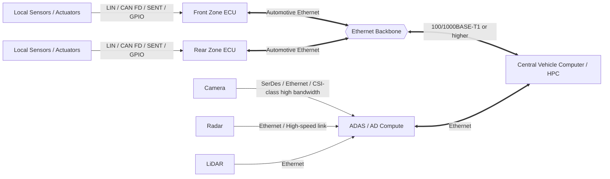
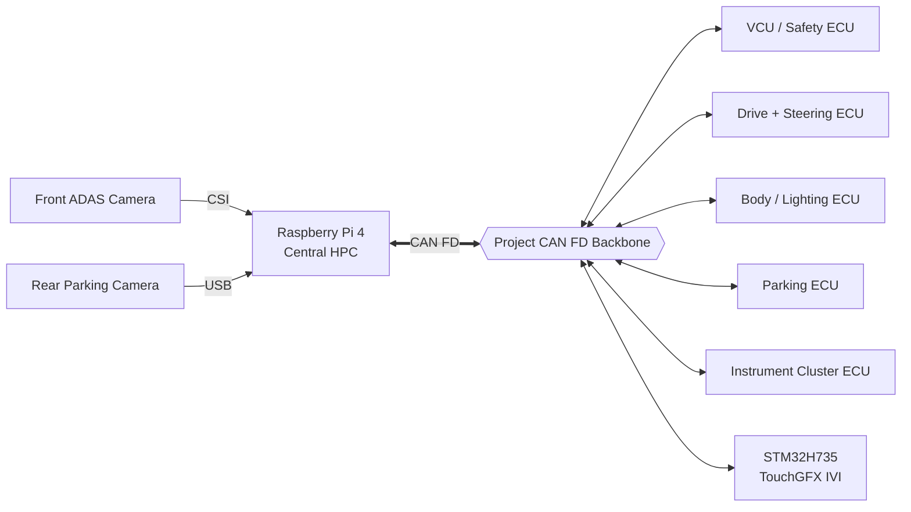
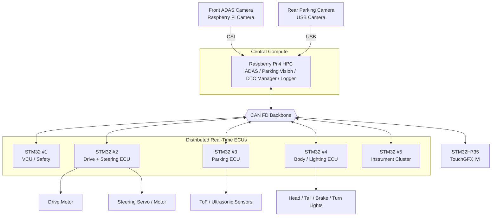
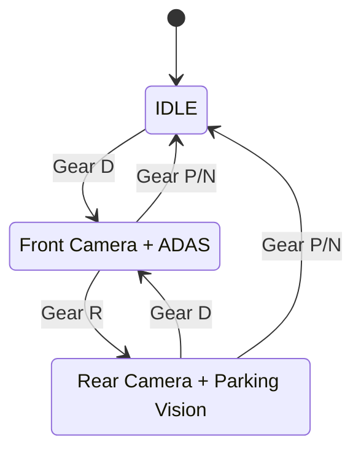

<div align="center">

# SDV MCU Project

**6인 팀으로 구현하는 Mini SDV E/E Architecture**

Raspberry Pi 4 기반 Central HPC · STM32 분산 ECU · CAN FD Backbone · ADAS · Parking Assist · IVI · Cluster · DTC · Motor/Steering Control


[프로젝트 개요](#1-프로젝트-개요) · [실차와의 차이](#2-실제-sdv-차량과-프로젝트-아키텍처의-차이) · [시스템 구조](#3-프로젝트-e-e-아키텍처) · [역할 분담](#8-6인-역할-분담) · [4주 계획](#9-4주-개발-계획)

</div>

---

> **현재 문서 버전:** Architecture v1.0 — 2026-09-09  
> **이전 계획 보존:** [2026-09-08 README Legacy](docs/archive/README_2026-09-08_legacy.md)  
> 본 프로젝트는 실제 도로 차량용 제어기가 아니라 **저속 RC/모형 모빌리티 플랫폼에서 SDV의 E/E 구조와 데이터 흐름을 축소 구현하는 교육·연구용 프로젝트**이다.

---

# 1. 프로젝트 개요

본 프로젝트의 목표는 단순히 RC카에 센서와 화면을 붙이는 것이 아니라, 실제 SDV(Software Defined Vehicle)의 핵심 구조인 **Central Compute + Distributed Real-Time ECU + Vehicle Network + HMI + Diagnostics**를 소형 하드웨어로 재현하는 것이다.

주요 기능은 다음과 같다.

- **Central HPC:** Raspberry Pi 4
- **ADAS:** 전방 Raspberry Pi Camera 기반 차선/객체 인식
- **Parking Assist:** 후방 카메라 + ToF/초음파 거리 센서
- **VCU / Safety Arbitration:** 주행 모드와 제어 요청의 최종 중재
- **Motor + Steering Control:** STM32 기반 실시간 폐루프 제어
- **Body / Lighting:** 전조등, 후미등, 브레이크등, 방향지시등 등
- **Instrument Cluster:** 속도, RPM, 배터리, 온도, 기어, 경고등 표시
- **IVI:** STM32H735 + TouchGFX 기반 ADAS/주차/DTC/차량 설정 UI
- **DTC:** ECU별 고장 감지, 중앙 로그, IVI 상세 표시
- **Vehicle Network:** CAN FD 공통 Backbone

프로젝트의 핵심 데이터 흐름은 아래 세 가지다.

```text
[ADAS 제어]
Front Camera
→ Raspberry Pi 4 HPC
→ CV / ADAS 판단
→ CAN FD
→ VCU
→ Drive & Steering ECU
→ Motor / Steering Actuator
```

```text
[차량 상태 표시]
Local ECU / Sensor
→ CAN FD
→ Instrument Cluster / IVI
→ Driver HMI
```

```text
[진단]
Sensor / ECU Fault
→ Local ECU DTC
→ CAN FD
→ Raspberry Pi DTC Manager
→ CAN FD
→ STM32H735 IVI
```

---

# 2. 실제 SDV 차량과 프로젝트 아키텍처의 차이

이 프로젝트는 **SDV의 논리 구조는 모사하지만, 실제 차량의 고속 Ethernet Zonal Backbone을 CAN FD Backbone으로 단순화**한다.

## 2.1 실제 최신 SDV 차량의 일반적인 Zonal Architecture

실제 차량에서는 센서와 액추에이터를 차량의 물리적 위치에 따라 Zone Controller에 연결하고, Zone Controller와 중앙 컴퓨터 사이를 Automotive Ethernet으로 연결하는 방향이 일반적이다.



### 실제 차량에서의 역할

- **LIN:** 단순·저속 Body Sensor/Actuator
- **CAN / CAN FD:** 지역 내부 실시간 ECU, Powertrain/Chassis 제어 신호
- **Automotive Ethernet:** Zone ↔ Central HPC의 고속 Backbone
- **SerDes / Ethernet:** Camera, LiDAR, Imaging Radar 등 대용량 ADAS 데이터
- **Central/ADAS HPC:** CV, Point Cloud, Sensor Fusion, Planning, Vehicle Application
- **Zone ECU:** Local I/O, Gateway, Network Aggregation, 일부 실시간 처리

특히 Camera 영상이나 LiDAR Point Cloud 같은 대용량 데이터는 일반적인 Zone MCU에서 CV 연산한 뒤 CAN으로 보내는 방식이 아니라, 고속 링크를 통해 ADAS HPC로 직접 전달하거나 Zone의 Ethernet Switch만 통과시켜 전달한다.

## 2.2 본 프로젝트의 축소 구조

예산, 보드 수, 개발 기간과 교육 목적을 고려해 Ethernet Zonal Backbone을 직접 구현하지 않고 **CAN FD 하나를 공통 차량 Backbone으로 사용**한다.



## 2.3 차이점 요약

| 항목 | 실제 SDV / Zonal 차량 | 본 프로젝트 |
|---|---|---|
| 중앙 연산 | Automotive-grade HPC / ADAS SoC | **Raspberry Pi 4** |
| 차량 Backbone | **Automotive Ethernet** | **CAN FD** |
| Zone 구조 | Front/Rear/Left/Right Zone ECU | 기능별 STM32 ECU로 단순화 |
| Zone 내부 네트워크 | CAN FD / LIN / SENT / GPIO | CAN FD + GPIO/ADC/PWM/I2C/SPI |
| ADAS 영상 경로 | Camera → SerDes/Ethernet → ADAS HPC | **Front Pi Camera → CSI → Pi 4** |
| 후방 영상 경로 | Camera → 고속 영상망 / ADAS·Parking ECU | **Rear USB Camera → Pi 4** |
| 대용량 영상 | Ethernet/SerDes | Pi 내부에서만 처리, CAN FD로 전송하지 않음 |
| 제어 데이터 | Ethernet + CAN FD | **CAN FD** |
| Hard Real-Time | 전용 MCU/ECU | **STM32** |
| IVI | Cockpit/Infotainment SoC | **STM32H735 + TouchGFX** |
| Cluster | 전용 Cluster ECU | **STM32 + TFT** |
| Diagnostics | UDS/DoIP, 중앙 진단 서비스 | CAN FD 기반 DTC + UDS 일부 개념 모사 |

### 프로젝트에서 의도적으로 단순화하는 부분

실차의 구조:

```text
Sensor / Actuator
    ↓
Zone ECU
    ↓
Automotive Ethernet Backbone
    ↓
Central HPC
```

프로젝트 구조:

```text
STM32 ECU / Sensor
    ↓
CAN FD Backbone
    ↓
Raspberry Pi 4 HPC
```

따라서 본 프로젝트에서 **CAN FD는 실차의 Ethernet Backbone 역할까지 함께 수행**한다.

향후 확장 단계에서는 Raspberry Pi와 Zonal Gateway 사이에 Automotive Ethernet 또는 일반 Ethernet을 추가하여 아래 구조로 발전시킬 수 있다.

```text
Local Sensor / ECU
→ CAN FD / LIN
→ Zone Controller
→ Ethernet
→ Central HPC
```

---

# 3. 프로젝트 E/E 아키텍처

## 3.1 전체 시스템



## 3.2 보드 구성

| 노드 | 예정 하드웨어 | 핵심 역할 |
|---|---|---|
| Central HPC | **Raspberry Pi 4** | ADAS, Parking Vision, DTC Manager, Logging |
| VCU | 소형 STM32 #1 | Mode, Arbitration, Safety, Heartbeat 감시 |
| Drive + Steering ECU | 소형 STM32 #2 | Motor speed control, Steering control, Encoder feedback |
| Parking ECU | 소형 STM32 #3 | ToF/Ultrasonic 거리 측정 및 Parking status |
| Body / Lighting ECU | 소형 STM32 #4 | Head/Tail/Brake/Turn/Hazard light 제어 |
| Instrument Cluster | 소형 STM32 #5 + TFT | Speed, RPM, SOC, Temperature, Gear, Warning |
| IVI | **STM32H735 + TouchGFX** | ADAS/Parking/DTC/Vehicle Settings UI |

> **CAN FD 하드웨어 주의:** Raspberry Pi에는 CAN FD가 내장되어 있지 않으므로 CAN FD 지원 인터페이스가 필요하다. `MCP2515`는 Classic CAN용이므로 CAN FD 목표에서는 `MCP2518FD`, `TCAN4550`, 또는 USB-CAN FD 계열을 검토한다. 소형 STM32 역시 실제 사용 보드가 FDCAN peripheral을 지원하는지 착수 시 확인한다. 지원하지 않는 경우 Classic CAN으로 fallback하되 상위 메시지 설계는 유지한다.

---

# 4. Raspberry Pi 4 HPC와 카메라 구조

Pi 4는 프로젝트의 Central HPC 역할을 수행하며 차량 전방 쪽에 배치한다. 물리적으로 전방에 있어도 논리적으로는 전체 차량 기능을 모으는 Central Compute이다.

## 4.1 전방 ADAS Camera

```text
Front Pi Camera
   ↓ CSI
Raspberry Pi 4
   ↓
OpenCV / AI Inference
   ↓
Lane / Object / Risk
   ↓
CAN FD
   ↓
VCU
```

주요 기능 후보:

- Lane Detection
- Lane Offset / Lane Angle
- Object Detection
- Forward Collision Warning
- 저속 ADAS Steering Request
- 저속 Speed / Stop Request

영상 자체는 CAN FD로 보내지 않는다.

```text
Raw Camera Image  → Pi 내부 처리
ADAS Result       → CAN FD 송신
```

예시 결과 데이터:

```text
ADAS_STATE       = ACTIVE
LANE_OFFSET      = -42 mm
LANE_ANGLE       = +3.1 deg
OBJECT_TYPE      = PERSON
OBJECT_DISTANCE  = 1200 mm
COLLISION_LEVEL  = WARNING
STEERING_REQUEST = +4.5 deg
SPEED_REQUEST    = 0.35 m/s
```

## 4.2 후방 Parking Camera

Raspberry Pi 4 Model B의 CSI 포트 수를 고려해 기본 구성은 다음과 같이 잡는다.

```text
Front Camera = Raspberry Pi CSI Camera
Rear Camera  = USB Camera
```

동시에 두 Vision 기능을 풀로드로 동작시키지 않고 **기어/모드에 따라 전환**한다.

```text
D / ADAS Mode
→ Front Camera Active
→ ADAS Service Active
→ Rear Parking Vision Idle

R Mode
→ Front ADAS Pause
→ Rear Camera Active
→ Parking Vision Active
```

상태 전환:



향후 동일한 CSI 카메라 2대를 사용하고 싶다면 Camera MUX를 검토할 수 있지만, 1차 구현은 CSI + USB 조합을 우선한다.

---

# 5. ECU별 기능

## 5.1 VCU / Safety ECU

VCU는 ADAS나 IVI가 직접 모터를 제어하지 못하게 하고 모든 상위 요청을 중재한다.

입력 예시:

- Driver / Mode Request
- ADAS Speed Request
- ADAS Steering Request
- Parking Obstacle Status
- ECU Heartbeat
- DTC / Fault State
- Gear `P / R / N / D`

출력 예시:

- Final Speed Request
- Final Steering Request
- Drive Enable
- Emergency Stop
- Vehicle Mode

우선순위 예시:

```text
FAULT / Emergency Stop
        >
Parking Critical Stop
        >
ADAS Safety Request
        >
Driver / Normal Request
```

## 5.2 Drive + Steering ECU

Raspberry Pi가 PWM을 직접 만들지 않고 STM32가 Hard Real-Time 제어를 담당한다.

```text
VCU
 ↓ Target Speed / Steering
Drive + Steering ECU
 ├─ Motor Encoder → Speed PID → PWM → Motor Driver
 └─ Steering Feedback → Steering PID → PWM → Servo/Motor
```

주요 상태:

- Motor RPM
- Vehicle Speed
- Steering Command
- Steering Feedback
- Motor Temperature
- Control Fault

## 5.3 Parking ECU

Parking ECU는 영상이 아니라 **거리 센서의 저수준 실시간 측정**을 담당한다.

```text
FL / FR / RL / RR ToF or Ultrasonic
            ↓
       Parking ECU
            ↓
Distance / Warning Level
            ↓
          CAN FD
```

Pi의 Rear Camera Vision과 결합하여 상위 Parking Assist를 구성한다.

## 5.4 Body / Lighting ECU

담당 기능:

- Head Lamp
- Tail Lamp
- Brake Lamp
- Turn Signal
- Hazard
- Auto Light 상태

입력은 CAN FD Vehicle State와 필요 시 조도 센서로 구성한다.

## 5.5 Instrument Cluster ECU

Cluster에는 운전 중 즉시 필요한 정보만 표시한다.

- Vehicle Speed
- Motor RPM
- Battery SOC
- Battery / Motor Temperature
- Gear `P/R/N/D`
- READY
- Turn Indicator
- Headlamp
- ADAS Active
- General Warning / Fault Lamp

DTC 상세 코드는 Cluster에 모두 표시하지 않고 아래처럼 단순 경고만 표시한다.

```text
⚠ Steering System Fault
⚠ Parking Sensor Fault
```

## 5.6 STM32H735 TouchGFX IVI

IVI는 상세 상태와 사용자 인터랙션을 담당한다.

화면 구성:

1. Home / Vehicle Status
2. ADAS Status
3. Parking Assist
4. Diagnostics / DTC
5. Vehicle / Lighting Settings

IVI는 차량 제어의 최종 권한을 가지지 않는다. 버튼 입력은 Request로 CAN FD에 송신하고 VCU 또는 해당 ECU가 실행 여부를 결정한다.

---

# 6. DTC / Diagnostics

각 ECU는 자신의 센서와 제어 상태를 자체 진단한다.

예시:

| ECU | DTC 예시 | 조건 |
|---|---|---|
| Drive | `DRIVE_001` | Encoder Timeout |
| Drive | `DRIVE_002` | Motor Overtemperature |
| Steering | `STEER_001` | Steering Feedback Invalid |
| Parking | `PARK_001` | Rear ToF Timeout |
| Body | `BODY_001` | Lamp Output Fault |
| VCU | `VCU_001` | ECU Heartbeat Timeout |
| HPC | `HPC_001` | Camera Service Fault |

진단 흐름:

```text
Local ECU Fault Detection
        ↓
DTC Event over CAN FD
        ↓
Raspberry Pi DTC Manager
        ↓
Timestamp / History / Active State
        ↓
CAN FD
        ↓
STM32H735 IVI
```

Cluster는 Warning 수준만 표시하고 IVI는 상세 DTC를 표시한다.

선택 확장:

- UDS `0x19 ReadDTCInformation` 개념 모사
- UDS `0x14 ClearDiagnosticInformation` 개념 모사
- DTC 발생 횟수 / First Seen / Last Seen 저장
- Fault Injection 시험

---

# 7. CAN FD Backbone 설계

## 7.1 메시지 설계 원칙

CAN ID와 Signal Matrix는 개발 시작 전에 고정한다.

초기 예시:

| CAN ID | Message | Tx | Rx | Cycle |
|---:|---|---|---|---:|
| `0x100` | Vehicle_State | VCU | All | 20 ms |
| `0x110` | ADAS_Request | HPC | VCU, IVI | 50 ms |
| `0x120` | Drive_Status | Drive ECU | VCU, Cluster, IVI, HPC | 20 ms |
| `0x130` | Steering_Status | Drive ECU | VCU, Cluster, IVI, HPC | 20 ms |
| `0x200` | Parking_Status | Parking ECU | VCU, IVI, HPC | 50~100 ms |
| `0x210` | Body_Status | Body ECU | Cluster, IVI, HPC | 100 ms |
| `0x220` | Body_Command | VCU / IVI | Body ECU | Event |
| `0x230` | Cluster_Aux_Status | VCU | Cluster | 100 ms |
| `0x300` | DTC_Event | All | HPC, IVI | Event |
| `0x310` | ECU_Heartbeat | All | VCU, HPC | 100~500 ms |
| `0x320` | Diagnostic_Request | IVI / HPC | Target ECU | Event |
| `0x321` | Diagnostic_Response | Target ECU | IVI / HPC | Event |

> 위 ID는 초기 설계안이며 실제 DLC, Signal bit position, Scale, Offset, Endianness, Timeout은 1주차에 확정한다.

## 7.2 Heartbeat / Fail-safe

모든 핵심 ECU는 주기적으로 Heartbeat를 송신한다.

```text
Drive ECU Heartbeat Lost
        ↓
VCU detects timeout
        ↓
MODE_FAULT
        ↓
Final Speed Request = 0
        ↓
DTC VCU_COMM_xxx
```

## 7.3 CAN에 보내지 않을 데이터

다음 데이터는 CAN FD에 Raw 형태로 송신하지 않는다.

- Camera Frame
- Video Stream
- 고해상도 Image Buffer
- Large Point Cloud

대신 Pi에서 처리 후 의미 있는 결과만 송신한다.

```text
Image → Object / Lane / Warning / Control Request
```

---

# 8. 6인 역할 분담

A~F는 임시 식별자이며 실제 팀원 이름은 추후 교체한다.

| 담당 | 주 담당 | 하드웨어 / SW | 주요 산출물 |
|---|---|---|---|
| **A** | **System Architecture / VCU / CAN Integration Lead** | STM32 VCU, CAN FD | CAN Matrix, VCU State Machine, Arbitration, Heartbeat, 전체 통합 |
| **B** | **Drive + Steering Control** | STM32, Motor Driver, Encoder, Servo/Steering | Speed PID, Steering Control, RPM/Speed Feedback, Fail-safe |
| **C** | **ADAS / Central HPC** | Raspberry Pi 4 + Front Pi Camera | Camera Pipeline, Lane/Object Detection, ADAS Request, HPC service 관리 |
| **D** | **Parking Assist** | STM32 Parking ECU + Rear USB Camera | ToF/Ultrasonic, R-mode camera service, Parking Warning/Fusion |
| **E** | **IVI / Diagnostics UI** | STM32H735 + TouchGFX | IVI 화면, CAN Receive Model, ADAS/Parking/DTC UI, DTC Clear UI |
| **F** | **Body / Lighting + Instrument Cluster** | STM32 Body ECU + STM32 Cluster + TFT | Lighting Control, Speed/RPM/SOC Cluster, Warning Lamps |

## 공동 담당 규칙

- **A:** CAN ID, Signal 이름, 주기, Timeout의 최종 통합 책임
- **C + D:** Raspberry Pi 프로세스와 Camera Resource 충돌 방지
- **A + B:** VCU ↔ Drive/Steering Safety Interface
- **D + E:** Parking Sensor/Camera 결과를 IVI 표현으로 연결
- **E + F:** Cluster와 IVI에 표시할 정보의 중복/구분 정의
- **전원·배선·차량 장착:** 전원 예산과 GND/통신 배선은 전원 담당 1명을 별도 지정하지 않고 A 중심 공동 검토

### HMI 역할 구분

| Instrument Cluster | IVI |
|---|---|
| Speed / RPM | ADAS 상세 상태 |
| Battery SOC | Parking Assist 상세 |
| Temperature | DTC 상세 코드 |
| Gear | Vehicle Settings |
| READY / Warning | Lighting Settings |
| Turn / Lamp Indicator | Diagnostic Clear / History |

---

# 9. 4주 개발 계획

범위가 넓기 때문에 **각자 기능을 따로 완성한 뒤 마지막에 합치는 방식이 아니라, 1주차부터 CAN 계약을 고정하고 매주 통합 가능한 단위로 개발**한다.

## Week 1 — Architecture Freeze & Bring-up

### 공통

- [ ] 전체 E/E Architecture 확정
- [ ] 실제 보드 FDCAN 지원 여부 확인
- [ ] CAN FD bitrate 및 CAN Matrix v0.1 확정
- [ ] 전원 구조 / 공통 GND / 종단저항 설계
- [ ] Repository folder / branch / coding convention 확정

### 역할별

- **A:** VCU State Machine, Heartbeat 규격, CAN Matrix
- **B:** Motor/Steering 개별 PWM 및 Encoder/Feedback 확인
- **C:** Front Camera capture 및 ADAS baseline FPS 측정
- **D:** 거리센서 4채널 및 Rear USB Camera capture 확인
- **E:** H735 TouchGFX 기본 화면 + CAN RX skeleton
- **F:** Lighting output + Cluster TFT 기본 계기판

### Week 1 완료 조건

```text
모든 노드가 단독 구동
+
CAN 송수신 최소 2노드 성공
+
Front / Rear Camera 각각 Frame 획득
```

## Week 2 — Functional ECU Development

- **A:** `P/R/N/D`, `MANUAL/ADAS/PARK/FAULT` State Machine
- **B:** Speed PID + Steering closed-loop
- **C:** Lane / Object Detection과 ADAS result 생성
- **D:** Parking distance level + R-mode Parking Vision
- **E:** Vehicle / ADAS / Parking / DTC 화면 동적 연결
- **F:** Auto/Manual light + Cluster CAN Signal 표시

공통:

- [ ] Heartbeat
- [ ] Timeout
- [ ] DTC Event
- [ ] 기본 Logging

## Week 3 — End-to-End Integration

### ADAS Path

```text
Front Camera
→ HPC
→ ADAS_Request
→ VCU
→ Drive/Steering
→ Vehicle Motion
```

### Parking Path

```text
Gear R
→ VCU Vehicle_State
→ Pi Rear Camera 활성화
→ Parking ECU 거리값
→ Parking Assist
→ IVI
```

### HMI Path

```text
Drive / VCU / Body
→ CAN FD
→ Cluster + IVI
```

### DTC Path

```text
Sensor Disconnect
→ Local DTC
→ Pi DTC Manager
→ IVI Warning
→ VCU Fail-safe if critical
```

Week 3에는 기능 추가보다 **통신 지연, 데이터 유효성, Mode 충돌, 복구 동작**을 우선한다.

## Week 4 — Vehicle Integration & Validation

- [ ] RC/모형차 최종 장착
- [ ] D → R 카메라 전환 시험
- [ ] ADAS Steering/Stop 저속 시험
- [ ] Parking distance warning 시험
- [ ] Cluster/IVI 동시 표시 시험
- [ ] Lighting / Brake / Turn signal 시험
- [ ] ECU unplug / sensor fault injection
- [ ] Heartbeat timeout fail-safe
- [ ] DTC clear / recovery
- [ ] 주행 중 CAN log 저장
- [ ] 최종 Demo Scenario 반복 시험

### 최종 측정 항목

- ADAS inference FPS
- ADAS sensing → CAN request latency
- CAN request → actuator response latency
- Gear R → Rear first frame latency
- Parking sensor update period
- ECU heartbeat timeout / recovery time
- DTC detection → IVI indication latency

---

# 10. 최종 Demo Scenario

```text
1. Power ON
   ↓
2. ECU Heartbeat 확인
   ↓
3. Cluster READY / IVI System Normal
   ↓
4. Gear D
   ↓
5. Front Camera + ADAS 활성화
   ↓
6. Lane Detection → Steering Request → VCU → Steering Control
   ↓
7. 전방 장애물 인식 → Speed Reduce / Stop Request
   ↓
8. Body ECU → Brake Lamp / Turn Signal 연동
   ↓
9. Gear R
   ↓
10. Front ADAS Pause + Rear Camera 활성화
   ↓
11. Parking ECU ToF + Rear Vision → Parking Warning
   ↓
12. Cluster Warning + IVI Parking 화면
   ↓
13. Sensor 또는 ECU Fault Injection
   ↓
14. DTC 발생 → Pi 저장 → IVI 상세 표시
   ↓
15. Critical Fault이면 VCU FAULT / Motor Stop
```

이 시나리오가 정상적으로 반복되면 단순 RC카가 아니라 다음 구조를 실제 하드웨어로 보여줄 수 있다.

> **Central HPC + Distributed ECU + CAN FD Vehicle Network + ADAS + Parking + VCU + Drive/Steering + Body + Cluster + IVI + Diagnostics**

---

# 11. 우선순위

## Must Have

- [ ] CAN/CAN FD 전체 통신
- [ ] VCU State / Safety Arbitration
- [ ] Motor + Steering Control
- [ ] Front Camera ADAS 최소 1개 기능
- [ ] Rear Parking Camera mode switching
- [ ] Parking distance sensors
- [ ] Body Lighting
- [ ] Instrument Cluster
- [ ] H735 TouchGFX IVI
- [ ] ECU Heartbeat + DTC

## Should Have

- [ ] Lane + Object Detection 동시 처리
- [ ] DTC History
- [ ] UDS 일부 서비스 개념 모사
- [ ] Parking Sensor + Vision Fusion
- [ ] Auto Light

## Could Have

- [ ] Ethernet Zone Gateway 추가
- [ ] Rear Camera 영상의 IVI 고속 전송
- [ ] OTA 구조 실험
- [ ] SOME/IP 또는 DDS 기반 Service-Oriented 실험
- [ ] Linux service/container 기반 HPC application 분리

---

# 12. 프로젝트가 재현하는 SDV 핵심 개념

이 프로젝트에서 가장 중요한 것은 센서 개수가 아니라 **역할 분리와 데이터 흐름**이다.

```text
High-performance perception
        → Raspberry Pi HPC

Safety arbitration
        → STM32 VCU

Hard real-time control
        → STM32 Drive/Steering ECU

Local sensing / body control
        → STM32 Parking / Body ECU

Driver critical information
        → Instrument Cluster

Detailed HMI / Diagnostics
        → STM32H735 TouchGFX IVI
```

실제 SDV와의 가장 큰 물리적 차이는 다음 한 줄로 정리한다.

> **Actual SDV: Zonal ECUs + Automotive Ethernet Backbone + Central HPC**  
> **This Project: Functional STM32 ECUs + CAN FD Backbone + Raspberry Pi 4 HPC**

이 차이를 숨기지 않고 명시하는 것이 프로젝트의 설계 의도다. 이후 Ethernet Zone Controller를 추가할 경우 현재 CAN 기반 ECU를 그대로 Edge/Local Network로 유지하면서 실제 Zonal 구조에 한 단계 더 가까워질 수 있다.

---

## Repository Notes

- 이전 아키텍처 README는 [`docs/archive/README_2026-09-08_legacy.md`](docs/archive/README_2026-09-08_legacy.md)에 보존한다.
- 실제 팀원 이름이 확정되면 A~F를 이름으로 교체한다.
- CAN Matrix, DTC Table, Pin Map은 구현 시작과 함께 별도 문서로 분리한다.
- 하드웨어 모델 및 트랜시버는 실제 보유 부품 확인 후 확정한다.

## License

[LICENSE](LICENSE)
