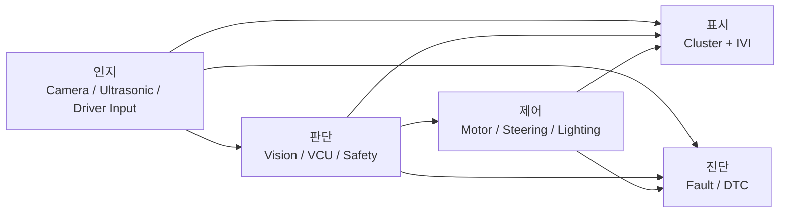
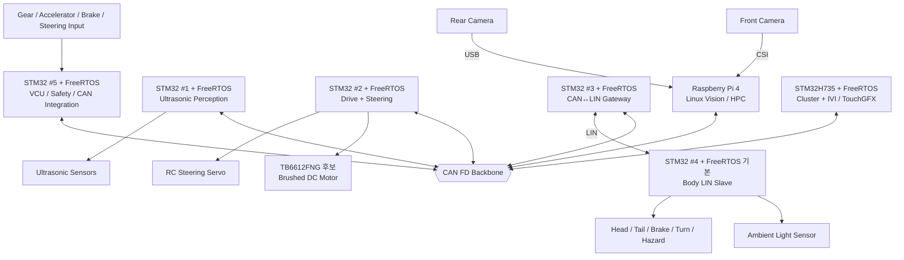

<div align="center">

# SDV MCU Project

**6인 팀으로 구현하는 Mini SDV E/E Architecture**

Raspberry Pi 4 Vision/HPC · STM32 + FreeRTOS 분산 ECU · CAN FD Backbone · LIN Subnetwork · Ultrasonic · Cluster/IVI · DTC · Motor/Steering


[프로젝트 개요](#1-프로젝트-개요) · [인지-판단-제어](#2-인지--판단--제어) · [전체 아키텍처](#4-현재-프로젝트-아키텍처) · [RTOS 구조](#5-rtos--software-execution-architecture) · [6인 역할](#8-6인-역할-분담) · [개발 문서](#11-개발-문서)

</div>

---

> **현재 기준:** Architecture v1.2 + RTOS Development Policy — 2026-09-09  
> **핵심 구조:** `인지 → 판단 → 제어`, 이를 `UI / 통신 / 진단`이 지원한다.  
> **MCU 실행 환경:** 가능한 STM32 Node는 **FreeRTOS + CMSIS-RTOS2**를 기본으로 설계한다.  
> **HPC 실행 환경:** Raspberry Pi는 Linux 기반 Service / Process / Thread 구조를 사용한다.  
> **Cockpit:** STM32H735 + TouchGFX 한 보드에서 Cluster와 IVI를 함께 구현한다.  
> **Vision 개발:** 개발 중 Front/Rear Camera를 Raspberry Pi 2대로 병렬 개발하고, 최종 차량에서는 Pi 1대로 통합하는 것을 목표로 한다.  
> **이전 계획 보존:** [Legacy Documentation](docs/archive/)

본 프로젝트는 실제 도로 차량용 제어기가 아니라 **저속 RC/모형 모빌리티 플랫폼에서 SDV의 데이터 흐름, 분산 ECU, RTOS, 차량 네트워크 구조를 축소 구현하는 교육용 프로젝트**다.

---

# 1. 프로젝트 개요

프로젝트를 가장 단순하게 보면 다음과 같다.

```text
센서와 카메라가 본다
        ↓
소프트웨어가 의미를 만든다
        ↓
차량이 무엇을 할지 결정한다
        ↓
모터 / 조향 / 조명을 제어한다
        ↓
운전자에게 상태를 보여준다
        ↓
문제가 생기면 Fault / DTC로 기록한다
```

주요 기능은 다음과 같다.

- **Ultrasonic Perception:** 초음파센서로 장애물 거리를 측정한다.
- **Camera Vision:** Front/Rear Camera 영상을 Raspberry Pi에서 처리한다.
- **HPC / Vision Decision:** 영상에서 차선, 물체, Parking 의미 정보를 만들고 요청을 생성한다.
- **VCU / Final Arbitration:** 운전자 입력, Vision 요청, 초음파 위험 상태, Fault를 보고 최종 차량 명령을 정한다.
- **Drive / Steering Control:** 브러시드 DC Motor와 RC Servo를 실제로 제어한다.
- **Body / Lighting:** 조도센서와 램프를 LIN으로 연결하고 CAN FD와 Gateway한다.
- **Cockpit:** STM32H735에서 Cluster + IVI UI를 구현한다.
- **Diagnostics:** 각 Node의 고장을 DTC로 모으고 저장/표시한다.
- **RTOS:** STM32의 주기 작업, 통신, 제어, UI, 진단을 Task 단위로 분리한다.

---

# 2. 인지 → 판단 → 제어



## 2.1 인지

센서값을 차량이 사용할 수 있는 정보로 만드는 단계다.

```text
Ultrasonic Echo
→ Distance
→ Validity / Filtering
→ SAFE / WARNING / CRITICAL
```

```text
Camera Frame
→ Vision Pipeline
→ Lane / Object / Parking Result
```

## 2.2 판단

인지 결과를 보고 무엇을 해야 할지 결정한다.

```text
Front Vision
→ ADAS Speed / Steering Request
        ↓
VCU
→ Mode / Safety / Priority 확인
→ Final Speed / Steering Request
```

Vision이 Motor PWM을 직접 만들지 않는다.

## 2.3 제어

최종 명령을 실제 하드웨어 출력으로 변환한다.

```text
Final Speed Request
→ Drive ECU
→ Motor Control
→ PWM / Direction
→ Motor Driver
→ Brushed DC Motor
```

```text
Final Steering Request
→ Drive + Steering ECU
→ Servo Mapping
→ PWM
→ RC Servo
```

## 2.4 UI / 통신 / 진단

- **UI:** Speed, RPM, Gear, ADAS, Parking, Body, DTC를 보여준다.
- **통신:** CAN FD와 LIN으로 각 Node가 데이터를 주고받는다.
- **진단:** Sensor/Control/Network/Task 문제가 생기면 Fault와 DTC로 관리한다.

---

# 3. 실제 SDV와 본 프로젝트

실제 최신 차량은 대체로 Local Bus와 Automotive Ethernet Backbone을 계층화한다.

```text
Local Sensor / Actuator
→ LIN / CAN FD
→ Zone Controller
→ Automotive Ethernet
→ Central / ADAS HPC
```

본 프로젝트에서는 전체 Automotive Ethernet Backbone을 구현하지 않고 **CAN FD를 공통 차량 Backbone으로 사용**한다. 대신 Body 영역에 LIN Subnetwork와 CAN↔LIN Gateway를 구현한다.

```text
Local Body LIN
→ STM32 Body Gateway
→ CAN FD Backbone
→ VCU / HPC / Cockpit / Other ECU
```

| 항목 | 실제 SDV / Zonal 차량 | 본 프로젝트 |
|---|---|---|
| Central Compute | Automotive HPC / ADAS SoC | Raspberry Pi 4 |
| Vehicle Backbone | Automotive Ethernet | CAN FD |
| Local Body Bus | LIN / CAN FD | LIN |
| Gateway | Zone Controller | STM32 Body Gateway |
| Vision | ADAS Compute | Raspberry Pi 4 |
| Real-Time Control | Automotive MCU / RTOS | STM32 + FreeRTOS |
| Cockpit | Cluster/Cockpit SoC | STM32H735 + FreeRTOS + TouchGFX |
| Diagnostics | UDS / DoIP 등 | Project DTC + CAN FD, 일부 UDS 개념 |

---

# 4. 현재 프로젝트 아키텍처

## 4.1 최종 차량 구조



## 4.2 보드 / 실행환경

| Hardware | 역할 | 실행 환경 |
|---|---|---|
| STM32 #1 | Ultrasonic Perception ECU | FreeRTOS |
| STM32 #2 | Drive + Steering Control ECU | FreeRTOS |
| STM32 #3 | Body CAN FD ↔ LIN Gateway / LIN Master | FreeRTOS |
| STM32 #4 | Body LIN Slave / Ambient / Lighting | FreeRTOS 기본, 자원 부족 시 예외 검토 |
| STM32 #5 | VCU / Driver Input / Safety / CAN Integration | FreeRTOS |
| STM32H735 | Cluster + IVI Cockpit | FreeRTOS + TouchGFX |
| Raspberry Pi 4 | Front + Rear Vision / HPC / DTC Manager | Linux |

> 실제 소형 STM32의 FDCAN 지원 여부, RAM/Flash 크기, FreeRTOS 적용 가능성은 최종 보드가 확정되면 확인한다. STM32 #4처럼 작은 Node가 자원상 RTOS 사용이 부적합하면 Bare-metal 예외를 허용하되 `ARCHITECTURE.md`에 이유를 기록한다.

## 4.3 Vision 병렬 개발

```text
개발 Pi #1 + Front Camera
→ Front ADAS Vision

개발 Pi #2 + Rear Camera
→ Rear Parking Vision
```

최종 차량에서는 한 Pi에 통합한다.

```text
Gear D
→ Front Vision ACTIVE
→ Rear Vision IDLE

Gear R
→ Front Vision PAUSE
→ Rear Vision ACTIVE
```

영상처리는 STM32가 아니라 Raspberry Pi가 담당한다. **Raw Camera Frame은 CAN FD로 전송하지 않고 의미 있는 결과값만 전송한다.**

---

# 5. RTOS / Software Execution Architecture

## 5.1 기본 정책

```text
STM32 Node
→ FreeRTOS Kernel
→ CMSIS-RTOS2 API 권장

Raspberry Pi
→ Linux
→ Process / Service / Thread
```

RTOS를 넣는 목적은 Task 수를 늘리는 것이 아니라 다음 기능이 서로 방해하지 않도록 실행 구조를 나누는 것이다.

```text
Periodic Sensing
Control Loop
CAN / LIN Communication
GUI
Diagnostics / Health
```

## 5.2 공통 RTOS 실행 흐름

```text
Peripheral / CAN / Timer Interrupt
              ↓
         짧은 ISR 처리
              ↓
 Task Notification / Queue / Event Flag
              ↓
          Application Task
              ↓
       State / Control / Output
```

### 공통 원칙

1. ISR에서는 긴 계산, `printf`, UI Rendering을 하지 않는다.
2. 주기 Task는 `osDelayUntil()` / `vTaskDelayUntil()` 계열로 일정한 주기를 목표로 한다.
3. Task 간 데이터는 Queue / Task Notification / Event Flags를 우선 사용한다.
4. 공유 데이터가 필요하면 Single-Owner Task 구조를 우선하고, Mutex는 필요한 곳에만 사용한다.
5. Safety/Control Task가 Debug Log나 UI 때문에 Block되지 않게 한다.
6. Task마다 `Period / Trigger / Priority / Deadline / Stack`을 문서화한다.
7. Stack High-Water Mark, Queue Overflow, Task Starvation, Jitter를 시험한다.
8. 중요 MCU Node는 Health Monitor + Independent Watchdog 구조를 목표로 한다.

## 5.3 Node별 Task 후보

| Node | Task 후보 |
|---|---|
| Ultrasonic | `UltrasonicTask`, `CanTxTask`, `HealthTask` |
| H735 Cockpit | `CanRxTask`, `VehicleModelTask`, `GuiTask`, `CommandTxTask`, `HealthTask` |
| Drive/Steering | `ControlTask`, `FeedbackTask`, `CanRxTask`, `StatusTask`, `HealthTask` |
| Body Gateway | `CanRxTask`, `LinScheduleTask`, `GatewayMappingTask`, `CanTxTask`, `HealthTask` |
| Body LIN Slave | `LinRxTask`, `AmbientTask`, `LightingTask`, `StatusTask`, `HealthTask` |
| VCU | `SafetyTask`, `VcuControlTask`, `DriverInputTask`, `CanRxTask`, `CanTxTask`, `DiagnosticTask`, `HealthTask` |

정확한 Task 개수와 Priority 숫자는 기능 시험 전부터 고정하지 않는다. 실제 Timing / CPU Load / Stack 측정 후 조정한다.

## 5.4 RTOS Priority와 차량 제어 Priority

두 개는 다른 개념이다.

```text
RTOS Priority
= CPU에서 어떤 Task를 먼저 실행할 것인가

Vehicle Arbitration Priority
= 여러 차량 요청 중 어떤 요청을 최종 채택할 것인가
```

예를 들어 VCU의 차량 판단 정책은:

```text
Critical Fault / E-Stop
> Critical Obstacle Stop
> ADAS Safety Request
> Normal Driver / Mode Request
```

처럼 정의할 수 있다.

이 우선순위가 FreeRTOS Task Priority 숫자와 그대로 같은 것은 아니다.

---

# 6. 주요 데이터 흐름

## 6.1 Ultrasonic

```text
Ultrasonic Sensor
→ Timer / GPIO ISR
→ UltrasonicTask
→ Distance / Valid / Warning
→ CanTxTask
→ CAN FD
→ VCU / H735 / HPC
```

## 6.2 Front ADAS Vision

```text
Front Camera
→ Raspberry Pi Linux Vision Service
→ Lane / Object / Risk
→ ADAS Speed / Steering Request
→ CAN Service
→ VCU
```

## 6.3 Rear Parking

```text
Rear Camera → Pi Rear Vision ─────────────┐
                                           ├→ Parking Status / VCU 판단
Ultrasonic → STM32 Ultrasonic Task ───────┘
```

Vision은 물체/위치 같은 의미 정보를 담당하고, Ultrasonic은 실제 근거리 거리값을 담당한다.

## 6.4 최종 차량 제어

```text
Driver Input
ADAS Request
Ultrasonic Critical
Fault / Heartbeat
       ↓
VCU SafetyTask / VcuControlTask
       ↓
Final Speed / Steering
       ↓ CAN FD
Drive CanRxTask
       ↓
ControlTask
       ↓
Motor / Servo
```

## 6.5 Body LIN / CAN Gateway

```text
Ambient Sensor
→ LIN Slave AmbientTask
→ LIN Status
→ Gateway LinScheduleTask
→ GatewayMappingTask
→ CAN FD
```

반대 방향:

```text
Body_Command over CAN
→ Gateway CanRxTask
→ GatewayMappingTask
→ LIN Command
→ LIN Slave LightingTask
→ Lamp Output
```

## 6.6 DTC / Diagnostics

```text
각 Node Local Fault Detection
        ↓
DTC / Fault Event
        ↓ CAN FD
Raspberry Pi DTC Manager
├ Active
├ History
├ First Seen / Last Seen
└ Occurrence Count
        ↓
STM32H735 Diagnostics UI
```

RTOS Node 자체의 진단 후보에는 Sensor/Network Fault뿐 아니라 다음도 포함할 수 있다.

- Task timeout / missed health update
- Queue overflow
- Stack overflow
- Watchdog reset reason
- Communication task failure

---

# 7. STM32H735 Cockpit: Cluster + IVI

H735 한 보드에서 Cluster와 IVI를 함께 구현한다.

### Cluster 기본 화면

- Speed
- Motor RPM
- Battery Voltage / SOC 후보
- Temperature
- P/R/N/D
- READY
- Turn / Headlamp
- ADAS / Parking Warning
- General Fault

### IVI 메뉴

- ADAS Status
- Parking Assist
- Diagnostics / DTC
- Lighting / Vehicle Settings
- System Status

RTOS 구조는 다음을 기본안으로 둔다.

```text
FDCAN ISR
   ↓
CanRxTask
   ↓ Queue
VehicleModelTask
   ↓
Vehicle Data Repository
   ↓
GuiTask / TouchGFX
```

사용자 명령은:

```text
TouchGFX
→ UiCommand Queue
→ CommandTxTask
→ CAN FD Request
→ VCU / Body Gateway
```

으로 분리한다.

H735 상세 명세/설계 예시는 [`docs/IVI/`](docs/IVI/)에서 확인한다.

---

# 8. 6인 역할 분담

| 담당 | 역할 | 주요 Hardware | 실행 환경 | 한 줄 설명 |
|---|---|---|---|---|
| **A** | **Ultrasonic / 인지** | STM32 #1 + Ultrasonic | FreeRTOS | 장애물까지 거리를 측정하고 Warning을 만든다. |
| **B** | **Cluster + IVI / UI** | STM32H735 + TouchGFX | FreeRTOS | 차량 상태, 경고, Parking, DTC를 보여준다. |
| **C** | **Motor + Steering / 제어** | STM32 #2 + Motor Driver + Motor + Servo | FreeRTOS | 최종 명령대로 차량을 실제로 움직인다. |
| **D** | **Lighting + Ambient / LIN-CAN** | STM32 #3 + #4 | FreeRTOS | 조도/조명을 LIN으로 연결하고 CAN FD와 Gateway한다. |
| **E** | **HPC + Camera Vision / 인지·판단** | Raspberry Pi + Front/Rear Camera | Linux | 영상을 처리하고 ADAS/Parking 결과를 만든다. |
| **F** | **VCU + DTC + CAN Integration / 최종 판단** | STM32 #5 + Pi Diagnostics 협업 | FreeRTOS | 최종 안전 판단, CAN 통합, DTC 규칙을 관리한다. |

### 역할 경계

- A는 거리 측정/상태 생성까지 담당하고 Motor를 직접 제어하지 않는다.
- B는 표시와 사용자 Request가 중심이며 차량 최종 제어 권한은 없다.
- C는 실제 Motor/Steering 제어와 Feedback을 담당한다.
- D는 Body Local LIN Network와 CAN↔LIN Gateway를 담당한다.
- E는 Camera Vision과 고수준 요청을 담당한다.
- F는 VCU Arbitration, Safety, CAN 통합, DTC 규칙을 담당한다.
- 모든 STM32 담당자는 자기 기능뿐 아니라 **Task/ISR/Queue/Health 구조**도 설명할 수 있어야 한다.

---

# 9. 초기 CAN / LIN 데이터 방향

## CAN FD 후보

| Message | Tx | 주요 Rx | 내용 |
|---|---|---|---|
| `Vehicle_State` | VCU | All | Gear, Mode, Safety State |
| `Driver_Input` | VCU | HPC / H735 | Accel, Brake, Steering |
| `Ultrasonic_Status` | Ultrasonic ECU | VCU / H735 / HPC | Distance, Valid, Warning |
| `Vision_Request` | HPC | VCU / H735 | ADAS/Parking semantic result / request |
| `Drive_Status` | Drive ECU | VCU / H735 / HPC | RPM, Speed, Steering Status |
| `Body_Status` | Gateway | VCU / H735 / HPC | Ambient, Lamp Status, LIN Health |
| `Body_Command` | VCU / H735 | Gateway | Lighting Request |
| `DTC_Event` | All | HPC / H735 | Fault Code / Status |
| `ECU_Heartbeat` | All | VCU / HPC | Node Alive |

실제 CAN ID, DLC, endian, scale, offset, cycle, timeout은 공통 CAN Matrix에서 확정한다.

## LIN 후보

| Frame | Publisher | 의미 |
|---|---|---|
| `Ambient_Status` | Body LIN Slave | 조도 상태 |
| `Lamp_Command` | Gateway Master | Lamp 명령 |
| `Lamp_Status` | Body LIN Slave | Lamp 상태 |
| `Lamp_Diagnostic` | Body LIN Slave | Body local fault |

---

# 10. 개발 단계

| 단계 | 목표 |
|---|---|
| **Stage 1** | 각 Node 단독 Bring-up + FreeRTOS Task skeleton + 입력/출력 검증 |
| **Stage 2** | 2개 Node씩 CAN/LIN 통신 + Queue/Timeout/Task timing 검증 |
| **Stage 3** | 전체 CAN Backbone + Gateway + HPC + Cockpit 통합 |
| **Stage 4** | 최종 Pi 통합 + 차량 Fault/Latency/Jitter/Stack/Queue 검증 |

STM32 Node는 대략 다음 순서로 개발한다.

```text
Peripheral 단독 확인
→ FreeRTOS Scheduler 시작
→ Task / ISR / Queue skeleton
→ Application Logic
→ CAN / LIN 통합
→ Timing / Stack / Fault Test
```

최종적으로 측정할 항목 예:

- Task period / jitter
- ISR → Task wake-up latency
- CAN request → control response
- Stack high-water mark
- Queue max occupancy / overflow
- Watchdog / health response
- Front/Rear Vision FPS / latency
- LIN schedule period / jitter
- DTC detection → H735 indication latency

---

# 11. 개발 문서

현재 기준 문서는 중복을 줄여 아래만 사용한다.

1. **[Documentation Guide](docs/README.md)**
2. [Team Guide](docs/TEAM_GUIDE.md)
3. [Project Reference](docs/PROJECT_REFERENCE.md)
4. [4주 개발 계획](docs/WEEKLY_PLAN.md)
5. [IVI / Cluster 작성 예시](docs/IVI/README.md)
6. [Functional Specification Template](docs/templates/FUNCTIONAL_SPECIFICATION_TEMPLATE.md)
7. [Software Architecture Template](docs/templates/SOFTWARE_ARCHITECTURE_TEMPLATE.md)
8. [Test Report Template](docs/templates/TEST_REPORT_TEMPLATE.md)

각 담당자는 자기 기능 폴더에 기본적으로 다음 세 문서를 작성한다.

```text
SPECIFICATION.md
ARCHITECTURE.md
TEST_REPORT.md
```

`ARCHITECTURE.md`에서는 STM32 Node라면 Component만 그리는 것이 아니라 **Task, ISR, Queue, Priority, Deadline, Stack, Watchdog 구조까지 작성**한다.

---

# 12. 최종 Demo 흐름

```text
Power ON
→ FreeRTOS / Linux services initialization
→ 모든 Node Heartbeat / Health 확인
→ H735 Cluster READY
→ Gear D
→ Front Vision Active
→ ADAS Request
→ VCU Safety / Arbitration
→ Drive / Steering ControlTask
→ Ultrasonic Obstacle Detection
→ Warning / Safe Stop 판단
→ Gear R
→ Rear Vision Active
→ Rear Vision + Ultrasonic Parking Assist
→ Ambient 변화
→ LIN Slave → Gateway → CAN FD
→ Lighting Request
→ CAN FD → Gateway → LIN → Lamp
→ Sensor / CAN / LIN / Task Fault Injection
→ Local Fault / DTC
→ Pi DTC Manager
→ H735 Diagnostic Screen
```

최종 목표는 다음 한 줄이다.

> **Sense → Decide → Control을 여러 ECU에 분산하고, STM32의 FreeRTOS Task와 CAN FD/LIN 네트워크를 통해 실제 하드웨어에서 통합한다.**

---

## License

[LICENSE](LICENSE)
