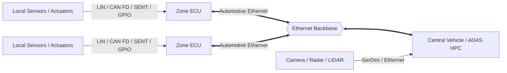
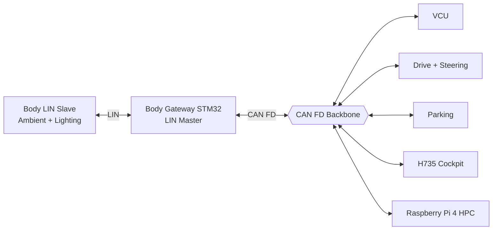
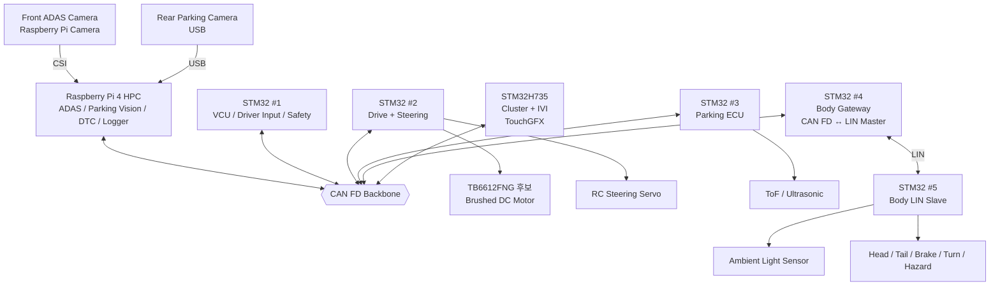

<div align="center">

# SDV MCU Project

**6인 팀으로 구현하는 Mini SDV E/E Architecture**

Raspberry Pi 4 Central HPC · STM32 분산 ECU · CAN FD Backbone · LIN Subnetwork · ADAS · Parking Assist · Cluster/IVI · DTC · Motor/Steering Control


[프로젝트 개요](#1-프로젝트-개요) · [실차와의 차이](#2-실제-sdv와-본-프로젝트의-차이) · [전체 아키텍처](#3-현재-프로젝트-아키텍처) · [역할 분담](#7-6인-역할-분담) · [문서](#10-개발-문서)

</div>

---

> **현재 문서 버전:** Architecture v1.1 — 2026-09-09  
> **중요 변경:** 기존에 분리했던 Instrument Cluster와 IVI를 **STM32H735 + TouchGFX 한 노드의 Cockpit ECU**로 통합했다. 기본 화면은 Cluster이며, 터치/메뉴 전환으로 ADAS·Parking·DTC·Vehicle Setting IVI 화면을 제공한다.  
> **이전 계획 보존:** [2026-09-08 Legacy README](docs/archive/README_2026-09-08_legacy.md)

본 프로젝트는 실제 도로 차량용 제어기가 아니라 **저속 RC/모형 모빌리티 플랫폼에서 SDV의 E/E 구조, 데이터 흐름, 실시간 제어, 진단, HMI를 축소 구현하는 교육용 프로젝트**다.

---

# 1. 프로젝트 개요

목표는 RC카에 기능을 단순히 붙이는 것이 아니라 다음 계층을 실제 하드웨어로 분리해 구현하는 것이다.

```text
High-performance perception / service
            → Raspberry Pi 4 HPC

Vehicle state / safety arbitration
            → STM32 VCU

Hard real-time motor / steering control
            → STM32 Drive + Steering ECU

Local distance sensing
            → STM32 Parking ECU

Vehicle gateway
            → STM32 Body Gateway

Local body network
            → LIN → STM32 Body LIN Slave

Driver HMI
            → STM32H735 Cluster + IVI
```

주요 기능은 다음과 같다.

- **ADAS:** 전방 Raspberry Pi Camera 기반 차선·객체·위험 인식
- **Parking Assist:** R단 후방 USB Camera + 거리센서
- **Driver Input:** P/R/N/D, Accelerator, Brake, Steering Wheel 입력
- **VCU:** 차량 모드, 운전자/ADAS/Parking 요청 중재, Fail-safe
- **Drive:** 브러시드 DC Motor + TB6612FNG 후보, Encoder/Hall 기반 RPM
- **Steering:** RC Servo 기반 조향
- **Body Gateway:** CAN FD ↔ LIN Gateway
- **LIN Body Slave:** 조도센서와 Lighting 장치
- **Cockpit:** STM32H735 + TouchGFX에서 Cluster와 IVI를 한 화면 시스템으로 통합
- **Diagnostics:** 각 ECU Local DTC + Raspberry Pi 중앙 DTC Manager

---

# 2. 실제 SDV와 본 프로젝트의 차이

## 2.1 실제 최신 SDV의 일반적인 방향



실제 Zonal Architecture에서는 **Zone 내부의 CAN FD/LIN**과 **Zone ↔ Central HPC 사이의 Automotive Ethernet Backbone**이 역할을 나눈다.

## 2.2 본 프로젝트

예산과 보드 규모를 고려해 Automotive Ethernet Backbone을 직접 구현하지 않고 **CAN FD를 차량 공통 Backbone으로 사용**한다. 대신 LIN Subnetwork와 Gateway를 실제로 구현해 계층형 네트워크 개념을 남긴다.



즉 실차와 프로젝트를 한 줄로 비교하면 다음과 같다.

> **Actual SDV:** Local LIN/CAN → Zone ECU → Automotive Ethernet Backbone → Central HPC  
> **This Project:** Local LIN → Body Gateway → CAN FD Backbone → Raspberry Pi HPC

| 항목 | 실제 SDV / Zonal 차량 | 본 프로젝트 |
|---|---|---|
| Central Compute | Automotive-grade HPC / ADAS SoC | Raspberry Pi 4 |
| Backbone | Automotive Ethernet | CAN FD |
| Local Bus | LIN / CAN FD / SENT | LIN + GPIO/ADC/I2C/PWM |
| Gateway | Zonal Controller | Body Gateway STM32 |
| ADAS 영상 | SerDes / Ethernet | Front Pi Camera → CSI |
| 후방 영상 | 고속 Camera Link | Rear USB Camera |
| Hard Real-Time | 전용 Automotive MCU | STM32 |
| Cockpit | Cluster/Cockpit SoC | STM32H735 + TouchGFX |
| Diagnostics | UDS / DoIP | CAN FD DTC + UDS 일부 개념 |

---

# 3. 현재 프로젝트 아키텍처

## 3.1 전체 E/E 구조



## 3.2 컴퓨팅 노드

| Node | Hardware | 역할 |
|---|---|---|
| Central HPC | Raspberry Pi 4 | ADAS, Rear Parking Vision, DTC Manager, Logger |
| STM32 #1 | VCU | Driver Input, Mode, Arbitration, Safety, Heartbeat |
| STM32 #2 | Drive + Steering ECU | Motor PWM/RPM, Servo steering, Local control |
| STM32 #3 | Parking ECU | ToF/Ultrasonic 거리 측정과 Warning Level |
| STM32 #4 | Body Gateway | CAN FD ↔ LIN Mapping, LIN Master, Gateway DTC |
| STM32 #5 | Body LIN Slave | Ambient sensing, Lighting output, LIN status |
| STM32H735 | Cockpit ECU | Digital Cluster + IVI + Diagnostic UI |

> 소형 STM32의 실제 모델별 **FDCAN 지원 여부는 착수 시 반드시 확인**한다. 지원하지 않으면 Classic CAN fallback을 허용하되 메시지 설계와 상위 아키텍처는 유지한다. Raspberry Pi도 CAN FD 지원 외장 인터페이스가 필요하다.

---

# 4. 주요 데이터 흐름

## 4.1 Driver → Vehicle

```text
Gear Buttons
Accelerator Position
Brake Position
Steering Wheel Angle
        ↓
      VCU
        ↓ CAN FD
Final Speed / Steering Request
        ↓
Drive + Steering ECU
        ↓
TB6612FNG + DC Motor / RC Servo
```

VCU가 센서 입력을 직접 Motor PWM으로 바꾸지 않고 **Driver Request → Safety Arbitration → Final Request** 순서로 처리한다.

## 4.2 ADAS

```text
Front Camera
   ↓ CSI
Raspberry Pi 4
   ↓ CV / AI
Lane / Object / Risk
   ↓ CAN FD
VCU
   ↓
Final Command
   ↓
Drive + Steering ECU
```

Raw Camera frame은 CAN FD로 보내지 않는다.

## 4.3 Parking

```text
Gear = R
   ↓
VCU Vehicle State
   ↓
Pi: Front ADAS pause / Rear Camera active

Parking ToF/Ultrasonic
   ↓
Parking ECU
   ↓ CAN FD
Distance / Warning Level
   ↓
VCU + H735 + Pi
```

## 4.4 Body Gateway / LIN

```text
H735 / VCU
  ↓ Body_Command over CAN FD
Body Gateway STM32 #4
  ↓ CAN → LIN Mapping
LIN
  ↓
Body LIN Slave STM32 #5
  ↓
Lighting
```

반대 방향:

```text
Ambient Light Sensor
  ↓
LIN Slave
  ↓ LIN Status
Body Gateway
  ↓ LIN → CAN Mapping
CAN FD
  ↓
VCU / H735 / HPC
```

## 4.5 DTC

```text
Local Sensor / ECU Fault
        ↓
Local DTC 생성
        ↓ CAN FD
Raspberry Pi DTC Manager
        ↓
Active / History / Timestamp / Count
        ↓ CAN FD
STM32H735 Cockpit
```

H735에서는 기본 Cluster 화면에 Warning을 표시하고, Diagnostic 메뉴로 들어가면 상세 DTC를 표시한다.

---

# 5. STM32H735 Cockpit: Cluster + IVI 통합

H735는 별도 Cluster와 별도 IVI 두 장치가 아니라 **하나의 Cockpit ECU**다.

## 기본 Cluster 화면

- Speed
- Motor RPM
- Battery Voltage / 추정 SOC
- Battery / Motor Temperature
- P/R/N/D
- READY
- Turn Signal
- Headlamp
- ADAS Active
- General Warning

## IVI 메뉴 화면

- ADAS 상세 상태
- Parking Assist
- DTC / Diagnostics
- Lighting / Vehicle Settings
- System Status

```text
Power ON
   ↓
Cluster Main Screen
   │
   ├─ Touch/Menu → ADAS
   ├─ Touch/Menu → Parking
   ├─ Touch/Menu → Diagnostics
   └─ Touch/Menu → Settings
```

운전 필수 정보는 항상 쉽게 돌아올 수 있는 Cluster 화면에 두고, 상세 정보는 IVI 메뉴로 분리한다.

---

# 6. Stage 1 개발 원칙

초심자 팀이므로 **1단계에서는 전체 CAN 통합을 먼저 하지 않는다.** 각자 자기 노드를 단독 Bring-up한다.

```text
Architecture / Specification 작성
        ↓
Pin Map / Wiring 작성
        ↓
Board Bring-up
        ↓
Sensor / Actuator 단독 시험
        ↓
Raw Data 확인
        ↓
Physical Value 변환
        ↓
Disconnect / Invalid 시험
        ↓
Stage 1 PASS
        ↓
CAN / LIN 통합
```

Stage 1의 상세 방법은 [Beginner Architecture & Stage 1 Guide](docs/BEGINNER_ARCHITECTURE_STAGE1_GUIDE.md)를 따른다.

---

# 7. 6인 역할 분담

A~F는 임시 식별자다.

| 담당 | 주요 Node | 핵심 책임 |
|---|---|---|
| **A** | STM32 #1 VCU | System Architecture, Driver Input, VCU State, CAN Integration, Safety |
| **B** | STM32 #2 Drive + Steering | TB6612FNG, Brushed Motor, Encoder/RPM, RC Servo, Local Control |
| **C** | Raspberry Pi 4 HPC | Front ADAS, Camera pipeline, DTC Manager, Logger, HPC service |
| **D** | STM32 #3 Parking + Rear Camera SW | 거리센서, Parking Warning, R-mode Rear Vision, C와 Pi 자원 협업 |
| **E** | STM32H735 Cockpit | Cluster + IVI TouchGFX, CAN Model, ADAS/Parking/DTC HMI |
| **F** | STM32 #4 + #5 Body Network | CAN↔LIN Gateway, LIN Master/Slave, Ambient, Lighting, Gateway DTC |

공통 규칙:

- A가 CAN Signal Matrix와 통합 기준을 관리한다.
- F가 LIN Schedule과 CAN↔LIN Mapping Table을 관리한다.
- C와 D는 Raspberry Pi의 Front/Rear Camera 서비스 충돌을 함께 관리한다.
- E는 화면에 보이는 값의 owner를 직접 만들지 않고 CAN 데이터로 받는다.
- 모든 ECU는 자기 센서/액추에이터의 Local Fault를 먼저 진단한다.

---

# 8. 초기 CAN / LIN 설계 방향

## CAN FD 메시지 예시

| CAN ID | Message | Tx | 주요 Rx |
|---:|---|---|---|
| `0x100` | Vehicle_State | VCU | All |
| `0x101` | Driver_Input | VCU | HPC / H735 |
| `0x110` | ADAS_Request | HPC | VCU / H735 |
| `0x120` | Drive_Status | Drive ECU | VCU / H735 / HPC |
| `0x200` | Parking_Status | Parking ECU | VCU / H735 / HPC |
| `0x210` | Body_Status | Body Gateway | VCU / H735 / HPC |
| `0x220` | Body_Command | VCU / H735 | Body Gateway |
| `0x300` | DTC_Event | All | HPC / H735 |
| `0x310` | ECU_Heartbeat | All | VCU / HPC |

실제 ID·DLC·Scale·Offset·Endian·Cycle·Timeout은 Stage 1 종료 전후에 확정한다.

## LIN 예시

| Frame | Publisher | Subscriber / Role |
|---|---|---|
| `Ambient_Status` | LIN Slave | Gateway가 읽음 |
| `Lamp_Command` | Gateway Master | LIN Slave가 실행 |
| `Lamp_Status` | LIN Slave | Gateway가 읽음 |
| `Lamp_Diagnostic` | LIN Slave | Gateway가 CAN DTC로 변환 |

---

# 9. 4주 계획 요약

| 주차 | 목표 |
|---|---|
| Week 1 | 명세/Architecture 작성 + 각 Node 단독 Bring-up |
| Week 2 | Local 기능 완성 + 2-node CAN / LIN 통신 시작 |
| Week 3 | CAN Backbone + LIN Gateway + H735/HPC End-to-End 통합 |
| Week 4 | 차량 장착, Fault Injection, Latency/FPS/Response 검증, 최종 시연 |

상세 내용은 [WEEKLY_PLAN.md](docs/WEEKLY_PLAN.md)를 참고한다.

---

# 10. 개발 문서

초심자 팀은 아래 순서로 읽는 것을 권장한다.

1. [전자공학 선행학습 가이드](docs/ELECTRONICS_PREREQUISITES_FOR_SW_TEAM.md)
2. [Architecture 작성 & Stage 1 Guide](docs/BEGINNER_ARCHITECTURE_STAGE1_GUIDE.md)
3. [현재 Sensor List](docs/SENSOR_LIST.md)
4. [각 Node 명세서/Architecture 작성 예시](docs/NODE_SPEC_ARCHITECTURE_EXAMPLES.md)
5. [4주 개발 계획](docs/WEEKLY_PLAN.md)
6. [Node Specification Template](docs/templates/NODE_SPECIFICATION_TEMPLATE.md)
7. [ECU Architecture Template](docs/templates/ECU_ARCHITECTURE_TEMPLATE.md)
8. [Stage 1 Test Report Template](docs/templates/STAGE1_TEST_REPORT_TEMPLATE.md)

---

# 11. 최종 Demo 목표

```text
Power ON
→ ECU Heartbeat
→ H735 Cluster READY
→ Gear D
→ Front ADAS Active
→ Lane / Object Result
→ VCU Arbitration
→ Motor / Steering Control
→ Gear R
→ Rear Camera + Parking Sensors
→ H735 Parking Screen
→ Ambient 변화
→ LIN Slave → Gateway → CAN → H735
→ Lighting Command
→ CAN → Gateway → LIN → Lamp
→ Sensor Fault Injection
→ Local DTC → Pi DTC Manager → H735 Diagnostic Screen
```

이 흐름이 반복 가능하게 동작하면 프로젝트는 다음을 실제로 보여준다.

> **Central HPC + Distributed Real-Time ECU + CAN FD Backbone + LIN Subnetwork/Gateway + ADAS + Parking + Driver Input + Motor/Steering + Cockpit HMI + Diagnostics**

---

## License

[LICENSE](LICENSE)
