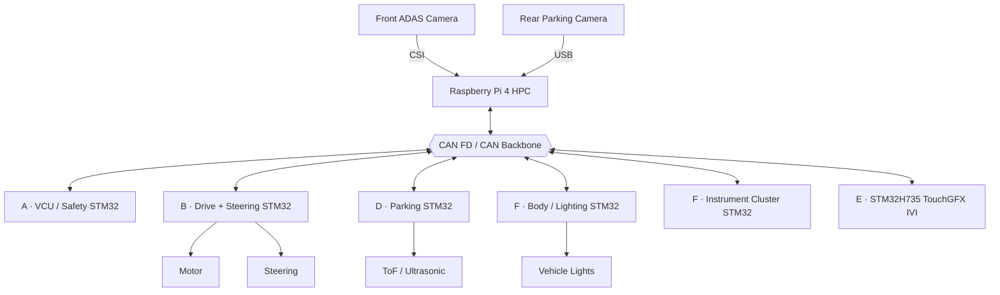

# Beginner Guide — ECU Architecture 작성법 & Stage 1 단독 Bring-up

> 대상: STM32 / Raspberry Pi / CAN 기반 차량 프로젝트를 처음 진행하는 팀원  
> 목표: **각자 자기 ECU/HPC의 역할을 설명할 수 있고, 센서·액추에이터를 보드에 직접 연결해 단독 시험까지 완료하는 것**  
> 현재 단계에서는 전체 차량 통합보다 **각 노드의 입력 → 처리 → 출력**을 먼저 검증한다.

---

## 0. 이 문서를 먼저 읽는 이유

처음 프로젝트를 시작하면 보통 다음 순서로 망하기 쉽다.

```text
센서부터 아무 핀에 연결
→ 코드 작성
→ 값은 어쩌다 나옴
→ CAN 붙이려 함
→ 누가 어떤 데이터를 만드는지 모름
→ 핀/단위/주기/메시지 충돌
```

이 프로젝트에서는 반대로 진행한다.

```text
1. 내 ECU 역할 정의
2. 입력 / 처리 / 출력 정의
3. 핀과 센서 인터페이스 정의
4. MCU 단독 Bring-up
5. 센서 / 액추에이터 단독 시험
6. 정상값과 오류조건 기록
7. 그 다음 CAN 통합
```

**Stage 1의 목표는 “차량이 움직이는 것”이 아니다.**  
각자 담당 보드에서 입력을 정확히 읽고, 필요한 출력을 정확히 만들며, 문제가 생겼을 때 원인을 설명할 수 있는 상태가 목표다.

---

# 1. Architecture가 무엇인가

Architecture는 단순한 배선도가 아니다.

배선도는 다음을 보여준다.

```text
Sensor VCC → 3.3V
Sensor SDA → PB9
Sensor SCL → PB8
```

Architecture는 다음을 보여준다.

```text
무엇을 입력받는가?
        ↓
누가 처리하는가?
        ↓
어떤 판단을 하는가?
        ↓
무엇을 출력하는가?
        ↓
다른 ECU와 어떤 정보를 주고받는가?
```

예를 들어 Parking ECU의 Architecture는 다음처럼 쓸 수 있다.

```text
ToF Sensor FL / FR / RL / RR
            ↓ I2C / GPIO
        Parking ECU
            ↓
  Distance Filtering
            ↓
 Warning Level 판단
            ↓
 Parking_Status 생성
            ↓
          CAN FD
            ↓
       VCU / IVI / HPC
```

반면 실제 배선은 별도다.

```text
VL53L0X SDA → PB9
VL53L0X SCL → PB8
XSHUT FL    → PA0
XSHUT FR    → PA1
...
```

둘을 섞지 않는다.

---

# 2. Architecture는 4개 표만 쓰면 시작할 수 있다

초심자는 처음부터 복잡한 UML이나 AUTOSAR 문서를 만들 필요가 없다.

각 담당자는 아래 **4개 항목**부터 작성한다.

1. Block Diagram
2. I/O Table
3. Software Flow
4. Interface Contract

---

## 2.1 Block Diagram

형식은 무조건 다음처럼 단순하게 시작한다.

```text
[INPUT]
   ↓
[MY ECU]
   ↓
[OUTPUT]
```

예: Drive + Steering ECU

```text
Motor Encoder ───────┐
Steering Feedback ───┤
                     ▼
             Drive + Steering ECU
                     │
             ┌───────┴────────┐
             ▼                ▼
        Motor Driver      Steering Servo
             │                │
             ▼                ▼
           Motor           Steering
```

그리고 이후 CAN이 붙으면 다음처럼 확장한다.

```text
                    CAN FD
                      │
             Target Speed / Angle
                      │
                      ▼
Encoder ───────→ Drive + Steering ECU ─────→ Motor PWM
Feedback ──────→                         └──→ Steering PWM
                      │
                      ▼
               Status / DTC
                      │
                    CAN FD
```

---

## 2.2 I/O Table

각자 반드시 작성한다.

예:

| 이름 | 종류 | 방향 | MCU Peripheral | Pin | 단위 / 범위 | 비고 |
|---|---|---|---|---|---|---|
| Motor Encoder A | Digital | Input | TIM Encoder | PA0 | pulse | 실제 핀 확정 필요 |
| Motor Encoder B | Digital | Input | TIM Encoder | PA1 | pulse | 실제 핀 확정 필요 |
| Steering Feedback | Analog | Input | ADC | PA4 | 0~3.3 V | 각도 환산 필요 |
| Motor PWM | PWM | Output | TIM PWM | PB6 | 0~100 % | Motor Driver 연결 |
| Steering PWM | PWM | Output | TIM PWM | PB7 | pulse width | Servo 사용 시 |

**핀은 예시를 복사하지 말고 실제 사용하는 보드의 회로도 / datasheet / CubeMX에서 확인한다.**

---

## 2.3 Software Flow

코드보다 먼저 흐름을 적는다.

예: 거리센서

```text
Sensor Init
    ↓
Read Raw Distance
    ↓
Range Check
    ↓
Filtering
    ↓
Warning Level 결정
    ↓
Local Data Update
```

예: 모터

```text
Encoder Read
    ↓
RPM 계산
    ↓
Target - Actual
    ↓
PID
    ↓
PWM 제한
    ↓
Motor Driver
```

복잡한 코드를 짜기 전에 이 흐름이 5~10줄 안에서 설명되어야 한다.

---

## 2.4 Interface Contract

Stage 1에서는 CAN을 아직 연결하지 않아도 **나중에 무엇을 주고받을지 미리 적는다.**

예: Parking ECU

### 다른 노드에서 받을 데이터

| 이름 | 송신자 | 의미 |
|---|---|---|
| Vehicle_Mode | VCU | 현재 차량 모드 |
| Gear | VCU | P/R/N/D |

### 다른 노드로 보낼 데이터

| 이름 | 수신자 | 의미 |
|---|---|---|
| Distance_FL | VCU / IVI / HPC | Front Left 거리 |
| Distance_FR | VCU / IVI / HPC | Front Right 거리 |
| Distance_RL | VCU / IVI / HPC | Rear Left 거리 |
| Distance_RR | VCU / IVI / HPC | Rear Right 거리 |
| Parking_Level | VCU / IVI | NORMAL / WARN / CRITICAL |
| Sensor_Fault | HPC / IVI | 센서 오류 여부 |

이 단계에서는 CAN ID나 byte 위치보다 **데이터의 의미와 주인(owner)**을 먼저 결정한다.

---

# 3. 반드시 지킬 Architecture 원칙

## 3.1 센서 데이터의 Owner는 한 곳만 둔다

예를 들어 Motor RPM은 Drive ECU가 Encoder를 읽어서 만든다.

```text
Encoder
  ↓
Drive ECU
  ↓
Motor RPM
```

Cluster가 Encoder를 또 읽지 않는다.

```text
잘못된 구조

Encoder ─→ Drive ECU
    └────→ Cluster
```

정상 구조:

```text
Encoder
  ↓
Drive ECU
  ↓ Motor_RPM
CAN
  ↓
Cluster / IVI / HPC
```

---

## 3.2 HMI는 제어값을 직접 만들지 않는다

IVI에서 버튼을 눌러도 모터 PWM을 직접 보내지 않는다.

```text
잘못된 예

IVI → Motor PWM 80%
```

```text
권장 구조

IVI
 ↓ User Request
VCU
 ↓ Safety / Mode 판단
Drive ECU
 ↓ Local Control
Motor
```

---

## 3.3 Raspberry Pi가 Hard Real-Time PWM을 직접 만들지 않는다

```text
Pi ADAS
 ↓
Steering Request
 ↓ CAN
VCU
 ↓
Drive + Steering ECU
 ↓
PWM / PID
```

Pi는 고성능 연산을 하고 STM32는 빠른 실시간 제어를 담당한다.

---

## 3.4 Raw Camera 영상은 CAN으로 보내지 않는다

```text
Camera Image
   ↓
Raspberry Pi 내부 CV 처리
   ↓
Lane / Object / Warning / Request
   ↓
CAN
```

---

# 4. 우리 프로젝트의 현재 전체 Architecture



> 실차 SDV는 보통 Zone Controller와 Automotive Ethernet Backbone을 사용하지만, 본 프로젝트는 학습과 구현 난이도를 고려해 **CAN FD/CAN Backbone 중심으로 단순화**한다.

---

# 5. Stage 1의 범위

Stage 1에서는 다음을 하지 않는다.

- 전체 ECU CAN 통합
- ADAS가 실제 모터를 움직이는 End-to-End 제어
- DTC 중앙 서버 통합
- 모든 보드를 차량에 한꺼번에 장착
- GUI 완성도 높이기

Stage 1에서는 다음만 한다.

```text
내 보드 전원 ON
      ↓
Peripheral Init
      ↓
센서 값을 정상적으로 읽음
      ↓
Serial / Debug 화면에서 확인
      ↓
액추에이터가 있으면 안전한 범위에서 단독 구동
      ↓
오류조건도 한 번 확인
      ↓
결과 기록
```

---

# 6. Stage 1 공통 Bring-up 순서

모든 팀원은 아래 순서를 지킨다.

## Step 1 — Board Bring-up

- [ ] MCU 보드가 정상적으로 부팅되는가?
- [ ] ST-Link / USB Serial 다운로드가 되는가?
- [ ] `LED Blink` 또는 UART `Hello`가 되는가?
- [ ] Debugger breakpoint가 정상 동작하는가?

완료 기준:

```text
Firmware Build → Flash → Run → Debug 가능
```

---

## Step 2 — Sensor Datasheet 확인

센서를 연결하기 전에 최소한 다음을 기록한다.

| 항목 | 예시 |
|---|---|
| Sensor Name | VL53L0X |
| Supply Voltage | 2.8~3.3 V module 기준 확인 |
| Interface | I2C |
| Address | 0x29 |
| Update Rate | 실제 설정값 기록 |
| Measurement Range | 데이터시트 기준 |
| Error / Invalid Value | 라이브러리 반환값 확인 |

**전압을 확인하지 않고 먼저 꽂지 않는다.**

---

## Step 3 — Wiring Table 작성

코드를 짜기 전에 작성한다.

| Device Pin | MCU Pin | 기능 |
|---|---|---|
| VCC | 3.3 V | Power |
| GND | GND | Ground |
| SDA | PB9 | I2C SDA |
| SCL | PB8 | I2C SCL |

여러 센서를 쓰면 센서마다 표를 만든다.

---

## Step 4 — Peripheral만 먼저 시험

센서 라이브러리 전체를 한 번에 붙이지 않는다.

예:

### I2C

```text
I2C Init
 ↓
Device Address Scan / WHO_AM_I
 ↓
ACK 확인
```

### ADC

```text
ADC Init
 ↓
Raw ADC 출력
 ↓
0 ~ Full Scale 변화 확인
```

### Encoder

```text
Timer Encoder Mode
 ↓
CNT 값 출력
 ↓
축 회전 방향에 따라 증가 / 감소 확인
```

### PWM

```text
Timer PWM
 ↓
고정 Duty 출력
 ↓
오실로스코프 / 로직분석기 / 안전한 부하에서 확인
```

---

## Step 5 — Raw 값부터 출력

처음부터 km/h, °C, cm로 예쁘게 만들지 않는다.

먼저:

```text
ADC_RAW = 2048
ENC_CNT = 1243
TOF_RAW = 437
```

가 정확히 변하는지 본다.

그 다음 물리값으로 변환한다.

```text
ADC_RAW
 ↓ Conversion
Motor Temperature = 32.4 °C
```

---

## Step 6 — 정상 범위 확인

최소 3점에서 측정한다.

예: 거리센서

| 실제 거리 | 측정값 1 | 측정값 2 | 측정값 3 | 판정 |
|---:|---:|---:|---:|---|
| 100 mm | | | | |
| 300 mm | | | | |
| 500 mm | | | | |

예: Steering Feedback

| 위치 | ADC Raw | 변환 각도 |
|---|---:|---:|
| Left | | |
| Center | | |
| Right | | |

---

## Step 7 — 오류조건 시험

정상값만 나오면 시험이 끝난 게 아니다.

한 번씩 확인한다.

```text
Sensor Cable Disconnect
        ↓
MCU가 멈추는가?
        ↓
Timeout을 검출하는가?
        ↓
Invalid 상태를 만들 수 있는가?
```

Stage 1에서는 DTC까지 완성하지 않아도 되지만 최소한 아래 변수는 만들기를 권장한다.

```c
sensor_valid = true / false;
sensor_timeout = true / false;
```

---

# 7. 역할별 Stage 1 해야 할 일

현재 역할 A~F 기준이다.

---

## A — System Architecture / VCU / CAN Integration

### Stage 1 목표

VCU는 원래 센서를 많이 직접 읽는 ECU가 아니므로 억지로 센서를 달 필요가 없다.

대신 **차량 입력을 모사하는 간단한 물리 입력**으로 VCU state machine을 먼저 시험한다.

추천 입력:

- Push Button / DIP Switch → `P / R / N / D`
- Push Button → Emergency Stop
- Potentiometer → Driver Request 모사용 ADC

```text
Button / Switch
      ↓ GPIO
     VCU
      ↓
Vehicle Mode
Gear State
Safety State
      ↓
UART Debug / LED
```

### 확인할 것

- [ ] GPIO input 정상
- [ ] Switch debounce
- [ ] ADC raw 값 정상
- [ ] `P/R/N/D` 상태 전환
- [ ] E-Stop 입력 시 FAULT/STOP 상태
- [ ] UART로 현재 상태 출력

### Stage 1 출력 예

```text
GEAR = D
MODE = MANUAL
DRIVER_REQ = 42 %
ESTOP = 0
```

### 산출물

- `VCU_BLOCK_DIAGRAM.md`
- `VCU_IO_TABLE.md`
- VCU state transition 그림
- Serial log 또는 짧은 테스트 영상

---

## B — Drive + Steering Control

### Stage 1 목표

```text
Motor Encoder → STM32 → RPM
Steering Feedback → STM32 → Position
STM32 PWM → Motor Driver / Steering
```

### 센서 / 입력

- Motor Encoder 또는 Hall Sensor
- Steering Feedback Potentiometer / Position Sensor

### 출력

- Motor PWM
- Steering Servo / Steering Motor PWM

### 순서

1. Motor 없이 PWM 파형 확인
2. Motor Driver 연결
3. 낮은 출력부터 Motor 단독 회전 확인
4. Encoder Count 확인
5. RPM 환산
6. Steering PWM 확인
7. Steering Feedback ADC 확인
8. 중앙 / 좌 / 우 위치값 기록

### Stage 1에서는 PID 완성보다 먼저 할 것

```text
PWM 20% → Motor 회전
PWM 30% → Motor 회전
PWM 40% → Motor 회전

Encoder 값이 그 변화에 따라 증가하는지 확인
```

PID는 Feedback이 믿을 만하다는 것이 확인된 후 시작한다.

### 출력 예

```text
PWM_CMD = 30 %
ENCODER_CNT = 812
RPM = 152
STEER_ADC = 2134
STEER_POS = CENTER
```

### 산출물

- Motor / Encoder Wiring Table
- Steering Wiring Table
- PWM별 RPM 간단 측정표
- Left / Center / Right feedback 값

---

## C — ADAS / Central HPC

C의 보드는 STM32가 아니라 Raspberry Pi 4 HPC다.

### Stage 1 목표

아직 차선 제어나 VCU 연동을 하지 않는다.

```text
Front Pi Camera
     ↓ CSI
Raspberry Pi 4
     ↓
Frame Capture
     ↓
FPS / Resolution 확인
```

### 확인할 것

- [ ] Camera device 인식
- [ ] 안정적인 Frame Capture
- [ ] 사용할 해상도 확정
- [ ] FPS 측정
- [ ] 영상 저장 또는 Preview
- [ ] OpenCV에서 1 frame 접근 가능

그 후 간단한 CV 하나만 붙인다.

예:

- grayscale
- edge detection
- 간단한 lane line
- 사전학습 object detector 1개

Stage 1에서는 **정확도보다 Camera Pipeline이 안 죽고 계속 도는 것**이 더 중요하다.

### 산출물

- Camera Resolution / FPS 표
- Front Camera Test Screenshot
- CPU 사용률 메모
- `front_camera_test` 실행 방법

---

## D — Parking Assist

D는 **Parking STM32 + Rear USB Camera**를 함께 담당하지만 Stage 1에서는 두 부분을 독립적으로 시험한다.

### Part A — Parking Sensor ECU

```text
ToF / Ultrasonic
       ↓
Parking STM32
       ↓
Raw Distance
       ↓
Filtered Distance
```

추천 순서:

1. 센서 1개만 연결
2. Raw distance 확인
3. 3개 거리 지점에서 값 기록
4. 2개 이상으로 확장
5. 최종 FL/FR/RL/RR 확장
6. Sensor disconnect 시험

여러 I2C ToF 센서가 같은 address를 쓰면 **XSHUT 또는 I2C MUX 등 주소 충돌 해결 방법**이 필요할 수 있으므로 사용 모델을 먼저 확인한다.

### Part B — Rear Camera

```text
Rear USB Camera
      ↓
Raspberry Pi 4
      ↓
Frame Capture
```

C와 함께 Pi Camera resource를 충돌 없이 쓸 수 있도록 실행 방식을 맞춘다.

### Stage 1 출력 예

```text
FL = 502 mm
FR = 487 mm
RL = 611 mm
RR = 603 mm
SENSOR_VALID = 1
```

### 산출물

- Sensor Wiring / Address Table
- 3-point distance test
- Rear Camera screenshot
- Front / Rear camera 실행 규칙

---

## E — STM32H735 TouchGFX IVI / Diagnostics UI

IVI는 원래 센서를 직접 읽는 노드가 아니다.

그러므로 Stage 1에서 센서를 억지로 연결하지 않는다.

### Stage 1 목표

```text
Dummy Vehicle Data
        ↓
STM32H735 Model
        ↓
TouchGFX
        ↓
화면 값 변경
```

예:

```text
speed = 25
rpm = 1200
battery = 78
parking_rr = 300
adas_warning = true
```

이 값을 timer로 바꾸거나 touch button으로 변경해서 UI가 정상 갱신되는지 확인한다.

### 확인할 것

- [ ] TouchGFX 프로젝트 Build
- [ ] LCD 출력
- [ ] Touch 입력
- [ ] 화면 전환
- [ ] 숫자 / Gauge update
- [ ] Warning icon on/off
- [ ] DTC list dummy data 표시

### 중요한 원칙

Stage 1에서는 CAN이 없어도 된다.

나중에는:

```text
CAN RX
  ↓
Vehicle Data Model
  ↓
TouchGFX View
```

로 Dummy Data 부분만 CAN 데이터로 교체한다.

### 산출물

- IVI Screen Map
- Dummy Data 구조체
- 화면 전환 영상 / 캡처
- 각 화면에서 필요한 CAN Signal 목록

---

## F — Body / Lighting + Instrument Cluster

F는 두 기능을 맡으므로 Stage 1에서 **Body ECU를 먼저 실제 I/O로 검증하고 Cluster는 Dummy Data로 동시에 진행**한다.

### Part A — Body / Lighting ECU

입력 후보:

- Ambient Light Sensor / CDS
- Brake Switch 모사용 Button
- Turn Left / Right Button

출력:

- Head Lamp LED
- Tail Lamp LED
- Brake Lamp LED
- Turn Signal LED

```text
Ambient Sensor
Button
  ↓
Body STM32
  ↓
Lighting Logic
  ↓
LED Output
```

확인할 것:

- [ ] GPIO output
- [ ] PWM brightness 필요 시 PWM
- [ ] CDS/Light sensor ADC
- [ ] 좌/우 방향지시등 blink 주기
- [ ] Brake input → Brake lamp
- [ ] Dark condition → Auto light

### Part B — Instrument Cluster

Stage 1에서는 CAN을 기다리지 말고 Dummy Data로 화면부터 검증한다.

```text
speed = 0 → 50
rpm = 0 → 3000
soc = 100 → 20
motor_temp = 25 → 70
gear = P/R/N/D
```

표시 항목:

- Speed
- RPM
- Battery SOC
- Temperature
- Gear
- READY
- Turn Indicator
- Headlamp
- Warning

### 산출물

- Body I/O Table
- Light sensor ADC min/max
- Lighting state table
- Cluster screenshot
- Cluster가 요구하는 CAN Signal 목록

---

# 8. Stage 1 개인 Architecture 문서 Template

각자 자기 폴더에 아래 형식으로 `ARCHITECTURE.md`를 만든다.

```markdown
# [ECU NAME] Architecture

## 1. Role
이 ECU가 차량에서 담당하는 기능을 2~3문장으로 작성.

## 2. Inputs
| Input | Source | Interface | Range / Unit |
|---|---|---|---|

## 3. Outputs
| Output | Destination | Interface | Range / Unit |
|---|---|---|---|

## 4. Hardware Block Diagram

Input → MCU → Output

## 5. Pin Map
| Function | MCU Pin | Peripheral | Note |
|---|---|---|---|

## 6. Software Flow
Init → Read → Validate → Process → Output

## 7. Local Variables
| Name | Type | Unit | Valid Range |
|---|---|---|---|

## 8. Future CAN Interface
### TX
| Signal | Unit | Cycle | Receiver |
|---|---|---|---|

### RX
| Signal | Unit | Timeout | Sender |
|---|---|---|---|

## 9. Fault Cases
| Fault | Detection | Local Action |
|---|---|---|

## 10. Stage 1 Test Result
| Test | Expected | Result | PASS/FAIL |
|---|---|---|---|
```

---

# 9. 권장 Repository 구조

처음부터 파일이 아무 데나 떠다니지 않게 다음 형태를 권장한다.

```text
SDV_MCU_Project/
│
├─ docs/
│  ├─ BEGINNER_ARCHITECTURE_STAGE1_GUIDE.md
│  ├─ WEEKLY_PLAN.md
│  └─ architecture/
│     ├─ A_VCU_ARCHITECTURE.md
│     ├─ B_DRIVE_STEER_ARCHITECTURE.md
│     ├─ C_HPC_ADAS_ARCHITECTURE.md
│     ├─ D_PARKING_ARCHITECTURE.md
│     ├─ E_IVI_ARCHITECTURE.md
│     └─ F_BODY_CLUSTER_ARCHITECTURE.md
│
├─ firmware/
│  ├─ vcu/
│  ├─ drive_steering/
│  ├─ parking/
│  ├─ body/
│  ├─ cluster/
│  └─ ivi_h735/
│
├─ hpc/
│  ├─ adas/
│  ├─ parking_vision/
│  ├─ diagnostics/
│  └─ logger/
│
└─ tests/
   └─ stage1/
```

현재 실제 폴더 구성은 개발 시작 시 팀에서 확정하면 된다.

---

# 10. Stage 1 Test Report Template

각 기능마다 아래 표를 채운다.

## Device Information

| 항목 | 내용 |
|---|---|
| 담당자 | A/B/C/D/E/F |
| ECU | |
| Board | |
| Sensor / Actuator | |
| Interface | ADC / GPIO / I2C / SPI / Timer / USB / CSI |
| Test Firmware Commit | |
| Test Date | |

## Wiring

| Device | Device Pin | MCU Pin | Voltage |
|---|---|---|---|

## Test

| No. | Test | Expected | Measured | Result |
|---:|---|---|---|---|
| 1 | Power On | 정상 부팅 | | PASS / FAIL |
| 2 | Peripheral Init | Init 성공 | | PASS / FAIL |
| 3 | Normal Input | 정상 범위 값 | | PASS / FAIL |
| 4 | Min / Max | 값 변화 확인 | | PASS / FAIL |
| 5 | Disconnect | 오류 검출 | | PASS / FAIL |
| 6 | Reconnect | 정상 복구 | | PASS / FAIL |

## Evidence

- UART log
- Debug screenshot
- 센서 측정 사진
- 짧은 동작 영상
- 필요한 경우 Logic Analyzer / Oscilloscope capture

---

# 11. Stage 1 공통 코딩 원칙

초기 코드부터 최소한 아래를 지킨다.

## Raw 값과 Physical 값을 분리

```c
uint16_t adc_raw;
float motor_temp_c;
```

`adc_raw`에 °C를 넣는 식으로 섞지 않는다.

---

## Valid 상태를 별도로 둔다

```c
float distance_mm;
bool distance_valid;
```

0 mm가 실제 0인지 센서 오류인지 구분할 수 있어야 한다.

---

## Magic Number를 코드 중간에 쓰지 않는다

```c
if (distance < 173)
```

보다:

```c
#define PARKING_CRITICAL_MM  150
#define PARKING_WARNING_MM   300
```

처럼 의미를 드러낸다.

값 자체는 실제 시험 후 확정한다.

---

## Blocking Delay를 남발하지 않는다

Stage 1 단일 센서 시험에서는 짧게 사용할 수 있지만 최종 ECU 코드에서는 센서·CAN·제어 task가 함께 돌아가야 한다.

따라서 나중에 RTOS 또는 timer tick 기반으로 바꾸기 쉬운 구조로 작성한다.

---

# 12. Stage 1 종료 조건

전체 팀은 아래 조건을 만족하면 Stage 2 CAN 통합으로 넘어간다.

## 공통

- [ ] 모든 보드 Build / Flash / Debug 가능
- [ ] 모든 담당자가 자기 Architecture를 3분 안에 설명 가능
- [ ] I/O Table 작성 완료
- [ ] 실제 Pin Map 작성 완료
- [ ] 센서 Raw 값 확인 완료
- [ ] 물리값 변환 확인 완료
- [ ] 센서 disconnect / invalid 처리 확인
- [ ] 테스트 결과가 문서로 남아 있음

## A

- [ ] Gear / Mode 입력 테스트
- [ ] VCU 기본 State Machine
- [ ] E-Stop 입력 처리

## B

- [ ] Motor PWM
- [ ] Encoder count / RPM
- [ ] Steering output
- [ ] Steering feedback

## C

- [ ] Front Camera capture
- [ ] Resolution / FPS 측정
- [ ] 기본 OpenCV pipeline

## D

- [ ] Parking sensor 최소 1개 정상
- [ ] 다채널 확장 방법 확인
- [ ] Rear USB Camera capture

## E

- [ ] H735 TouchGFX build
- [ ] Touch / 화면 전환
- [ ] Dummy Vehicle Data 표시

## F

- [ ] Lighting I/O
- [ ] Ambient sensor / input
- [ ] Cluster 기본 화면
- [ ] Dummy Speed / RPM / SOC 표시

---

# 13. Stage 2로 넘어갈 때 처음 할 일

Stage 1이 끝난 뒤에야 CAN을 붙인다.

순서는 다음과 같다.

```text
Stage 1
각 ECU Local I/O 검증
      ↓
CAN Matrix v0.1 Freeze
      ↓
2개 노드만 CAN 연결
      ↓
Heartbeat
      ↓
Sensor Status 송신
      ↓
Command / Response
      ↓
전체 ECU 연결
```

처음부터 모든 보드를 CAN bus에 연결하지 않는다.

가장 먼저:

```text
VCU ↔ Drive ECU
```

또는

```text
VCU ↔ Parking ECU
```

같이 **2개 노드만 연결해서** 송수신을 검증한다.

---

# 14. 팀원이 막혔을 때 질문하는 형식

단순히 다음처럼 질문하지 않는다.

```text
센서 안돼요.
```

아래 정보를 같이 올린다.

```text
Board:
Sensor:
Interface:
Power Voltage:
MCU Pin:
CubeMX Setting:
Expected:
Actual:
UART Log:
Tried:
```

예:

```text
Board: STM32xxxx
Sensor: VL53L0X
Interface: I2C1
Power: 3.3V
SDA/SCL: PB9/PB8
Expected: 0x29 ACK
Actual: HAL_I2C_IsDeviceReady timeout
Tried: wiring 확인, 다른 cable 사용
```

이렇게 해야 다른 팀원이 원인을 재현할 수 있다.

---

# 15. Stage 1에서 가장 중요한 한 문장

> **“내 ECU가 어떤 센서 값을 소유하고, 그 값을 어떤 방식으로 읽고, 어떤 상태값으로 만들어 다음 단계에 제공하는지 설명할 수 있어야 한다.”**

센서 하나를 읽는 것 자체는 어렵지 않다. 프로젝트에서 어려운 부분은 6명이 만든 여섯 개의 작은 세계가 나중에 서로 같은 언어로 대화하게 만드는 것이다. Stage 1에서는 각 세계부터 정상적으로 굴러가게 만든다.
