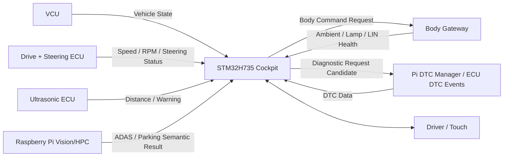
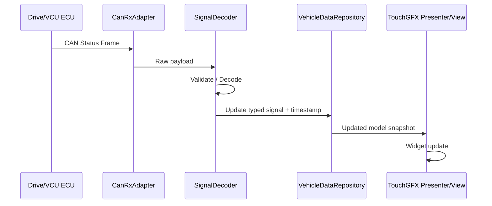
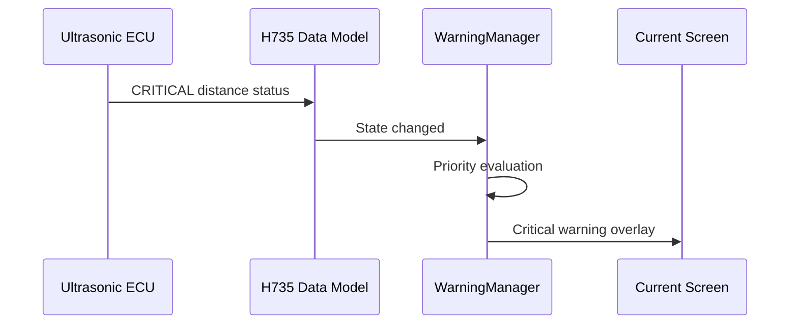
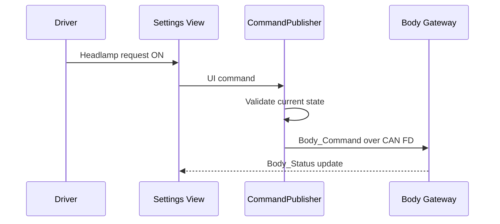
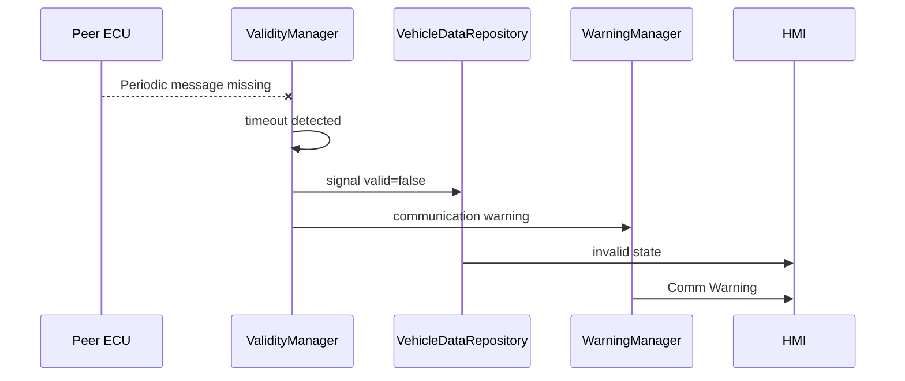
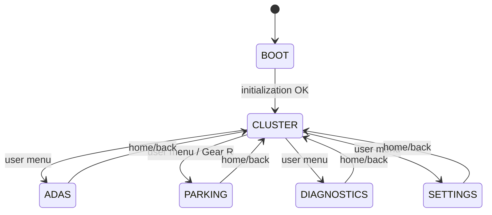

# Cluster + IVI Cockpit Software Architecture

> 문서 목적: STM32H735 Cockpit을 **어떤 구조로 구현하는지**, 각 구성요소가 어떻게 협력하는지 설명한다.  
> 기능 요구사항은 `SPECIFICATION.md`, 검증 결과는 `TEST_REPORT.md`를 기준으로 한다.

## Document Information

| Item | Value |
|---|---|
| Node / System | Cluster + IVI Cockpit |
| Owner | B |
| Board / Platform | STM32H735 + TouchGFX |
| Revision | v0.1 |
| Status | Draft |
| Related Specification | `SPECIFICATION.md` |
| Related Test | `TEST_REPORT.md` |

### Revision History

| Revision | Date | Author | Change |
|---|---|---|---|
| v0.1 | 2026-09-09 | Team | Initial filled example |

---

# 1. Introduction & Goals

## 1.1 Purpose

> H735 Cockpit은 CAN FD로 받은 차량 데이터를 일관된 Vehicle Data Model로 관리하고 TouchGFX를 통해 Cluster/IVI 화면에 표시하며, 사용자 설정은 Request 형태로 차량 네트워크에 전달한다.

## 1.2 Scope

포함:
- CAN FD RX/TX adapter
- Vehicle Data Model
- Signal validity / timeout 관리
- Warning Manager
- TouchGFX Model / Presenter / View
- Cluster Main
- ADAS / Parking / Diagnostics / Settings 화면
- 사용자 Command Request 생성

제외:
- Camera image processing
- Raw camera streaming over CAN
- Motor/Servo control
- VCU arbitration
- LIN direct communication
- 센서 raw measurement

## 1.3 Stakeholders

| Stakeholder | 관심사 / 필요한 정보 |
|---|---|
| B / HMI 담당 | TouchGFX 구조, Data Model, 화면 상태, CAN interface |
| F / VCU·CAN 통합 | H735 RX/TX 계약, timeout, Body/DTC request |
| A / Ultrasonic | Parking status가 어떤 형태로 표시되는지 |
| C / Drive Control | Speed/RPM/Steering status 표시 계약 |
| E / Vision | ADAS/Parking semantic result 표시 계약 |
| D / Body Network | Lamp status / Body command interface |
| 테스트 담당 | Warning, timeout, 화면 전환, DTC 표시 검증 |

---

# 2. Quality Goals

| Priority | Quality Goal | Concrete Scenario / Measure |
|---:|---|---|
| 1 | Reliability | CAN signal timeout이나 잘못된 데이터가 들어와도 UI가 멈추지 않고 Invalid/Warning으로 표현한다. |
| 2 | Responsiveness | 유효한 주요 차량 데이터는 목표 100 ms 이내에 UI Model에 반영한다. |
| 3 | Usability | Power ON 후 Cluster Main이 기본 화면이며 주요 Warning은 어떤 메뉴에서도 확인 가능해야 한다. |
| 4 | Maintainability | CAN Decode, Vehicle Model, Warning Logic, TouchGFX View를 분리해 Signal/UI 변경이 서로 과도하게 영향을 주지 않게 한다. |
| 5 | Testability | Stage 1에서는 CAN 없이 Dummy/Mock Data로 전체 UI 흐름을 시험할 수 있어야 한다. |

---

# 3. Constraints

| Constraint | Reason / Impact |
|---|---|
| STM32H735 + TouchGFX 사용 | 프로젝트 Cockpit HW |
| CAN FD Backbone 목표 | 다른 ECU와 차량 데이터 교환 |
| Raw Camera Frame은 CAN으로 전송하지 않음 | Bandwidth와 시스템 역할 분리 |
| H735는 안전 제어 최종 권한이 없음 | VCU가 최종 Arbitration 담당 |
| LIN 직접 연결 없음 | Body Gateway가 CAN↔LIN 변환 담당 |
| 실제 CAN ID / Pin 일부 TBD | CAN Matrix / HW 확정 후 반영 필요 |

---

# 4. Context & Scope View



## External Interfaces

| External Entity | Direction | Data / Service | Interface | Owner |
|---|---|---|---|---|
| VCU | RX | Gear, Mode, Safety State | CAN FD | F |
| Drive ECU | RX | Speed, RPM, Steering Status | CAN FD | C |
| Ultrasonic ECU | RX | Distance, Valid, Warning | CAN FD | A |
| Raspberry Pi HPC | RX | ADAS/Parking semantic result | CAN FD | E |
| Body Gateway | RX/TX | Body Status / Lighting Request | CAN FD | D |
| DTC Manager | RX/TX 후보 | DTC event/history/clear request | CAN FD | F + Pi |
| Driver | RX/TX | Visual information / Touch | Display + Touch | B |

---

# 5. Solution Strategy & Rationale

| Decision / Strategy | Why | Related Quality / Constraint |
|---|---|---|
| CAN Decode와 TouchGFX View 사이에 Vehicle Data Model을 둔다 | 화면이 CAN frame 구조에 직접 의존하지 않게 함 | Maintainability |
| Warning Manager를 일반 화면 로직과 분리한다 | Critical warning 우선 표시를 일관되게 처리 | Reliability / Usability |
| 화면별 Presenter/View를 나누고 공통 Model을 공유한다 | TouchGFX MVP 구조 활용 | Maintainability |
| Stage 1은 Dummy Data Provider를 사용한다 | 전체 CAN 통합을 기다리지 않고 UI 검증 가능 | Testability |
| H735는 설정을 Request로만 전송한다 | 실제 actuator 제어 권한은 Body/VCU에 유지 | Safety |
| Camera는 semantic result만 표시한다 | CAN bandwidth와 역할 분리 | Constraint |

---

# 6. Building Block / Component View

## 6.1 Top-level Components

```text
                CAN FD
                  ↓
            CanRxAdapter
                  ↓
           SignalDecoder
                  ↓
        VehicleDataRepository
          ┌───────┼────────┐
          ↓       ↓        ↓
     Validity   Warning    DTC
     Manager    Manager   Model
          └───────┼────────┘
                  ↓
          TouchGFX Model
                  ↓
              Presenter
                  ↓
                 View
     ┌────────┬────┼─────┬──────────┐
     ↓        ↓    ↓     ↓          ↓
  Cluster    ADAS Parking Diagnostics Settings
                                    │
                                    ↓
                           CommandPublisher
                                    ↓
                                  CAN TX
```

Stage 1에서는 `CanRxAdapter` 대신 `DummyDataProvider`를 사용할 수 있다.

## 6.2 Component Responsibility

| Component | Responsibility | Input | Output | Depends On |
|---|---|---|---|---|
| `CanRxAdapter` | CAN frame 수신 | FDCAN RX | raw message | HAL/FDCAN |
| `SignalDecoder` | CAN payload → logical signal | raw CAN | decoded signal | CAN Matrix |
| `VehicleDataRepository` | 최신 차량 상태 보관 | decoded signal | typed vehicle state | SignalDecoder |
| `ValidityManager` | timeout/validity 관리 | signal timestamp/flags | valid/invalid state | timer |
| `WarningManager` | Warning 우선순위/overlay 판단 | vehicle state + DTC | warning state | Repository |
| `DtcModel` | DTC list/detail 데이터 관리 | DTC Event | list/detail | Diagnostics contract |
| `TouchGFX Model` | UI에서 사용할 snapshot 제공 | Repository | presenter data | TouchGFX |
| `Presenter` | 화면별 표시 데이터 변환 | Model | View update | TouchGFX |
| `View` | 실제 widget 표시/입력 처리 | Presenter data / touch | user event | TouchGFX |
| `CommandPublisher` | 사용자 Request 검증/송신 | UI command | CAN TX request | CAN service |
| `DummyDataProvider` | Stage 1 테스트 데이터 생성 | timer/test action | mock vehicle state | none |

## 6.3 Module / Folder Mapping

제안 구조이며 실제 TouchGFX 생성 프로젝트에 맞춰 조정한다.

```text
ivi/
├─ app/
│  ├─ vehicle_data/
│  ├─ validity/
│  ├─ warning/
│  └─ diagnostics/
├─ communication/
│  ├─ can_rx/
│  ├─ can_tx/
│  └─ signal_codec/
├─ platform/
│  └─ dummy_data/
└─ touchgfx/
   ├─ model/
   ├─ cluster/
   ├─ adas/
   ├─ parking/
   ├─ diagnostics/
   └─ settings/
```

---

# 7. Runtime View

## 7.1 정상 차량 상태 갱신



## 7.2 Critical Parking Warning



## 7.3 Lighting 설정 요청



## 7.4 CAN Timeout



---

# 8. Deployment / Hardware View

```text
                       CAN FD Backbone
                             │
                    CAN FD Transceiver
                             │
                           FDCAN
                             │
                      STM32H735 MCU
                   ┌─────────┴──────────┐
                   │                    │
            Cockpit Software       TouchGFX
                   │                    │
                   └─────────┬──────────┘
                             │
                    LCD + Touch Panel
                             │
                           Driver
```

| HW / Runtime Node | Software | Interface | Power / Electrical Note |
|---|---|---|---|
| STM32H735 | Data Model / Warning / CAN / TouchGFX | FDCAN, display, touch | board specification 확인 |
| CAN FD Transceiver | physical CAN layer | FDCAN TX/RX ↔ CANH/L | 실제 부품 TBD |
| LCD/Touch | Cluster + IVI | board integrated | H735 board interface |

## Pin / Peripheral Map

| Function | Device | MCU/Board Pin | Peripheral | Direction | Voltage / Note |
|---|---|---|---|---|---|
| CAN TX | CAN FD Transceiver | TBD | FDCAN | OUT | CubeMX/board schematic 확인 |
| CAN RX | CAN FD Transceiver | TBD | FDCAN | IN | CubeMX/board schematic 확인 |
| Display | LCD | Board integrated | LTDC/etc. board config | OUT | board project 설정 사용 |
| Touch | Touch controller | Board integrated | board config | IN | board project 설정 사용 |

---

# 9. Interfaces & Contracts

## 9.1 CAN / CAN FD

### RX

| Message / Signal | Meaning | Sender | Timeout | Timeout Action |
|---|---|---|---|---|
| `Vehicle_State` | Gear/Mode/Safety | VCU | TBD | Vehicle state invalid + warning |
| `Drive_Status` | Speed/RPM/Steering status | Drive ECU | TBD | 해당 widget invalid |
| `Ultrasonic_Status` | Distance/Warning | Ultrasonic ECU | TBD | Parking sensor invalid |
| `Vision_Request` | ADAS/Parking semantic result | HPC | TBD | Vision unavailable |
| `Body_Status` | Ambient/Lamp/LIN health | Body Gateway | TBD | Body communication warning |
| `DTC_Event` | Fault code/status | All/Pi | Event | Unknown code라도 raw code 표시 |
| `ECU_Heartbeat` | Node alive | All | TBD | ECU offline warning |

### TX

| Message / Signal | Meaning | Unit | Cycle/Event | Receiver | Valid Condition |
|---|---|---|---|---|---|
| `Body_Command` | Lighting/Body user request | enum/flags | Event | Body Gateway | valid UI request |
| Diagnostic Clear Request 후보 | DTC clear request | TBD | Event | Diagnostics target | policy satisfied |

CAN ID, DLC, endian, scale, offset은 공통 CAN Matrix에서 확정한다.

## 9.2 LIN

N/A. Cockpit은 LIN에 직접 연결하지 않는다.

## 9.3 API / IPC / File

Stage 1: N/A.

향후 DTC description/configuration을 별도 static table 또는 generated file로 관리할 경우 interface를 추가한다.

---

# 10. Data & State Model

## 10.1 Main Data

| Data | Type | Owner | Meaning | Unit | Valid Range | Invalid Condition |
|---|---|---|---|---|---|---|
| `vehicle_speed` | float/int | Drive ECU | 차량 속도 | project unit | ≥0 | Drive timeout |
| `motor_rpm` | int | Drive ECU | Motor RPM | rpm | ≥0 | Drive timeout |
| `gear` | enum | VCU | P/R/N/D | enum | defined values | VCU timeout/invalid |
| `parking_distance[]` | int[] | Ultrasonic ECU | 영역별 거리 | mm | sensor range | valid=false |
| `parking_warning` | enum | Ultrasonic/HPC | SAFE/WARN/CRITICAL | enum | defined values | source invalid |
| `adas_status` | struct | HPC | lane/object/warning | logical | valid flag | HPC timeout |
| `lamp_status` | flags | Body Gateway | lamp state | bool/enum | defined | Body timeout |
| `dtc_list` | list | Diagnostics | DTC entries | N/A | valid code/status | malformed event |

## 10.2 UI State



Warning Overlay는 화면 state와 별도로 동작하는 공통 계층으로 설계한다.

| State | Entry Condition | Main Action | Exit Condition |
|---|---|---|---|
| BOOT | Power ON | HW/UI/CAN init | init complete |
| CLUSTER | default/home | essential vehicle info | menu event |
| ADAS | ADAS menu | vision semantic status | back/home |
| PARKING | Parking menu/Gear R | distance/warning | back/home |
| DIAGNOSTICS | Diagnostics menu | DTC list/detail | back/home |
| SETTINGS | Settings menu | user request | back/home |

---

# 11. Cross-cutting Concepts

## 11.1 Error Handling

- Invalid CAN signal은 정상 최신값처럼 표시하지 않는다.
- Timeout은 `valid=false`로 Vehicle Data Model에 반영한다.
- UI rendering은 invalid signal 때문에 중단되지 않아야 한다.
- 복구 frame이 들어오면 해당 source를 다시 valid로 전환한다.

## 11.2 Diagnostics / DTC

- H735 자체 local fault 후보: CAN communication, Touch, Display init/update.
- 외부 DTC는 code/source/status/severity 형태로 표시한다.
- Unknown code도 숨기지 않고 raw code/source를 표시한다.
- DTC Clear는 직접 DB를 삭제하는 동작이 아니라 Diagnostic Request로 설계한다.

## 11.3 Timing / Concurrency

| Task / Service | Period / Trigger | Priority | Deadline / Target |
|---|---|---|---|
| FDCAN RX | message event | High | frame loss 없이 처리 |
| Signal validity check | 10~50 ms 후보 | High | timeout 정책 충족 |
| Vehicle model update | event / periodic | Medium | 주요 데이터 ≤100 ms 목표 |
| TouchGFX update | framework tick | Medium | UI freeze 없음 |
| Touch event | event | Medium | feedback ≤150 ms 목표 |
| DTC UI/log update | event | Low/Medium | critical warning은 우선 승격 |

실제 task period/priority는 TouchGFX/FreeRTOS 구성 후 확정한다.

## 11.4 Communication

- H735의 Heartbeat TX 여부와 주기는 공통 CAN Matrix에서 결정한다.
- CAN retry는 application layer에서 무분별하게 수행하지 않고 controller 상태와 메시지 성격에 따라 정의한다.
- Bus-off/error state는 사용자에게 Communication Fault로 나타낼 수 있어야 한다.

## 11.5 Calibration / Configuration

- Warning threshold의 owner는 Sensor/VCU 쪽이며 H735에서 독자적으로 다른 값을 사용하지 않는다.
- UI 단위/scale/config는 공통 signal 정의를 따른다.
- Theme/brightness 등의 HMI-only setting은 별도 configuration으로 분리 가능하다.

## 11.6 Coding / Testability

- CAN driver와 화면 code를 직접 결합하지 않는다.
- `DummyDataProvider`로 CAN 없이 모든 화면을 시연할 수 있게 한다.
- Vehicle Data Repository는 test code에서 임의 상태를 주입할 수 있어야 한다.
- Warning 우선순위 logic은 UI rendering과 분리해 unit test 가능한 구조를 목표로 한다.

---

# 12. Architecture Decisions

| ADR ID | Decision | Alternatives | Reason | Consequence |
|---|---|---|---|---|
| ADR-HMI-001 | Cluster와 IVI를 STM32H735 한 Cockpit으로 통합 | 별도 Cluster MCU + H735 IVI | 보드 수 절감, 정보 모델 통합 | H735 UI SW 책임 증가 |
| ADR-HMI-002 | CAN Decode와 UI 사이 Vehicle Data Model 사용 | View에서 CAN frame 직접 decode | 유지보수/테스트 용이 | 중간 model layer 필요 |
| ADR-HMI-003 | Camera raw video를 CAN/H735로 보내지 않음 | CAN FD로 image 전송 | bandwidth와 Pi/HMI 역할 분리 | H735는 semantic result만 표시 |
| ADR-HMI-004 | Lighting 동작은 Request만 전송 | H735가 lamp GPIO 직접 제어 | Body Gateway/LIN 구조 유지 | command status feedback 필요 |
| ADR-HMI-005 | Stage 1은 Dummy Data 우선 | 전체 CAN 완성 후 UI 개발 | 병렬 개발 가능 | dummy와 실제 signal schema 동기화 필요 |

---

# 13. Quality Scenarios & Verification

| Quality Goal | Scenario | Measure / Target | Verification |
|---|---|---|---|
| Reliability | Drive CAN frame timeout | UI hang 없이 speed/rpm invalid | Fault injection |
| Responsiveness | Drive status frame 수신 | model update ≤100 ms 목표 | timestamp/log |
| Usability | Critical Parking warning | 현재 화면에서 warning 확인 ≤200 ms 목표 | simulated CRITICAL input |
| Testability | CAN hardware 없음 | Dummy data로 5개 화면 시연 가능 | Stage 1 test |
| Maintainability | CAN signal layout 변경 | decoder/model만 주로 변경, View 변경 최소화 | code review |

---

# 14. Risks & Technical Debt

| ID | Risk / Debt | Impact | Mitigation / Next Action | Owner |
|---|---|---|---|---|
| RISK-HMI-001 | 실제 FDCAN pin/transceiver 미확정 | CAN 통합 지연 | H735 schematic/CubeMX 기준 조기 확정 | B/F |
| RISK-HMI-002 | CAN signal matrix 미확정 | Data model 재작업 | 공통 signal name/unit 먼저 freeze | F/B |
| RISK-HMI-003 | DTC Clear protocol 미확정 | Diagnostics UI 일부 TBD | DTC protocol 확정 후 command 추가 | F/B |
| RISK-HMI-004 | Battery SOC source 미확정 | Cluster 표시 정의 불명확 | owner/계산 방식 확정 | F/Team |
| RISK-HMI-005 | TouchGFX 성능 미측정 | 화면 지연/메모리 문제 | Stage 1에서 frame/update profiling | B |

---

# 15. Requirement Traceability

| Requirement ID | Component / Design Element | Runtime / Interface | Test ID |
|---|---|---|---|
| REQ-HMI-001 | VehicleDataRepository + Cluster Presenter | Drive_Status / Vehicle_State | T-HMI-001 |
| REQ-HMI-003 | ADAS Model + ADAS View | Vision_Request | T-HMI-003 |
| REQ-HMI-004 | Parking Model + Parking View | Ultrasonic_Status | T-HMI-004 |
| REQ-HMI-005 | DtcModel + Diagnostics View | DTC_Event | T-HMI-005 |
| REQ-HMI-006 | Screen Coordinator / Views | Touch event | T-HMI-006 |
| REQ-HMI-007 | ValidityManager | all periodic CAN RX | T-HMI-007 |
| REQ-HMI-008 | CommandPublisher | Body_Command | T-HMI-008 |
| REQ-HMI-010 | WarningManager | warning sources | T-HMI-010 |

---

# 16. Glossary

| Term | Meaning |
|---|---|
| HMI | Human Machine Interface |
| IVI | In-Vehicle Infotainment |
| Cluster | 운전자 핵심 차량 정보를 보여주는 계기판 영역 |
| MVP | TouchGFX에서 사용하는 Model-View-Presenter 구조 |
| VCU | Vehicle Control Unit |
| DTC | Diagnostic Trouble Code |
| HPC | Raspberry Pi 기반 project central compute |
| Semantic Result | 이미지 자체가 아니라 object/lane/warning 같은 해석 결과 |

---

# 17. Architecture Review Checklist

- [x] Scope와 역할 경계가 명확하다.
- [x] Stakeholder와 중요한 Quality Goal이 있다.
- [x] 외부 Context와 Interface가 보인다.
- [x] Component별 책임을 분리했다.
- [x] 정상 Runtime Flow가 있다.
- [x] Fault/Timeout Runtime Flow가 있다.
- [x] Software가 H735에서 실행됨을 명시했다.
- [ ] 실제 CAN ID/DLC/Timeout 확정 필요.
- [x] 중요한 설계 결정과 이유가 기록되어 있다.
- [x] Risk / TBD를 기록했다.
- [x] Requirement → Design → Test 연결 초안을 만들었다.
