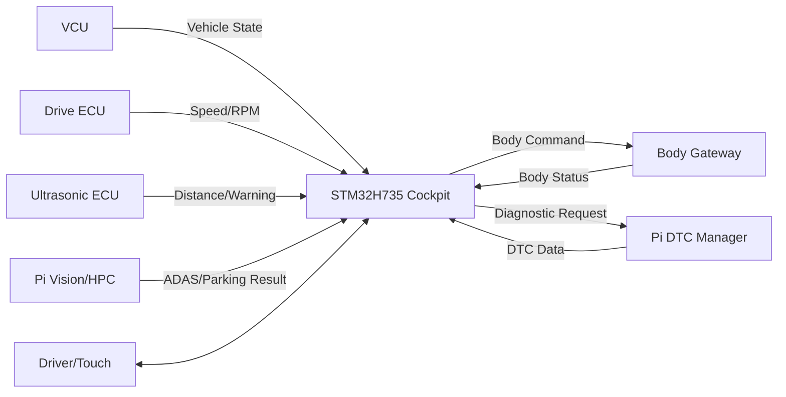
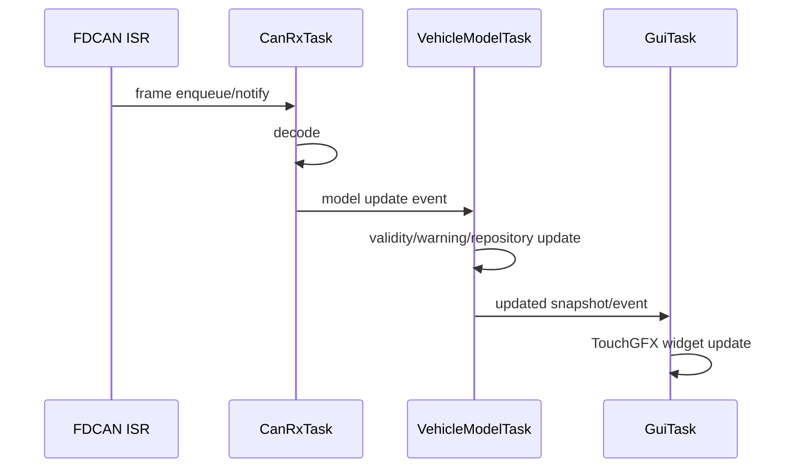
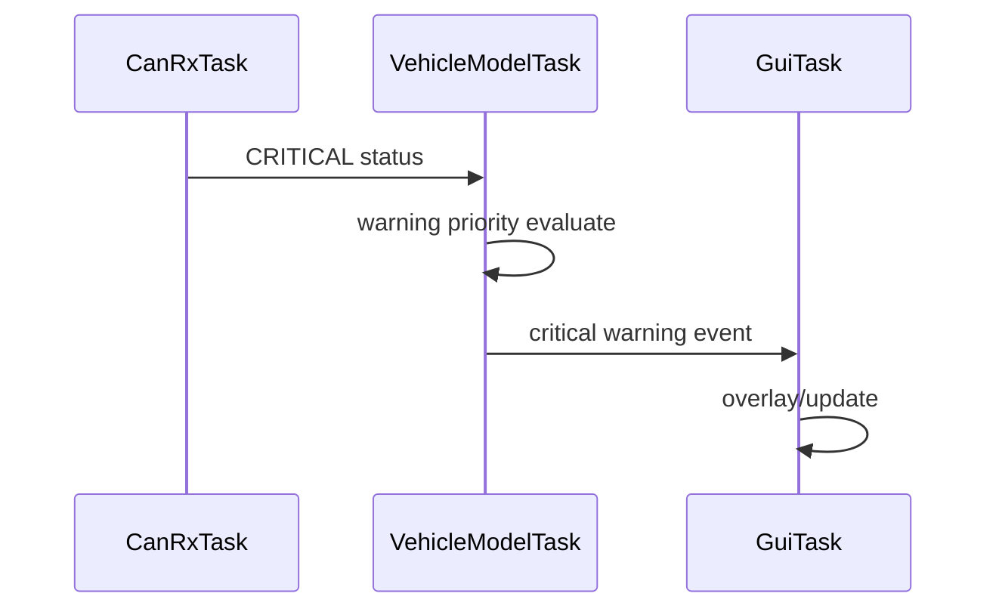
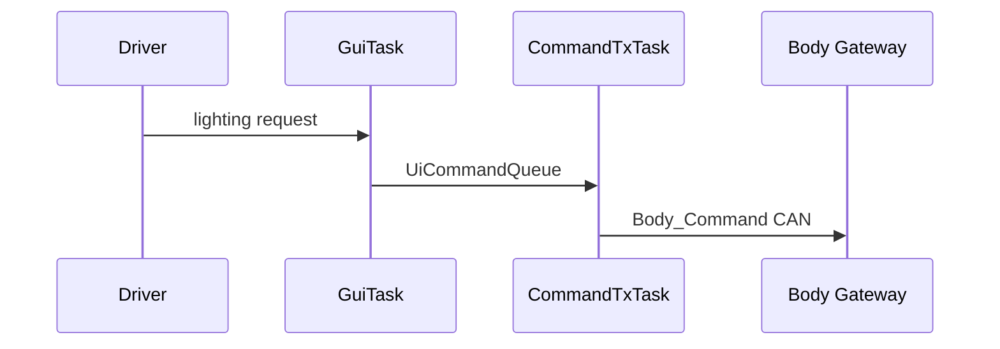
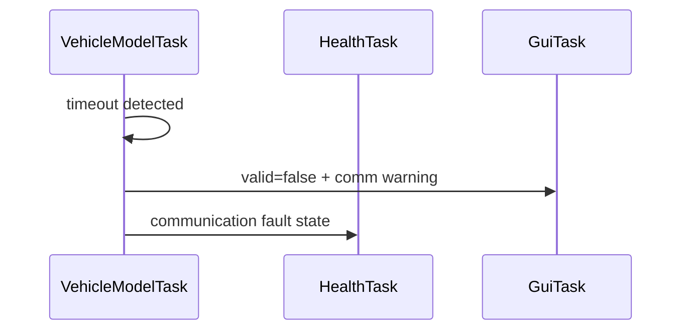
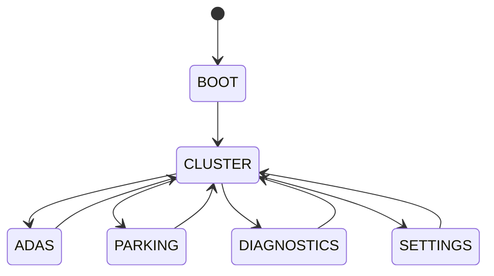

# Cluster + IVI Cockpit Software Architecture

> 문서 목적: STM32H735 Cockpit을 **어떤 구조로 구현하는지**, TouchGFX와 FreeRTOS Task가 어떻게 협력하는지 설명한다.  
> 기능 요구사항은 `SPECIFICATION.md`, 검증 결과는 `TEST_REPORT.md`를 기준으로 한다.

## Document Information

| Item | Value |
|---|---|
| Node / System | Cluster + IVI Cockpit |
| Owner | B |
| Board / Platform | STM32H735 + TouchGFX |
| Execution Model | FreeRTOS + CMSIS-RTOS2 |
| Revision | v0.2 |
| Status | Draft |
| Related Specification | `SPECIFICATION.md` |
| Related Test | `TEST_REPORT.md` |

### Revision History

| Revision | Date | Author | Change |
|---|---|---|---|
| v0.1 | 2026-09-09 | Team | Initial filled example |
| v0.2 | 2026-09-09 | Team | FreeRTOS task/ISR/queue/watchdog architecture added |

---

# 1. Introduction & Goals

## 1.1 Purpose

> H735 Cockpit은 CAN FD 차량 데이터를 Vehicle Data Model로 관리하고 TouchGFX를 통해 Cluster/IVI 화면에 표시하며, UI/CAN/진단 기능을 FreeRTOS Task로 분리해 서로 block되지 않게 실행한다.

## 1.2 Scope

포함:
- FDCAN RX/TX
- CAN signal decode
- Vehicle Data Repository
- Validity / timeout
- Warning Manager
- DTC Model
- TouchGFX Model/Presenter/View
- User Command Publisher
- FreeRTOS Task/Queue/Event 구조
- Health / Stack / Queue monitoring

제외:
- Camera image processing
- Raw camera streaming over CAN
- Motor/Servo control
- VCU arbitration
- LIN direct communication
- sensor raw measurement

## 1.3 Stakeholders

| Stakeholder | 관심사 |
|---|---|
| B HMI | TouchGFX, Task 구조, Data Model, 화면 상태 |
| F VCU/CAN | RX/TX contract, timeout, diagnostic request |
| A Ultrasonic | Parking data display |
| C Drive | speed/rpm/status contract |
| D Body | body status/request |
| E Vision | ADAS/Parking semantic result |
| Test | timing, queue, stack, warning, timeout |

---

# 2. Quality Goals

| Priority | Quality Goal | Concrete Scenario / Measure |
|---:|---|---|
| 1 | Reliability | CAN timeout/invalid input이 있어도 GUI와 scheduler가 멈추지 않는다. |
| 2 | Responsiveness | 주요 CAN 데이터가 목표 100 ms 이내 UI Model에 반영된다. |
| 3 | Concurrency Safety | GUI rendering과 CAN RX가 서로 blocking하지 않는다. |
| 4 | Maintainability | CAN decode, repository, warning, TouchGFX를 분리한다. |
| 5 | Testability | CAN 없이 Dummy Provider로 UI/RTOS 흐름을 시험할 수 있다. |

---

# 3. Constraints

| Constraint | Reason / Impact |
|---|---|
| STM32H735 + TouchGFX | Cockpit HW |
| FreeRTOS + CMSIS-RTOS2 | STM32 RTOS 공통 정책 |
| CAN FD Backbone | 차량 통신 |
| Raw Camera Frame 미수신 | bandwidth/역할 분리 |
| H735는 최종 안전 제어 권한 없음 | VCU가 final arbitration |
| LIN direct 없음 | Body Gateway가 담당 |
| CAN ID/Pin 일부 TBD | 통합 후 확정 |

TouchGFX/CubeMX가 생성하는 RTOS 설정과 BSP 구조를 우선 존중하고, 수동 수정은 생성 코드와 충돌하지 않게 분리한다.

---

# 4. Context & Scope View



---

# 5. Solution Strategy & Rationale

| Decision | Why | Quality |
|---|---|---|
| CAN decode와 GUI 사이 Repository 사용 | View가 CAN layout에 직접 의존하지 않음 | Maintainability |
| `CanRxTask`와 `GuiTask` 분리 | CAN burst와 rendering 상호 방해 감소 | Reliability |
| `VehicleModelTask`를 single writer로 사용 | shared state race 감소 | Concurrency Safety |
| UI command는 Queue로 `CommandTxTask`에 전달 | GUI에서 CAN TX blocking 제거 | Responsiveness |
| FDCAN ISR은 notify/enqueue만 수행 | ISR latency 최소화 | Timing |
| HealthTask로 task/queue/stack 감시 | hang/overflow 가시화 | Reliability |
| Stage 1 DummyDataProvider 사용 | CAN 완성 전 병렬 개발 | Testability |

---

# 6. Building Block / Component View

```text
                 FDCAN
                   ↓
              CanRxAdapter
                   ↓
               CanRxTask
                   ↓ Queue
            SignalDecoder
                   ↓
          VehicleModelTask
      ┌────────────┼────────────┐
      ↓            ↓            ↓
 Validity      Warning        DTC Model
 Manager       Manager
      └────────────┼────────────┘
                   ↓
          VehicleDataRepository
                   ↓ snapshot/event
                GuiTask
                   ↓
          TouchGFX MVP Screens
     Cluster / ADAS / Parking / DTC / Settings
                   │
             UI Command Event
                   ↓
             UiCommandQueue
                   ↓
             CommandTxTask
                   ↓
                 FDCAN TX

HealthTask
→ task/queue/stack/watchdog health
```

## Component Responsibility

| Component | Responsibility |
|---|---|
| `CanRxAdapter` | HAL/FDCAN과 RTOS boundary |
| `SignalDecoder` | raw payload → logical signal |
| `VehicleDataRepository` | typed vehicle state 저장 |
| `ValidityManager` | timestamp/timeout/valid state |
| `WarningManager` | warning priority/overlay 판단 |
| `DtcModel` | DTC list/detail |
| `GuiTask` | TouchGFX rendering/input |
| `CommandPublisher` | UI command validation |
| `CommandTxTask` | CAN TX |
| `HealthTask` | task/queue/stack/watchdog health |
| `DummyDataProvider` | Stage 1 mock vehicle data |

## Module Mapping 후보

```text
ivi/
├ app/
│  ├ vehicle_data/
│  ├ validity/
│  ├ warning/
│  └ diagnostics/
├ communication/
│  ├ can_rx/
│  ├ can_tx/
│  └ signal_codec/
├ rtos/
│  ├ task_health/
│  └ ipc/
├ platform/
│  └ dummy_data/
└ touchgfx/
   ├ model/
   ├ cluster/
   ├ adas/
   ├ parking/
   ├ diagnostics/
   └ settings/
```

---

# 7. Concurrency / RTOS View

## 7.1 Task Model

| Task | Responsibility | Trigger / Period | Relative Priority | Deadline/Target | Blocking Policy |
|---|---|---|---|---|---|
| `CanRxTask` | queued CAN frame decode | event | High | queue backlog 최소 | GUI 기다리지 않음 |
| `VehicleModelTask` | repository/validity/warning | event or 10~20 ms 후보 | Normal~High | UI model ≤100 ms | long I/O 금지 |
| `GuiTask` | TouchGFX update/render/touch | framework tick | Normal | touch ≤150 ms 목표 | CAN driver direct access 금지 |
| `CommandTxTask` | user request CAN TX | event | Normal | event response TBD | Queue 기반 |
| `HealthTask` | task/queue/stack health | 100 ms 후보 | Low | health deadline TBD | debug log 제한 |

정확한 priority number와 stack size는 runtime profiling 후 확정한다.

## 7.2 ISR Map

| Interrupt | ISR Responsibility | Wake-up Target | Mechanism |
|---|---|---|---|
| FDCAN RX | frame metadata/copy 최소 처리 | `CanRxTask` | Queue/Notification |
| Touch IRQ, BSP 구조 해당 시 | event flag 최소 처리 | `GuiTask`/TouchGFX mechanism | generated BSP mechanism |
| Display/DMA interrupt | BSP/TouchGFX 요구 최소 처리 | `GuiTask` | generated semaphore/event |
| SysTick/RTOS tick | scheduler tick | kernel | FreeRTOS |

ISR에서 CAN decode, DTC lookup, rendering, printf를 수행하지 않는다.

## 7.3 RTOS Objects

| Object | Type | Producer | Consumer | Purpose | Overflow/Timeout |
|---|---|---|---|---|---|
| `CanRxQueue` | Queue | FDCAN ISR/adapter | CanRxTask | raw frame 전달 | overflow counter + policy |
| `ModelUpdateQueue` | Queue/Event | CanRxTask | VehicleModelTask | decoded update 전달 | latest-value 정책 검토 |
| `UiCommandQueue` | Queue | GuiTask | CommandTxTask | user request | command drop 금지 후보 |
| `SystemEvents` | Event Flags | CAN/Model/Health | 여러 Task | CAN_READY/FAULT/CRITICAL | state based |

## 7.4 Shared Resource Ownership

| Resource | Owner | Policy |
|---|---|---|
| FDCAN TX | `CommandTxTask` 중심 | 다른 Task는 queue request |
| VehicleDataRepository write | `VehicleModelTask` | single writer |
| TouchGFX widgets | `GuiTask` | 다른 Task direct UI call 금지 |
| DTC model update | `VehicleModelTask`/Dtc submodule | GuiTask는 snapshot read |

이 구조로 mutex 사용을 줄인다.

## 7.5 Scheduling Policy

- periodic task는 `osDelayUntil()` 계열 검토
- event task는 queue/notification으로 block
- 일반 Task에서 `HAL_Delay()` 사용 최소화
- debug `printf`는 critical task에서 금지
- task overrun 측정 counter 추가 후보

---

# 8. Runtime View

## 8.1 CAN → UI



## 8.2 Critical Warning



## 8.3 User Command



## 8.4 CAN Timeout



---

# 9. Deployment / Hardware View

```text
CAN FD Backbone
      ↓
CAN FD Transceiver
      ↓
STM32H735
├ FreeRTOS Kernel
├ CanRxTask
├ VehicleModelTask
├ GuiTask / TouchGFX
├ CommandTxTask
└ HealthTask
      ↓
LCD + Touch
```

| HW | Software | Interface | Note |
|---|---|---|---|
| STM32H735 | FreeRTOS + Cockpit SW | FDCAN/LTDC/Touch | board config |
| CAN FD Transceiver | physical layer | FDCAN ↔ CANH/L | model TBD |
| LCD/Touch | TouchGFX | board integrated | generated BSP |

Pin map은 CubeMX/board schematic 확인 후 작성한다.

---

# 10. Interfaces & Contracts

## CAN RX

| Message | Meaning | Sender | Timeout Action |
|---|---|---|---|
| `Vehicle_State` | gear/mode/safety | VCU | state invalid/warning |
| `Drive_Status` | speed/rpm | Drive | widgets invalid |
| `Ultrasonic_Status` | distance/warning | Ultrasonic | sensor invalid |
| Vision status | ADAS/Parking result | HPC | vision unavailable |
| `Body_Status` | ambient/lamp/LIN | Gateway | body warning |
| `DTC_Event` | fault code/status | All/Pi | raw code라도 표시 |
| `ECU_Heartbeat` | alive | all | offline warning |

## CAN TX

| Message | Meaning | Trigger | Receiver |
|---|---|---|---|
| `Body_Command` | lighting/body request | UI event | Gateway |
| Diagnostic Clear Request | DTC clear 후보 | user event | Diagnostics target |

H735는 LIN 직접 사용 없음.

---

# 11. Data & State Model

| Data | Owner | Meaning | Invalid Condition |
|---|---|---|---|
| `vehicle_speed` | Drive | speed | Drive timeout |
| `motor_rpm` | Drive | rpm | Drive timeout |
| `gear` | VCU | P/R/N/D | VCU timeout |
| `parking_distance[]` | Ultrasonic | mm | valid=false |
| `adas_status` | HPC | semantic result | HPC timeout |
| `lamp_status` | Gateway | body state | Body timeout |
| `dtc_list` | Diagnostics | DTC entries | malformed/unknown handled |

UI state:



Warning overlay는 screen state와 독립된 공통 계층이다.

---

# 12. Cross-cutting Concepts

## Error Handling
- invalid data는 정상값처럼 표시하지 않음
- timeout은 repository valid state에 반영
- source recovery frame 수신 시 valid 복구

## Diagnostics
- local candidate: CAN/Touch/GUI task/queue fault
- unknown external DTC도 raw code 표시
- DTC clear는 request만 전송

## Timing

| Function | Target |
|---|---|
| CAN RX → model | ≤100 ms 목표 |
| Touch response | ≤150 ms 목표 |
| Critical warning | ≤200 ms 목표 |
| CanRxTask queue overflow | expected load에서 0 |

## Memory / Stack / Heap
- task stack: 측정 후 확정
- stack overflow hook 사용 후보
- runtime stack high-water 기록
- startup 이후 uncontrolled dynamic allocation 피함
- queue depth는 CAN burst/load test로 조정

## Watchdog / Health

```text
CanRxTask heartbeat ─┐
ModelTask heartbeat ─┼→ HealthTask
GuiTask heartbeat ───┘
                     ↓
                all healthy?
                ├ Yes → IWDG refresh 후보
                └ No  → fault / no refresh
```

TouchGFX GUI 자체 hang을 감지할 수 있는 heartbeat 지점을 실제 구현에서 정한다.

## Priority Inversion / Starvation
- Vehicle repository single writer로 mutex 최소화
- FDCAN TX single owner task 권장
- GUI와 CAN task 간 직접 mutex 의존 최소화
- load test에서 CanRxTask starvation과 GuiTask starvation 둘 다 확인

---

# 13. Architecture Decisions

| ADR ID | Decision | Alternative | Reason | Consequence |
|---|---|---|---|---|
| ADR-HMI-001 | Cluster+IVI를 H735 하나로 통합 | separate cluster | model 통합 | H735 책임 증가 |
| ADR-HMI-002 | Vehicle Data Repository 사용 | View 직접 CAN decode | maintainability | middle layer 필요 |
| ADR-HMI-003 | Raw camera 미수신 | CAN image | bandwidth | semantic result only |
| ADR-HMI-004 | Lighting은 Request만 TX | GPIO direct | Body architecture 유지 | feedback 필요 |
| ADR-HMI-005 | Dummy provider로 Stage 1 | CAN 완성 대기 | 병렬 개발 | schema sync 필요 |
| ADR-HMI-006 | FreeRTOS task로 CAN/Model/GUI 분리 | single loop | responsiveness/reliability | task/queue/stack 관리 필요 |
| ADR-HMI-007 | VehicleModelTask single writer | shared writable model | race/mutex 감소 | update path 중앙화 |

---

# 14. Quality Scenarios & Verification

| Quality | Scenario | Target | Verification |
|---|---|---|---|
| Reliability | Drive timeout | GUI hang 없이 invalid | fault injection |
| Timing | CAN status RX | model ≤100 ms | timestamp |
| Concurrency | CAN burst + GUI render | queue overflow 0, UI freeze 0 | load test |
| RTOS health | soak | stack overflow/deadlock 0 | runtime stats |
| Usability | critical parking | ≤200 ms 목표 | injection |

---

# 15. Risks & Technical Debt

| ID | Risk | Mitigation |
|---|---|---|
| RISK-HMI-001 | FDCAN transceiver/pin TBD | early CubeMX/schematic check |
| RISK-HMI-002 | CAN matrix TBD | signal name/unit first freeze |
| RISK-HMI-003 | task priority/stack TBD | profiling + high-water measurement |
| RISK-HMI-004 | queue depth too small | CAN burst test |
| RISK-HMI-005 | TouchGFX load starves communication | RTOS load test / priority tuning |
| RISK-HMI-006 | HealthTask blindly feeds watchdog | per-task heartbeat gating |

---

# 16. Requirement Traceability

| Requirement | Component | Task/Runtime | Test |
|---|---|---|---|
| REQ-HMI-001 | Repository + Cluster View | ModelTask + GuiTask | T-HMI-001 |
| REQ-HMI-004 | Parking Model/View | ModelTask + GuiTask | T-HMI-004 |
| REQ-HMI-007 | ValidityManager | ModelTask | T-HMI-007 |
| REQ-HMI-008 | CommandPublisher | GuiTask → CommandTxTask | T-HMI-008 |
| REQ-HMI-013 | RTOS separation | CanRx/Model/Gui tasks | T-HMI-013 |
| REQ-HMI-014 | ISR policy | FDCAN ISR → CanRxTask | T-HMI-014 |
| REQ-HMI-015 | IPC policy | queues/events | T-HMI-015 |
| REQ-HMI-016 | critical path | ModelTask → GuiTask | T-HMI-016 |
| REQ-HMI-017 | stack/queue health | HealthTask | T-HMI-017 |
| REQ-HMI-018 | watchdog-ready health | HealthTask | T-HMI-018 |

---

# 17. Glossary

| Term | Meaning |
|---|---|
| RTOS | Real-Time Operating System |
| FreeRTOS | H735 기본 RTOS |
| CMSIS-RTOS2 | RTOS abstraction API |
| ISR | Interrupt Service Routine |
| HMI | Human Machine Interface |
| IVI | In-Vehicle Infotainment |
| MVP | TouchGFX Model-View-Presenter |
| DTC | Diagnostic Trouble Code |

---

# 18. Architecture Review Checklist

- [ ] CAN/GUI/Model Task 책임이 분리되어 있다.
- [ ] Task Trigger/Period/Priority 방향이 있다.
- [ ] FDCAN ISR이 최소 처리만 한다.
- [ ] Queue/Event object owner와 overflow 정책이 있다.
- [ ] GuiTask가 CAN driver를 직접 호출하지 않는다.
- [ ] VehicleDataRepository writer가 명확하다.
- [ ] Critical warning path가 일반 logging/DTC list에 block되지 않는다.
- [ ] stack/queue 측정 계획이 있다.
- [ ] Watchdog refresh 조건이 task health와 연결된다.
- [ ] Requirement → Component/Task → Test traceability가 있다.
