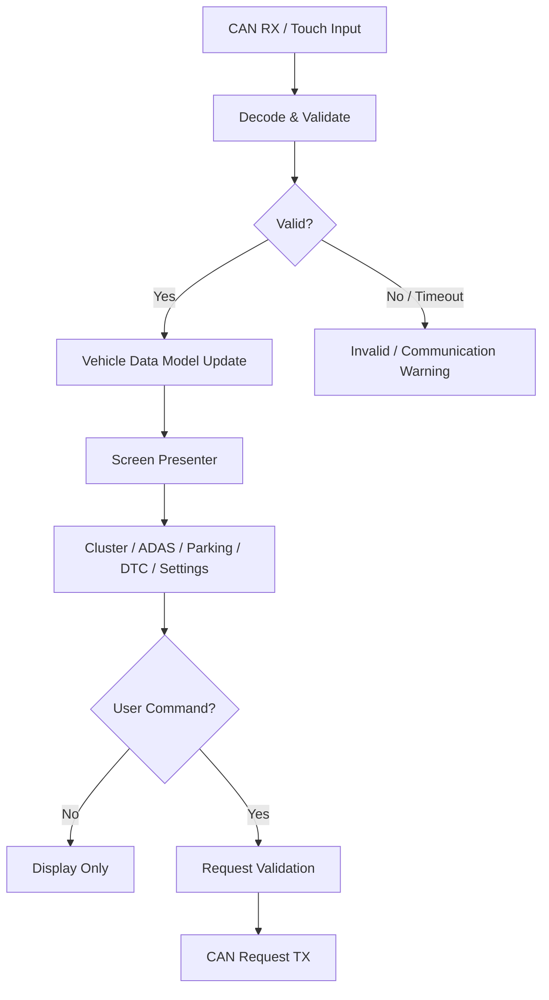

# Cluster + IVI Cockpit Functional Specification

> 문서 목적: STM32H735 + TouchGFX Cockpit 기능이 **무엇을 해야 하는지** 정의한다.  
> 구현 구조는 `ARCHITECTURE.md`, 검증 결과는 `TEST_REPORT.md`에서 관리한다.

## Document Information

| Item | Value |
|---|---|
| Feature ID | `FEAT-HMI-001` |
| Feature / Node Name | Cluster + IVI Cockpit |
| Owner | B |
| Role | UI / 차량 상태 표시 / 사용자 입력 |
| Status | Draft |
| Priority | MUST |
| Board / Platform | STM32H735 + TouchGFX |
| Related Architecture | `ARCHITECTURE.md` |
| Related Test | `TEST_REPORT.md` |

### Revision History

| Revision | Date | Author | Change |
|---|---|---|---|
| v0.1 | 2026-09-09 | Team | Initial filled example |

---

# 1. Purpose and Scope

## 1.1 한 문장 설명

> H735 Cockpit은 CAN FD로 전달되는 차량 상태, ADAS, Parking, Body, DTC 정보를 운전자에게 보여주고, 일부 사용자 요청을 CAN으로 전달한다.

## 1.2 포함 범위

- Digital Cluster 기본 화면
- Speed / RPM / Gear / Battery / Temperature 표시
- ADAS 상태 및 Warning 표시
- Ultrasonic / Rear Parking 상태 표시
- DTC 목록 및 상세 정보 표시
- Lighting / Vehicle Setting 요청 UI
- Touch 기반 화면 전환
- CAN 데이터 수신, 유효성/Timeout 상태 표시
- General Warning 표시

## 1.3 제외 범위

- Motor PWM 또는 Steering PWM 직접 생성
- ADAS 최종 제어 판단
- Camera 영상처리
- Raw Camera Frame 수신/표시
- Ultrasonic 거리 계산
- DTC 원인 자체 진단
- Lighting GPIO 직접 구동

H735는 **데이터를 만들어내는 센서 ECU가 아니라 다른 Node의 상태를 받아 보여주는 Cockpit Node**를 중심으로 한다.

---

# 2. Usage / System Scenario

## 2.1 정상 주행 화면

| Item | Description |
|---|---|
| Actor / Trigger | VCU / Drive ECU의 CAN Status |
| Preconditions | H735 부팅 완료, TouchGFX 실행, CAN 수신 가능 |
| Trigger | `Vehicle_State`, `Drive_Status` 수신 |
| Normal Flow | CAN RX → Decode → Data Model Update → Cluster Widget Update |
| Postconditions | Speed, RPM, Gear, READY, Warning 정보가 최신 상태로 표시됨 |

## 2.2 Parking Warning

| Item | Description |
|---|---|
| Actor / Trigger | Ultrasonic ECU / HPC Rear Vision |
| Preconditions | Gear R 또는 Parking 화면 활성 |
| Trigger | `Ultrasonic_Status` 또는 Parking Vision 결과 수신 |
| Normal Flow | 거리/Warning 수신 → Parking Model 갱신 → 영역별 Warning 표시 |
| Postconditions | 운전자가 Rear/Left/Right 위험 상태를 확인 가능 |

## 2.3 DTC 확인

| Item | Description |
|---|---|
| Actor / Trigger | 사용자 Touch / `DTC_Event` |
| Preconditions | Cockpit READY |
| Trigger | Diagnostics 메뉴 진입 또는 새 DTC 수신 |
| Normal Flow | DTC Model 갱신 → 목록 표시 → 항목 선택 → 상세 표시 |
| Postconditions | Active/History 상태 및 설명을 확인 가능 |

---

# 3. Functional Flow

---

# 4. Inputs

| Input ID | Input | Source | Interface | Unit / Range | Valid Condition | Update / Trigger |
|---|---|---|---|---|---|---|
| IN-HMI-001 | `Vehicle_State` | VCU | CAN FD | Gear/Mode/Safety | Valid CAN payload | Periodic |
| IN-HMI-002 | `Drive_Status` | Drive ECU | CAN FD | rpm, speed, steering status | Valid flag / timeout 정상 | Periodic |
| IN-HMI-003 | `Ultrasonic_Status` | Ultrasonic ECU | CAN FD | mm / warning enum | sensor valid | Periodic |
| IN-HMI-004 | `Vision_Request` / Vision Status | Raspberry Pi HPC | CAN FD | ADAS/Parking semantic result | valid result | Periodic/Event |
| IN-HMI-005 | `Body_Status` | Body Gateway | CAN FD | ambient/lamp/LIN health | valid payload | Periodic |
| IN-HMI-006 | `DTC_Event` | 각 Node / Pi Manager | CAN FD | code/status/severity | valid DTC format | Event |
| IN-HMI-007 | `ECU_Heartbeat` | 각 Node | CAN FD | alive/status | timeout 미발생 | Periodic |
| IN-HMI-008 | Touch Event | Driver | Touch Controller | x/y/action | valid touch region | Event |

---

# 5. Outputs

| Output ID | Output | Destination | Interface | Unit / Range | Update / Event | Valid Condition |
|---|---|---|---|---|---|---|
| OUT-HMI-001 | Cluster Screen | Driver | LCD/TouchGFX | visual | Frame update | model valid |
| OUT-HMI-002 | ADAS/Parking Warning | Driver | LCD/TouchGFX | visual enum | Event/Periodic | source valid |
| OUT-HMI-003 | DTC Detail | Driver | LCD/TouchGFX | text/status | Event | DTC valid |
| OUT-HMI-004 | `Body_Command` | Body Gateway | CAN FD | lighting request | User event | request valid |
| OUT-HMI-005 | Diagnostic Clear Request 후보 | Diagnostics target | CAN FD | TBD | User event | 권한/상태 조건 만족 |

`OUT-HMI-005`의 실제 Message 이름, CAN ID와 처리 정책은 DTC/CAN 통합 단계에서 확정한다.

---

# 6. Functional Requirements

| Requirement ID | Requirement | Priority | Verification | Related Test |
|---|---|---|---|---|
| REQ-HMI-001 | Cockpit은 Speed, RPM, Gear를 Cluster 기본 화면에 표시해야 한다. | MUST | Test | T-HMI-001 |
| REQ-HMI-002 | Cockpit은 READY 및 General Warning 상태를 표시해야 한다. | MUST | Test | T-HMI-002 |
| REQ-HMI-003 | Cockpit은 ADAS 상태와 Warning 정보를 표시해야 한다. | MUST | Test | T-HMI-003 |
| REQ-HMI-004 | Cockpit은 Ultrasonic 거리/Warning 정보를 Parking 화면에 표시해야 한다. | MUST | Test | T-HMI-004 |
| REQ-HMI-005 | Cockpit은 DTC 목록과 선택된 DTC의 상세 상태를 표시해야 한다. | MUST | Test | T-HMI-005 |
| REQ-HMI-006 | Cockpit은 Touch 입력으로 Cluster/ADAS/Parking/Diagnostics/Settings 화면을 전환해야 한다. | MUST | Test | T-HMI-006 |
| REQ-HMI-007 | Cockpit은 유효하지 않거나 Timeout된 차량 데이터를 정상값처럼 표시하지 않아야 한다. | MUST | Fault Test | T-HMI-007 |
| REQ-HMI-008 | Cockpit은 Lighting 설정을 직접 GPIO로 출력하지 않고 CAN Request로 전송해야 한다. | MUST | Inspect/Test | T-HMI-008 |
| REQ-HMI-009 | Cockpit은 Raw Camera Frame을 CAN FD로 수신하도록 설계하지 않아야 한다. | MUST | Inspect | T-HMI-009 |
| REQ-HMI-010 | Cockpit은 새 Critical Warning이 발생하면 현재 화면과 무관하게 운전자에게 Warning을 제공해야 한다. | SHOULD | Test | T-HMI-010 |
| REQ-HMI-011 | 주요 차량 상태는 유효한 CAN 데이터 수신 후 목표 100 ms 이내에 화면 모델에 반영해야 한다. | SHOULD | Measure | T-HMI-011 |
| REQ-HMI-012 | 정상 Touch 입력은 목표 150 ms 이내에 화면 전환 또는 사용자 피드백이 나타나야 한다. | SHOULD | Measure | T-HMI-012 |

시간값은 프로젝트 목표값이며 실제 H735/TouchGFX 측정 후 조정한다.

---

# 7. Rules / Conditions

| Rule ID | Condition / Rule | Result |
|---|---|---|
| RULE-HMI-001 | Power ON 후 기본 화면 | Cluster Main 표시 |
| RULE-HMI-002 | Gear R | Parking 정보 접근성을 높이고 Parking Warning 표시 |
| RULE-HMI-003 | Critical Warning 발생 | 현재 메뉴보다 Warning 표시 우선 |
| RULE-HMI-004 | CAN Signal timeout | 마지막 값을 정상 최신값처럼 유지하지 않고 Invalid/통신경고 처리 |
| RULE-HMI-005 | Lighting Setting 변경 | Local GPIO가 아니라 `Body_Command` Request 송신 |
| RULE-HMI-006 | DTC Clear 요청 | 실제 Clear 권한/조건을 통합 규격에 따라 검증 후 Request 송신 |

---

# 8. Exceptions / Edge Cases

| Case ID | Exception / Edge Case | Detection | Expected Behavior | Recovery |
|---|---|---|---|---|
| EDGE-HMI-001 | `Drive_Status` timeout | last_rx timeout | Speed/RPM invalid 표시, Comm Warning | 정상 frame 재수신 |
| EDGE-HMI-002 | DTC code unknown | DTC lookup miss | Unknown DTC + raw code 표시 | DB/lookup 갱신 |
| EDGE-HMI-003 | Touch 연타 / 잘못된 영역 | UI event validation | 무효 입력 무시, UI hang 금지 | 자동 |
| EDGE-HMI-004 | CAN bus unavailable | CAN error state | Communication Fault 표시, 제어값 생성 금지 | CAN recovery 후 갱신 |
| EDGE-HMI-005 | Parking sensor invalid | `valid=false` | 실제 거리 대신 Sensor Invalid 표시 | sensor recovery |
| EDGE-HMI-006 | Vision unavailable | vision status timeout/fault | ADAS/Parking Vision unavailable 표시 | HPC service recovery |

---

# 9. UI / UX Reference

| Item | Description |
|---|---|
| Cluster Main | Speed 중심, RPM/Gear/READY/Warning/Lamp 상태 |
| ADAS Screen | ADAS active, lane/object/warning semantic data |
| Parking Screen | Ultrasonic 거리/Warning + Rear Vision semantic status |
| Diagnostics | Active/History DTC list, code, source ECU, severity/status |
| Settings | Lighting/Vehicle setting Request UI |
| Screen Flow | `Cluster Main ↔ ADAS / Parking / Diagnostics / Settings` |

Raw Rear Camera 영상 자체를 CAN FD로 받아 H735에 표시하는 것은 현재 범위가 아니다.

---

# 10. Interface Requirements

## 10.1 Hardware

| Device | Interface | Electrical / Voltage | Requirement / Note |
|---|---|---|---|
| STM32H735 Display | Board integrated | Board spec | TouchGFX UI |
| Touch Controller | Board integrated | Board spec | Touch event |
| CAN FD Transceiver | FDCAN ↔ CANH/L | 사용 부품 기준 | 실제 Transceiver 필요 |

실제 Pin/Transceiver 모델은 보드 선정 및 CubeMX 설정 후 기록한다.

## 10.2 CAN / CAN FD

| Message / Signal | TX/RX | Owner / Peer | Unit | Cycle/Event | Timeout | Timeout Action |
|---|---|---|---|---|---|---|
| `Vehicle_State` | RX | VCU | enum/flags | Periodic | TBD | Vehicle state invalid |
| `Drive_Status` | RX | Drive ECU | rpm/speed | Periodic | TBD | Speed/RPM invalid |
| `Ultrasonic_Status` | RX | Ultrasonic ECU | mm/enum | Periodic | TBD | Sensor invalid 표시 |
| `Vision_Request` | RX | HPC | semantic data | Periodic/Event | TBD | Vision unavailable |
| `Body_Status` | RX | Body Gateway | status | Periodic | TBD | Body comm warning |
| `DTC_Event` | RX | All/Pi | code/status | Event | N/A/Event | Event 저장/표시 |
| `ECU_Heartbeat` | RX | All | alive | Periodic | TBD | ECU warning |
| `Body_Command` | TX | Body Gateway | request | Event | N/A | 송신 결과/log 기록 |

## 10.3 LIN

N/A. H735는 LIN에 직접 연결하지 않는다. Body Gateway를 통해 CAN FD로 통신한다.

## 10.4 API / IPC / File

N/A for Stage 1. 향후 DTC description table을 code-generated/static table/file로 관리할 경우 별도 정의한다.

---

# 11. Timing / Performance Requirements

| Requirement | Target | Verification |
|---|---|---|
| 주요 차량 데이터 → UI model update | ≤ 100 ms 목표 | Timestamp / log |
| Touch → UI response | ≤ 150 ms 목표 | Event timestamp |
| Critical warning indication | ≤ 200 ms 목표 | Fault injection + timestamp |
| GUI freeze | 정상 시나리오에서 발생하지 않아야 함 | 반복 시험 |

---

# 12. Safety / Fail-safe / DTC

| Fault | Detection | Safe / Local Action | DTC Candidate | Recovery |
|---|---|---|---|---|
| CAN communication lost | CAN error / timeout | Invalid/Comm warning 표시 | `HMI_COMM_xxx` 후보 | CAN 복구 후 상태 재수신 |
| Touch controller fault | init/event failure | Display-only degraded mode | `HMI_TOUCH_xxx` 후보 | 재초기화/재부팅 |
| Display update fault | render/watchdog 이상 | UI fault 기록 | `HMI_DISPLAY_xxx` 후보 | 재초기화/재부팅 |
| Unknown DTC code | lookup miss | Raw code라도 표시 | 별도 DTC 불필요 | table update |

Cockpit은 안전 제어의 최종 권한을 갖지 않으므로 통신 이상 시 Motor/Steering을 직접 제어하지 않는다. 해당 안전동작은 VCU가 담당한다.

---

# 13. Acceptance Criteria

- [ ] H735 부팅 후 Cluster Main이 표시된다.
- [ ] Dummy Data로 Speed/RPM/Gear/Warning 값 변경을 확인한다.
- [ ] Touch로 5개 주요 화면을 전환한다.
- [ ] Dummy ADAS/Parking/DTC 데이터가 각 화면에 표시된다.
- [ ] Invalid/Timeout 상태가 정상 데이터와 구분된다.
- [ ] Lighting 설정이 Local GPIO가 아닌 CAN Request 구조로 연결된다.
- [ ] 실제 CAN 통합 후 주요 RX 메시지가 Data Model에 반영된다.
- [ ] 주요 Requirement가 `TEST_REPORT.md`의 Test ID와 연결된다.

---

# 14. Open Issues / TBD

| ID | Item | Owner | Target Date / Condition |
|---|---|---|---|
| TBD-HMI-001 | 실제 CAN ID / DLC / Signal layout | F + B | CAN Matrix 확정 시 |
| TBD-HMI-002 | H735 CAN FD Transceiver / 실제 pin map | B | Hardware 확정 시 |
| TBD-HMI-003 | Battery SOC의 실제 owner / 계산 방식 | F + Team | Sensor/VCU 설계 확정 시 |
| TBD-HMI-004 | DTC Clear Request 형식과 권한 조건 | F + B | Diagnostic protocol 확정 시 |
| TBD-HMI-005 | 실제 TouchGFX frame/update 성능 목표 재조정 | B | Stage 1 측정 후 |
