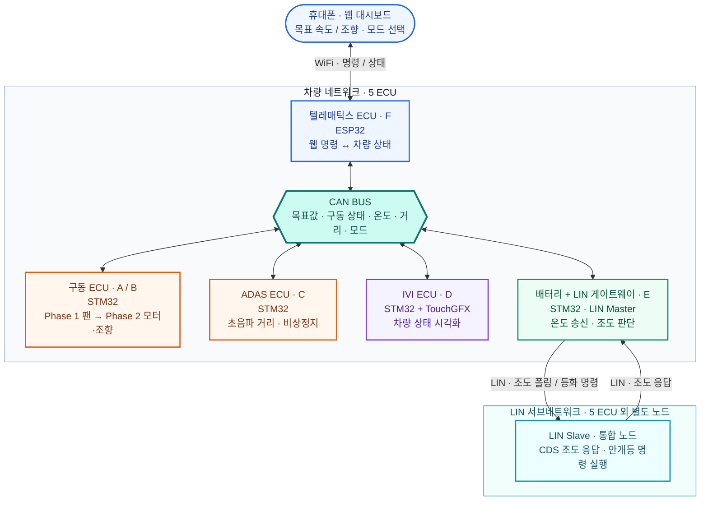

# SDV MCU Project

**5 ECU로 구현하는 모빌리티 SDV 시스템**

CAN·LIN·RTOS 기반 벤치 검증부터 RC카 통합까지

[기술 스택](#tech-stack) · [시스템 구성](#ecu-architecture) · [4주 로드맵](#roadmap) · [상세 개발 계획](legacy_v1.2_before_full_sync_2026-09-09/WEEKLY_PLAN.md)

---

> **상태:** 초기 계획 / 구현·시험 완료 전  
> **작성 기준:** 제공 명세 `mobility_project_spec_v0.9.md` (본문 제목은 v0.8), 2026-09-08  
> 아래 내용은 해당 명세를 정리한 개발 계획입니다. 상세 보드 모델, 프로토콜 수치, 부품 적합성 및 시험 기준은 착수 시 확정합니다.

## 기술 스택

> 제공 명세에 따른 **사용 예정 스택**입니다. 세부 모델·버전과 실제 구현 여부는 개발 진행에 맞춰 갱신합니다.

### Embedded & RTOS

| 스택 | 적용 위치 | 역할 |
|---|---|---|
| **STM32 × 4** | 공조/모터·ADAS·IVI·배터리 게이트웨이 | 센서 수집, 제어, 상태 표시 및 ECU 간 연동 |
| **ESP32 × 1** | 텔레매틱스 | WiFi 웹 대시보드와 CAN 명령·상태 중계 |
| **RTOS** | ECU 펌웨어 | 통신·센서·제어·표시 작업의 주기와 우선순위 관리 |
| **PWM · ADC · GPIO** | 구동 및 센서 인터페이스 | 팬·모터·서보 출력, 서미스터 입력, 디지털 입출력 |

RTOS 배포판, 펌웨어 언어, IDE·SDK 및 보드 세부 모델은 아직 선정 전입니다.

### Network & Interface

| 스택 | 연결 구간 | 역할 |
|---|---|---|
| **CAN** | 5 ECU 공통 버스 | 목표 제어값·구동 상태·온도·거리·모드 전달 |
| **LIN** | 배터리 게이트웨이 ↔ CDS/안개등 노드 | 조도 폴링, 자동 안개등 명령·상태 전달 |
| **WiFi · Web Dashboard** | 휴대폰 ↔ ESP32 | 목표 속도·조향 입력, 모드 전환, 상태 확인 |
| **TouchGFX** | STM32 IVI | 팬 PWM·RPM·온도·거리·안개등·모드 시각화 |

LIN은 Phase 1부터 개발하며, 2주차 체크포인트에서 진행 상태에 따라 후순위로 전환할 수 있습니다. 웹 프레임워크와 상세 통신 규격은 미정입니다.

### Sensing & Actuation

| 구분 | 구성 | 적용 단계 |
|---|---|---|
| **거리 감지** | 초음파 센서 | Phase 1 벤치 → Phase 2 차량 전방 |
| **온도 측정** | 서미스터 + ADC | Phase 1 벤치 → Phase 2 배터리팩 |
| **자동 등화** | CDS + LIN 슬레이브 + LED | Phase 1 개발, 유지 시 Phase 2 장착 |
| **벤치 구동** | EZ 모터 R300 5V 팬 + PWM 구동 회로 | Phase 1 |
| **차량 구동·조향** | 브러시드 모터 + TB6612FNG 후보 + 서보 | Phase 2, 정격 적합성 확인 필요 |
| **주행 상태 측정** | 로터리 엔코더 또는 자석+홀센서 | Phase 2, 부품 선정 필요 |
| **전원** | USB 파워뱅크 → 배터리 + UBEC 기반 3레일 | Phase 1 → Phase 2 |

<strong>선택 확장 · Vision Stack</strong> — Phase 1/2 완료 후 검토

 

| 구성 | 역할 | 상태 |
|---|---|---|
| Raspberry Pi 4 + AI Camera(IMX500) | 정지 표지판·신호등 인식 | 명세상 보유 |
| MCP2515 SPI-CAN HAT | 비전 결과의 CAN 전달 | 추가 조달 |
| 사전학습 객체 탐지 모델 + 색상 판별 | 표지판·신호등 종류 및 적/녹 판단 | 모델·지원 클래스·판별 방식 검증 필요 |
| 독립 5V/3A 전원 | 비전 장치 전원 공급 | 구성 검증 필요 |

기본 4주 필수 범위에 포함하지 않습니다.

---

## 1. 목표와 진행 방식

- **기간 / 인원:** 4주 / 6명. 비전공자 다수이며 팀 전원이 CAN·RTOS 기초를 숙지한 조건입니다.
- **최종 플랫폼:** SCY 16101/16102/16103/16201 중 브러시드 버전 RC카, 1/16 스케일·4WD를 계획합니다.
- **핵심 기술:** CAN, LIN, RTOS, 멀티 ECU, TouchGFX IVI, ESP32 WiFi 웹 대시보드.
- **Phase 1 (1~2주차):** RC카 없이 5 ECU와 LIN 서브네트워크, CAN 통신·RTOS·핵심 제어 로직을 벤치에서 검증합니다.
- **Phase 2 (3~4주차):** 검증한 시스템을 RC카에 장착하고 구동·조향 전환과 전원 재설계를 수행합니다. 엔코더·회피 로직·표시 필드 확장도 이 단계의 구현·시험 작업에 포함합니다.
- **Phase 3 (선택):** Phase 1/2 완료 후 여유가 있을 때만 비전 인식을 추가합니다.

## 2. ECU 구성과 6인 역할 분담

A~F는 역할 식별자이며 실제 팀원 이름은 추후 연결합니다.

| 담당 | ECU / 보드 | Phase 1: 벤치 | Phase 2: RC카 |
|---|---|---|---|
| A·B (2명) | 공조 → 모터+조향 / STM32 | EZ 모터 R300 5V 팬 PWM 제어, CAN 목표값 수신, 통신 두절 시 정지, ADAS 비상정지 처리 | 브러시드 모터·서보 제어, 엔코더 RPM·odom, 회피 로직, 후방 LED 확장 |
| C (1명) | ADAS / STM32 | 초음파 거리 측정, 장애물·비상정지 프레임 송신, **CAN 규격 및 통합 리드** | 차량 전방 장착 및 거리·정지 동작 재검증 |
| D (1명) | IVI / STM32 + TouchGFX | 팬 PWM·온도·거리·안개등·자율주행 모드 표시 | RPM·속도·조향 표시 확장 |
| E (1명) | 배터리(온도)+LIN 게이트웨이 / STM32 | 서미스터 ADC·온도 CAN 송신, LIN 마스터 폴링·안개등 판단·명령, 결과 CAN 전달 | 배터리팩·등화 위치에 장착 및 재검증 |
| F (1명) | 텔레매틱스 / ESP32 + CAN | 폰 웹 대시보드, 목표 팬 속도 입력, 수동/자율 토글 | 목표 조향각 및 차량 상태 필드 확장 |

**LIN 통합 슬레이브 노드 1개(CDS+안개등)는 위 5 ECU와 별도로 구성**합니다. 슬레이브 MCU·구동 회로는 명세에 특정되지 않아 1주차에 선정합니다.

## 3. 네트워크 구조

**WiFi로 명령을 입력하고, CAN으로 5 ECU를 연결하며, LIN으로 조도·안개등을 제어합니다.**

| 연결 | 담당 범위 | 대표 데이터 흐름 |
|---|---|---|
| **WiFi · 사용자 인터페이스** | 휴대폰 ↔ ESP32 | 목표 속도·조향·모드 입력 / 차량 상태 확인 |
| **CAN · ECU 공통 네트워크** | 텔레매틱스·구동·ADAS·IVI·게이트웨이 | 제어 명령 / 비상정지 / 센서·구동 상태 |
| **LIN · 센서 및 등화** | 게이트웨이 ↔ CDS·안개등 슬레이브 | 조도 폴링·응답 / 안개등 ON·OFF 명령 |

**주요 동작 경로**

- **구동 제어:** 휴대폰 → WiFi → 텔레매틱스 → CAN → 팬/모터·조향 ECU.
- **비상정지:** 초음파 → ADAS → CAN → 팬/모터 정지, IVI 상태 표시.
- **자동 안개등:** CDS → LIN 응답 → 게이트웨이 판단 → LIN 명령 → 안개등. 게이트웨이는 결과를 CAN으로 전달해 IVI에 표시합니다.

> **단계별 적용:** Phase 1은 팬 제어, Phase 2는 모터·조향 및 차량 상태 필드를 사용합니다. LIN은 2주차 체크포인트에서 유지 여부를 결정합니다. 선택 비전 ECU는 기본 5 ECU 구성에 포함하지 않습니다.

## 4. 통신 및 제어 동작

| 메시지 계열 | 송신 | Phase 1 데이터 | Phase 2 확장 | 주요 수신 |
|---|---|---|---|---|
| 목표 제어값 | 텔레매틱스 | 목표 팬 속도값 | 목표 차량 속도·조향각 | 공조/모터, IVI |
| 구동 상태 | 공조/모터 | 현재 PWM 듀티 | RPM·속도(odom)·조향 정보 | IVI, 텔레매틱스 |
| 배터리 상태 | 배터리+LIN | 온도 | 유지 | IVI, 텔레매틱스 |
| 안개등 상태 | 배터리+LIN | ON/OFF | 유지 | IVI |
| 장애물/비상정지 | ADAS | 거리·비상정지 플래그 | 유지 | 공조/모터, IVI |
| 자율주행 모드 | 텔레매틱스 | 수동/자율 플래그 | 유지 | 공조/모터, IVI |

위 표는 메시지의 의미를 정리한 것으로 CAN ID·DLC·바이트 배치는 아직 미정입니다. **C가 1주차 초반에 공통 규격을 확정·배포**하며, Phase 2 확장 필드·단위·유효성 표현을 처음부터 합의해 호환성을 유지합니다.

- **비상정지:** 초음파 거리 임계값 미만 → ADAS 프레임 송신 → 팬 또는 구동 모터 정지. Phase 2 후방 LED 블링크는 확장 항목입니다.
- **통신 두절:** 목표 제어 프레임을 정해진 시간 동안 받지 못하면 팬/모터를 정지합니다.
- **자동 안개등:** LIN 조도 응답 → 마스터 임계값 판단 → LIN ON/OFF 명령 → 상태 CAN 전달.
- **수동/자율:** 텔레매틱스 토글로 ADAS 기반 목표 속도 오버라이드 여부를 선택합니다. 비상정지의 모드별 적용·우선순위·해제 조건은 1주차에 명확히 정의합니다.
- **RTOS:** Phase 1부터 통신·센서·제어·표시 작업을 구성하고, 4주차에 주기·우선순위·공유 데이터 처리를 안정화합니다.

## 5. 하드웨어와 전원 계획

아래는 명세의 구성안이며 부품 적합성 검증 완료를 의미하지 않습니다.

| 단계 | 전원 구성안 | 확인할 항목 |
|---|---|---|
| Phase 1 | 5V USB 파워뱅크로 보드·팬 공급, 공통 GND | 전체 및 기동 전류, 팬 구동 회로, LIN 슬레이브 포함 전원 예산, 각 트랜시버 공급전압 |
| Phase 2 모터 | 7.4V·1300mAh·10C 배터리 → TB6612FNG VM → 브러시드 모터 | 모터 기동·스톨 전류와 드라이버 정격 적합성 |
| Phase 2 서보 | UBEC 5~6V·3A급 후보 → 서보 | 실제 서보 전압·전류 요구 |
| Phase 2 로직 | 별도 UBEC/5V 레귤레이터 → ECU·CAN/LIN 회로 | 보드별 입력 조건, 전원 강하·리셋·통신 영향 |

서보와 로직 레일은 분리하고 GND는 공통으로 구성할 계획입니다. 구체 배선과 정격은 선정한 부품 데이터시트 및 측정 결과로 확정합니다.

**추가 조달 계획**

- Phase 1: CDS, 안개등 대용 LED, LIN 트랜시버 모듈 2개.
- Phase 2: 브러시드 RC카, UBEC 2개, 로터리 엔코더 또는 자석+홀센서, 후방 적색 LED.
- 보유·누락 확인: STM32 보드 4개, ESP32 1개, TouchGFX 디스플레이, CAN 인터페이스·배선·종단, 초음파·서미스터, 팬 구동부, LIN 슬레이브 MCU, TB6612FNG 및 서보.

## 6. 4주 일정

| 주차 | 핵심 목표 | 완료 기준 |
|---|---|---|
| 1주차 | CAN 규격 우선 확정, 6명 역할별 Phase 1 착수, 부품 발주 | 공통 규격 배포, 담당 ECU 기본 구동·통신 확인 |
| 2주차 | Phase 1 전체 벤치 통합 및 LIN 체크포인트 | 5 ECU 시연, LIN 성공 여부 및 후순위 전환 결정 |
| 3주차 | Phase 2 구동·조향 전환, 전원 재설계·장착, 확장 기능 구현 | RC카 기본 구동·조향·정지와 ECU 연동 검증 |
| 4주차 | RTOS 안정화, 회귀 시험, 최종 시연·문서 | 필수 시험 통과와 재현 가능한 시연 자료 |

역할별 작업·산출물·진행 기록은 [4주 상세 계획](legacy_v1.2_before_full_sync_2026-09-09/WEEKLY_PLAN.md)을 참고합니다.

## 7. 우선순위와 완료 기준

**필수:** Phase 1의 5 ECU와 Phase 2 RC카 구동·조향·전원 통합.  
**LIN:** Phase 1부터 추진하되 2주차 체크포인트에서 막히면 후순위로 전환하고 배터리 ECU의 온도 기능을 유지합니다.  
**확장:** 후방 비상정지 LED. 비전 인식은 Phase 1/2 완료 후에만 착수합니다.

### Phase 1

- [ ] 5 ECU가 CAN으로 통신하고 RTOS 기반 담당 기능이 동작한다.
- [ ] 폰에서 목표값을 입력하면 팬이 반응하고 상태가 표시된다.
- [ ] 장애물 감지 및 목표 프레임 두절 시 팬이 정지한다.
- [ ] 온도·거리·팬 PWM·모드가 IVI에 표시된다.
- [ ] LIN 조도 폴링·안개등 제어·CAN 상태 전달을 검증한다.
- [ ] LIN을 후순위로 전환했다면 미완료 기능과 조정 범위를 기록한다.

LIN 미완료 시에는 원래 Phase 1 전체 완료로 표기하지 않고 **5 ECU 필수 범위 완료 / LIN 보류**로 구분합니다.

### Phase 2 및 최종 검증

- [ ] 차량 모터·조향, 엔코더 RPM·odom 및 모드별 로직을 구현·검증한다.
- [ ] 전원 3레일 구성과 구동 중 MCU 리셋·통신 영향을 확인한다.
- [ ] 비상정지·통신 두절·복구와 IVI/웹 확장 필드를 검증한다.
- [ ] 유지한 LIN 기능은 차량 장착 후 다시 시험한다.
- [ ] RTOS 동작·제어 주기·응답 시간을 합의한 수치와 비교한다.
- [ ] 결선도, 툴체인, 빌드·다운로드 안내, 시험 결과와 시연 자료를 정리한다.

## 8. 착수 시 확정할 사항

- 실제 날짜, A~F 실명, STM32·ESP32 세부 모델, RTOS·툴체인 버전.
- CAN 비트레이트·ID·DLC·엔디언·단위·송신 주기·타임아웃·확장 필드 규칙.
- LIN 속도·PID·체크섬·스케줄·슬레이브 MCU 및 트랜시버 전원 조건.
- 거리·조도 임계값, 정지/복구 조건, 제어 우선순위, 자율 회피 시나리오.
- 엔코더 분해능·장착 위치·RPM/odom 환산식. 조향각 센서가 없다면 명령각/추정각을 실제 측정각과 구분하는 표시 방식.
- RC카 모터·서보 규격, 드라이버·전원 정격, 부품 도착 일정.
- 명세의 헤드라이트/안개등 혼용은 현재 **CDS 연동 안개등**으로 정리하며, 별도 헤드라이트 기능 여부는 확정 필요.

## 9. Phase 3 — 비전 인식 (선택)

Raspberry Pi 4 + AI Camera(IMX500), MCP2515 SPI-CAN HAT 및 독립 5V/3A 전원 구성안을 사용합니다. Pi와 카메라는 명세상 보유 장비이며 CAN HAT은 추가 조달 대상입니다.

정지 표지판·신호등 인식 결과를 기존 ADAS 비상정지와 별도 메시지로 전달하고, IVI에서 계획된 정지와 장애물 정지를 구분합니다. 사용 모델·지원 클래스와 신호등 색상 판별 방식은 착수 시 검증하며, 정지 유지 시간과 재출발 조건도 시험 전에 확정합니다. **기본 4주 필수 일정 및 인원 배치에 포함하지 않습니다.**

## 문서와 라이선스

- [4주 상세 계획 및 주간 기록](legacy_v1.2_before_full_sync_2026-09-09/WEEKLY_PLAN.md)
- [LICENSE](../../LICENSE)

현재 문서는 계획 단계입니다. 구현 코드와 검증된 실행 안내는 개발 진행에 맞춰 추가합니다.
