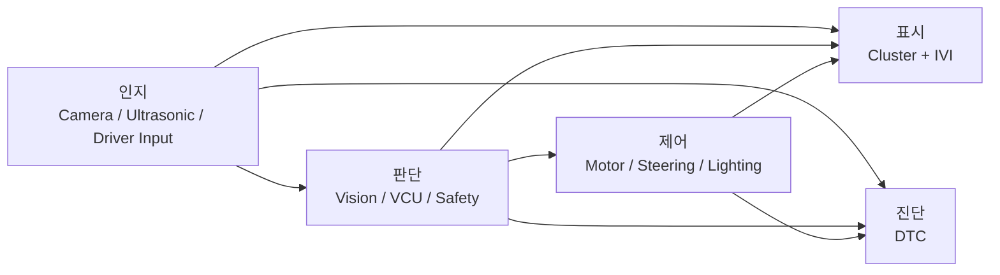
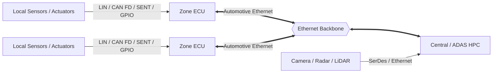
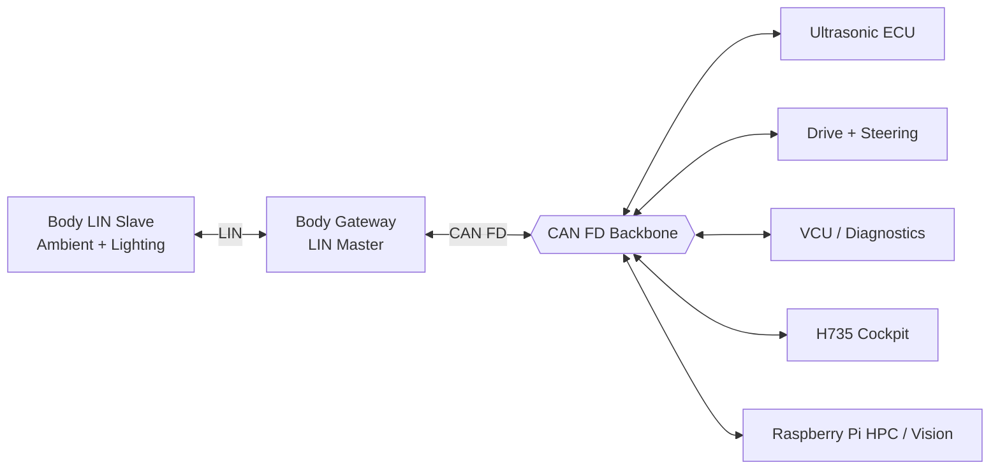
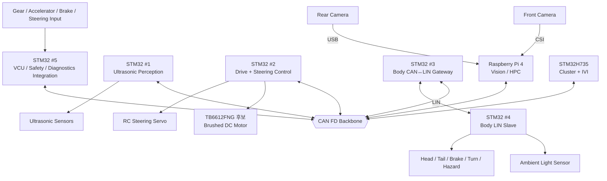

<div align="center">

# SDV MCU Project

**6인 팀으로 구현하는 Mini SDV E/E Architecture**

Raspberry Pi 4 Vision/HPC · STM32 분산 ECU · CAN FD Backbone · LIN Subnetwork · Ultrasonic · Cluster/IVI · DTC · Motor/Steering


[프로젝트 개요](#1-프로젝트-개요) · [인지-판단-제어](#2-인지--판단--제어로-보는-프로젝트) · [실차와의 차이](#3-실제-sdv와-본-프로젝트의-차이) · [전체 아키텍처](#4-현재-프로젝트-아키텍처) · [6인 역할](#7-6인-역할-분담) · [개발 문서](#10-개발-문서)

</div>

---

> **현재 문서 버전:** Architecture v1.2 — 2026-09-09  
> **핵심 구조:** `인지 → 판단 → 제어`, 그리고 이를 `UI / 통신 / 진단`이 지원한다.  
> **Cockpit:** STM32H735 + TouchGFX 한 보드에서 Cluster와 IVI를 함께 구현한다.  
> **Vision 개발:** 개발 중에는 Front / Rear Camera를 Raspberry Pi 2대로 병렬 개발할 수 있고, 최종 차량에서는 Raspberry Pi 1대로 통합하는 것을 목표로 한다.  
> **이전 계획 보존:** [2026-09-08 Legacy README](../README_2026-09-08_legacy.md)

본 프로젝트는 실제 도로 차량용 제어기가 아니라 **저속 RC/모형 모빌리티 플랫폼에서 SDV의 데이터 흐름과 ECU 역할을 축소 구현하는 교육용 프로젝트**다.

---

# 1. 프로젝트 개요

프로젝트를 가장 단순하게 표현하면 다음과 같다.

```text
센서가 주변/차량 상태를 본다
        ↓
소프트웨어가 의미를 만든다
        ↓
차량이 무엇을 할지 결정한다
        ↓
모터와 조향기가 실제로 움직인다
        ↓
운전자에게 상태를 보여준다
        ↓
문제가 생기면 DTC로 기록한다
```

주요 기능은 다음과 같다.

- **Ultrasonic Perception:** 초음파센서로 주변 거리를 측정한다.
- **Camera Vision:** Front/Rear Camera 영상을 Raspberry Pi에서 처리한다.
- **HPC / Decision:** 영상 결과를 이용해 ADAS/Parking 판단 결과를 만든다.
- **VCU / Final Arbitration:** 운전자 입력, Vision 요청, 안전 상태를 보고 최종 차량 명령을 정한다.
- **Drive / Steering Control:** 브러시드 DC Motor와 RC Servo를 실제로 제어한다.
- **Body / Lighting:** 조도센서와 램프를 LIN으로 연결하고 CAN FD와 Gateway한다.
- **Cockpit:** STM32H735에서 Cluster + IVI UI를 구현한다.
- **Diagnostics:** 각 ECU 고장을 DTC로 모으고 화면에 표시한다.

---

# 2. 인지 → 판단 → 제어로 보는 프로젝트

초심자는 ECU 이름보다 먼저 아래 흐름을 이해한다.



## 2.1 인지

인지란 **센서가 읽은 값을 차량이 사용할 수 있는 정보로 만드는 일**이다.

예:

```text
Ultrasonic Echo
→ 182 mm
→ REAR_RIGHT = 182 mm
→ CRITICAL
```

```text
Camera Frame
→ Object Detection
→ PERSON / RIGHT / WARNING
```

## 2.2 판단

판단이란 **인지한 정보를 보고 차량이 무엇을 해야 하는지 결정하는 일**이다.

예:

```text
Front Vision
Lane Offset = -40 mm
        ↓
ADAS Logic
Steering Request = +3 deg
```

그러나 ADAS가 Motor PWM을 직접 만들지는 않는다.

```text
ADAS Request
    ↓
VCU Safety / Mode Check
    ↓
Final Speed / Steering Request
```

## 2.3 제어

제어란 **최종 명령을 실제 하드웨어 움직임으로 바꾸는 일**이다.

```text
Final Speed Request
→ Drive ECU
→ PWM
→ TB6612FNG 후보
→ Brushed DC Motor
```

```text
Final Steering Request
→ Steering Control
→ Servo PWM
→ RC Servo
```

## 2.4 UI / 통신 / 진단

- **UI:** 운전자에게 Speed, RPM, Gear, Parking, ADAS, DTC를 보여준다.
- **통신:** CAN FD와 LIN을 통해 각 보드가 데이터를 주고받는다.
- **진단:** 센서/통신/제어 문제가 생기면 DTC로 기록한다.

---

# 3. 실제 SDV와 본 프로젝트의 차이

## 3.1 실제 최신 SDV의 일반적인 방향



실제 Zonal Architecture에서는 Zone 내부의 LIN/CAN FD와 Zone ↔ HPC 사이 Automotive Ethernet이 역할을 나눈다.

## 3.2 본 프로젝트

본 프로젝트는 Automotive Ethernet Backbone을 직접 구현하지 않고 **CAN FD를 차량 공통 Backbone으로 사용**한다. 대신 Body 영역에 LIN Subnetwork와 CAN↔LIN Gateway를 구현한다.



> **Actual SDV:** Local LIN/CAN → Zone ECU → Automotive Ethernet → Central HPC  
> **This Project:** Local LIN → Body Gateway → CAN FD Backbone → Raspberry Pi / STM32 Nodes

| 항목 | 실제 SDV / Zonal 차량 | 본 프로젝트 |
|---|---|---|
| Central Compute | Automotive HPC / ADAS SoC | Raspberry Pi 4 |
| Vehicle Backbone | Automotive Ethernet | CAN FD |
| Local Body Bus | LIN / CAN FD | LIN |
| Gateway | Zone Controller | STM32 Body Gateway |
| Vision | 고성능 ADAS Compute | Raspberry Pi 4 |
| Hard Real-Time Control | Automotive MCU | STM32 |
| Cockpit | Cluster/Cockpit SoC | STM32H735 + TouchGFX |
| Diagnostics | UDS / DoIP | DTC + CAN FD, UDS 일부 개념 |

---

# 4. 현재 프로젝트 아키텍처

## 4.1 최종 차량 구조



## 4.2 보드 사용 계획

| Hardware | 최종 역할 |
|---|---|
| STM32 #1 | Ultrasonic Perception ECU |
| STM32 #2 | Drive + Steering Control ECU |
| STM32 #3 | Body CAN FD ↔ LIN Gateway / LIN Master |
| STM32 #4 | Body LIN Slave / Ambient / Lighting |
| STM32 #5 | VCU / Driver Input / Safety / Diagnostics Integration |
| STM32H735 | Cluster + IVI Cockpit |
| Raspberry Pi 4 | Front + Rear Vision, HPC services, DTC database/logger |

## 4.3 Vision 병렬 개발 방식

개발 중에는 Raspberry Pi 두 대를 사용해 서로 독립적으로 개발할 수 있다.

```text
Developer Pi #1
Front Camera
→ ADAS Vision

Developer Pi #2
Rear Camera
→ Parking Vision
```

GitHub에서는 코드를 기능별로 분리한다.

```text
hpc/
├─ common/
├─ front_vision/
├─ rear_vision/
├─ vehicle_manager/
├─ can_service/
├─ diagnostics/
└─ logger/
```

최종 차량에서는 한 Pi로 통합한다.

```text
Gear D
→ Front Vision ACTIVE
→ Rear Vision IDLE

Gear R
→ Front Vision PAUSE
→ Rear Vision ACTIVE
```

영상처리는 STM32가 아니라 Raspberry Pi가 담당하며, **Camera Raw Frame은 CAN FD로 보내지 않고 결과값만 송신한다.**

---

# 5. 주요 데이터 흐름

## 5.1 Ultrasonic 인지

```text
Ultrasonic Sensors
      ↓
STM32 Ultrasonic ECU
      ↓
Distance / Valid / Warning Level
      ↓ CAN FD
VCU + H735 + HPC
```

## 5.2 Front ADAS Vision

```text
Front Camera
   ↓
Raspberry Pi Vision
   ↓
Lane / Object / Risk
   ↓
ADAS Speed / Steering Request
   ↓ CAN FD
VCU
```

## 5.3 Rear Parking Vision

```text
Gear R
  ↓
Rear Camera Active
  ↓
Raspberry Pi Rear Vision
  ↓
Object / Position / Warning
```

Ultrasonic 결과와 Vision 결과는 서로 다른 센서 정보이며, VCU/HPC에서 함께 사용할 수 있다.

## 5.4 최종 차량 제어

```text
Driver Input
ADAS Request
Ultrasonic Critical
Fault State
      ↓
     VCU
      ↓
Final Speed / Steering Request
      ↓ CAN FD
Drive + Steering ECU
      ↓
Motor / Servo
```

## 5.5 Body LIN / CAN Gateway

```text
Ambient Sensor
     ↓
Body LIN Slave
     ↓ LIN
Body Gateway
     ↓ CAN FD
VCU / H735 / HPC
```

반대 방향:

```text
Lighting Request
     ↓ CAN FD
Body Gateway
     ↓ LIN
Body LIN Slave
     ↓
Lamp Output
```

## 5.6 DTC

DTC는 한 담당자만 만드는 기능이 아니다. **각 Node가 자기 고장을 검출하고, Diagnostics 담당이 형식과 통합을 관리한다.**

```text
Ultrasonic Fault ─┐
Motor Fault ──────┤
LIN Fault ────────┤
Camera Fault ─────┤
VCU Fault ────────┘
        ↓
Local DTC
        ↓ CAN FD
Raspberry Pi DTC Manager / DB
        ↓
H735 Diagnostic Screen
```

---

# 6. STM32H735 Cockpit: Cluster + IVI

H735 한 보드가 두 역할을 한다.

### Cluster 기본 화면

- Speed
- Motor RPM
- Battery Voltage / SOC 후보
- Temperature
- P/R/N/D
- READY
- Turn / Headlamp
- ADAS / Parking Warning
- General Fault

### IVI 메뉴

- ADAS Status
- Parking Assist
- Diagnostics / DTC
- Lighting / Vehicle Settings
- System Status

```text
Cluster Main
 ├ ADAS
 ├ Parking
 ├ Diagnostics
 └ Settings
```

H735는 센서 값을 직접 만들어내는 ECU가 아니라 **다른 Node가 만든 차량 정보를 받아서 보여주는 역할**을 중심으로 한다.

---

# 7. 6인 역할 분담

A~F는 임시 식별자다. 역할을 `인지 / 판단 / 제어 / UI / 통신 / 진단` 관점에서 나눈다.

| 담당 | 역할 | 주요 Hardware | 한 줄 설명 |
|---|---|---|---|
| **A** | **Ultrasonic / 인지** | STM32 #1 + Ultrasonic | 주변 장애물이 얼마나 가까운지 측정한다. |
| **B** | **Cluster + IVI / UI** | STM32H735 + TouchGFX | 차량 상태와 경고를 운전자에게 보여준다. |
| **C** | **Motor + Steering / 제어** | STM32 #2 + TB6612FNG 후보 + Motor + Servo | 최종 명령대로 차량을 실제로 움직인다. |
| **D** | **Lighting + Ambient / LIN-CAN** | STM32 #3 + #4 | 조도와 조명을 LIN으로 연결하고 CAN FD와 Gateway한다. |
| **E** | **HPC + Camera Vision / 인지·판단** | Raspberry Pi + Front/Rear Camera | 영상을 보고 차선·물체를 찾고 ADAS/Parking 요청을 만든다. |
| **F** | **VCU + DTC + CAN Integration / 최종 판단·진단** | STM32 #5 + Pi Diagnostics 협업 | 모든 요청의 최종 안전 판단, CAN 통합, 고장 규칙을 관리한다. |

### 역할 경계

- A는 **거리 측정**까지 책임진다. Motor를 직접 멈추지 않는다.
- B는 **표시**가 중심이다. 차량 제어의 최종 권한을 갖지 않는다.
- C는 **실제 제어**를 담당한다. Camera AI를 하지 않는다.
- D는 **Body Local Network와 Gateway**를 담당한다.
- E는 **Camera 영상처리와 고수준 요청 생성**을 담당한다.
- F는 **최종 차량 상태/안전 판단과 DTC/CAN 통합**을 담당한다.
- 모든 담당자는 자기 Node의 Local Fault Detection을 구현하고, F가 DTC 형식을 통합한다.

자세한 쉬운 설명은 [팀 역할 쉬운 설명](TEAM_ROLE_EASY_GUIDE.md)을 먼저 읽는다.

---

# 8. 초기 CAN / LIN 데이터 방향

## CAN FD 예시

| Message | Tx | 주요 Rx | 내용 |
|---|---|---|---|
| `Vehicle_State` | VCU | All | Gear, Mode, Safety State |
| `Driver_Input` | VCU | HPC / H735 | Accel, Brake, Steering |
| `Ultrasonic_Status` | Ultrasonic ECU | VCU / H735 / HPC | Distance, Valid, Warning |
| `Vision_Request` | HPC | VCU / H735 | ADAS/Parking 결과와 Request |
| `Drive_Status` | Drive ECU | VCU / H735 / HPC | RPM, Speed, Steering Status |
| `Body_Status` | Gateway | VCU / H735 / HPC | Ambient, Lamp Status, LIN Health |
| `Body_Command` | VCU / H735 | Gateway | Lighting Request |
| `DTC_Event` | All | HPC / H735 | Fault Code / Status |
| `ECU_Heartbeat` | All | VCU / HPC | Node Alive |

실제 CAN ID, DLC, bit position, scale, offset, timeout은 별도 CAN Matrix에서 확정한다.

## LIN 예시

| Frame | Publisher | 의미 |
|---|---|---|
| `Ambient_Status` | Body LIN Slave | 조도 값 |
| `Lamp_Command` | Gateway Master | Lamp ON/OFF/Mode |
| `Lamp_Status` | Body LIN Slave | 실제 Lamp 상태 |
| `Lamp_Diagnostic` | Body LIN Slave | Local Body Fault |

---

# 9. 개발 단계

| 단계 | 목표 |
|---|---|
| **Stage 1** | 각자 자기 센서/화면/모터/통신을 단독으로 동작시킨다. |
| **Stage 2** | 2개 Node씩 CAN/LIN 통신을 붙인다. |
| **Stage 3** | 전체 CAN Backbone, Gateway, HPC, Cockpit을 통합한다. |
| **Stage 4** | 차량 장착 후 Fault/Latency/FPS/Response를 검증한다. |

초심자 팀이므로 Stage 1에서 모든 보드를 한꺼번에 연결하지 않는다.

---

# 10. 개발 문서

처음 참여한 팀원은 아래 순서로 읽는다.

1. **[팀 역할 쉬운 설명](TEAM_ROLE_EASY_GUIDE.md)**
2. [전자공학 선행학습 가이드](ELECTRONICS_PREREQUISITES_FOR_SW_TEAM.md)
3. [Architecture 작성 & Stage 1 Guide](BEGINNER_ARCHITECTURE_STAGE1_GUIDE.md)
4. [현재 Sensor List](SENSOR_LIST.md)
5. [Node별 명세서 / Architecture 예시](NODE_SPEC_ARCHITECTURE_EXAMPLES.md)
6. [4주 개발 계획](WEEKLY_PLAN.md)
7. [Node Specification Template](templates/NODE_SPECIFICATION_TEMPLATE.md)
8. [ECU Architecture Template](templates/ECU_ARCHITECTURE_TEMPLATE.md)
9. [Stage 1 Test Report Template](templates/STAGE1_TEST_REPORT_TEMPLATE.md)

---

# 11. 최종 Demo 흐름

```text
Power ON
→ 모든 Node Heartbeat 확인
→ H735 Cluster READY
→ Gear D
→ Front Vision Active
→ ADAS Request
→ VCU Final Arbitration
→ Drive / Steering Control
→ Ultrasonic Obstacle Detection
→ Warning / Safe Stop 판단
→ Gear R
→ Rear Vision Active
→ Rear Vision + Ultrasonic Parking Assist
→ Ambient 변화
→ LIN Slave → Gateway → CAN FD
→ Lighting 동작
→ Fault Injection
→ Local DTC → Pi DTC Manager → H735 Diagnostic Screen
```

최종 목표는 다음 한 줄이다.

> **Sense → Decide → Control을 여러 ECU와 CAN FD/LIN 네트워크로 나누어 실제 하드웨어에서 연결한다.**

---

## License

[LICENSE](../../../LICENSE)
