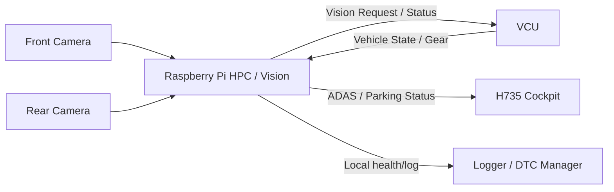
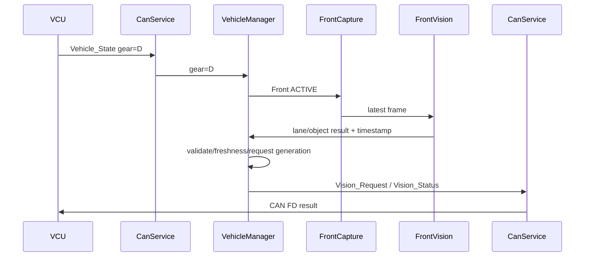
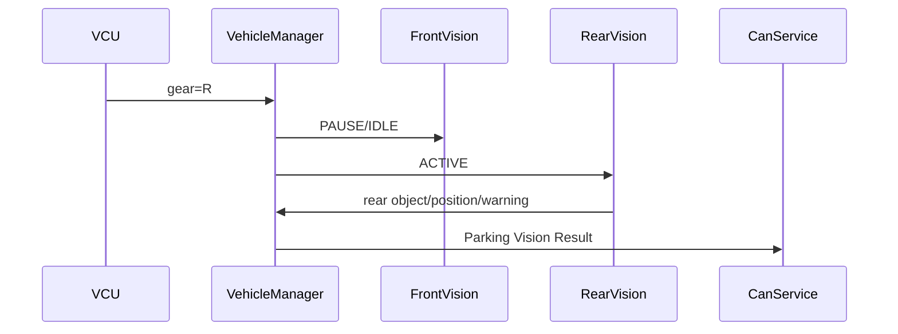
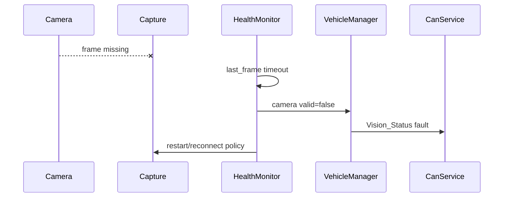
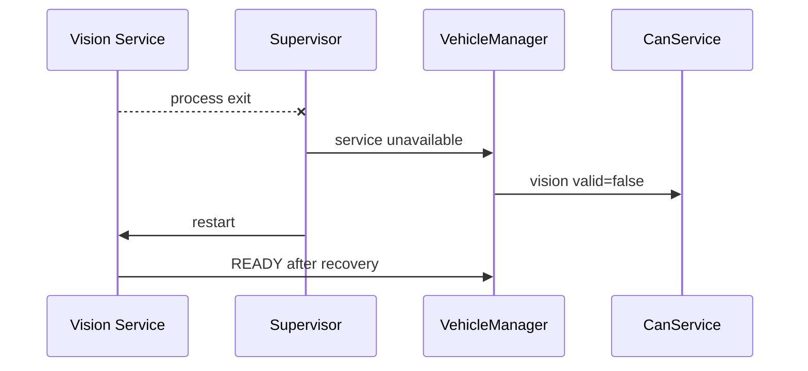
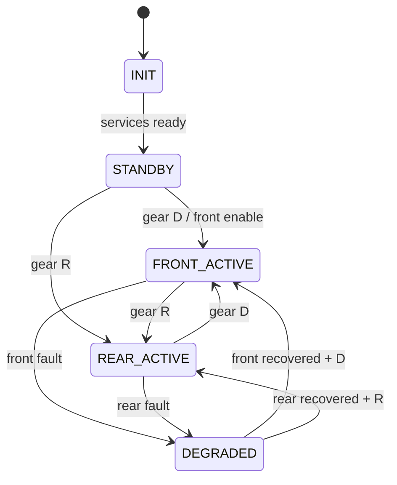

# HPC + Camera Vision Software Architecture

[프로젝트 홈](../../../README.md) · [문서 안내](../../README.md) · [폴더 목록](README.md)

> 문서 목적: Raspberry Pi 기반 Front/Rear Camera Vision과 HPC 기능을 **어떤 Linux Service / Process / Thread 구조로 구현하는지** 설명한다.  
> 기능 요구사항은 `SPECIFICATION.md`, 검증 결과는 `TEST_REPORT.md`를 기준으로 한다.

## Document Information

| Item | Value |
|---|---|
| Node / System | HPC + Front/Rear Camera Vision |
| Owner | E |
| Board / Platform | Raspberry Pi + Linux |
| Execution Model | Linux Service / Process / Thread |
| Revision | v0.1 |
| Status | Draft |
| Related Specification | `SPECIFICATION.md` |
| Related Test | `TEST_REPORT.md` |

### Revision History

| Revision | Date | Author | Change |
|---|---|---|---|
| v0.1 | 2026-09-09 | Team | Initial filled example |

---

# 1. Introduction & Goals

## 1.1 Purpose

> HPC + Camera Vision은 Front/Rear Camera 영상을 Pi 내부에서 처리하고, 차량 네트워크에는 영상 자체가 아닌 lane/object/warning/request 같은 의미 있는 결과만 제공한다.

## 1.2 Scope

포함:
- Front/Rear Camera capture
- Front ADAS Vision
- Rear Parking Vision
- Vehicle mode / gear coordination
- Semantic result generation
- CAN RX/TX service
- Health monitoring
- Logging / metrics
- 개발 Pi 2대 → 최종 Pi 1대 deployment

제외:
- Motor/Servo PWM
- VCU final arbitration
- Ultrasonic measurement
- H735 rendering
- LIN control

## 1.3 Stakeholders

| Stakeholder | 관심사 / 필요한 정보 |
|---|---|
| E / Vision 담당 | Camera pipeline, Process/Thread, model, performance |
| F / VCU·CAN | Request/Status contract, valid/timeout, gear/mode |
| B / H735 | 표시 가능한 ADAS/Parking semantic result |
| A / Ultrasonic | Rear Parking에서 서로 다른 센싱 정보 구분 |
| 통합 담당 | CAN adapter, service startup, Pi 1대 통합 |
| 테스트 담당 | FPS, latency, process crash, camera disconnect, switching |

---

# 2. Quality Goals

| Priority | Quality Goal | Concrete Scenario / Measure |
|---:|---|---|
| 1 | Freshness / Timing | 오래된 frame/result가 backlog로 누적되지 않고 최신 상태를 우선한다. |
| 2 | Reliability | Camera/process 장애 시 `valid=false`와 fault를 제공하고 전체 시스템이 멈추지 않는다. |
| 3 | Performance | Front/Rear Vision의 FPS와 processing latency를 측정하고 목표를 충족하도록 조정한다. |
| 4 | Maintainability | Capture, algorithm, CAN, vehicle mode, logging을 분리한다. |
| 5 | Testability | Front/Rear Vision을 독립 실행하고 녹화 영상/더미 CAN으로 시험할 수 있다. |

---

# 3. Constraints

| Constraint | Reason / Impact |
|---|---|
| Raspberry Pi + Linux 사용 | 프로젝트 HPC 플랫폼 |
| Front/Rear 개발은 Pi 2대 가능 | 병렬 개발 |
| 최종 차량은 Pi 1대 통합 목표 | 최종 HW 단순화 |
| Camera Raw Frame은 CAN FD로 전송하지 않음 | bandwidth / 역할 분리 |
| Final vehicle control은 VCU 소유 | 안전 / 책임 분리 |
| Front Camera CSI, Rear Camera USB 후보 | 현재 프로젝트 방향 |
| Pi에 내장 CAN FD 없음 | 외장 CAN FD interface 필요 |
| FPS/모델/Resolution은 아직 TBD | 실제 측정 필요 |

---

# 4. Context & Scope View



## External Interfaces

| External Entity | Direction | Data / Service | Interface | Owner |
|---|---|---|---|---|
| Front Camera | RX | image frame | CSI 후보 | E |
| Rear Camera | RX | image frame | USB 후보 | E |
| VCU | RX | Gear/Mode/Safety | CAN FD | F |
| VCU | TX | speed/steering request, valid/fault | CAN FD | E→F |
| H735 | TX | ADAS/Parking semantic result | CAN FD | E→B |
| Diagnostics | TX | local fault / health | CAN FD / local IPC | E/F |

---

# 5. Solution Strategy & Rationale

| Decision / Strategy | Why | Related Quality / Constraint |
|---|---|---|
| Camera capture와 Vision processing 분리 | inference가 frame acquisition을 장시간 막지 않게 함 | Timing |
| bounded frame queue 사용 | backlog 대신 최신 frame 우선 | Freshness |
| Front/Rear pipeline 독립 module/service | 병렬 개발과 독립 시험 | Maintainability/Testability |
| Vehicle Manager가 Gear/Mode 소유 | 각 Vision service가 CAN을 제각각 해석하는 것 방지 | Consistency |
| CAN Service single owner | CAN socket/interface 경쟁 방지 | Reliability |
| raw frame은 Pi 내부에서만 사용 | CAN bandwidth 보호 | Constraint |
| semantic result에 timestamp/valid 유지 | stale data 판별 | Reliability |
| logging을 비동기 처리 | Vision critical path block 방지 | Performance |

---

# 6. Building Block / Component View

## 6.1 Top-level Components

```text
Front Camera                  Rear Camera
     ↓                             ↓
FrontCapture                  RearCapture
     ↓                             ↓
FrontFrameQueue               RearFrameQueue
     ↓                             ↓
FrontVisionPipeline           RearVisionPipeline
     ↓                             ↓
ADASResult                  ParkingVisionResult
       \                       /
        \                     /
          VehicleManager
         ┌──────┼──────┐
         ↓      ↓      ↓
     CanService Health  Logger
         ↓
      CAN FD
```

## 6.2 Component Responsibility

| Component | Responsibility | Input | Output | Depends On |
|---|---|---|---|---|
| `FrontCapture` | Front Camera frame 획득 | CSI camera | frame/ref | camera driver |
| `RearCapture` | Rear Camera frame 획득 | USB camera | frame/ref | V4L2/OpenCV 후보 |
| `FrontVisionPipeline` | lane/object/ADAS result | front frame | semantic result | OpenCV/model |
| `RearVisionPipeline` | object/position/parking result | rear frame | semantic result | OpenCV/model |
| `VehicleManager` | gear/mode와 최신 Vision state 통합 | CAN state + results | active mode / publish state | CanService |
| `RequestGenerator` | speed/steering request 후보 생성 | front semantic state | request | policy/config |
| `CanService` | CAN RX/TX single owner | CAN interface | vehicle state / network TX | SocketCAN/adapter 후보 |
| `HealthMonitor` | camera/process/result/latency health | timestamps/metrics | health/fault | services |
| `Logger` | async logs/metrics | all components | file/console | storage |
| `ConfigManager` | model/path/threshold/config | config file/env | validated config | filesystem |

## 6.3 Module / Folder Mapping

제안 구조:

```text
hpc/
├─ common/
│  ├─ types/
│  ├─ config/
│  ├─ ipc/
│  └─ logging/
├─ front_vision/
│  ├─ capture/
│  ├─ preprocessing/
│  ├─ lane/
│  ├─ object/
│  └─ request/
├─ rear_vision/
│  ├─ capture/
│  ├─ preprocessing/
│  ├─ object/
│  └─ parking/
├─ vehicle_manager/
├─ can_service/
├─ health_monitor/
└─ diagnostics/
```

---

# 7. Concurrency / Linux Runtime View

## 7.1 Process / Service Model

| Process / Service | Responsibility | Lifetime / Trigger | Importance | Blocking Policy |
|---|---|---|---|---|
| `vehicle_manager` | authoritative gear/mode/result coordination | always-on | High | logging block 금지 |
| `can_service` | CAN RX/TX | always-on | High | reconnect logic 필요 |
| `front_vision` | front capture + pipeline | always-on 또는 D mode active | High | bounded queue |
| `rear_vision` | rear capture + pipeline | always-on 또는 R mode active | High | bounded queue |
| `health_monitor` | health/freshness/resource metrics | periodic | Normal/High | lightweight |
| `logger` | file/console metrics | async | Low | producers block 금지 |

개발 초기는 한 executable 안의 thread로 구현할 수도 있지만, 최종 Architecture에서는 책임과 failure domain을 위와 같이 분리한다.

## 7.2 Thread Model 후보

각 Vision service 내부:

```text
Capture Thread
    ↓ bounded queue
Processing Thread
    ↓ latest result
Publish / IPC Thread or loop
```

GPU/NPU가 없는 Pi에서는 algorithm 비용에 따라 capture와 processing을 한 thread로 단순화할 수 있지만, **frame backlog가 발생하지 않는지 실측 후 결정**한다.

## 7.3 IPC Objects

| Object | Type 후보 | Producer | Consumer | Data | Overflow / Timeout Policy |
|---|---|---|---|---|---|
| `front_frame_q` | bounded queue | FrontCapture | FrontVision | frame/ref | oldest/latest drop policy TBD |
| `rear_frame_q` | bounded queue | RearCapture | RearVision | frame/ref | oldest/latest drop policy TBD |
| `front_result_q` | queue/shared state | FrontVision | VehicleManager | typed result | latest valid 우선 |
| `rear_result_q` | queue/shared state | RearVision | VehicleManager | typed result | latest valid 우선 |
| `vehicle_state` | queue/shared state | CanService | VehicleManager | gear/mode | timeout invalid |
| `tx_request_q` | queue | VehicleManager | CanService | CAN message | bounded + failure metric |
| `log_q` | async queue | all | Logger | log/metric | drop low-priority logs 후보 |

## 7.4 Shared Resource Ownership

| Resource | Owner | Other Users | Protection / Rule |
|---|---|---|---|
| Front Camera | FrontCapture | FrontVision indirect | capture owner only |
| Rear Camera | RearCapture | RearVision indirect | capture owner only |
| CAN interface | CanService | others via IPC | single owner |
| Gear/Mode state | VehicleManager | readers | latest snapshot / atomic/IPC |
| Log file | Logger | producers via queue | single writer |
| Config | ConfigManager/startup | read-only consumers | immutable snapshot 권장 |

## 7.5 Scheduling / Delay Policy

- busy polling보다 blocking wait/epoll/queue/event를 우선한다.
- frame queue가 쌓이면 오래된 영상 처리보다 최신성 유지가 우선이다.
- process priority/nice/CPU affinity는 baseline 측정 전에는 고정하지 않는다.
- logging/file flush가 Vision processing을 block하지 않게 한다.

---

# 8. Runtime View

## 8.1 Front ADAS Normal Flow



## 8.2 Rear Parking Normal Flow



## 8.3 Camera Timeout



## 8.4 Vision Process Crash



---

# 9. Deployment / Hardware View

## 9.1 개발 단계

```text
Pi #1
└ Front Camera
  └ front_vision

Pi #2
└ Rear Camera
  └ rear_vision
```

Git 저장소의 공통 타입/인터페이스는 공유한다.

## 9.2 최종 단계

```text
Front CSI Camera ─┐
                  ├→ Raspberry Pi HPC
Rear USB Camera ──┘   ├ front_vision
                      ├ rear_vision
                      ├ vehicle_manager
                      ├ can_service
                      ├ health_monitor
                      └ logger / diagnostics support
                           ↓
                    CAN FD Interface
                           ↓
                      CAN Backbone
```

| HW / Runtime Node | Software | Interface | Note |
|---|---|---|---|
| Raspberry Pi | all HPC services | Linux | thermal/power 확인 |
| Front Camera | front capture | CSI 후보 | exact model TBD |
| Rear Camera | rear capture | USB 후보 | bandwidth/power TBD |
| CAN FD adapter | CanService | SPI/USB 후보 | MCP2518FD/TCAN/USB 후보 중 실제 HW 확인 |

---

# 10. Interfaces & Contracts

## 10.1 CAN / CAN FD

### TX

| Message / Signal | Meaning | Unit | Cycle/Event | Receiver | Valid Condition |
|---|---|---|---|---|---|
| `Vision_Request` | ADAS/Parking semantic/request | TBD | periodic/event | VCU/H735 | source result fresh |
| `Vision_Status` 후보 | front/rear valid, active, fault | flags | periodic/event | VCU/H735 | CanService alive |
| `ECU_Heartbeat` 후보 | HPC alive | bool/counter | periodic | VCU | service policy TBD |

### RX

| Message / Signal | Meaning | Sender | Timeout | Timeout Action |
|---|---|---|---|---|
| `Vehicle_State` | Gear/Mode/Safety | VCU | TBD | mode invalid/degraded |
| `Driver_Input` 후보 | driver state | VCU | TBD | optional input invalid |

CAN ID/DLC/endian/scale/offset은 공통 CAN Matrix에서 확정한다.

## 10.2 Camera Interface

| Camera | Interface | Owner | Output | Failure |
|---|---|---|---|---|
| Front | CSI 후보 | FrontCapture | frame/ref | frame timeout |
| Rear | USB 후보 | RearCapture | frame/ref | disconnect/frame timeout |

## 10.3 IPC / File

| Interface | Producer | Consumer | Data Format | Failure Handling |
|---|---|---|---|---|
| frame queue | capture | vision | image/ref | bounded/drop policy |
| result queue | vision | vehicle manager | typed struct/message | stale timeout |
| mode state | CAN/VM | vision | enum | latest state |
| config | file/env | all | YAML/JSON/TOML/etc. TBD | startup validation |
| metrics | all | logger/monitor | structured | async/drop low-priority |

---

# 11. Data & State Model

## 11.1 Main Data

| Data | Type | Owner | Meaning | Unit | Invalid Condition |
|---|---|---|---|---|---|
| `front_frame` | frame/ref | FrontCapture | latest front image | image | capture timeout |
| `rear_frame` | frame/ref | RearCapture | latest rear image | image | capture timeout |
| `lane_offset` | numeric | FrontVision | lane lateral offset | TBD | front invalid |
| `lane_angle` | numeric | FrontVision | lane heading | TBD | front invalid |
| `object_detected` | bool/enum | FrontVision | object state | logical | front invalid |
| `collision_level` | enum | FrontVision | risk level | enum | front invalid |
| `rear_object_position` | enum | RearVision | rear object region | enum | rear invalid |
| `parking_warning` | enum | RearVision | rear visual warning | enum | rear invalid |
| `speed_request` | numeric | RequestGenerator | VCU request | TBD | source invalid/stale |
| `steering_request` | numeric | RequestGenerator | VCU request | TBD | source invalid/stale |
| `vision_health` | flags | HealthMonitor | camera/service/latency status | flags | N/A |

모든 semantic result는 `timestamp`, `valid`, `source`를 함께 유지하는 방향을 권장한다.

## 11.2 Mode State



---

# 12. Cross-cutting Concepts

## 12.1 Error Handling

- frame timeout → 해당 camera valid=false
- inference exception → result invalid + process/service health update
- stale result → CAN publish 금지 또는 invalid flag
- CAN unavailable → local Vision은 계속 동작 가능하되 publish fault 표시
- config parse failure → 명시적 startup failure 또는 safe default 정책

## 12.2 Diagnostics / DTC

Local fault 후보:
- front camera unavailable
- rear camera unavailable
- front/rear service crash
- excessive latency
- CAN interface unavailable
- configuration invalid

DTC code 형식은 F 담당의 공통 규격을 따른다.

## 12.3 Timing

| Function | Trigger | Target | Overrun Action |
|---|---|---|---|
| Front capture | frame | FPS TBD | dropped/missed frame metric |
| Front inference | frame/result loop | latency TBD | stale/drop/degraded |
| Rear capture | frame | FPS TBD | missed frame metric |
| Rear inference | frame/result loop | latency TBD | stale/drop/degraded |
| Health check | periodic | TBD | fault publish |
| CAN publish | result/event | TBD | retry/log policy |

## 12.4 Memory / Resource

- frame buffer 개수 제한
- queue bounded
- model memory 측정
- process RSS 측정
- storage log rotation 필요
- CPU 사용률/thermal throttling 확인

## 12.5 Health Monitoring

```text
Camera last frame
Vision last result
Process alive
CAN interface state
Latency
CPU / Memory / Thermal
      ↓
HealthMonitor
      ↓
vision_valid / fault / degraded
      ↓ CAN
VCU + H735
```

## 12.6 Logging / Observability

로그 예:

```text
[MODE] D -> R
[CAM][FRONT] paused
[CAM][REAR] first_frame ts=...
[VIS][REAR] object=1 position=RIGHT latency_ms=...
[CAN][TX] parking_warning=...
[HEALTH] rear_camera_timeout
```

성능 측정 가능성을 위해 frame id/timestamp/result id를 연계한다.

---

# 13. Architecture Decisions

| ADR ID | Decision | Alternatives | Reason | Consequence |
|---|---|---|---|---|
| ADR-VIS-001 | 영상처리는 Raspberry Pi에서 수행 | STM32 Vision | compute/memory/OpenCV/AI | Pi health/latency 관리 필요 |
| ADR-VIS-002 | raw frame을 CAN으로 보내지 않음 | image CAN transfer | bandwidth/role separation | H735는 semantic result만 표시 |
| ADR-VIS-003 | Front/Rear Vision을 독립 module/service로 개발 | 하나의 monolithic loop | 병렬 개발/시험 | IPC/interface 정의 필요 |
| ADR-VIS-004 | 최종 Pi 1대로 통합 | Pi 2대 최종 장착 | HW 단순화 | 최종 load/thermal 재측정 필요 |
| ADR-VIS-005 | CAN interface는 CanService single owner | 각 service 직접 CAN 접근 | consistency/reliability | IPC 필요 |
| ADR-VIS-006 | bounded queue와 latest-data 정책 | unbounded queue | freshness/latency | 일부 frame drop 허용 |

---

# 14. Quality Scenarios & Verification

| Quality Goal | Scenario | Measure / Target | Verification |
|---|---|---|---|
| Freshness | inference가 느려짐 | backlog 없이 stale age 제한 | queue/latency log |
| Reliability | rear camera disconnect | rear valid=false + process alive | fault injection |
| Recovery | vision process crash | fault detect + restart | kill/restart test |
| Performance | Pi 1대에서 Front/Rear 통합 | FPS/CPU/memory/thermal 측정 | load test |
| Maintainability | algorithm 교체 | CAN contract/VehicleManager 변경 최소화 | code review |

---

# 15. Risks & Technical Debt

| ID | Risk / Debt | Impact | Mitigation / Next Action | Owner |
|---|---|---|---|---|
| RISK-VIS-001 | 최종 Pi 1대 성능 부족 | FPS/latency 저하 | model/resolution/mode switching 최적화 | E |
| RISK-VIS-002 | USB rear camera bandwidth/power | frame drop | 실제 camera/USB test | E |
| RISK-VIS-003 | Front/Rear camera API 차이 | 통합 코드 복잡 | capture interface abstraction | E |
| RISK-VIS-004 | CAN FD adapter 미확정 | 통합 지연 | E/F가 조기 확정 | E/F |
| RISK-VIS-005 | Vision result 정의 변경 | VCU/HMI 재작업 | semantic contract 조기 freeze | E/F/B |
| RISK-VIS-006 | thermal throttling | 장시간 성능 저하 | soak/thermal test | E |
| RISK-VIS-007 | process/IPC 구조 과도한 복잡성 | 개발 지연 | Stage 1은 단순 구현 후 측정 기반 분리 | E |

---

# 16. Requirement Traceability

| Requirement ID | Component | Runtime | Interface | Test ID |
|---|---|---|---|---|
| REQ-VIS-001 | FrontCapture | front_vision | CSI | T-VIS-001 |
| REQ-VIS-002 | RearCapture | rear_vision | USB | T-VIS-002 |
| REQ-VIS-003 | FrontVisionPipeline | front_vision | result IPC | T-VIS-003 |
| REQ-VIS-004 | RearVisionPipeline | rear_vision | result IPC | T-VIS-004 |
| REQ-VIS-005 | VehicleManager | vehicle_manager | CAN/IPC | T-VIS-005 |
| REQ-VIS-006 | VehicleManager + RearCapture | services | mode switch | T-VIS-006 |
| REQ-VIS-007 | CanService | can_service | CAN FD | T-VIS-007 |
| REQ-VIS-009 | HealthMonitor | health_monitor | health/CAN | T-VIS-009 |
| REQ-VIS-010 | Supervisor + Health | Linux services | process state | T-VIS-010 |
| REQ-VIS-012 | Deployment | Pi 1대 | all | T-VIS-012 |
| REQ-VIS-015 | Metrics | all services | logs/metrics | T-VIS-015 |

---

# 17. Glossary

| Term | Meaning |
|---|---|
| HPC | High Performance Computer, 본 프로젝트에서는 Raspberry Pi 중앙 연산 노드 |
| Vision | Camera frame에서 의미 있는 정보를 추출하는 처리 |
| Semantic Result | raw image가 아닌 lane/object/warning 등의 해석 결과 |
| Freshness | 결과가 얼마나 최신 frame에 기반하는지 |
| IPC | Inter-Process Communication |
| VCU | Vehicle Control Unit |
| DTC | Diagnostic Trouble Code |

---

# 18. Architecture Review Checklist

- [ ] Front/Rear 역할과 범위가 명확하다.
- [ ] Raw frame이 CAN으로 나가지 않는다.
- [ ] Final control authority가 VCU임이 명확하다.
- [ ] Capture / Vision / VehicleManager / CAN 책임이 분리되어 있다.
- [ ] Process/Thread/IPC 구조가 설명되어 있다.
- [ ] Frame/Result queue가 bounded이고 overflow 정책이 있다.
- [ ] Gear D/R mode switching flow가 있다.
- [ ] Camera/process/CAN fault flow가 있다.
- [ ] Result timestamp/valid/freshness가 고려되어 있다.
- [ ] Pi 2대 개발 → Pi 1대 통합 deployment가 설명되어 있다.
- [ ] FPS/latency/CPU/memory/thermal 측정 계획이 있다.
- [ ] CAN signal owner/consumer가 명확하다.
- [ ] Risk/TBD가 기록되어 있다.
- [ ] Requirement → Component/Runtime → Test를 추적할 수 있다.
