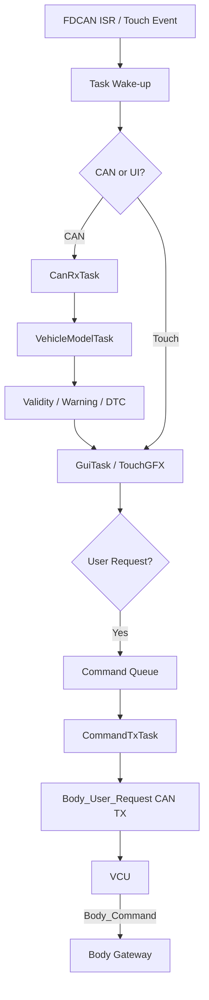

# Cluster + IVI Cockpit Functional Specification

[프로젝트 홈](../../../README.md) · [문서 안내](../../README.md) · [폴더 목록](README.md)

> 문서 목적: STM32H735 + TouchGFX Cockpit 기능이 **무엇을 해야 하는지** 정의한다.  
> 구현 구조는 `ARCHITECTURE.md`, 검증 결과는 `TEST_REPORT.md`에서 관리한다.

> **최상위 구현 기준:** [FINAL_IMPLEMENTATION_SPEC.md](../../system/FINAL_IMPLEMENTATION_SPEC.md). 조명 요청은 `IVI → Body_User_Request → VCU → Body_Command → Body Gateway`를 따른다. IVI는 `Body_Command`를 직접 송신하지 않는다.

## Document Information

| Item | Value |
|---|---|
| Feature ID | `FEAT-HMI-001` |
| Feature / Node Name | Cluster + IVI Cockpit |
| Owner | B |
| Role | UI / 차량 상태 표시 / 사용자 입력 |
| Status | Draft |
| Priority | MUST |
| Board / Platform | STM32H735 + TouchGFX |
| Execution Model | FreeRTOS + CMSIS-RTOS2 |
| Related Architecture | `ARCHITECTURE.md` |
| Related Test | `TEST_REPORT.md` |

### Revision History

| Revision | Date | Author | Change |
|---|---|---|---|
| v0.1 | 2026-09-09 | Team | Initial filled example |
| v0.2 | 2026-09-09 | Team | FreeRTOS task/timing/health requirements added |
| v0.3 | 2026-09-10 | Team | Lighting request route aligned with final specification: IVI → VCU → Body Gateway |

---

# 1. Purpose and Scope

## 1.1 한 문장 설명

> H735 Cockpit은 CAN FD로 전달되는 차량 상태, ADAS, Parking, Body, DTC 정보를 운전자에게 보여주고, 일부 사용자 요청을 CAN으로 전달하며, UI/CAN/진단 기능을 FreeRTOS Task로 분리해 실행한다.

## 1.2 포함 범위

- Digital Cluster 기본 화면
- Speed / RPM / Gear / Battery / Temperature 표시
- ADAS 상태 및 Warning
- Ultrasonic / Rear Parking 상태
- DTC 목록/상세
- Lighting / Vehicle Setting Request UI
- Touch 기반 화면 전환
- CAN RX/TX
- Signal validity / timeout
- FreeRTOS Task 분리
- Queue / Notification 기반 Task 간 데이터 전달
- Health / Stack / Queue monitoring

## 1.3 제외 범위

- Motor PWM / Steering PWM 직접 생성
- ADAS 최종 제어 판단
- Camera 영상처리
- Raw Camera Frame CAN 수신
- Ultrasonic 거리 계산
- Lighting GPIO 직접 구동
- VCU arbitration

---

# 2. Usage / System Scenario

## 2.1 정상 차량 상태 표시

| Item | Description |
|---|---|
| Actor / Trigger | VCU / Drive ECU CAN frame |
| Preconditions | H735 init 완료, FreeRTOS scheduler running, TouchGFX running, CAN ready |
| Trigger | `Vehicle_State`, `Drive_Status` 수신 |
| Normal Flow | FDCAN ISR → CanRxTask → decode → VehicleModelTask → GuiTask |
| Postconditions | Speed/RPM/Gear/READY/Warning 최신 상태 표시 |

## 2.2 Parking Warning

| Item | Description |
|---|---|
| Actor / Trigger | Ultrasonic ECU / HPC Rear Vision |
| Preconditions | Cockpit READY |
| Trigger | Parking status 수신 |
| Normal Flow | CanRxTask → Model Queue → Warning evaluation → GuiTask overlay |
| Postconditions | 운전자가 위험 위치/상태 확인 가능 |

## 2.3 사용자 Lighting Request

| Item | Description |
|---|---|
| Actor / Trigger | Driver touch |
| Preconditions | Settings screen active |
| Trigger | Lighting toggle/select |
| Normal Flow | GuiTask → Command Queue → CommandTxTask → Body_User_Request → VCU |
| Postconditions | VCU가 Body_User_Request를 수신 가능. VCU가 최종 Body_Command를 결정하여 Body Gateway로 전달 |

---

# 3. Functional Flow

---

# 4. Inputs

| Input ID | Input | Source | Interface | Unit / Range | Valid Condition | Update / Trigger |
|---|---|---|---|---|---|---|
| IN-HMI-001 | `Vehicle_State` | VCU | CAN FD | Gear/Mode/Safety | valid payload | periodic |
| IN-HMI-002 | `Drive_Status` | Drive ECU | CAN FD | rpm/speed/status | timeout 정상 | periodic |
| IN-HMI-003 | `Ultrasonic_Status` | Ultrasonic ECU | CAN FD | mm/warning | sensor valid | periodic |
| IN-HMI-004 | Vision status/request | Raspberry Pi | CAN FD | semantic result | source valid | periodic/event |
| IN-HMI-005 | `Body_Status` | Body Gateway | CAN FD | ambient/lamp/LIN health | valid payload | periodic |
| IN-HMI-006 | `DTC_Event` | ECU/Pi DTC Manager | CAN FD | code/status/severity | valid format | event |
| IN-HMI-007 | `ECU_Heartbeat` | ECU Nodes | CAN FD | alive/status | timeout 정상 | periodic |
| IN-HMI-008 | Touch Event | Driver | Touch | x/y/action | valid region | event |

---

# 5. Outputs

| Output ID | Output | Destination | Interface | Update / Event | Valid Condition |
|---|---|---|---|---|---|
| OUT-HMI-001 | Cluster/IVI Screen | Driver | LCD/TouchGFX | render update | model valid/degraded state |
| OUT-HMI-002 | Critical Warning | Driver | LCD/TouchGFX | event | warning valid |
| OUT-HMI-003 | DTC Detail | Driver | LCD/TouchGFX | event | DTC entry valid |
| OUT-HMI-004 | `Body_User_Request` | VCU | CAN FD | user event | request valid |
| OUT-HMI-005 | Diagnostic Clear Request 후보 | Diagnostics target | CAN FD | user event | policy satisfied |

---

# 6. Functional Requirements

| Requirement ID | Requirement | Priority | Verification | Related Test |
|---|---|---|---|---|
| REQ-HMI-001 | Cockpit은 Speed, RPM, Gear를 Cluster 기본 화면에 표시해야 한다. | MUST | Test | T-HMI-001 |
| REQ-HMI-002 | READY 및 General Warning을 표시해야 한다. | MUST | Test | T-HMI-002 |
| REQ-HMI-003 | ADAS 상태와 Warning을 표시해야 한다. | MUST | Test | T-HMI-003 |
| REQ-HMI-004 | Ultrasonic 거리/Warning을 Parking 화면에 표시해야 한다. | MUST | Test | T-HMI-004 |
| REQ-HMI-005 | DTC 목록과 상세 상태를 표시해야 한다. | MUST | Test | T-HMI-005 |
| REQ-HMI-006 | Touch로 Cluster/ADAS/Parking/Diagnostics/Settings 화면을 전환해야 한다. | MUST | Test | T-HMI-006 |
| REQ-HMI-007 | Timeout/Invalid 차량 데이터를 정상 최신값처럼 표시하지 않아야 한다. | MUST | Fault Test | T-HMI-007 |
| REQ-HMI-008 | Lighting 설정은 Body_User_Request로 VCU에 전송해야 하며, Body_Command 발행과 Lamp GPIO 직접 제어를 수행하지 않아야 한다. | MUST | Test/Inspect | T-HMI-008 |
| REQ-HMI-009 | Raw Camera Frame을 CAN으로 수신하도록 설계하지 않아야 한다. | MUST | Inspect | T-HMI-009 |
| REQ-HMI-010 | Critical Warning은 현재 화면과 무관하게 우선 표시 가능해야 한다. | SHOULD | Test | T-HMI-010 |
| REQ-HMI-011 | 주요 CAN 데이터는 수신 후 목표 100 ms 이내에 UI Model에 반영해야 한다. | SHOULD | Measure | T-HMI-011 |
| REQ-HMI-012 | Touch 입력은 목표 150 ms 이내에 화면 피드백을 제공해야 한다. | SHOULD | Measure | T-HMI-012 |
| REQ-HMI-013 | CAN 수신 처리와 TouchGFX rendering은 서로 독립적인 FreeRTOS Task context로 분리해야 한다. | MUST | Inspect/Test | T-HMI-013 |
| REQ-HMI-014 | FDCAN ISR은 긴 decode/rendering을 수행하지 않고 Task를 깨우는 최소 처리만 해야 한다. | MUST | Inspect | T-HMI-014 |
| REQ-HMI-015 | Task 간 CAN/Model/UI 데이터 전달은 Queue/Notification/Repository 정책으로 관리해야 한다. | MUST | Inspect/Test | T-HMI-015 |
| REQ-HMI-016 | Critical Warning 처리 경로는 일반 DTC list rendering이나 logging 때문에 block되지 않아야 한다. | MUST | Load Test | T-HMI-016 |
| REQ-HMI-017 | Stack overflow와 Queue overflow를 검출 또는 시험할 수 있어야 한다. | SHOULD | RTOS Test | T-HMI-017 |
| REQ-HMI-018 | Cockpit은 HealthTask를 통해 중요 Task/Queue 상태를 감시하고 Watchdog 적용 가능 구조를 가져야 한다. | SHOULD | Inspect/Test | T-HMI-018 |

시간/Stack/Queue 수치는 실제 TouchGFX/FreeRTOS profiling 후 확정한다.

---

# 7. Rules / Conditions

| Rule ID | Condition | Result |
|---|---|---|
| RULE-HMI-001 | Power ON | Cluster Main 기본 진입 |
| RULE-HMI-002 | Gear R | Parking 정보 접근성 강화 |
| RULE-HMI-003 | Critical Warning | 일반 화면보다 Warning 우선 |
| RULE-HMI-004 | CAN Signal timeout | `valid=false` + Comm Warning |
| RULE-HMI-005 | Lighting 설정 | Command Queue → Body_User_Request → VCU |
| RULE-HMI-006 | DTC Clear | 통합 규격 조건 확인 후 Request |
| RULE-HMI-007 | GUI load 증가 | CanRxTask/Validity 처리가 starvation되지 않아야 함 |

---

# 8. Exceptions / Edge Cases

| Case ID | Exception / Edge Case | Detection | Expected Behavior | Recovery |
|---|---|---|---|---|
| EDGE-HMI-001 | `Drive_Status` timeout | timestamp | Speed/RPM invalid + warning | 정상 frame 재수신 |
| EDGE-HMI-002 | Unknown DTC | lookup miss | raw code/source 표시 | table update |
| EDGE-HMI-003 | Touch 연타 | event validation | hang 없이 처리/무시 | automatic |
| EDGE-HMI-004 | CAN unavailable | controller/error state | Comm Fault 표시 | bus recovery |
| EDGE-HMI-005 | Parking sensor invalid | `valid=false` | Sensor Invalid 표시 | source recovery |
| EDGE-HMI-006 | Vision unavailable | timeout | Vision unavailable | service recovery |
| EDGE-HMI-007 | CAN RX queue full | queue send failure/high-water | overflow count/diagnostic, critical data 정책 적용 | load 감소/queue tuning |
| EDGE-HMI-008 | GuiTask 지연 | task health/timing | CAN model ingestion 계속 유지, health warning | profiling/tuning |

---

# 9. UI / UX Reference

| Screen | Main Data |
|---|---|
| Cluster Main | Speed, RPM, Gear, READY, Warning, Lamp |
| ADAS | ADAS active, lane/object/warning semantic data |
| Parking | Ultrasonic distance/warning + Rear Vision status |
| Diagnostics | Active/History DTC list/detail |
| Settings | Lighting/vehicle setting Request |

Raw Rear Camera 영상 자체를 CAN으로 받아 표시하는 것은 현재 범위가 아니다.

---

# 10. Interface Requirements

## 10.1 Hardware

| Device | Interface | Note |
|---|---|---|
| STM32H735 Display | board integrated | TouchGFX |
| Touch Controller | board integrated | event input |
| CAN FD Transceiver | FDCAN ↔ CANH/L | actual model TBD |

## 10.2 CAN / CAN FD

| Message | Direction | Peer | Cycle/Event | Timeout | Timeout Action |
|---|---|---|---|---|---|
| `Vehicle_State` | RX | VCU | periodic | TBD | invalid state |
| `Drive_Status` | RX | Drive | periodic | TBD | speed/rpm invalid |
| `Ultrasonic_Status` | RX | Ultrasonic | periodic | TBD | sensor invalid |
| Vision status | RX | HPC | periodic/event | TBD | vision unavailable |
| `Body_Status` | RX | Gateway | periodic | TBD | body warning |
| `DTC_Event` | RX | All/Pi | event | N/A | list update |
| `Body_User_Request` | TX | VCU | event | N/A | TX result/log |

## 10.3 LIN

N/A. H735는 LIN에 직접 연결하지 않는다.

---

# 11. Timing / Performance Requirements

| Requirement | Target | Verification |
|---|---|---|
| CAN RX → Vehicle Model | ≤100 ms 목표 | timestamp |
| Touch → UI response | ≤150 ms 목표 | event/render timestamp |
| Critical Warning indication | ≤200 ms 목표 | fault injection |
| GUI freeze | 0 in normal soak test | soak |
| CanRxTask event handling | TBD | trace/log |
| Queue overflow | 0 in expected load | runtime stats |

---

# 12. Execution / RTOS Requirements

## 12.1 Task Model

| Task | Responsibility | Trigger / Period | Priority Direction | Blocking Policy |
|---|---|---|---|---|
| `CanRxTask` | CAN dequeue/decode | event | High | UI rendering 기다리지 않음 |
| `VehicleModelTask` | repository/validity/warning | event/10~20 ms 후보 | Normal~High | long blocking 금지 |
| `GuiTask` | TouchGFX render/input | framework tick | Normal | CAN driver 직접 접근 금지 |
| `CommandTxTask` | UI Request CAN TX | event | Normal | queue based |
| `HealthTask` | task/queue/stack health | 100 ms 후보 | Low | watchdog policy 수행 |

## 12.2 RTOS Objects

| Object | Type | Producer | Consumer | Policy |
|---|---|---|---|---|
| `CanRxQueue` | Queue | FDCAN ISR/adapter | CanRxTask | overflow count + policy |
| `ModelUpdateQueue` | Queue/Event | CanRxTask | VehicleModelTask | latest-state-friendly design |
| `UiCommandQueue` | Queue | GuiTask | CommandTxTask | event command 보존 |
| `SystemEvents` | Event Flags | Tasks | Health/Model | CAN ready/fault/critical flags |

## 12.3 ISR

FDCAN ISR은:
- frame metadata 최소 capture
- queue push 또는 task notify
- 긴 decode 금지
- printf 금지
- TouchGFX 호출 금지

## 12.4 Memory / Health

- Task stack size: TBD after measurement
- Stack overflow hook: enable candidate
- queue high-water/overflow counter: required candidate
- startup 이후 uncontrolled dynamic allocation: avoid
- HealthTask + IWDG: 적용 후보, 최종 CubeMX 설정 후 확정

---

# 13. Safety / Fail-safe / DTC

| Fault | Detection | Local Action | DTC Candidate | Recovery |
|---|---|---|---|---|
| CAN lost | timeout/controller state | invalid/comm warning | `HMI_COMM_xxx` 후보 | bus recovery |
| Touch fault | init/event health | display-only degraded | `HMI_TOUCH_xxx` 후보 | reinit/reboot |
| GUI/task health fault | health monitor | warning / watchdog policy | `HMI_TASK_xxx` 후보 | reset/recovery |
| Queue overflow | counter | data drop policy + health flag | `HMI_QUEUE_xxx` 후보 | tuning/restart |
| Unknown DTC | lookup miss | raw code 표시 | N/A | table update |

Cockpit은 Motor/Steering 안전 제어의 최종 권한을 갖지 않는다.

---

# 14. Acceptance Criteria

- [ ] Cluster Main 정상 표시
- [ ] Dummy Data로 주요 화면 동작
- [ ] Touch 화면 전환
- [ ] CAN RX → Model → UI 흐름 확인
- [ ] Invalid/Timeout 표시
- [ ] Critical Warning 우선 표시
- [ ] Lighting Request CAN TX
- [ ] FreeRTOS Scheduler 정상 실행
- [ ] CanRxTask / VehicleModelTask / GuiTask 분리 확인
- [ ] FDCAN ISR 최소 처리 확인
- [ ] Queue overflow가 정상 부하에서 발생하지 않음
- [ ] Task stack high-water 측정
- [ ] Timing 목표 측정
- [ ] Health/Watchdog 정책 검토

---

# 15. Open Issues / TBD

- CAN ID / Signal layout
- FDCAN Transceiver / pin
- numeric task priority
- task stack size
- queue depth
- DTC Clear protocol
- Battery SOC Owner
- Watchdog 최종 정책
