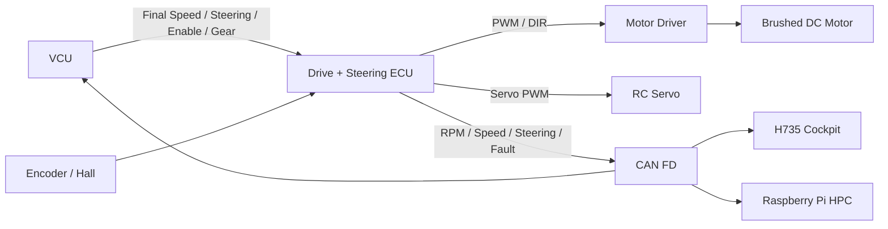
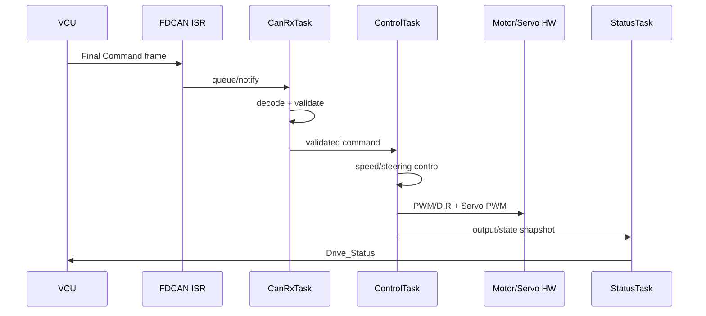
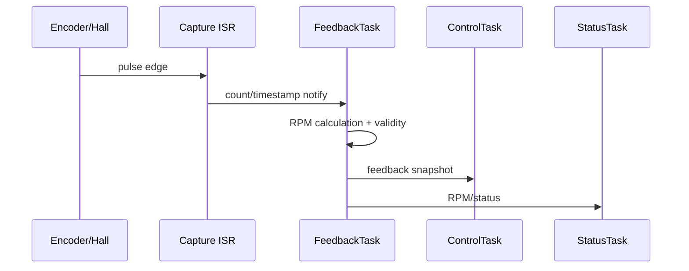
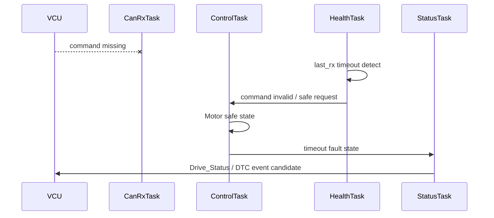
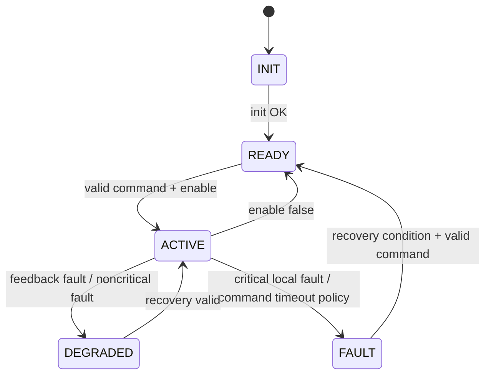

# Motor + Steering Control Software Architecture

> 2026-09-11: STM32G431KB 구매 모델 부분 동결. [최상위 명세](../../system/FINAL_IMPLEMENTATION_SPEC.md) DEC-HW-001~005를 따른다. 제조사/revision/핀 배정과 실기 시험은 별도이며, 아래 시험 결과/측정값을 PASS로 변경한 것은 아니다.

[프로젝트 홈](../../../README.md) · [문서 안내](../../README.md) · [폴더 목록](README.md)

> 문서 목적: Drive + Steering ECU를 **어떤 Software Component와 FreeRTOS Task로 구현하는지**, 왜 그렇게 나눴는지, 실제 실행 시 어떤 순서로 협력하는지 설명한다.  
> 기능 요구사항은 `SPECIFICATION.md`, 검증 결과는 `TEST_REPORT.md`를 기준으로 한다.

## Document Information

| Item | Value |
|---|---|
| Node / System | Motor + Steering Control ECU |
| Owner | C |
| Board / Platform | STM32G431KB (STM32 #2) + Motor Driver + Brushed DC Motor + RC Servo |
| Execution Model | FreeRTOS + CMSIS-RTOS2 기본 |
| Revision | v0.1 |
| Status | Draft |
| Related Specification | `SPECIFICATION.md` |
| Related Test | `TEST_REPORT.md` |

### Revision History

| Revision | Date | Author | Change |
|---|---|---|---|
| v0.1 | 2026-09-09 | Team | Initial filled RTOS architecture example |

---

# 1. Introduction & Goals

## 1.1 Purpose

> Drive + Steering ECU는 VCU의 최종 명령을 안전하게 수신하고 Motor/Servo 출력으로 변환하며, Encoder/Hall Feedback을 이용해 실제 구동 상태를 계산하고 CAN FD로 상태를 반환한다.

## 1.2 Scope

포함:
- FDCAN RX/TX
- Command validation / freshness
- Motor PWM / Direction / Enable
- Encoder/Hall feedback
- RPM calculation
- Steering command mapping
- Servo PWM
- Open-loop speed control
- 향후 Closed-loop PID 확장
- Fault / timeout / health
- FreeRTOS task scheduling

제외:
- Driver input acquisition
- VCU arbitration
- Camera/Ultrasonic perception
- HMI rendering
- LIN body control
- DTC history DB

## 1.3 Stakeholders

| Stakeholder | 관심사 / 필요한 정보 |
|---|---|
| C / Drive 담당 | Control logic, timer, encoder, servo, RTOS timing |
| F / VCU·CAN | Command/status contract, timeout, fail-safe |
| B / H735 | Speed/RPM/Steering status 표시 데이터 |
| E / HPC | Vehicle speed/status 소비 가능성 |
| 테스트 담당 | PWM, RPM, timeout, jitter, stack/queue health |

---

# 2. Quality Goals

| Priority | Quality Goal | Concrete Scenario / Measure |
|---:|---|---|
| 1 | Safety / Reliability | Command timeout 시 오래된 Motor command를 계속 유지하지 않는다. |
| 2 | Timing | ControlTask가 목표 주기와 jitter 범위를 충족한다. |
| 3 | Determinism | CAN burst나 logging 때문에 ControlTask 실행이 불안정해지지 않는다. |
| 4 | Maintainability | Driver / Feedback / Control / Communication을 분리한다. |
| 5 | Testability | CAN 없이 Dummy Command로 Motor/Servo control path를 시험할 수 있다. |

---

# 3. Constraints

| Constraint | Reason / Impact |
|---|---|
| STM32 + FreeRTOS 기본 | 프로젝트 공통 정책 |
| CAN FD Backbone 목표 | VCU 및 다른 Node와 통신 |
| Motor Driver는 TB6612FNG 후보 | 최종 Motor current spec 확인 전 확정 금지 |
| Steering은 RC Servo 기본안 | 실제 pulse/angle calibration 필요 |
| Encoder/Hall은 권장 Feedback | RPM/Closed-loop 기반 |
| VCU가 최종 Command Owner | Drive ECU가 ADAS/Driver input을 직접 arbitration하지 않음 |
| 정확한 CAN ID/Task period 일부 TBD | 통합/실측 후 확정 |

---

# 4. Context & Scope View



## External Interfaces

| External Entity | Direction | Data / Service | Interface | Owner |
|---|---|---|---|---|
| VCU | RX | Final command / enable / gear | CAN FD | F |
| VCU/H735/HPC | TX | RPM / speed / steering / health | CAN FD | C |
| Encoder/Hall | RX | pulse/timestamp | Timer/GPIO | C |
| Motor Driver | TX | PWM / DIR / Enable | Timer/GPIO | C |
| RC Servo | TX | calibrated PWM | Timer PWM | C |

---

# 5. Solution Strategy & Rationale

| Decision / Strategy | Why | Related Quality / Constraint |
|---|---|---|
| ControlTask를 주기 Task로 분리 | 일정한 제어 주기 확보 | Timing |
| CAN RX와 Control 분리 | CAN burst가 control loop를 직접 지연시키지 않게 함 | Determinism |
| Encoder ISR은 count/timestamp만 처리 | ISR latency 최소화 | Timing |
| FeedbackTask에서 RPM 계산 | 계산을 task context로 이동 | Maintainability |
| Command는 validation 후 ControlTask에 전달 | 오래되거나 잘못된 command 직접 출력 방지 | Safety |
| CAN TX를 StatusTask가 담당 | ControlTask blocking 방지 | Determinism |
| Open-loop부터 구현 후 Closed-loop 확장 | Feedback 신뢰도 검증 전 PID 과설계 방지 | Testability |

---

# 6. Building Block / Component View

## 6.1 Top-level Components

```text
                 FDCAN
                   ↓
              CanRxAdapter
                   ↓
             CommandDecoder
                   ↓
            CommandValidator
                   ↓
            CommandRepository
                   ↓
              ControlCore
             ┌─────┴─────┐
             ↓           ↓
       MotorController  SteeringController
             ↓           ↓
        MotorDriverIF   ServoDriverIF

Encoder/Hall
    ↓
CaptureAdapter
    ↓
FeedbackEstimator
    ↓
FeedbackRepository

Control / Feedback / Fault
          ↓
      StatusBuilder
          ↓
       CanTxService
```

## 6.2 Component Responsibility

| Component | Responsibility | Input | Output | Depends On |
|---|---|---|---|---|
| `CanRxAdapter` | FDCAN frame 수신 | RX FIFO | raw frame | HAL/FDCAN |
| `CommandDecoder` | CAN payload → logical command | raw frame | command struct | CAN Matrix |
| `CommandValidator` | range/enum/freshness 검증 | command | valid/invalid | timing/config |
| `CommandRepository` | 최신 valid command 보관 | validated command | snapshot | CanRxTask |
| `MotorController` | speed target → PWM/DIR | command + feedback | motor output | calibration/control policy |
| `SteeringController` | steering target → servo command | command | servo output | calibration |
| `CaptureAdapter` | encoder count/timestamp 관리 | ISR event | raw feedback | timer |
| `FeedbackEstimator` | count/time → RPM | raw capture | rpm/valid | encoder config |
| `FeedbackRepository` | latest feedback | estimator output | snapshot | FeedbackTask |
| `FaultManager` | timeout/invalid/RTOS health | health inputs | fault state | timers/RTOS |
| `StatusBuilder` | network status 구성 | command/output/feedback/fault | Drive_Status | repositories |
| `CanTxService` | periodic/event CAN TX | status | frame TX | FDCAN |

## 6.3 Suggested Module / Folder Mapping

```text
drive_steering/
├─ app/
│  ├─ command/
│  ├─ control/
│  ├─ feedback/
│  ├─ fault/
│  └─ status/
├─ drivers/
│  ├─ motor_driver/
│  ├─ servo/
│  └─ encoder/
├─ communication/
│  ├─ can_rx/
│  ├─ can_tx/
│  └─ signal_codec/
├─ rtos/
│  ├─ tasks/
│  ├─ queues/
│  └─ health/
└─ config/
   ├─ calibration.h
   └─ drive_config.h
```

---

# 7. Concurrency / RTOS View

## 7.1 Task Model

| Task | Responsibility | Trigger / Period | Relative Priority | Deadline / Target | Stack | Blocking Policy |
|---|---|---|---|---|---|---|
| `CanRxTask` | command decode/validation | CAN event | High | command update latency TBD | TBD | 긴 blocking 금지 |
| `ControlTask` | Motor + Steering control / output update | 5~10 ms 후보 | Highest application | 1 cycle 내 완료 | TBD | printf/slow I/O 금지 |
| `FeedbackTask` | Encoder/Hall → RPM 계산 | event / 5~10 ms 후보 | High | next control cycle 전 | TBD | 긴 blocking 금지 |
| `StatusTask` | Drive_Status / Heartbeat TX | 20~50 ms 후보 | Normal | status period | TBD | CAN TX service 사용 |
| `HealthTask` | command timeout / task / queue / stack health | 50~100 ms 후보 | Low/Normal | health period | TBD | 짧은 처리 |

`ControlTask`는 application task 중 가장 높은 우선순위 방향으로 두되 정확한 numeric priority는 실측 후 정한다.

## 7.2 Priority Rationale

```text
ControlTask
> CanRxTask / FeedbackTask
> StatusTask
> HealthTask / Debug Logging
```

단, 실제 interrupt priority와 FreeRTOS API 사용 규칙은 STM32/FreeRTOS 설정에 맞춰 별도로 확인한다.

## 7.3 ISR Map

| Interrupt | Peripheral / Source | ISR Responsibility | Wake-up Target | Mechanism |
|---|---|---|---|---|
| FDCAN RX | CAN frame arrival | 최소 frame metadata/copy | `CanRxTask` | Queue/Notification |
| Encoder Capture | Timer/Input Capture | edge count/timestamp | `FeedbackTask` | Notification / capture buffer |
| Timer Update, 필요 시 | periodic timing | timestamp/event only | relevant task | Notification |

ISR에서 하지 않는 것:
- PID 계산
- RPM 계산 전체
- `printf`
- blocking CAN 송신
- Servo mapping 전체

## 7.4 RTOS Objects / IPC

| Object | Type | Producer | Consumer | Data / Event | Size / Depth | Overflow / Timeout Policy |
|---|---|---|---|---|---|---|
| `CanRxQueue` | Queue | FDCAN ISR | CanRxTask | raw CAN frame | TBD | overflow counter + health fault |
| `CommandQueue` | Queue/latest object | CanRxTask | ControlTask | validated final command | TBD | newest command 우선 정책 검토 |
| `EncoderNotify` | Task Notification | Encoder ISR | FeedbackTask | edge/capture ready | counter/index | missed event detect candidate |
| `FeedbackQueue` | Queue/latest object | FeedbackTask | ControlTask | rpm/valid | TBD | stale flag |
| `StatusQueue` | Queue/latest object | ControlTask/FeedbackTask | StatusTask | drive status | TBD | latest-state policy |
| `HealthFlags` | Event Flags/counters | tasks | HealthTask | alive/overrun/overflow | N/A | missing health → unhealthy |

Command는 오래된 값을 여러 개 순서대로 처리하기보다 **최신 command가 중요한 데이터**이므로 queue depth/overwrite 정책을 실제 CAN 주기와 함께 결정한다.

## 7.5 Shared Resource Ownership

| Resource | Owner Task | Other User | Protection | Reason |
|---|---|---|---|---|
| Motor PWM Timer | `ControlTask` | init only | single owner | output race 방지 |
| Servo PWM Timer | `ControlTask` | init only | single owner | steering output 일관성 |
| Encoder raw capture | `FeedbackTask` + ISR adapter | ControlTask는 snapshot만 읽음 | notification/buffer | ISR/task 분리 |
| CAN TX | `StatusTask`/CanTxService | Fault event producer | TX queue | ControlTask blocking 방지 |
| Command state | CanRxTask writes, ControlTask consumes | HealthTask metadata read | queue/snapshot | direct global write 최소화 |

## 7.6 Scheduling / Delay Policy

- `ControlTask`: `osDelayUntil()` 또는 `vTaskDelayUntil()` 계열 periodic scheduling 권장
- `FeedbackTask`: event-driven 또는 짧은 periodic 방식 중 encoder hardware에 맞춰 선택
- `CanRxTask`: event-driven
- `StatusTask`: periodic
- `HealthTask`: periodic
- 일반 Task에서 긴 `HAL_Delay()`/busy wait 사용 금지 방향
- ControlTask 실행시간이 period를 초과하면 overrun counter를 증가시키고 원인을 기록한다.

---

# 8. Runtime View

## 8.1 Normal Drive Command



## 8.2 Encoder Feedback



## 8.3 Command Timeout



---

# 9. Deployment / Hardware View

```text
                CAN FD Backbone
                       │
               CAN FD Transceiver
                       │
                     FDCAN
                       │
                STM32 + FreeRTOS
        ┌──────────────┼──────────────┐
        │              │              │
     PWM/DIR       Timer Capture    Servo PWM
        │              │              │
 Motor Driver     Encoder/Hall      RC Servo
        │
 Brushed DC Motor
```

| HW / Runtime Node | Software / RTOS | Interface | Electrical Note |
|---|---|---|---|
| STM32 #2 | FreeRTOS control SW | FDCAN/Timer/GPIO | STM32G431KB; 실제 보드 revision/핀맵 확인 필요 |
| Motor Driver | MotorDriverIF | PWM/DIR/Enable | TB6612FNG 후보, current fit 확인 |
| Brushed DC Motor | actuator | driver output | voltage/current TBD |
| Encoder/Hall | feedback | timer/input capture | logic level/PPR TBD |
| RC Servo | steering actuator | PWM | spec/calibration TBD |
| CAN FD Transceiver | physical bus | FDCAN↔CANH/L | part TBD |

## Pin / Peripheral Map

| Function | Device | MCU/Board Pin | Peripheral | Direction | Voltage / Note |
|---|---|---|---|---|---|
| Motor PWM | Motor Driver | TBD | TIMx PWM | OUT | verify driver logic |
| Motor DIR A/B | Motor Driver | TBD | GPIO | OUT | TBD |
| Driver Enable/STBY | Motor Driver | TBD | GPIO | OUT | safe init state |
| Encoder A/Hall | Sensor | TBD | TIM/Input Capture | IN | logic level 확인 |
| Encoder B, 해당 시 | Sensor | TBD | TIM/GPIO | IN | quadrature 여부 TBD |
| Servo PWM | RC Servo | TBD | TIM PWM | OUT | servo spec 기준 |
| CAN TX/RX | Transceiver | TBD | FDCAN | I/O | schematic 확인 |

---

# 10. Interfaces & Contracts

## 10.1 CAN / CAN FD

### RX

| Message / Signal | Meaning | Sender | Timeout | Timeout Action |
|---|---|---|---|---|
| `Final_Speed_Request` | 최종 속도/구동 요청 | VCU | TBD | motor safe state |
| `Final_Steering_Request` | 최종 조향 요청 | VCU | TBD | safe/hold/center policy TBD |
| `Drive_Enable` | actuator enable | VCU | TBD | disable output |
| `Vehicle_Gear` | direction/mode context | VCU | TBD | drive inhibit/safe policy |

### TX

| Message / Signal | Meaning | Unit | Cycle/Event | Receiver | Valid Condition |
|---|---|---|---|---|---|
| `Motor_RPM` | motor feedback | rpm | periodic TBD | VCU/H735/HPC | feedback valid |
| `Vehicle_Speed` | converted vehicle speed 후보 | TBD | periodic TBD | VCU/H735/HPC | conversion valid |
| `Steering_Status` | target/actual/valid | TBD | periodic TBD | VCU/H735/HPC | state valid |
| `Drive_Status` | output state / health | flags/enum | periodic TBD | VCU/H735/HPC | ECU running |
| `DTC_Event` | local fault event | code/status | event | Pi/H735/VCU | fault confirmed |
| `ECU_Heartbeat` | node health | enum/flags | periodic TBD | VCU/HPC | scheduler healthy |

## 10.2 LIN

N/A.

---

# 11. Data & State Model

## 11.1 Main Data

| Data | Type | Owner | Meaning | Unit | Valid Range | Invalid Condition |
|---|---|---|---|---|---|---|
| `final_speed_request` | int/float TBD | VCU | final drive target | TBD | CAN contract | timeout/range invalid |
| `final_steering_request` | int/float TBD | VCU | final steering target | TBD | calibrated range | timeout/range invalid |
| `drive_enable` | bool | VCU | actuator enable | bool | true/false | message invalid |
| `motor_rpm` | int/float | Drive ECU | measured RPM | rpm | encoder config | stale/implausible |
| `motor_pwm` | int | Drive ECU | applied duty | %/ticks | config range | control invalid |
| `steering_command` | int/float | Drive ECU | servo target | TBD | calibrated limit | request invalid |
| `drive_fault_flags` | bitfield | Drive ECU | local fault state | flags | defined | N/A |

## 11.2 ECU State Machine



| State | Entry Condition | Main Action | Exit Condition |
|---|---|---|---|
| INIT | power on/reset | outputs safe, driver/RTOS init | init complete |
| READY | scheduler/CAN ready | motor disabled/safe, wait valid command | enable + valid command |
| ACTIVE | valid command | periodic control | disable/fault/timeout |
| DEGRADED | feedback unavailable 등 | limited/open-loop/safe policy TBD | recovery/critical fault |
| FAULT | critical condition | safe output, fault report | recovery policy |

---

# 12. Cross-cutting Concepts

## 12.1 Error Handling

- Invalid CAN command는 actuator에 직접 반영하지 않는다.
- Timeout은 command freshness로 관리한다.
- Encoder invalid는 `valid=false`로 분리한다.
- output safe state는 local control path에서 빠르게 적용 가능해야 한다.

## 12.2 Diagnostics / DTC

Local fault 후보:
- VCU command timeout
- encoder timeout / implausibility
- CAN communication fault
- ControlTask overrun
- queue overflow
- steering feedback fault, 확장 시

DTC history 저장은 Pi DTC Manager가 담당하고, 이 ECU는 **fault detection + event/status 제공**을 담당한다.

## 12.3 Timing

| Task / Function | Period / Trigger | Deadline | Jitter Target | Overrun Action |
|---|---|---|---|---|
| ControlTask | 5~10 ms 후보 | same cycle | TBD | health counter |
| FeedbackTask | event / 5~10 ms 후보 | before next useful control update | TBD | stale feedback |
| CanRxTask | event | TBD | N/A | queue/latency measure |
| StatusTask | 20~50 ms 후보 | period | TBD | health/log |
| HealthTask | 50~100 ms 후보 | period | TBD | watchdog/fault policy |

## 12.4 Communication

- CAN RX는 ISR → Queue/Notification → CanRxTask.
- CAN TX는 StatusTask/CanTxService single-owner 방향.
- Heartbeat 주기와 timeout은 공통 CAN Matrix에서 결정.
- Bus-off/error state는 Health/Fault에 반영.

## 12.5 Calibration / Configuration

후보 config:
- motor PWM min/max
- motor direction mapping
- encoder PPR/CPR
- wheel/gear ratio, vehicle speed 계산 시
- servo center/left/right
- steering command scale
- command timeout
- PID gains, Closed-loop 사용 시

Runtime 변경이 필요한 값과 compile-time config를 구분한다.

## 12.6 Memory / Stack / Heap

| Item | Policy / Target | Measurement |
|---|---|---|
| ControlTask stack | TBD | high-water mark |
| FeedbackTask stack | TBD | high-water mark |
| CAN queues | TBD depth | max occupancy |
| heap after startup | 최소화 | runtime free heap |
| dynamic allocation in ControlTask | 사용하지 않는 방향 | code review |
| stack overflow hook | enable 권장 | fault test |

## 12.7 Watchdog / Health Monitoring

```text
ControlTask alive ─┐
CanRxTask alive ───┤
FeedbackTask alive ┤
Queue health ──────┤
Command freshness ─┤
                   ↓
                HealthTask
                   ↓
              all healthy?
              ├ Yes → IWDG refresh 후보
              └ No  → fault / refresh 중단 정책
```

## 12.8 Priority Inversion / Starvation

- ControlTask가 UART/CAN debug mutex를 기다리지 않게 설계한다.
- shared peripheral은 single-owner 방향을 우선한다.
- logging은 낮은 priority 또는 별도 queue 기반으로 분리한다.
- CanRxTask가 burst load로 CPU를 독점하지 않게 frame processing budget을 확인한다.

---

# 13. Architecture Decisions

| ADR ID | Decision | Alternatives | Reason | Consequence |
|---|---|---|---|---|
| ADR-DRV-001 | FreeRTOS task 구조 사용 | one super-loop | control/comm/health 주기 분리 | stack/queue 관리 필요 |
| ADR-DRV-002 | ControlTask가 Motor+Steering output logical owner | motor/steering 별도 direct writers | 출력 상태 동기화와 race 방지 | control task 책임 증가 |
| ADR-DRV-003 | Encoder ISR은 최소 처리 | ISR에서 RPM 계산 | interrupt latency 감소 | FeedbackTask 필요 |
| ADR-DRV-004 | CAN TX를 ControlTask에서 직접 blocking 수행하지 않음 | direct transmit | control timing 보호 | Status/Tx service 필요 |
| ADR-DRV-005 | Open-loop 먼저, Closed-loop는 encoder 검증 후 | PID부터 구현 | 디버깅 단순화/feedback 신뢰성 우선 | 기능 확장 단계 필요 |
| ADR-DRV-006 | TB6612FNG는 후보로 유지 | 즉시 확정 | Motor Stall Current 미확정 | 부품 확정 전 spec 비교 필요 |

---

# 14. Quality Scenarios & Verification

| Quality Goal | Scenario | Measure / Target | Verification |
|---|---|---|---|
| Reliability | VCU command 끊김 | stale command 유지하지 않음 | timeout fault injection |
| Timing | CAN burst + control | ControlTask period/jitter 목표 유지 | trace/runtime stats |
| Feedback | encoder pulse 입력 | RPM 계산 재현성 | signal generator/manual rotation test |
| Steering | min/center/max command | calibrated mechanical range 내 | bench test |
| RTOS health | long soak | stack/queue overflow 0 | runtime stats |

---

# 15. Risks & Technical Debt

| ID | Risk / Debt | Impact | Mitigation / Next Action | Owner |
|---|---|---|---|---|
| RISK-DRV-001 | Motor current spec 미확정 | Driver 손상/성능 부족 | motor voltage/rated/stall current 확인 | C |
| RISK-DRV-002 | TB6612FNG 적합성 미확정 | driver 재선정 가능 | datasheet/spec comparison | C |
| RISK-DRV-003 | Encoder PPR/기구비 미확정 | RPM/speed 오차 | hardware 확정 후 calibration | C |
| RISK-DRV-004 | Servo mechanical limit 미확정 | 과도한 steering command | center/min/max calibration | C |
| RISK-DRV-005 | Task period/priority 미조정 | jitter/overrun | timing profiling | C |
| RISK-DRV-006 | Queue depth 미검증 | CAN burst loss | occupancy/overflow test | C/F |
| RISK-DRV-007 | Closed-loop PID 미조정 | overshoot/불안정 | feedback 검증 후 단계적 tuning | C |

---

# 16. Requirement Traceability

| Requirement ID | Component | Task / Runtime | Interface | Test ID |
|---|---|---|---|---|
| REQ-DRV-001 | CanRxAdapter/CommandDecoder | CanRxTask | CAN RX | T-DRV-001 |
| REQ-DRV-004 | MotorController | ControlTask | PWM/DIR | T-DRV-004 |
| REQ-DRV-005 | SteeringController | ControlTask | Servo PWM | T-DRV-005 |
| REQ-DRV-006 | FeedbackEstimator | FeedbackTask + Encoder ISR | Timer capture | T-DRV-006 |
| REQ-DRV-007 | FaultManager | HealthTask + ControlTask | command timestamp | T-DRV-007 |
| REQ-DRV-008 | StatusBuilder/CanTxService | StatusTask | CAN TX | T-DRV-008 |
| REQ-DRV-011 | CaptureAdapter | ISR + FeedbackTask | timer notification | T-DRV-011 |
| REQ-DRV-013 | RTOS scheduling | ControlTask | runtime | T-DRV-013 |
| REQ-DRV-014 | HealthManager | HealthTask | RTOS health | T-DRV-014 |
| REQ-DRV-016 | HW compatibility review | N/A | motor driver | T-DRV-016 |

---

# 17. Glossary

| Term | Meaning |
|---|---|
| Drive ECU | Motor + Steering Control ECU |
| VCU | Vehicle Control Unit |
| PWM | Pulse Width Modulation |
| RPM | Revolutions Per Minute |
| PPR/CPR | Encoder pulses/counts per revolution |
| PID | Proportional Integral Derivative control |
| RTOS | Real-Time Operating System |
| ISR | Interrupt Service Routine |
| IWDG | Independent Watchdog |

---

# 18. Architecture Review Checklist

- [ ] VCU와 Drive ECU 역할 경계가 명확하다.
- [ ] Motor/Servo/Encoder의 실제 Owner가 명확하다.
- [ ] ControlTask 주기와 상대 우선순위 방향이 있다.
- [ ] Encoder/FDCAN ISR과 Task 책임이 분리되어 있다.
- [ ] CAN burst가 ControlTask를 block하지 않는 구조다.
- [ ] Command Timeout 처리 경로가 있다.
- [ ] Motor safe startup 상태가 정의되어 있다.
- [ ] Steering calibration/TBD가 명시되어 있다.
- [ ] Stack/Queue/Watchdog 정책이 있다.
- [ ] TB6612FNG를 최종 확정 부품처럼 쓰지 않는다.
- [ ] Requirement → Component/Task → Test 추적이 가능하다.
