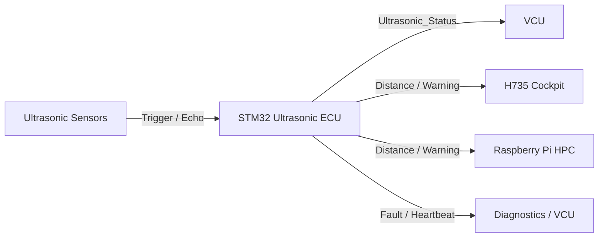
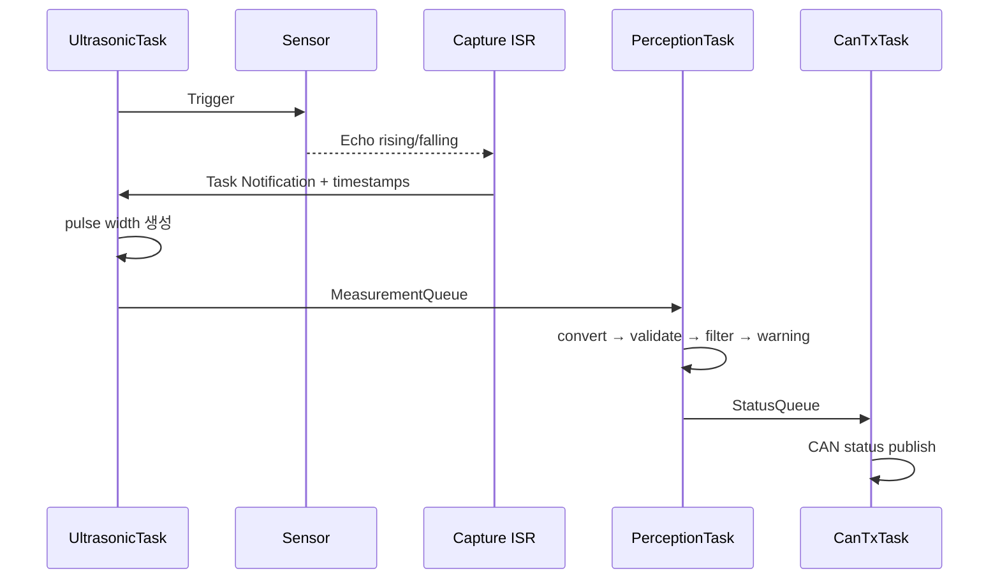
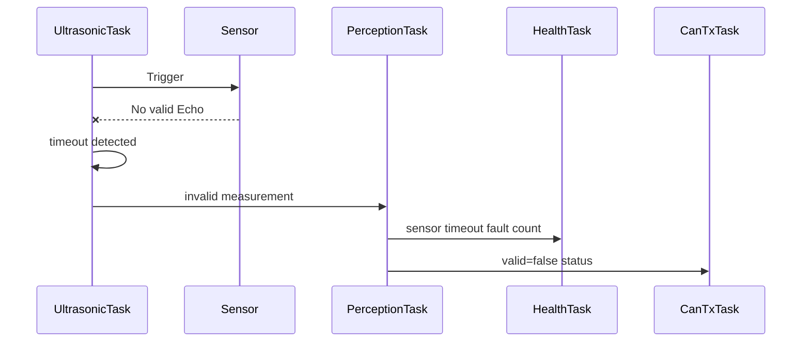
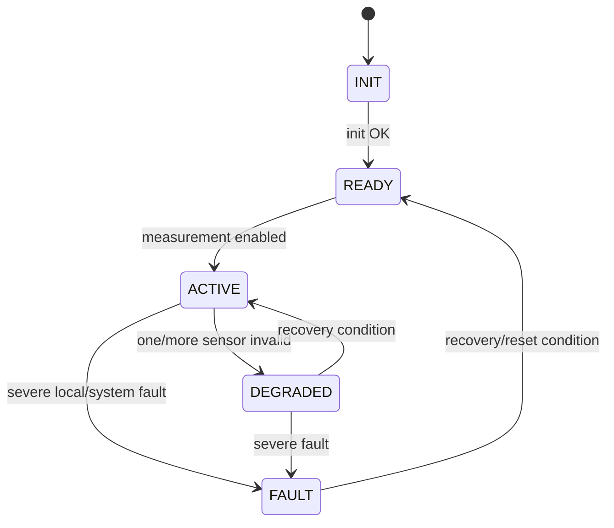

# Ultrasonic Perception ECU Software Architecture

> 2026-09-11: STM32G431KB 구매 모델 부분 동결. [최상위 명세](../../system/FINAL_IMPLEMENTATION_SPEC.md) DEC-HW-001~005를 따른다. 제조사/revision/핀 배정과 실기 시험은 별도이며, 아래 시험 결과/측정값을 PASS로 변경한 것은 아니다.

[프로젝트 홈](../../../README.md) · [문서 안내](../../README.md) · [폴더 목록](README.md)

> 문서 목적: Ultrasonic Perception ECU를 **어떤 Component와 FreeRTOS Task로 나눠 구현하는지** 설명한다.  
> 기능 요구사항은 `SPECIFICATION.md`, 검증 결과는 `TEST_REPORT.md`를 기준으로 한다.

## Document Information

| Item | Value |
|---|---|
| Node / System | Ultrasonic Perception ECU |
| Owner | A |
| Board / Platform | STM32G431KB (STM32 #1) + Ultrasonic Sensor Array |
| Execution Model | FreeRTOS + CMSIS-RTOS2 기본 |
| Revision | v0.1 |
| Status | Draft |
| Related Specification | `SPECIFICATION.md` |
| Related Test | `TEST_REPORT.md` |

### Revision History

| Revision | Date | Author | Change |
|---|---|---|---|
| v0.1 | 2026-09-09 | Team | Initial filled example |

---

# 1. Introduction & Goals

## 1.1 Purpose

> Ultrasonic Perception ECU는 여러 Ultrasonic Sensor의 Echo 시간을 안정적으로 수집하고 거리/유효성/Warning을 계산해 CAN FD로 차량의 다른 Node에 제공한다.

## 1.2 Scope

포함:
- Trigger/Echo Driver
- Timer Input Capture ISR
- Sensor scan scheduler
- distance conversion
- validity / timeout
- filtering
- warning state
- CAN status/fault/heartbeat 송신
- FreeRTOS Task / Queue / Notification
- health monitoring / watchdog-ready 구조

제외:
- Motor/Servo 직접 제어
- Parking 최종 stop 판단
- Camera vision
- H735 UI
- DTC history DB

## 1.3 Stakeholders

| Stakeholder | 관심사 / 필요한 정보 |
|---|---|
| A / Ultrasonic 담당 | 센서 측정, 필터, RTOS task, pin/timer 구조 |
| F / VCU·CAN 통합 | distance/warning/validity, CAN cycle, timeout |
| B / H735 | Parking 화면에서 사용할 distance/warning 의미 |
| E / HPC | Rear Vision과 함께 참고할 ultrasonic status |
| 테스트 담당 | 거리 정확도, timeout, crosstalk, RTOS timing |

---

# 2. Quality Goals

| Priority | Quality Goal | Concrete Scenario / Measure |
|---:|---|---|
| 1 | Reliability | Echo timeout이나 Sensor disconnect가 발생해도 오래된 값을 정상값처럼 송신하지 않는다. |
| 2 | Timing | Sensor scan과 perception update가 정의된 주기 안에서 반복된다. |
| 3 | Determinism | ISR은 최소 처리하고 주기/이벤트 처리를 Task에서 수행한다. |
| 4 | Maintainability | Driver / Measurement / Perception / CAN / Health를 분리한다. |
| 5 | Testability | Sensor 1개와 dummy measurement만으로도 perception logic을 독립 시험할 수 있다. |

---

# 3. Constraints

| Constraint | Reason / Impact |
|---|---|
| STM32 Node는 FreeRTOS 기본 | 프로젝트 RTOS 정책 |
| CMSIS-RTOS2 API 권장 | STM32CubeMX 통합 |
| Ultrasonic Sensor model TBD | Timing/range/electrical 조건 추후 확정 |
| Sensor 개수/위치 TBD | scan period와 timer/pin 구조에 영향 |
| Echo logic voltage TBD | level shifting 여부 확인 필요 |
| CAN FD Backbone 목표 | VCU/H735/HPC와 status 교환 |
| Motor 직접 제어 금지 | VCU/Drive 역할 분리 |

---

# 4. Context & Scope View



## External Interfaces

| External Entity | Direction | Data / Service | Interface | Owner |
|---|---|---|---|---|
| Ultrasonic Sensor Array | RX/TX | Trigger / Echo | GPIO + Timer Input Capture | A |
| VCU | TX | distance, warning, valid, fault | CAN FD | F consumer |
| H735 | TX | parking display data | CAN FD | B consumer |
| Raspberry Pi HPC | TX | perception status | CAN FD | E consumer |
| Diagnostics | TX | local fault candidate / health | CAN FD | F/Pi consumer |

---

# 5. Solution Strategy & Rationale

| Decision / Strategy | Why | Related Quality / Constraint |
|---|---|---|
| Echo edge는 Timer Input Capture ISR에서 timestamp만 수집 | ISR latency와 blocking 최소화 | Timing/Reliability |
| 거리 계산은 Task에서 수행 | ISR에서 긴 계산 금지 | Determinism |
| Sensor는 순차 scan | 여러 ultrasonic 간 crosstalk 완화 | Reliability |
| Measurement와 Perception을 분리 | raw 측정과 filter/warning 정책 분리 | Maintainability |
| CAN TX는 single-owner Task 사용 | 여러 Task의 CAN 접근 경쟁 감소 | Reliability |
| threshold/config를 logic과 분리 | 차량 크기/센서 특성 변경 대응 | Maintainability |
| invalid 상태를 명시적으로 전송 | stale data 오해 방지 | Safety/Reliability |

---

# 6. Building Block / Component View

## 6.1 Top-level Components

```text
Ultrasonic Sensors
       ↓
Trigger / Echo Driver
       ↓
Timer Capture ISR
       ↓ notification
Measurement Manager
       ↓ raw measurement
Distance Converter
       ↓
Validity / Filter
       ↓
Warning Evaluator
       ↓
Perception Repository
       ├→ CAN Publisher
       └→ Fault / Health Manager
```

## 6.2 Component Responsibility

| Component | Responsibility | Input | Output | Depends On |
|---|---|---|---|---|
| `UltrasonicDriver` | Trigger pulse / sensor select | measurement request | trigger | HAL GPIO/Timer |
| `CaptureIsrAdapter` | rising/falling capture timestamp | timer interrupt | capture event | HAL TIM |
| `MeasurementManager` | scan / timeout / pulse width | capture event | raw measurement | Driver/RTOS |
| `DistanceConverter` | pulse width → distance | pulse width | distance raw | sensor calibration |
| `ValidityChecker` | range/plausibility | distance raw | valid/invalid | config |
| `DistanceFilter` | noise/spike 완화 | valid distance | filtered distance | config |
| `WarningEvaluator` | threshold 기반 상태 | filtered distance | SAFE/WARNING/CRITICAL | config |
| `PerceptionRepository` | 최신 sensor/zone state 보관 | processed result | status snapshot | app layer |
| `CanPublisher` | status/fault/heartbeat 송신 | snapshot | CAN frame | CAN Matrix |
| `HealthManager` | task/queue/sensor health | counters/events | health/fault | RTOS |

## 6.3 Module / Folder Mapping

제안 구조다.

```text
ultrasonic/
├─ app/
│  ├─ measurement/
│  ├─ perception/
│  ├─ filtering/
│  ├─ warning/
│  └─ health/
├─ drivers/
│  ├─ ultrasonic_gpio/
│  └─ capture_timer/
├─ communication/
│  └─ can/
├─ config/
│  └─ ultrasonic_config.h
└─ tests/
   └─ dummy_measurement/
```

---

# 7. Concurrency / RTOS View

## 7.1 Task Model

| Task | Responsibility | Trigger / Period | Relative Priority | Deadline / Target | Stack | Blocking Policy |
|---|---|---|---|---|---|---|
| `UltrasonicTask` | sensor scan, trigger, echo completion/timeout | periodic + notification | High | scan timing 충족 | TBD | 긴 blocking 금지 |
| `PerceptionTask` | conversion, validity, filter, warning | MeasurementQueue | High/Normal | 다음 publish 전 | TBD | bounded queue wait |
| `CanTxTask` | status/fault/heartbeat CAN 송신 | StatusQueue + periodic | Normal | CAN cycle 충족 | TBD | bounded queue wait |
| `HealthTask` | task alive, sensor timeout, queue/stack health | periodic | Low/Normal | health period TBD | TBD | log는 non-critical |

정확한 priority number와 stack size는 profiling 후 확정한다.

## 7.2 Priority Rationale

```text
Echo timing / measurement completion
> Perception update
> CAN periodic status
> Health / Diagnostics / Logging
```

`UltrasonicTask`는 Echo completion과 timeout을 놓치면 측정 자체가 무효가 되므로 높은 우선순위를 갖는다. `HealthTask`는 중요하지만 microsecond-level 응답이 필요한 작업은 아니다.

## 7.3 ISR Map

| Interrupt | Peripheral / Source | ISR Responsibility | Wake-up Target | Mechanism |
|---|---|---|---|---|
| Echo Input Capture | TIM channel | edge timestamp/capture phase 저장 | `UltrasonicTask` | Task Notification |
| Measurement timeout candidate | timer/timebase | timeout event flag | `UltrasonicTask` | Notification/Event |
| FDCAN TX/RX callback | FDCAN | queue completion/config frame enqueue | `CanTxTask` 또는 optional Rx handler | Queue/Notification |

ISR에서 하지 않는다:
- distance 계산
- filtering
- warning 판단
- printf/logging
- CAN application payload 생성
- blocking API

## 7.4 RTOS Objects / IPC

| Object | Type | Producer | Consumer | Data / Event | Size / Depth | Overflow / Timeout Policy |
|---|---|---|---|---|---|---|
| `EchoNotify` | Task Notification | Capture ISR | `UltrasonicTask` | capture complete/timeout | 1 task | missed event counter |
| `MeasurementQueue` | Queue | `UltrasonicTask` | `PerceptionTask` | sensor id, pulse, timestamp | TBD | overflow flag + drop policy |
| `StatusQueue` | Queue | `PerceptionTask` | `CanTxTask` | status snapshot/event | TBD | 최신 상태 우선 검토 |
| `HealthFlags` | Event Flags | critical tasks | `HealthTask` | alive/overrun | bitset | missing bit = unhealthy |

## 7.5 Shared Resource Ownership

| Resource | Owner Task | Other User | Protection | Reason |
|---|---|---|---|---|
| Trigger GPIO/Timer | `UltrasonicTask` | ISR capture only | single owner + ISR | sensor timing 일관성 |
| PerceptionRepository write | `PerceptionTask` | `CanTxTask` read | snapshot/double buffer 또는 짧은 critical section | consistency |
| CAN TX | `CanTxTask` | others request via queue | single owner | bus API 경쟁 방지 |
| Debug UART | low priority logger 후보 | all via log queue | queue/single owner | control task blocking 방지 |

## 7.6 Scheduling / Delay Policy

- periodic scan은 `osDelayUntil()` / `vTaskDelayUntil()` 계열을 사용한다.
- Echo completion은 event-driven notification으로 처리한다.
- 일반 Task에서 긴 `HAL_Delay()`와 busy wait를 사용하지 않는다.
- Sensor간 silence/gap은 sensor datasheet와 crosstalk 시험을 기준으로 설정한다.
- Task overrun은 expected wake-up과 actual timestamp 차이로 검출한다.

---

# 8. Runtime View

## 8.1 정상 Sensor 측정



## 8.2 Echo Timeout



## 8.3 Multi-Sensor Scan

```text
Sensor 0 Trigger → Echo complete/timeout
        ↓ configured gap
Sensor 1 Trigger → Echo complete/timeout
        ↓ configured gap
Sensor 2 ...
        ↓
Scan complete
```

동시에 모든 Sensor를 trigger하지 않는 것을 기본안으로 한다.

---

# 9. Deployment / Hardware View

```text
Ultrasonic Sensor Array
  ├ Trigger GPIO
  └ Echo → Input Capture
          ↓
       STM32 #1
       FreeRTOS
          │
        FDCAN
          │
 CAN FD Transceiver
          │
     CANH / CANL
```

| HW / Runtime Node | Software / RTOS | Interface | Electrical Note |
|---|---|---|---|
| STM32 #1 | FreeRTOS + Ultrasonic SW | GPIO/TIM/FDCAN | STM32G431KB; 실제 보드 revision/핀맵 확인 필요 |
| Ultrasonic Sensor | external sensor | Trigger/Echo | supply/logic level datasheet 확인 |
| CAN FD Transceiver | CAN physical layer | FDCAN ↔ CANH/L | actual part TBD |

## Pin / Peripheral Map

| Function | Device | MCU/Board Pin | Peripheral | Direction | Voltage / Note |
|---|---|---|---|---|---|
| Sensor 0 Trigger | Ultrasonic | TBD | GPIO | OUT | datasheet 확인 |
| Sensor 0 Echo | Ultrasonic | TBD | TIM Input Capture | IN | logic level 확인 |
| Sensor N | Ultrasonic | TBD | GPIO/TIM | IN/OUT | sensor count 확정 후 |
| CAN TX/RX | CAN FD Transceiver | TBD | FDCAN | OUT/IN | transceiver 필요 |

---

# 10. Interfaces & Contracts

## 10.1 CAN / CAN FD

### TX

| Message / Signal | Meaning | Unit | Cycle/Event | Receiver | Valid Condition |
|---|---|---|---|---|---|
| `Ultrasonic_Status` | sensor/zone distance + valid + warning | mm/flags | Periodic TBD | VCU/H735/HPC | ECU running |
| `Ultrasonic_Fault` 후보 | local fault | code/flags | Event/Periodic TBD | Diagnostics/VCU | fault active/history policy |
| `ECU_Heartbeat` | node alive/health | flags | Periodic TBD | VCU/HPC | scheduler/health OK |

### RX

| Message / Signal | Meaning | Sender | Timeout | Timeout Action |
|---|---|---|---|---|
| `Vehicle_Mode` / enable 후보 | sensor enable/mode | VCU | TBD | default/local policy |

## 10.2 LIN

N/A.

## 10.3 Internal RTOS Contract

| Interface | Producer | Consumer | Data Format | Failure Handling |
|---|---|---|---|---|
| `EchoNotify` | ISR | UltrasonicTask | capture event | timeout/missed count |
| `MeasurementQueue` | UltrasonicTask | PerceptionTask | `RawMeasurement` | overflow health flag |
| `StatusQueue` | PerceptionTask | CanTxTask | `UltrasonicStatus` | latest-state policy TBD |

---

# 11. Data & State Model

## 11.1 Main Data

| Data | Type | Owner | Meaning | Unit | Valid Range | Invalid Condition |
|---|---|---|---|---|---|---|
| `pulse_width` | uint32 | Measurement | Echo round-trip time | timer/us | sensor spec | timeout/capture error |
| `distance_raw_mm` | int/float | DistanceConverter | 변환 거리 | mm | sensor range TBD | out-of-range |
| `distance_filtered_mm` | int/float | DistanceFilter | 필터 후 거리 | mm | sensor range TBD | input invalid |
| `valid` | bool | ValidityChecker | measurement validity | bool | true/false | N/A |
| `warning_level` | enum | WarningEvaluator | SAFE/WARNING/CRITICAL/INVALID | enum | defined | config invalid |
| `sensor_timestamp` | tick/time | Measurement | last update | time | monotonic | stale timeout |
| `fault_flags` | bitmask | HealthManager | local faults | bits | defined | malformed internal state |

## 11.2 State Machine



| State | Entry Condition | Main Action | Exit Condition |
|---|---|---|---|
| INIT | power on | peripheral/RTOS init | init OK |
| READY | initialized | wait/start schedule | measurement enabled |
| ACTIVE | normal sensing | measure/process/publish | sensor fault/severe fault |
| DEGRADED | 일부 sensor invalid | valid sensor 계속 제공 + invalid 표시 | recovery/severe fault |
| FAULT | severe task/system fault | fault status, watchdog policy | reset/recovery |

---

# 12. Cross-cutting Concepts

## 12.1 Error Handling

- timeout된 sensor data를 정상 최신값처럼 유지하지 않는다.
- invalid measurement는 filtering/warning에 정상값으로 사용하지 않는다.
- 일부 Sensor fault가 전체 ECU hang으로 이어지지 않게 한다.
- severe internal fault는 HealthManager와 watchdog 정책에 반영한다.

## 12.2 Diagnostics / DTC

- local sensor timeout / range invalid / multiple unavailable / CAN fault / RTOS health를 검출한다.
- DTC code 숫자와 lifecycle은 F 담당의 진단 규격에 따른다.
- Pi DTC Manager가 history를 보관하고 H735가 표시한다.

## 12.3 Timing

| Task / Function | Period / Trigger | Deadline | Jitter Target | Overrun Action |
|---|---|---|---|---|
| Sensor scan | periodic | TBD | TBD | health flag |
| Echo completion | interrupt event | sensor timeout 전 | interrupt latency 관찰 | invalid measurement |
| Perception | MeasurementQueue | next publish 전 | TBD | status delay/health |
| CAN publish | periodic/event | CAN cycle TBD | TBD | queue/fault |
| Health | periodic | TBD | loose | diagnostic flag |

## 12.4 Communication

- CAN ID/cycle/timeout은 CAN Matrix에서 확정한다.
- Sensor result와 CAN payload 구조를 직접 강하게 결합하지 않고 codec layer를 둔다.
- CAN bus-off 시 local measurement는 계속 가능하되 communication fault를 관리한다.

## 12.5 Calibration / Configuration

구성값 후보:
- active sensor count
- sensor zone mapping
- pulse-to-distance coefficient
- min/max valid range
- filter parameter
- warning thresholds
- recovery count
- inter-sensor gap

실제 값은 Datasheet + Stage 1 시험 결과로 확정한다.

## 12.6 Memory / Stack / Heap

| Item | Policy / Target | Measurement |
|---|---|---|
| Static task allocation | Consider/Prefer | code review |
| Heap use after startup | 최소화 | runtime stats |
| Stack overflow hook | enable 검토 | config/code review |
| Stack high-water | 실제 측정 후 margin 결정 | runtime API/debugger |
| Queue memory | sensor count/worst rate 기반 | max occupancy |

## 12.7 Watchdog / Health Monitoring

```text
UltrasonicTask alive ─┐
PerceptionTask alive ─┤
CanTxTask health ─────┤
Queue/Sensor health ──┤
                      ↓
                  HealthTask
                      ↓
                 all required OK?
                 ├ Yes → IWDG refresh
                 └ No  → fault / no-refresh policy
```

| Health Item | Detection | Response |
|---|---|---|
| Task alive | period heartbeat | health fault |
| Sensor timeout ratio | counters | degraded/fault |
| Queue overflow | API error | flag + log |
| Task overrun | timestamp | flag + investigate |
| Stack low watermark | runtime check | warning/fix stack |

## 12.8 Priority Inversion / Starvation

- Mutex 사용은 최소화한다.
- CAN TX는 single owner Task로 설계한다.
- debug UART/log가 high priority sensing을 block하지 않게 한다.
- PerceptionTask가 지속적인 load로 HealthTask를 영구 starvation시키지 않게 scheduler/load test를 수행한다.

---

# 13. Architecture Decisions

| ADR ID | Decision | Alternatives | Reason | Consequence |
|---|---|---|---|---|
| ADR-US-001 | FreeRTOS Task 기반 구조 사용 | super-loop | timing/health/communication 분리 | stack/queue 관리 필요 |
| ADR-US-002 | Input Capture ISR은 timestamp/notify만 수행 | ISR에서 distance 전체 계산 | ISR latency 감소 | Task/queue 구조 필요 |
| ADR-US-003 | 여러 Sensor를 순차 trigger | 동시 trigger | crosstalk 위험 감소 | scan time 증가 |
| ADR-US-004 | invalid를 별도 상태로 전송 | last value 계속 송신 | stale data 오해 방지 | consumer가 validity 처리해야 함 |
| ADR-US-005 | Motor 직접 정지하지 않음 | ultrasonic ECU가 actuator command | VCU가 최종 안전판단 담당 | CAN/VCU 의존성 존재 |

---

# 14. Quality Scenarios & Verification

| Quality Goal | Scenario | Measure / Target | Verification |
|---|---|---|---|
| Reliability | Sensor disconnect | ECU hang 없이 valid=false | fault injection |
| Accuracy | 여러 기준거리 | 오차 기록 및 calibration 판단 | 3-point+ test |
| Timing | periodic scan | target period/jitter 측정 | timestamp/trace |
| Crosstalk | multiple sensors | 비정상 jump/false echo 빈도 확인 | sequential test |
| RTOS health | soak/load | stack/queue overflow 0 목표 | runtime stats |
| Communication | CAN TX | expected status cycle | CAN log |

---

# 15. Risks & Technical Debt

| ID | Risk / Debt | Impact | Mitigation / Next Action | Owner |
|---|---|---|---|---|
| RISK-US-001 | Sensor model 미확정 | timing/range/power 설계 미확정 | 부품 확정 + datasheet review | A/Team |
| RISK-US-002 | Echo voltage가 MCU 허용범위 초과 가능 | GPIO 손상/오동작 | logic level 확인 + level shifting | A |
| RISK-US-003 | 여러 Sensor crosstalk | false distance | sequential scan + gap + physical layout test | A |
| RISK-US-004 | sensor 수 증가로 scan period 증가 | stale parking data | sensor count/period profiling | A/F |
| RISK-US-005 | task priority/stack 미조정 | deadline miss/reset | RTOS profiling | A |
| RISK-US-006 | CAN Matrix 미확정 | integration 재작업 | signal meaning/unit 먼저 freeze | A/F |

---

# 16. Requirement Traceability

| Requirement ID | Component | Task / Runtime | Interface | Test ID |
|---|---|---|---|---|
| REQ-US-001 | Driver + MeasurementManager | UltrasonicTask/ISR | Trigger/Echo | T-US-001 |
| REQ-US-002 | DistanceConverter | PerceptionTask | MeasurementQueue | T-US-002 |
| REQ-US-003 | ValidityChecker | PerceptionTask | status | T-US-003 |
| REQ-US-004 | DistanceFilter | PerceptionTask | internal | T-US-004 |
| REQ-US-005 | WarningEvaluator | PerceptionTask | Ultrasonic_Status | T-US-005 |
| REQ-US-006 | MeasurementManager | UltrasonicTask | timeout event | T-US-006 |
| REQ-US-008 | Scan Scheduler | UltrasonicTask | Trigger schedule | T-US-008 |
| REQ-US-009 | CanPublisher | CanTxTask | CAN FD | T-US-009 |
| REQ-US-011 | CaptureIsrAdapter | ISR | Notification | T-US-011 |
| REQ-US-012 | RTOS architecture | all tasks | Queue/Notification | T-US-012 |
| REQ-US-013 | HealthManager | HealthTask | RTOS health | T-US-013 |
| REQ-US-014 | HealthManager | HealthTask/IWDG | Watchdog | T-US-014 |

---

# 17. Glossary

| Term | Meaning |
|---|---|
| Trigger | Ultrasonic measurement 시작 신호 |
| Echo | 반사파 왕복시간을 나타내는 Sensor 응답 pulse |
| Input Capture | Timer로 input edge timestamp를 측정하는 기능 |
| Crosstalk | 다른 Ultrasonic Sensor의 발신/반사파가 측정에 간섭하는 현상 |
| RTOS | Real-Time Operating System |
| ISR | Interrupt Service Routine |
| VCU | Vehicle Control Unit |
| DTC | Diagnostic Trouble Code |

---

# 18. Architecture Review Checklist

- [ ] A의 책임이 거리 인지까지로 명확하다.
- [ ] Sensor/Timer electrical 조건의 TBD가 숨겨져 있지 않다.
- [ ] ISR과 distance/filter 계산이 분리되어 있다.
- [ ] Sensor scan 방식이 정의되어 있다.
- [ ] Task마다 trigger/period/priority 방향이 있다.
- [ ] Queue/Notification 구조와 overflow 정책이 있다.
- [ ] CAN TX single-owner 정책이 있다.
- [ ] invalid/timeout data 정책이 있다.
- [ ] multiple sensor crosstalk 위험을 다룬다.
- [ ] stack/queue/timing profiling 항목이 있다.
- [ ] health/watchdog-ready 구조가 있다.
- [ ] Requirement → Component/Task → Test 연결이 있다.
