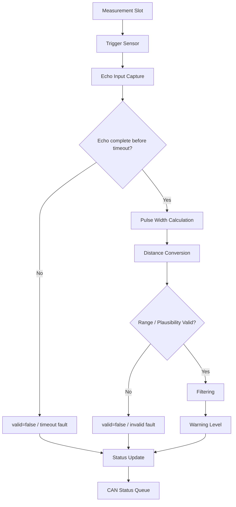

# Ultrasonic Perception Functional Specification

> 2026-09-11: STM32G431KB 구매 모델 부분 동결. [최상위 명세](../../system/FINAL_IMPLEMENTATION_SPEC.md) DEC-HW-001~005를 따른다. 제조사/revision/핀 배정과 실기 시험은 별도이며, 아래 시험 결과/측정값을 PASS로 변경한 것은 아니다.

[프로젝트 홈](../../../README.md) · [문서 안내](../../README.md) · [폴더 목록](README.md)

> 문서 목적: Ultrasonic Perception ECU가 **무엇을 측정하고 어떤 상태를 제공해야 하는지** 정의한다.  
> 구현 구조와 FreeRTOS Task 배치는 `ARCHITECTURE.md`, 검증 결과는 `TEST_REPORT.md`에서 관리한다.

## Document Information

| Item | Value |
|---|---|
| Feature ID | `FEAT-US-001` |
| Feature / Node Name | Ultrasonic Perception ECU |
| Owner | A |
| Role | 인지 / Parking Distance Perception |
| Status | Draft |
| Priority | MUST |
| Board / Platform | STM32G431KB (STM32 #1) + Ultrasonic Sensor Array |
| Execution Model | FreeRTOS + CMSIS-RTOS2 기본 |
| Related Architecture | `ARCHITECTURE.md` |
| Related Test | `TEST_REPORT.md` |

### Revision History

| Revision | Date | Author | Change |
|---|---|---|---|
| v0.1 | 2026-09-09 | Team | Initial filled example |

---

# 1. Purpose and Scope

## 1.1 한 문장 설명

> Ultrasonic Perception ECU는 주변 Ultrasonic Sensor의 Echo 시간을 측정해 거리와 유효성을 계산하고, Filtering과 Warning Level을 적용한 결과를 CAN FD로 VCU/H735/HPC에 제공한다.

## 1.2 포함 범위

- Ultrasonic Trigger 생성
- Echo pulse time 측정
- Echo time → distance 변환
- 측정값 validity 판단
- 기본 filtering
- Sensor별 distance 관리
- Sensor별/전체 Warning Level 생성
- Sensor timeout / out-of-range / unavailable 검출
- CAN FD status 송신
- Local fault / DTC candidate 생성
- FreeRTOS Task / ISR / Queue 기반 실행 구조
- Health monitoring / Watchdog-ready 구조

## 1.3 제외 범위

- Motor PWM 또는 Steering PWM 직접 생성
- 차량 정지 여부의 최종 판단
- Camera Vision 처리
- Rear Vision과의 최종 fusion 판단
- H735 UI 표시 로직
- 최종 DTC history DB 저장

A 담당의 책임은 **거리 인지와 그 결과의 신뢰성**까지다. `CRITICAL` 상태를 실제 정지 명령으로 바꾸는 것은 VCU의 책임이다.

---

# 2. Usage / System Scenario

## 2.1 정상 거리 측정

| Item | Description |
|---|---|
| Actor / Trigger | FreeRTOS periodic measurement schedule |
| Preconditions | MCU/Timer/GPIO 초기화 완료, Sensor enabled |
| Trigger | 해당 Sensor의 measurement slot 도달 |
| Normal Flow | Trigger pulse → Echo edge capture → pulse width 계산 → distance 변환 → validity → filtering → warning → status update |
| Postconditions | 해당 Sensor의 `distance_mm`, `valid`, `warning_level`, timestamp가 갱신됨 |

## 2.2 Sensor 응답 없음

| Item | Description |
|---|---|
| Actor / Trigger | Measurement timeout |
| Preconditions | Trigger는 정상 발생 |
| Trigger | 지정 timeout 내 정상 Echo 완료가 없음 |
| Normal Flow | timeout 검출 → measurement invalid → fault counter 증가 → status update → 필요 시 DTC candidate 생성 |
| Postconditions | 이전 정상 거리값을 최신 정상값처럼 사용하지 않고 `valid=false` 상태가 전달됨 |

## 2.3 여러 Sensor 측정

| Item | Description |
|---|---|
| Actor / Trigger | Sensor scan scheduler |
| Preconditions | 여러 Sensor가 설정되어 있음 |
| Trigger | 다음 Sensor slot |
| Normal Flow | Sensor를 순차 측정 → 각 결과 저장 → Zone별/전체 Warning 갱신 |
| Postconditions | Sensor 간 간섭을 줄이면서 모든 활성 Sensor의 상태를 주기적으로 제공 |

---

# 3. Functional Flow

---

# 4. Inputs

| Input ID | Input | Source | Interface | Unit / Range | Valid Condition | Update / Trigger |
|---|---|---|---|---|---|---|
| IN-US-001 | Echo edge/time | Ultrasonic Sensor | GPIO + Timer Input Capture | timer tick / us | 정상 rising/falling capture | Sensor measurement event |
| IN-US-002 | Sensor configuration | Static config / future CAN config | memory / optional CAN | sensor enable, zone, threshold | defined configuration | startup / config event |
| IN-US-003 | Measurement schedule tick | FreeRTOS / timer | RTOS time base | ms | scheduler 정상 | periodic |
| IN-US-004 | Optional enable/mode | VCU / project config | CAN FD 후보 | enum/bool | valid command | Event/Periodic TBD |

실제 Sensor model, 입력 전압, Echo logic level, 측정 가능 range는 Datasheet 확인 후 확정한다.

---

# 5. Outputs

| Output ID | Output | Destination | Interface | Unit / Range | Update / Event | Valid Condition |
|---|---|---|---|---|---|---|
| OUT-US-001 | Sensor distance | VCU / H735 / HPC | CAN FD | mm | Periodic TBD | `valid=true` |
| OUT-US-002 | Sensor validity | VCU / H735 / HPC | CAN FD | bool/flags | Periodic TBD | 항상 제공 |
| OUT-US-003 | Warning level | VCU / H735 / HPC | CAN FD | SAFE/WARNING/CRITICAL/INVALID | Periodic/Event | configuration valid |
| OUT-US-004 | Local fault status | Diagnostics / VCU | CAN FD | fault flags | Event/Periodic | fault 발생 시 |
| OUT-US-005 | ECU heartbeat/health | VCU / HPC | CAN FD | alive/health | Periodic TBD | ECU 정상 동작 |

Sensor 개수와 최종 Zone 구조는 TBD다. CAN payload는 Sensor array 또는 Zone status 형태 중 공통 CAN Matrix에서 확정한다.

---

# 6. Functional Requirements

| Requirement ID | Requirement | Priority | Verification | Related Test |
|---|---|---|---|---|
| REQ-US-001 | ECU는 활성 Ultrasonic Sensor에 대해 Trigger를 생성하고 Echo 응답 시간을 측정해야 한다. | MUST | Test/Inspect | T-US-001 |
| REQ-US-002 | ECU는 정상 Echo 측정값을 정의된 물리 단위의 거리값으로 변환해야 한다. | MUST | Test | T-US-002 |
| REQ-US-003 | ECU는 측정값이 정상인지 구분하는 `valid` 상태를 제공해야 한다. | MUST | Test | T-US-003 |
| REQ-US-004 | ECU는 거리값에 정의된 filtering을 적용해야 한다. | MUST | Test/Analyze | T-US-004 |
| REQ-US-005 | ECU는 구성된 threshold에 따라 SAFE/WARNING/CRITICAL 상태를 생성해야 한다. | MUST | Test | T-US-005 |
| REQ-US-006 | ECU는 Echo timeout 발생 시 해당 측정값을 invalid로 처리해야 한다. | MUST | Fault Test | T-US-006 |
| REQ-US-007 | ECU는 Sensor의 유효 측정 범위를 벗어난 값을 정상 거리로 제공하지 않아야 한다. | MUST | Boundary Test | T-US-007 |
| REQ-US-008 | 여러 Sensor를 사용할 경우 측정 순서를 관리해 Sensor 간 상호 간섭을 줄이는 구조를 가져야 한다. | SHOULD | Test/Inspect | T-US-008 |
| REQ-US-009 | ECU는 거리, validity, warning 상태를 CAN FD를 통해 송신할 수 있어야 한다. | MUST | Communication Test | T-US-009 |
| REQ-US-010 | ECU는 Sensor fault를 local fault 상태로 관리하고 DTC candidate로 전달할 수 있어야 한다. | SHOULD | Fault Test | T-US-010 |
| REQ-US-011 | Ultrasonic 측정 ISR은 긴 계산이나 blocking 동작을 수행하지 않아야 한다. | MUST | Inspect | T-US-011 |
| REQ-US-012 | Sensor 측정, Perception 처리, CAN 송신, Health monitoring은 FreeRTOS 실행 구조에서 서로 책임이 분리되어야 한다. | MUST | Inspect/RTOS Test | T-US-012 |
| REQ-US-013 | Queue overflow, task overrun, stack 부족 중 검출 가능한 항목은 Health 상태에 반영되어야 한다. | SHOULD | RTOS Fault Test | T-US-013 |
| REQ-US-014 | ECU는 Critical Task가 비정상인 상태에서 Watchdog를 무조건 refresh하지 않는 구조를 가져야 한다. | SHOULD | Inspect/Test | T-US-014 |

---

# 7. Rules / Conditions

| Rule ID | Condition / Control Rule | Result |
|---|---|---|
| RULE-US-001 | 정상 Echo capture + range 정상 | `valid=true` |
| RULE-US-002 | Echo timeout | `valid=false`, timeout fault |
| RULE-US-003 | 변환 거리 out-of-range | `valid=false` |
| RULE-US-004 | `valid=false` | 해당 거리값으로 정상 Warning을 계산하지 않음 |
| RULE-US-005 | 모든 Warning threshold | Config에서 관리하고 H735가 독자적으로 다른 threshold를 만들지 않음 |
| RULE-US-006 | 여러 Sensor 활성 | 동시에 무질서하게 trigger하지 않고 scan/schedule 적용 |
| RULE-US-007 | Critical distance 감지 | `CRITICAL` 상태만 생성하며 Motor 직접 제어 금지 |
| RULE-US-008 | Sensor 복구 | 연속 정상 측정 또는 정의된 recovery 조건 후 valid 복귀, 상세 조건 TBD |

Warning threshold와 recovery count는 Stage 1 측정 후 확정한다.

---

# 8. Exceptions / Edge Cases

| Case ID | Exception / Edge Case | Detection | Expected Behavior | Recovery |
|---|---|---|---|---|
| EDGE-US-001 | Echo 없음 | measurement timeout | invalid + timeout fault | 다음 measurement retry |
| EDGE-US-002 | Echo pulse 너무 짧음/김 | range/plausibility check | invalid | 다음 정상 measurement |
| EDGE-US-003 | Sensor disconnect | 반복 timeout / electrical check candidate | unavailable 상태 | reconnect 후 정상 측정 |
| EDGE-US-004 | Sensor 간 crosstalk | 비정상 jump / multi-sensor test | scan gap/filter 조정 | schedule 조정 |
| EDGE-US-005 | 갑작스러운 거리 spike | filter/plausibility | 단발 spike가 즉시 잘못된 상태를 만들지 않도록 정책 적용 | 다음 samples |
| EDGE-US-006 | Measurement Queue full | RTOS queue return/error | overflow flag, 정의된 drop policy | queue 정상화 |
| EDGE-US-007 | `UltrasonicTask` 지연 | period/health monitor | overrun flag | scheduler/priority 개선 |
| EDGE-US-008 | CAN 송신 불가 | CAN error / queue fail | local data 유지 + communication fault | CAN recovery |

---

# 9. UI / UX Reference

N/A. Ultrasonic ECU 자체에는 사용자 UI가 없다.

H735 Parking 화면은 이 ECU가 제공하는 distance / validity / warning을 소비한다.

---

# 10. Interface Requirements

## 10.1 Hardware

| Device | Interface | Electrical / Voltage | Requirement / Note |
|---|---|---|---|
| Ultrasonic Sensor | Trigger GPIO | Sensor datasheet 기준 | output pulse timing 확인 |
| Ultrasonic Sensor | Echo → Timer Input Capture | Sensor logic level 기준 | MCU 입력 허용전압 확인, 필요 시 level shifting |
| STM32 #1 | Timer / GPIO | board 기준 | 센서 수에 따른 channel/pin 확인 |
| CAN FD Transceiver | FDCAN ↔ CANH/L | 실제 부품 기준 | MCU와 CAN Bus 사이 Transceiver 필요 |

센서가 5V Echo를 출력하는 모델일 수 있으므로 **실제 센서 모델 확인 전 MCU GPIO에 직접 연결한다고 가정하지 않는다.**

## 10.2 CAN / CAN FD

| Message / Signal | TX/RX | Owner / Peer | Unit | Cycle/Event | Timeout | Timeout Action |
|---|---|---|---|---|---|---|
| `Ultrasonic_Status` | TX | Ultrasonic ECU → VCU/H735/HPC | mm + flags | Periodic TBD | Consumer 정의 | Consumer가 source invalid 처리 |
| `Ultrasonic_Fault` / DTC candidate | TX | Ultrasonic ECU → Diagnostics | code/flags | Event/Periodic TBD | N/A | fault 상태 유지 |
| `ECU_Heartbeat` | TX | Ultrasonic ECU → VCU/HPC | alive/health | Periodic TBD | Consumer 정의 | ECU offline 판단 |
| `Vehicle_Mode` / enable 후보 | RX | VCU | enum/bool | TBD | TBD | local safe/default mode |

실제 CAN ID, DLC, endian, scale, offset은 공통 CAN Matrix에서 확정한다.

## 10.3 LIN

N/A.

## 10.4 API / IPC / File

N/A. 내부 RTOS IPC는 12장에서 정의한다.

---

# 11. Timing / Performance Requirements

| Requirement | Target | Verification |
|---|---|---|
| Sensor별 measurement timeout | Sensor datasheet + test 후 TBD | scope/log |
| 전체 sensor scan/update period | 목표값 TBD, 센서 수 확정 후 결정 | timestamp |
| CAN status cycle | TBD | CAN log |
| Sensor measurement → status update latency | TBD | timestamp |
| UltrasonicTask period jitter | TBD | RTOS trace/timestamp |

정확한 숫자는 Sensor model, Sensor 수, crosstalk 방지 간격을 확인한 후 확정한다.

---

# 12. Execution / RTOS Requirements

## 12.1 Task Requirement

| Task / Service | Responsibility | Trigger / Period | Priority Direction | Deadline / Response | Blocking Allowed? |
|---|---|---|---|---|---|
| `UltrasonicTask` | sensor scan, trigger, echo completion 관리 | periodic / measurement event | High | measurement schedule 충족 | 긴 blocking 금지 |
| `PerceptionTask` | distance validity, filter, warning 계산 | measurement queue event | High/Normal | 다음 status publish 전 | bounded queue wait |
| `CanTxTask` | status/fault/heartbeat CAN 송신 | queue/event + periodic | Normal | CAN cycle 충족 | CAN API 정책 내 |
| `HealthTask` | task alive, queue, sensor health, watchdog 조건 | periodic | Low/Normal | health period TBD | non-critical log 허용 |

정확한 FreeRTOS priority number, stack size는 실측 후 확정한다.

## 12.2 Event / Communication Requirement

| Producer | Consumer | Mechanism | Data | Overflow / Timeout Policy |
|---|---|---|---|---|
| Timer Capture ISR | `UltrasonicTask` | Task Notification | edge/timestamp complete event | 중복/누락 flag 기록 |
| `UltrasonicTask` | `PerceptionTask` | Queue | raw measurement struct | overflow flag + drop policy TBD |
| `PerceptionTask` | `CanTxTask` | Queue | perception/status snapshot | 최신 상태 우선 정책 검토 |
| Critical tasks | `HealthTask` | Event Flags / heartbeat counter | alive/overrun | missing health → fault |

## 12.3 ISR Requirement

| Interrupt | ISR이 해야 하는 일 | Task로 넘길 일 | Max/Constraint |
|---|---|---|---|
| Timer Input Capture | edge timestamp/capture state 저장, completion notify | pulse width validation, distance calculation | blocking/printf 금지 |
| Optional timeout timer | timeout flag/notify | fault 처리와 retry | 최소 처리 |
| FDCAN interrupt, RX 사용 시 | frame enqueue/notify | decode/config handling | 최소 처리 |

## 12.4 Resource / Memory Requirement

- startup 이후 불필요한 dynamic allocation을 피한다.
- Task stack size는 추측이 아니라 high-water mark 측정으로 조정한다.
- Queue depth는 Sensor 수와 worst-case producer rate를 근거로 결정한다.
- Timer/Input Capture peripheral은 `UltrasonicTask`가 논리적 owner가 된다.
- CAN TX는 `CanTxTask` single-owner 구조를 우선한다.

## 12.5 Watchdog / Health Requirement

| Health Item | Detection | Action |
|---|---|---|
| `UltrasonicTask` alive | heartbeat/period check | health fault |
| `PerceptionTask` alive | heartbeat/queue progress | health fault |
| Queue overflow | RTOS return/error counter | fault flag + log |
| Sensor repeated timeout | timeout counter | sensor unavailable / DTC candidate |
| Task overrun | timestamp/period monitor | health fault |
| Watchdog refresh condition | critical task health all OK | only then refresh |

---

# 13. Safety / Fail-safe / DTC

| Fault | Detection | Safe / Local Action | DTC Candidate | Recovery |
|---|---|---|---|---|
| Sensor timeout | Echo timeout | `valid=false`, no false distance | `US_SENSOR_TIMEOUT` 후보 | 정상 응답 연속 확인 |
| Distance invalid | range/plausibility fail | measurement reject | `US_RANGE_INVALID` 후보 | 정상 measurement |
| Multiple sensor unavailable | invalid count/policy | degraded perception status | `US_MULTI_SENSOR_FAULT` 후보 | sensor recovery |
| CAN TX failure | controller/queue error | local state 유지 + comm fault | `US_CAN_FAULT` 후보 | CAN recovery |
| RTOS queue overflow | queue API error | overflow flag | `US_RTOS_QUEUE` 후보 | queue 정상화 / design fix |
| Critical task unhealthy | HealthTask | watchdog refresh 조건 불만족 | `US_TASK_HEALTH` 후보 | reset/recovery policy |

DTC code 숫자와 status lifecycle은 F 담당의 Diagnostics 규격과 통합 후 확정한다.

---

# 14. Acceptance Criteria

- [ ] Sensor 1개에서 Trigger/Echo 측정이 재현된다.
- [ ] 최소 3개 기준거리에서 distance 변환값을 기록한다.
- [ ] 정상 측정과 timeout/invalid 측정을 구분한다.
- [ ] Filtering 전/후 값을 비교할 수 있다.
- [ ] SAFE/WARNING/CRITICAL 상태가 configurable threshold로 동작한다.
- [ ] 여러 Sensor 사용 시 순차 scan 구조가 동작한다, 해당 시.
- [ ] `Ultrasonic_Status` CAN 송신을 확인한다.
- [ ] ISR에서 긴 계산/printf/blocking을 하지 않는다.
- [ ] RTOS Task/Queue 구조가 문서와 일치한다.
- [ ] Task period/jitter와 stack high-water를 측정한다.
- [ ] Queue overflow 정책을 시험한다.
- [ ] Sensor disconnect/timeout 시 UI/VCU에 invalid 상태가 전달된다.
- [ ] Health/Watchdog 조건을 확인한다.

---

# 15. Open Issues / TBD

| ID | Item | Owner | Target Date / Condition |
|---|---|---|---|
| TBD-US-001 | Sensor model 확정 | A/Team | 부품 선정 시 |
| TBD-US-002 | Sensor 개수/Zone/장착 위치 | A/Team | 차량 layout 확정 시 |
| TBD-US-003 | GPIO/Timer pin map | A | board + sensor 확정 후 |
| TBD-US-004 | Echo voltage / level shifting | A | datasheet 확인 후 |
| TBD-US-005 | distance conversion/calibration | A | Stage 1 측정 후 |
| TBD-US-006 | filter와 warning threshold | A/F | Stage 1 + VCU policy 협의 후 |
| TBD-US-007 | CAN cycle/ID/payload | A/F | CAN Matrix v0.1 |
| TBD-US-008 | Task priority/stack/queue depth | A | RTOS profiling 후 |
