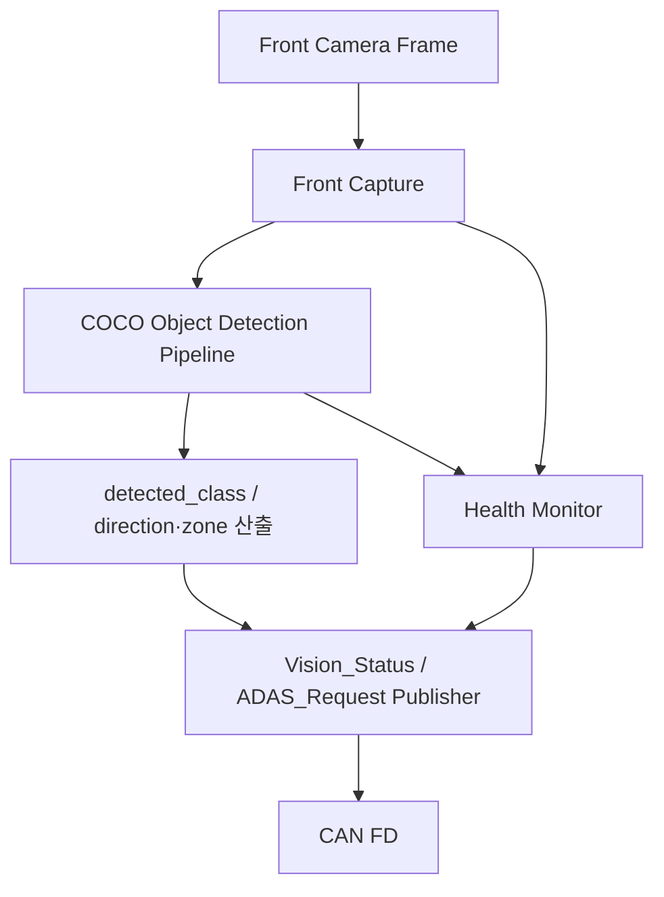

# HPC + Camera Vision Functional Specification

[프로젝트 홈](../../../README.md) · [문서 안내](../../README.md) · [폴더 목록](README.md)

> **2026-09-15 범위 변경:** Rear Camera / Rear Vision / 주차 Vision 기능을 삭제했다. HPC는 전방 카메라 1대의 COCO 기반 객체인식만 담당하며, 초음파 충돌 위험도 판단은 Ultrasonic(A)이 전담한다. 근거: [`FINAL_IMPLEMENTATION_SPEC.md` §3.4, §4.2, §4.3, §8 E HPC](../../system/FINAL_IMPLEMENTATION_SPEC.md).

> 문서 목적: Raspberry Pi 기반 Front Camera Vision과 HPC 기능이 **무엇을 해야 하는지** 정의한다.
> 구현 구조는 `ARCHITECTURE.md`, 검증 결과는 `TEST_REPORT.md`에서 관리한다.

## Document Information

| Item | Value |
|---|---|
| Feature ID | `FEAT-HPC-VIS-001` |
| Feature / Node Name | HPC + Front Camera Vision |
| Owner | E |
| Role | 인지 / 판단 / HPC |
| Status | Draft |
| Priority | MUST |
| Board / Platform | Raspberry Pi + Linux |
| Execution Model | Linux Service / Process / Thread |
| Related Architecture | `ARCHITECTURE.md` |
| Related Test | `TEST_REPORT.md` |

### Revision History

| Revision | Date | Author | Change |
|---|---|---|---|
| v0.1 | 2026-09-09 | Team | Initial filled example |
| v0.2 | 2026-09-15 | Team | Rear Camera/Rear Vision/주차 Vision 삭제, Front Vision COCO 객체인식(detected_class + direction/zone) 전용으로 재정의 |

---

# 1. Purpose and Scope

## 1.1 한 문장 설명

> HPC + Camera Vision은 Front Camera 영상을 Raspberry Pi에서 COCO 기반 객체인식으로 처리하여 차량이 사용할 수 있는 ADAS 의미 정보(`Vision_Status`)와 회피/감속 요청(`ADAS_Request`)을 만들고 CAN FD로 전달한다.

## 1.2 포함 범위

- Front Camera capture (1대, 상시 동작)
- COCO 기반 Object Detection pipeline
- `detected_class` + `direction/zone` semantic result 생성
- ADAS speed/steering 회피 요청 후보 생성
- CAN FD 결과 송수신 (`Vision_Status` → F, B / `ADAS_Request` → F)
- Vision valid / health / fault 상태 생성
- Linux process/service health 관리
- 로그 및 성능 측정

## 1.3 제외 범위

- Rear Camera capture / Rear Vision pipeline (삭제됨, `DEC-HW-016`/`DEC-VIS-002/006/007` REMOVED)
- 초음파 충돌 위험도 재판정 (A Ultrasonic 4방향 전담) 및 주차 경로/주차 semantic 생성
- Gear D/R에 따른 카메라 전환 (카메라는 전방 1대 상시 동작, 모드 전환 없음)
- Lane detection (COCO 객체인식 범위 밖)
- Motor PWM / Direction 직접 출력
- Steering Servo PWM 직접 출력
- 최종 차량 안전 Arbitration
- Ultrasonic 거리 측정
- H735 UI rendering
- LIN Lighting 제어
- Camera raw frame을 CAN FD로 전송
- 모든 DTC 규격의 최종 소유

Vision/HPC는 **고수준 인지와 회피 요청 생성**을 담당하고, 실제 차량 최종 판단은 VCU(F)가, 초음파 충돌 위험도 판단은 A가 담당한다. Ultrasonic Collision Critical은 ADAS_Request보다 항상 우선한다 (`FINAL_IMPLEMENTATION_SPEC.md` §1.2).

---

# 2. Usage / System Scenario

## 2.1 Front ADAS Object Detection

| Item | Description |
|---|---|
| Actor / Trigger | Front Camera 상시 동작 |
| Preconditions | Pi boot 완료, Front Camera 사용 가능, Vision service READY |
| Trigger | 항상 활성 (Gear/Mode에 따른 전환 없음) |
| Normal Flow | Camera Capture → Preprocess → COCO Object Detection → detected_class/direction 산출 → Vision_Status/ADAS_Request 생성 → CAN TX |
| Postconditions | VCU/H735가 최신 Front Vision 결과를 사용할 수 있음 |

## 2.2 Vision Failure

| Item | Description |
|---|---|
| Actor / Trigger | Camera disconnect / Process crash / Frame timeout |
| Preconditions | Vision function active |
| Trigger | camera/service health failure |
| Normal Flow | Failure detect → `front_valid=false` / fault state → CAN status → restart/degraded policy |
| Postconditions | VCU/H735가 Vision 결과를 정상값으로 오해하지 않음 |

---

# 3. Functional Flow

---

# 4. Inputs

| Input ID | Input | Source | Interface | Unit / Range | Valid Condition | Update / Trigger |
|---|---|---|---|---|---|---|
| IN-VIS-001 | Front Camera Frame | Front Camera | CSI 후보 | image frame | capture success | frame event |
| IN-VIS-002 | `Vehicle_State` | VCU | CAN FD | gear/mode/safety | valid CAN + timeout 정상 | periodic |
| IN-VIS-003 | Time / Monotonic Clock | Linux | system clock | timestamp | monotonic valid | continuous |
| IN-VIS-004 | Configuration | file/env/static config | file/API | thresholds/model path (COCO 모델) | parse valid | startup/reload |

---

# 5. Outputs

| Output ID | Output | Destination | Interface | Unit / Range | Update / Event | Valid Condition |
|---|---|---|---|---|---|---|
| OUT-VIS-001 | `detected_class` (`Vision_Status`) | VCU(F) / IVI(B) | CAN FD | enum (COCO name 기반) | periodic/event | front vision valid |
| OUT-VIS-002 | `direction`/`zone` (`Vision_Status`) | VCU(F) / IVI(B) | CAN FD | enum (예: LEFT/CENTER/RIGHT) | periodic/event | front vision valid |
| OUT-VIS-003 | `vision warning` (`Vision_Status`) | VCU(F) / IVI(B) | CAN FD | enum | event/periodic | front vision valid |
| OUT-VIS-004 | `requested_speed`/`requested_steering` (`ADAS_Request`) | VCU(F) | CAN FD | TBD | periodic/event | ADAS request valid |
| OUT-VIS-005 | `request_reason/type` (`ADAS_Request`, 전방 객체 회피 사유만) | VCU(F) | CAN FD | enum | periodic/event | ADAS request valid |
| OUT-VIS-006 | `front_valid` / health (`Vision_Status`) | VCU(F) / IVI(B) | CAN FD | bool/flags | periodic/event | always available if CAN service healthy |
| OUT-VIS-007 | Local log / metrics | Developer / Logger | file/stdout/IPC | structured | event/periodic | local service active |

---

# 6. Functional Requirements

| Requirement ID | Requirement | Priority | Verification | Related Test |
|---|---|---|---|---|
| REQ-VIS-001 | HPC는 Front Camera frame을 획득할 수 있어야 한다. | MUST | Test | T-VIS-001 |
| REQ-VIS-002 | Front Vision은 COCO 기반 `detected_class` + `direction/zone` semantic result를 생성해야 한다. | MUST | Test | T-VIS-002 |
| REQ-VIS-003 | Vision 결과는 raw image가 아니라 semantic/control result 형태로 CAN에 제공해야 한다. | MUST | Inspect/Test | T-VIS-003 |
| REQ-VIS-004 | HPC는 Motor/Servo PWM을 직접 생성하지 않아야 한다. | MUST | Inspect | T-VIS-004 |
| REQ-VIS-005 | HPC는 초음파 충돌 위험도 판단(semantic result 또는 request)을 생성하지 않아야 한다 — 충돌주의는 A(Ultrasonic) 전담. | MUST | Inspect | T-VIS-005 |
| REQ-VIS-006 | Camera frame timeout/disconnect를 감지하고 `front_valid=false` 또는 fault 상태를 제공해야 한다. | MUST | Fault Test | T-VIS-006 |
| REQ-VIS-007 | Vision process crash 시 시스템이 fault를 감지하고 정의된 recovery/restart 정책을 수행해야 한다. | SHOULD | Fault Test | T-VIS-007 |
| REQ-VIS-008 | 각 결과에는 timestamp 또는 freshness 판단이 가능한 정보를 유지해야 한다. | SHOULD | Inspect/Test | T-VIS-008 |
| REQ-VIS-009 | CAN service 장애가 Vision capture/inference process 전체를 불필요하게 중단시키지 않도록 구성해야 한다. | SHOULD | Fault Test | T-VIS-009 |
| REQ-VIS-010 | Vision FPS, processing latency, CPU, memory를 측정 가능해야 한다. | MUST | Measure | T-VIS-010 |
| REQ-VIS-011 | `ADAS_Request`는 Ultrasonic Collision Critical을 해제/override할 수 없어야 한다 (§1.2 우선순위는 F 중재 로직에서 강제). | MUST | Inspect | T-VIS-011 |

---

# 7. Rules / Conditions

| Rule ID | Condition / Rule | Result |
|---|---|---|
| RULE-VIS-001 | Front Camera 상시 동작 | Gear/Mode와 무관하게 Front Vision ACTIVE |
| RULE-VIS-002 | Camera invalid | `front_valid=false` |
| RULE-VIS-003 | Result stale | 이전 값을 최신 정상값처럼 재사용하지 않음 |
| RULE-VIS-004 | ADAS request 생성 | VCU(F)가 최종 승인할 Request로만 취급, Ultrasonic Collision Critical보다 우선하지 않음 |
| RULE-VIS-005 | Raw frame | Pi 내부 pipeline에서만 사용, CAN 전송 금지 |
| RULE-VIS-006 | 주차 관련 semantic/request | 생성하지 않음 (A 전담) |

---

# 8. Exceptions / Edge Cases

| Case ID | Exception / Edge Case | Detection | Expected Behavior | Recovery |
|---|---|---|---|---|
| EDGE-VIS-001 | Front Camera disconnect | capture failure/timeout | front valid=false, fault publish | reconnect/restart |
| EDGE-VIS-002 | Vision process crash | supervisor/process exit | fault + restart policy | service restart |
| EDGE-VIS-003 | CAN unavailable | socket/interface error | local Vision 계속 가능, result publish unavailable 표시 | CAN recovery |
| EDGE-VIS-004 | IPC queue full | queue depth/high-water | stale frame/result drop policy | load recovery |
| EDGE-VIS-005 | Slow inference | deadline/latency monitor | stale result 방지, degraded status | resolution/model 조정 후보 |
| EDGE-VIS-006 | Invalid configuration | parse/validation fail | safe default 또는 startup fail 명확히 표시 | config fix |

---

# 9. UI / UX Reference

HPC 자체 UI는 필수 범위가 아니다.

| Item | Description |
|---|---|
| Main UI | N/A |
| Debug Preview | 개발 시 Camera/Vision overlay 창 사용 가능 |
| Driver-facing UI | H735 Cockpit이 담당 |
| Warning Display | HPC는 Warning data를 만들고 H735가 표시 |

---

# 10. Interface Requirements

## 10.1 Hardware

| Device | Interface | Electrical / Note | Requirement |
|---|---|---|---|
| Front Camera | CSI 후보 | 실제 Pi/Camera spec 확인 | stable capture |
| CAN FD Interface | SPI/USB 등 후보 | Pi 자체 CAN FD 없음 | 실제 adapter 확정 필요 |
| Raspberry Pi | Linux | power/thermal 확인 | sustained Vision load 가능 |

## 10.2 CAN / CAN FD

| Message / Signal | TX/RX | Peer | Unit | Cycle/Event | Timeout | Timeout Action |
|---|---|---|---|---|---|---|
| `Vehicle_State` | RX | VCU | gear/mode | periodic | TBD | Vision 참고용, mode 전환에는 사용하지 않음 |
| `Vision_Status` | TX | VCU(F) / IVI(B) | detected_class/direction/warning/valid | periodic/event | N/A | retry policy TBD |
| `ADAS_Request` | TX | VCU(F) | speed/steering/reason/valid | periodic/event | N/A | local log if send fail |
| `ECU_Heartbeat` | TX/RX 후보 | VCU/HPC | alive | periodic | TBD | health policy |

CAN ID/DLC/packing은 공통 CAN Matrix에서 확정한다.

## 10.3 LIN

N/A. HPC는 LIN에 직접 연결하지 않는다.

## 10.4 API / IPC / File

| Interface | Producer | Consumer | Format | Error Handling |
|---|---|---|---|---|
| Frame Queue | Camera Capture | Vision Pipeline | frame/ref | bounded queue + drop policy |
| Result Queue | Vision Pipeline | Vehicle Manager / CAN Service | typed result | latest-valid policy |
| Config | file/env/static | services | structured config | validate on startup |
| Metrics | services | logger/monitor | structured | non-blocking preferred |

---

# 11. Timing / Performance Requirements

| Requirement | Target | Verification |
|---|---|---|
| Front Camera FPS | TBD after baseline | measured FPS |
| Front Vision latency | TBD | frame timestamp → result timestamp |
| Result freshness | TBD | stale age monitor |
| CAN publish latency | TBD | result ready → CAN send |
| CPU / Memory budget | TBD after final Pi test | system metrics |

숫자는 최종 Camera/Model/Pi에서 실측한 뒤 확정한다.

---

# 12. Execution / Linux Service Requirements

## 12.1 Process / Service Requirement

| Process / Service | Responsibility | Trigger / Lifetime | Importance | Failure Handling |
|---|---|---|---|---|
| `front_vision` | Front capture + COCO 객체인식 처리 | always-on | High | fault + restart/degraded |
| `vehicle_manager` | vehicle state 참고, mode 조정 없음 | always-on | Normal | supervisor restart |
| `can_service` | CAN RX/TX | always-on | High | reconnect/restart |
| `health_monitor` | service/camera/latency health | periodic | Normal/High | fault publish |
| `logger` | log/metrics | always-on/async | Low | drop/log fault, critical path non-blocking |

## 12.2 IPC Requirement

| Producer | Consumer | Mechanism 후보 | Data | Overflow / Timeout Policy |
|---|---|---|---|---|
| capture | vision | bounded queue | frame/ref | 오래된 frame drop 후보 |
| vision | vehicle_manager | queue/socket/shared state | result | latest result 우선 |
| can_service | vehicle_manager | queue/socket | Vehicle_State | timeout health 반영 |
| all | logger | async queue | log/metric | critical path block 금지 |

## 12.3 Thread Requirement

- Capture thread가 inference 때문에 장시간 막히지 않도록 분리 가능성을 유지한다.
- Camera buffer와 result queue는 bounded 구조를 사용한다.
- 오래된 frame을 계속 처리해 latency가 누적되는 구조를 피한다.
- logging은 Vision critical path를 block하지 않게 한다.

## 12.4 Resource Requirement

- CPU usage 측정
- Memory RSS 측정
- Camera buffer memory 측정
- Thermal throttling 확인
- File/log growth 제한
- Queue depth/high-water 측정

## 12.5 Health Requirement

| Health Item | Detection | Action |
|---|---|---|
| Camera frame alive | last frame timestamp | valid=false / restart 후보 |
| Vision result alive | last result timestamp | stale/fault |
| Process alive | supervisor / heartbeat | restart/fault publish |
| CAN alive | socket/interface state | communication fault |
| Processing latency | timestamp | degraded/fault threshold TBD |
| CPU/thermal | system metrics | load reduction candidate |

---

# 13. Safety / Fail-safe / DTC

| Fault | Detection | Safe / Local Action | DTC Candidate | Recovery |
|---|---|---|---|---|
| Front Camera lost | frame timeout | front valid=false | `VIS_FRONT_CAMERA_xxx` 후보 | reconnect/restart |
| Front Vision crash | process health | ADAS request invalid | `VIS_FRONT_SERVICE_xxx` 후보 | restart |
| CAN communication lost | CAN state | local processing 유지 가능, publish unavailable | `HPC_CAN_xxx` 후보 | reconnect |
| Excessive latency | timestamp | stale result invalid 처리 | `VIS_LATENCY_xxx` 후보 | load/model/config 조정 |

VCU는 Vision valid/fault를 보고 최종 차량 안전동작을 결정한다. Ultrasonic Collision Critical은 이 fault 상태와 무관하게 항상 우선한다.

---

# 14. Acceptance Criteria

- [ ] Front Camera capture가 안정적으로 동작한다.
- [ ] COCO 기반 `detected_class`/`direction/zone` semantic result를 생성한다.
- [ ] Raw Camera frame이 CAN으로 전송되지 않는다.
- [ ] Vision result가 CAN contract(`Vision_Status`/`ADAS_Request`) 형태로 송신된다.
- [ ] Camera disconnect 시 valid/fault가 갱신된다.
- [ ] Process crash/restart 정책을 시험할 수 있다.
- [ ] FPS / latency / CPU / memory 측정값을 남긴다.
- [ ] `ADAS_Request`가 초음파 충돌 위험도 판단을 포함하지 않고, Ultrasonic Collision Critical을 override하지 않음을 확인한다.

---

# 15. Open Issues / TBD

| ID | Item | Owner | Target Condition |
|---|---|---|---|
| TBD-VIS-001 | Front Camera 정확한 모델 | E | HW 확정 |
| TBD-VIS-002 | COCO 기반 Vision algorithm/model | E | baseline 비교 후 |
| TBD-VIS-003 | Resolution/FPS | E | 성능 측정 후 |
| TBD-VIS-004 | Linux supervisor/service 방식 | E | deployment 설계 시 |
| TBD-VIS-005 | IPC 방식 | E | prototype 측정 후 |
| TBD-VIS-006 | CAN FD adapter | E/F | HW 확인 후 |
| TBD-VIS-007 | CAN signal layout | E/F/B | CAN Matrix freeze |
