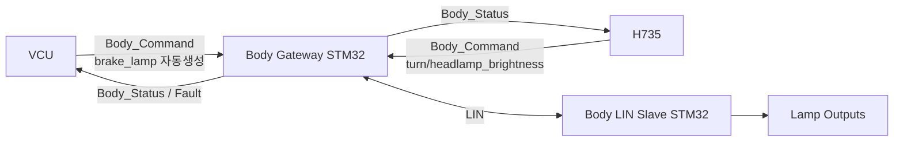
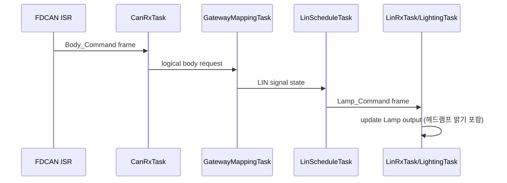
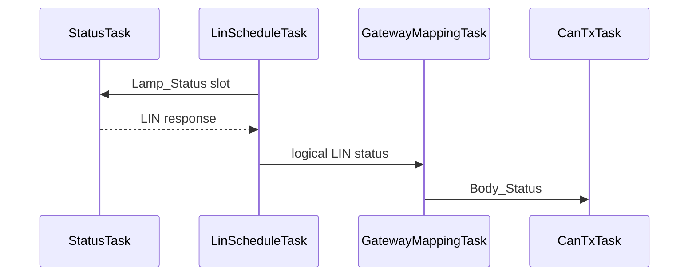
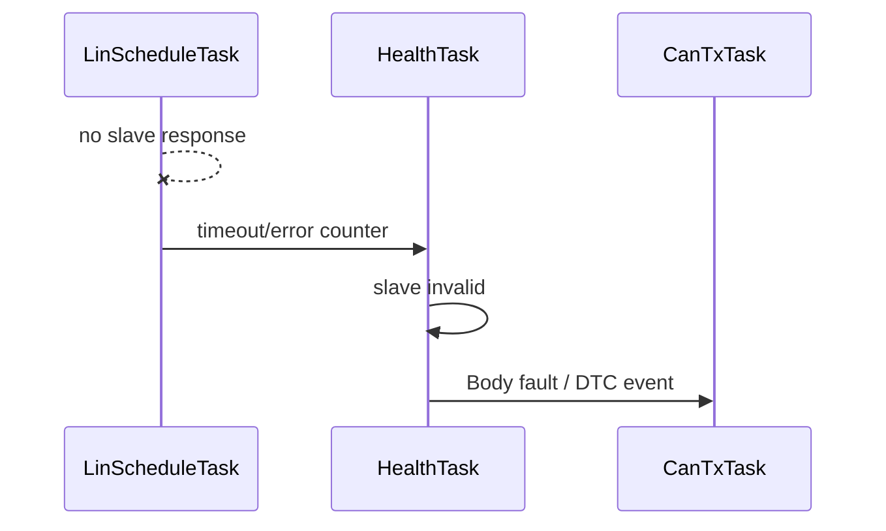

# Lighting / LIN-CAN Software Architecture

> 2026-09-11: STM32G431KB 구매 모델 부분 동결. [최상위 명세](../../system/FINAL_IMPLEMENTATION_SPEC.md) DEC-HW-001~005를 따른다. 제조사/revision/핀 배정과 실기 시험은 별도이며, 아래 시험 결과/측정값을 PASS로 변경한 것은 아니다.

> **2026-09-15 범위 변경:** Ambient Sensor / `AmbientTask` / `Ambient_Status` 구조를 전부 삭제했다. `headlamp`는 밝기값(`headlamp_brightness`)으로, `brake_lamp`는 F가 감속 감지로 자동 생성하는 값으로 재정의했다. 근거: [`FINAL_IMPLEMENTATION_SPEC.md` §3.5, §4.6~§4.8, §5.1, §5.2, §8 D Body](../../system/FINAL_IMPLEMENTATION_SPEC.md).

[프로젝트 홈](../../../README.md) · [문서 안내](../../README.md) · [폴더 목록](README.md)

> 문서 목적: D 담당의 **Body Gateway STM32 + Body LIN Slave STM32**를 어떤 구조로 구현하는지 설명한다. 기능 요구사항은 `SPECIFICATION.md`, 검증은 `TEST_REPORT.md`를 기준으로 한다.

## Document Information

| Item | Value |
|---|---|
| Node / System | Body Gateway + Body LIN Slave |
| Owner | D |
| Board / Platform | STM32G431KB Gateway + STM32G431KB Slave |
| Execution Model | FreeRTOS + CMSIS-RTOS2 기본 |
| Revision | v0.2 |
| Status | Draft |
| Related Specification | `SPECIFICATION.md` |
| Related Test | `TEST_REPORT.md` |

### Revision History

| Revision | Date | Author | Change |
|---|---|---|---|
| v0.1 | 2026-09-09 | Team | Initial filled example |
| v0.2 | 2026-09-15 | Team | Ambient Sensor/AmbientTask/Ambient_Status 삭제, headlamp를 밝기값으로, brake_lamp를 F 자동 생성 값으로 재정의 |

---

# 1. Introduction & Goals

## 1.1 Purpose

> Gateway는 차량 CAN FD Backbone과 LIN Body Subnetwork를 연결하고, LIN Slave는 Lamp Output(헤드램프 밝기/턴시그널/브레이크등)을 소유한다.

## 1.2 Scope

포함:
- CAN FD RX/TX
- LIN Master schedule
- CAN↔LIN signal mapping
- Lighting command/output/status (헤드램프 밝기 포함)
- Fault/timeout/DTC
- FreeRTOS task/ISR/queue/watchdog

제외:
- Ambient sensing (삭제됨)
- H735 UI 내부 구현
- VCU 최종 arbitration
- motor/steering control

## 1.3 Stakeholders

| Stakeholder | 관심사 |
|---|---|
| D 담당 | LIN/CAN/RTOS/Lighting 구조 |
| F VCU/CAN 통합 | Body message contract, timeout, brake_lamp 자동 생성 |
| B H735 | Body status, lamp(턴/헤드램프 밝기) request |
| 테스트 담당 | LIN timing, end-to-end mapping, fault |

---

# 2. Quality Goals

| Priority | Quality Goal | Scenario / Measure |
|---:|---|---|
| 1 | Reliability | Slave disconnect 시 Gateway가 hang되지 않고 fault 처리 |
| 2 | Timing | LIN schedule이 정의된 period/jitter를 만족 |
| 3 | Maintainability | CAN decode, mapping, LIN, lighting 기능 분리 |
| 4 | Testability | Gateway↔Slave만으로 Stage 1/2 시험 가능 |

---

# 3. Constraints

| Constraint | Reason / Impact |
|---|---|
| Gateway와 Slave는 별도 STM32 | LIN Master/Slave 실습 구조 |
| CAN FD Backbone 목표 | 상위 차량 네트워크 |
| LIN Transceiver 필요 | UART pin 직접 LIN 연결 불가 |
| CAN FD Transceiver 필요 | FDCAN pin 직접 CANH/L 연결 불가 |
| FreeRTOS 기본 | 프로젝트 SW 정책 |
| Ambient Sensor 사용하지 않음 | 삭제됨(`DEC-HW-014`/`DEC-BODY-003`) |
| `brake_lamp`는 F가 생성, D는 판단하지 않음 | 감속 감지는 F 책임(`DEC-CTRL-020`) |
| 실제 MCU/Transceiver/bitrate 일부 TBD | HW 확정 후 갱신 |

---

# 4. Context & Scope View



## External Interfaces

| Entity | Direction | Data | Interface | Owner |
|---|---|---|---|---|
| VCU/H735 | RX/TX | Body_Command / Body_Status | CAN FD | F/B |
| LIN Slave | RX/TX | Lamp/Diagnostic | LIN | D |
| Lamps | TX | GPIO/PWM (헤드램프는 밝기 PWM) | local | D |

---

# 5. Solution Strategy & Rationale

| Decision | Why | Quality |
|---|---|---|
| Gateway와 Slave 역할 분리 | LIN Master/Slave 구조를 명확히 보여줌 | Testability |
| CAN↔LIN mapping을 별도 component로 분리 | protocol driver와 signal logic 결합 방지 | Maintainability |
| LIN schedule을 dedicated task로 운영 | 주기/jitter 관리 | Timing |
| Lamp physical output은 Slave가 소유 | local actuator ownership | Reliability |
| CAN TX는 single-owner task 방향 | shared FDCAN contention 감소 | Maintainability |
| `brake_lamp`는 값 그대로 중계만 | D가 감속 판단 로직을 중복 보유하지 않음 | Maintainability |

---

# 6. Building Block / Component View

## 6.1 Gateway

```text
FDCAN Driver
   ↓
CanRxAdapter
   ↓
BodyCommandDecoder
   ↓
GatewayMapper
   ↓
LinScheduleManager
   ↓
LIN Driver

LIN Status
   ↓
GatewayMapper
   ↓
BodyStatusBuilder
   ↓
CanTxService
```

## 6.2 LIN Slave

```text
LIN Driver
   ↓
LinCommandHandler
   ↓
LightingManager (헤드램프 밝기 / 턴 / 브레이크)
   ↓
LampDriver
   ↓
BodyStatusRepository
   ↓
LIN Response Builder
```

## 6.3 Component Responsibility

| Component | Responsibility |
|---|---|
| `CanRxAdapter` | CAN frame receive / enqueue |
| `BodyCommandDecoder` | CAN payload → logical request |
| `GatewayMapper` | CAN signal ↔ LIN signal mapping |
| `LinScheduleManager` | LIN frame order/period 관리 |
| `CanTxService` | Body status / DTC / heartbeat TX |
| `LinCommandHandler` | Slave command decode |
| `LightingManager` | lamp state machine / 밝기·output mapping |
| `HealthManager` | timeout/task/queue health |

---

# 7. Concurrency / RTOS View

## 7.1 Gateway Task Model

| Task | Responsibility | Trigger / Period | Relative Priority | Stack | Blocking Policy |
|---|---|---|---|---|---|
| `CanRxTask` | CAN command decode | Event | High | TBD | short only |
| `LinScheduleTask` | LIN master schedule | slot TBD | High | TBD | no printf |
| `GatewayMappingTask` | CAN↔LIN logical mapping | Event | Normal/High | TBD | bounded |
| `CanTxTask` | Body status/fault TX | Event/periodic | Normal | TBD | queue wait 허용 |
| `HealthTask` | timeout/task/queue/watchdog | 100 ms 후보 | Low/Normal | TBD | bounded |

## 7.2 Slave Task Model

| Task | Responsibility | Trigger / Period | Relative Priority | Stack | Blocking Policy |
|---|---|---|---|---|---|
| `LinRxTask` | LIN command/status handling | Event | High | TBD | short only |
| `LightingTask` | lamp output update (헤드램프 밝기 포함) | Event/10~20 ms 후보 | Normal/High | TBD | no logging block |
| `StatusTask` | LIN response data 준비 | Event/schedule | Normal | TBD | bounded |
| `HealthTask` | local health/watchdog | 100 ms 후보 | Low | TBD | bounded |

Ambient Sensor 삭제로 기존 `AmbientTask`는 제거되었다.

## 7.3 ISR Map

| Interrupt | ISR Responsibility | Wake-up Target | Mechanism |
|---|---|---|---|
| FDCAN RX | frame metadata/copy 최소 처리 | `CanRxTask` | Queue/Notification |
| FDCAN Error | state 저장 | `HealthTask` | Event/Notification |
| LIN/UART RX/TX | byte/frame/error state 최소 처리 | `LinRxTask`/`LinScheduleTask` | Notification/Queue |

ISR에서는 mapping, lamp logic, printf를 수행하지 않는다.

## 7.4 RTOS Objects / IPC

| Object | Type | Producer | Consumer | Data | Overflow Policy |
|---|---|---|---|---|---|
| `CanRxQueue` | Queue | CAN ISR | CanRxTask | raw CAN frame | counter + bounded drop policy TBD |
| `BodyCommandQueue` | Queue | CanRxTask | GatewayMappingTask | logical request | latest/event policy TBD |
| `LinCommandState` | Queue/Repository | GatewayMappingTask | LinScheduleTask | command signals | latest state |
| `LinStatusQueue` | Queue | LIN path | GatewayMappingTask | status/fault | bounded |
| `CanTxQueue` | Queue | Mapping/Health | CanTxTask | status/event | fault priority 고려 |

## 7.5 Shared Resource Ownership

| Resource | Owner | Protection |
|---|---|---|
| FDCAN TX | `CanTxTask` | single-owner queue |
| LIN Master peripheral | `LinScheduleTask` | single owner |
| Lamp GPIO/PWM | `LightingTask` | single owner |

---

# 8. Runtime View

## 8.1 CAN → LIN



## 8.2 LIN → CAN



## 8.3 Slave Timeout



---

# 9. Deployment / Hardware View

```text
CANH/L
  ↓
CAN FD Transceiver
  ↓
Gateway STM32 + FreeRTOS
  ↓ UART/LIN
LIN Transceiver
  ↓
LIN Bus
  ↓
LIN Transceiver
  ↓
Slave STM32 + FreeRTOS
  └ Lamp Driver / LED (헤드램프 밝기 PWM 포함)
```

| HW | SW | Interface | Note |
|---|---|---|---|
| Gateway STM32 | CAN/LIN Gateway tasks | FDCAN, UART/LIN | STM32G431KB; 실제 보드 revision/핀맵 확인 필요 |
| Slave STM32 | Lighting tasks | UART/LIN, GPIO/PWM | STM32G431KB; 실제 보드 revision/핀맵 확인 필요 |
| CAN FD Transceiver | physical CAN | CANH/L | TBD |
| LIN Transceivers | physical LIN | LIN | Gateway/Slave 각각 필요 |

Pin map은 실제 board schematic/CubeMX 후 작성한다.

---

# 10. Interfaces & Contracts

## 10.1 CAN

### RX
| Message | Meaning | Sender | Timeout | Action |
|---|---|---|---|---|
| `Body_Command` | lamp/body request (headlamp_brightness/turn/brake_lamp) | VCU/H735 | TBD | request invalid/hold policy TBD |

### TX
| Message | Meaning | Receiver | Cycle/Event |
|---|---|---|---|
| `Body_Status` | lamp/LIN health (ambient 없음) | VCU/H735/HPC | periodic TBD |
| `DTC_Event` | Body fault | H735/VCU | event |
| `ECU_Heartbeat` | gateway alive | VCU/HPC | periodic TBD |

## 10.2 LIN

| Frame | Publisher | Subscriber | Period | Fault |
|---|---|---|---|---|
| `Lamp_Command` | Gateway Master | Slave | TBD | invalid/no response |
| `Lamp_Status` | Slave | Gateway | TBD | timeout/checksum |
| `Lamp_Diagnostic` | Slave | Gateway | TBD | timeout/checksum |

`Ambient_Status` 프레임은 삭제되었다.

## 10.3 CAN ↔ LIN Mapping

| CAN | Direction | LIN | Conversion |
|---|---|---|---|
| `Body_Command.headlamp_brightness` | CAN→LIN | `LAMP_HEAD_CMD` | 0-100% scale TBD |
| `Body_Command.turn_left`/`turn_right` | CAN→LIN | `LAMP_TURN_CMD` | boolean |
| `Body_Command.brake_lamp` | CAN→LIN | `LAMP_BRAKE_CMD` | boolean, F가 생성한 값 그대로 전달 |
| `LAMP_STATUS` | LIN→CAN | `Body_Status.lamp_status` | flags |
| `LAMP_FAULT` | LIN→CAN | `DTC_Event` candidate | fault map |

---

# 11. Data & State Model

## 11.1 Main Data

| Data | Owner | Meaning | Invalid Condition |
|---|---|---|---|
| `body_command` | VCU/H735 | desired lamp states (헤드램프 밝기 포함) | CAN timeout/invalid |
| `lamp_state` | LIN Slave | actual logical lamp state | output/local fault |
| `lin_slave_valid` | Gateway | node health | response timeout |
| `body_status` | Gateway | mapped CAN status | source invalid |

## 11.2 Gateway State

```text
INIT → READY → ACTIVE
            ↘ LIN_FAULT
            ↘ CAN_FAULT
```

Fault state라고 전체 gateway가 반드시 정지하는 것은 아니다. CAN과 LIN 장애를 각각 degraded mode로 관리한다.

---

# 12. Cross-cutting Concepts

## Error Handling
- LIN timeout은 slave invalid로 표시
- CAN bus-off와 LIN timeout을 서로 독립적으로 관리
- `brake_lamp`는 F가 생성한 값을 그대로 전달, D가 임의로 값을 변경하지 않음

## Diagnostics
- LIN node timeout
- lamp/output mismatch 후보
- CAN bus error
- queue/task/stack software health

## Timing
| Function | Period / Trigger | Target |
|---|---|---|
| LIN schedule | slot TBD | jitter TBD |
| Body status CAN TX | TBD | TBD |
| Lighting response | event | TBD |

## Memory / Stack
- stack high-water 측정
- queue depth 실측 후 확정
- startup 이후 불필요한 heap allocation 최소화

## Watchdog
```text
Gateway critical tasks / Slave critical tasks
→ HealthTask
→ all healthy?
→ IWDG refresh
```

---

# 13. Architecture Decisions

| ADR ID | Decision | Alternative | Reason | Consequence |
|---|---|---|---|---|
| ADR-BODY-001 | STM32 #3를 CAN↔LIN Gateway/LIN Master로 사용 | 별도 Gateway MCU 추가 | 보드 수 절감, 역할 명확 | Gateway SW 책임 증가 |
| ADR-BODY-002 | STM32 #4를 LIN Slave로 사용 | Lamp를 Gateway에 직접 연결 | LIN 실습/Local node 구조 | MCU 2개 필요 |
| ADR-BODY-003 | Lamp physical output은 Slave가 소유 | H735/Gateway 직접 GPIO | local ownership | LIN feedback 필요 |
| ADR-BODY-004 | LIN schedule dedicated task | super-loop | timing 관리 | task/priority 관리 필요 |
| ADR-BODY-005 | CAN TX single-owner task | 여러 task direct TX | contention 감소 | TX queue 필요 |
| ADR-BODY-006 | Ambient Sensor 삭제 | Ambient 유지 | 요구 범위 축소(2026-09-15) | AmbientTask/Ambient_Status 제거로 구조 단순화 |
| ADR-BODY-007 | `brake_lamp`는 F가 생성, D는 값만 중계 | D가 감속 판단 | 판단 로직 중복 방지, F가 이미 Drive_Status 소유 | D는 자체 감속 판단 로직 불필요 |

---

# 14. Quality Scenarios & Verification

| Quality | Scenario | Target | Verification |
|---|---|---|---|
| Reliability | Slave disconnect | Gateway hang 없음, fault 표시 | disconnect test |
| Timing | LIN schedule | period/jitter TBD 충족 | logic analyzer |
| Isolation | CAN bus failure | LIN task deadlock 없음 | fault injection |
| Isolation | LIN failure | CAN node alive 유지 | fault injection |
| RTOS health | soak test | stack/queue overflow 0 | runtime stats |

---

# 15. Risks & Technical Debt

| ID | Risk | Impact | Mitigation | Owner |
|---|---|---|---|---|
| RISK-BODY-001 | 실제 STM32 FDCAN 지원 미확정 | Gateway HW 변경 가능 | 보드 datasheet 확인 | D |
| RISK-BODY-002 | LIN transceiver 미선정 | 통신 지연 | voltage/part 조기 확정 | D |
| RISK-BODY-003 | Lamp load 정격 미확정 (헤드램프 밝기 PWM 포함) | GPIO/driver 손상 위험 | driver 회로/부하 확인 | D |
| RISK-BODY-004 | LIN schedule 미확정 | timing 재작업 | signal/frame 먼저 freeze | D/F |
| RISK-BODY-005 | 작은 Slave MCU RAM 부족 가능 | FreeRTOS 적용 어려움 | RAM/stack 측정 후 ADR로 예외 검토 | D |

---

# 16. Requirement Traceability

| Requirement | Component | Task | Interface | Test |
|---|---|---|---|---|
| REQ-BODY-001 | CanRxAdapter | CanRxTask | CAN RX | T-BODY-001 |
| REQ-BODY-002 | GatewayMapper | GatewayMappingTask | CAN↔LIN | T-BODY-002 |
| REQ-BODY-003 | LinScheduleManager | LinScheduleTask | LIN | T-BODY-003 |
| REQ-BODY-004 | LightingManager | LightingTask | GPIO/PWM | T-BODY-004 |
| REQ-BODY-008 | HealthManager | HealthTask | LIN status | T-BODY-008 |
| REQ-BODY-011 | RTOS Health | HealthTask | RTOS | T-BODY-011 |
| REQ-BODY-015 | GatewayMapper | GatewayMappingTask | CAN↔LIN | T-BODY-015 |

---

# 17. Glossary

| Term | Meaning |
|---|---|
| LIN Master | schedule/header를 시작하는 LIN node |
| LIN Slave | Master 요청에 응답하는 local node |
| Gateway | 서로 다른 network/signal을 변환/중계하는 node |
| Transceiver | MCU logic과 physical bus를 연결하는 회로 |
| DTC | Diagnostic Trouble Code |

---

# 18. Review Checklist

- [ ] Gateway와 Slave 역할이 분리되어 있다.
- [ ] CAN↔LIN mapping이 명시되어 있다.
- [ ] LIN schedule owner가 명확하다.
- [ ] ISR과 Task 책임이 분리되어 있다.
- [ ] CAN/LIN physical transceiver가 고려되어 있다.
- [ ] Lamp output owner가 Slave로 명확하다.
- [ ] 헤드램프 밝기 제어와 brake_lamp 자동 생성 의미가 일관되게 반영되어 있다.
- [ ] timeout/fault/degraded behavior가 있다.
- [ ] RTOS queue/stack/watchdog 정책이 있다.
- [ ] Requirement→Task→Test 추적이 가능하다.
