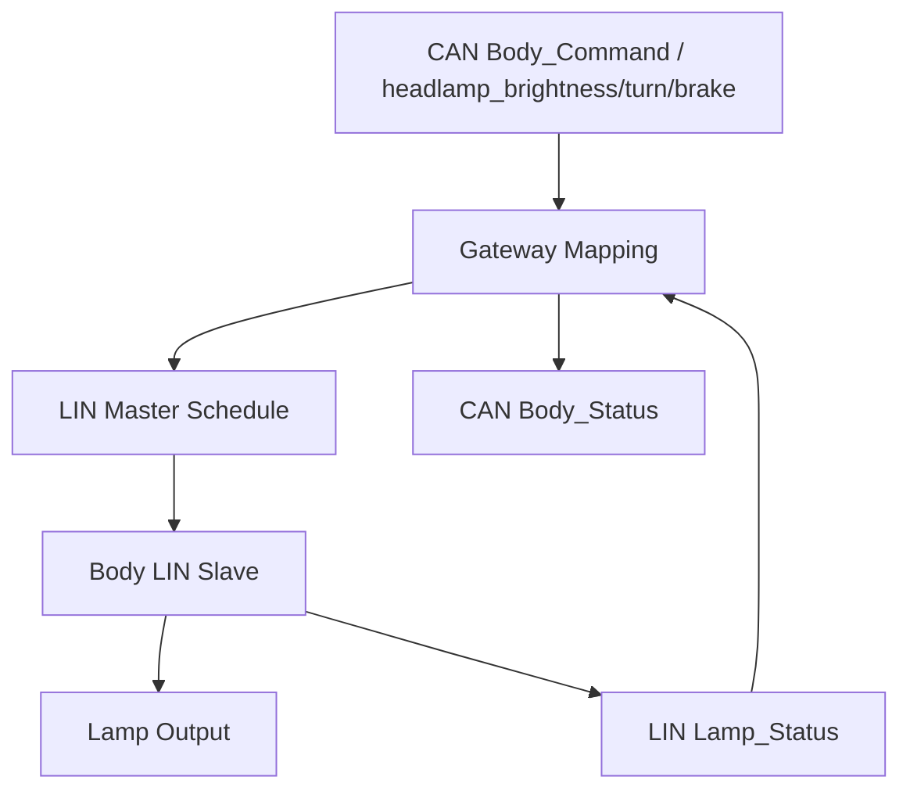

# Lighting / LIN-CAN Functional Specification

> 2026-09-11: STM32G431KB 구매 모델 부분 동결. [최상위 명세](../../system/FINAL_IMPLEMENTATION_SPEC.md) DEC-HW-001~005를 따른다. 제조사/revision/핀 배정과 실기 시험은 별도이며, 아래 시험 결과/측정값을 PASS로 변경한 것은 아니다.

> **2026-09-15 범위 변경:** Ambient Sensor / `AmbientTask` / `Ambient_Status` 기능을 전부 삭제했다 (`DEC-HW-014`, `DEC-BODY-003` REMOVED, LIN Frame Set에서 `Ambient_Status` 제거). `headlamp`는 on/off가 아니라 밝기값(`headlamp_brightness`)이고, `brake_lamp`는 사용자 요청이 아니라 F가 감속 감지로 자동 생성한다 (`DEC-CTRL-020`). `hazard`/`tail_lamp` 필드는 요구 범위 밖으로 삭제했다. 근거: [`FINAL_IMPLEMENTATION_SPEC.md` §3.5, §4.6, §4.7, §4.8, §5.1, §5.2, §8 D Body](../../system/FINAL_IMPLEMENTATION_SPEC.md).

[프로젝트 홈](../../../README.md) · [문서 안내](../../README.md) · [폴더 목록](README.md)

> 문서 목적: D 담당의 **Body Gateway + Body LIN Slave + Lighting** 기능이 무엇을 해야 하는지 정의한다. 구현 구조는 `ARCHITECTURE.md`, 검증 결과는 `TEST_REPORT.md`에서 관리한다.

## Document Information

| Item | Value |
|---|---|
| Feature ID | `FEAT-BODY-001` |
| Feature / Node Name | Lighting / LIN-CAN |
| Owner | D |
| Role | 통신 / 제어 |
| Status | Draft |
| Priority | MUST |
| Board / Platform | STM32G431KB Gateway + STM32G431KB LIN Slave |
| Execution Model | FreeRTOS + CMSIS-RTOS2 기본 |
| Related Architecture | `ARCHITECTURE.md` |
| Related Test | `TEST_REPORT.md` |

### Revision History

| Revision | Date | Author | Change |
|---|---|---|---|
| v0.1 | 2026-09-09 | Team | Initial filled example |
| v0.2 | 2026-09-15 | Team | Ambient Sensor/AmbientTask/Ambient_Status 삭제, headlamp를 밝기값으로 재정의, brake_lamp를 F 자동 생성 값으로 재정의, LIN Frame Set에서 Ambient_Status 제거 |

---

# 1. Purpose and Scope

## 1.1 한 문장 설명

> Body Gateway는 CAN FD와 LIN을 연결하고, Body LIN Slave는 Lamp(턴시그널/헤드램프 밝기/브레이크등) 출력을 수행해야 한다.

## 1.2 포함 범위

- Gateway STM32의 CAN FD Node 기능
- Gateway STM32의 LIN Master 기능
- CAN↔LIN signal mapping
- LIN schedule
- Head(밝기)/Brake/Turn Lamp 상태 제어
- LIN timeout / node health / local fault
- Body status CAN 송신
- FreeRTOS Task / ISR / Queue / Health 구조

## 1.3 제외 범위

- Ambient Sensor 처리 (삭제됨, `DEC-HW-014`/`DEC-BODY-003` REMOVED)
- Hazard / Tail Lamp (요구 범위 밖으로 삭제)
- H735가 Lamp GPIO를 직접 제어하는 기능
- VCU의 최종 차량 안전 판단
- Camera / Ultrasonic 처리
- 실제 자동차 규격 수준의 BCM 전체 기능

---

# 2. System Scenario

## 2.1 CAN → LIN Lighting Command

| Item | Description |
|---|---|
| Actor / Trigger | VCU의 `Body_Command` (H735의 `Body_User_Request`를 중재하고 brake_lamp를 자동 생성) |
| Preconditions | Gateway READY, LIN Slave 응답 가능 |
| Trigger | CAN command 수신 |
| Normal Flow | CAN RX → Decode → Mapping → LIN command 준비 → Schedule slot 송신 → Slave Lighting update |
| Postconditions | Slave lamp state가 요청값으로 갱신되고 `Lamp_Status`로 보고됨 |

## 2.2 자동 Brake Lamp 생성

| Item | Description |
|---|---|
| Actor / Trigger | F(VCU)의 감속 감지 |
| Preconditions | F가 `Drive_Status` 등에서 감속을 감지 가능 |
| Trigger | 정의된 감속 threshold 초과 (`DEC-CTRL-020`) |
| Normal Flow | F가 `Body_Command.brake_lamp=true` 생성 → Gateway CAN RX → LIN Mapping → Slave 점등 |
| Postconditions | 사용자 요청 없이 감속 시 brake_lamp가 자동 점등됨. D는 이 값을 그대로 중계할 뿐 판단하지 않는다. |

## 2.3 LIN Node Timeout

| Item | Description |
|---|---|
| Actor / Trigger | Gateway HealthTask |
| Preconditions | LIN schedule 동작 중 |
| Trigger | 연속 응답 실패 또는 timeout |
| Normal Flow | timeout detect → LIN node invalid → DTC/Fault candidate → CAN Body_Status 갱신 |
| Postconditions | 상위 Node가 Body/LIN fault를 식별 가능 |

---

# 3. Functional Flow

---

# 4. Inputs

| Input ID | Input | Source | Interface | Unit / Range | Valid Condition | Trigger |
|---|---|---|---|---|---|---|
| IN-BODY-001 | `Body_Command` (headlamp_brightness/turn_left/turn_right/brake_lamp) | VCU | CAN FD | flags/enum/0-100% | valid payload | Event |
| IN-BODY-002 | LIN Slave response | Body LIN Slave | LIN | frame/signals | checksum/timeout 정상 | Schedule slot |
| IN-BODY-003 | CAN controller status | Gateway MCU | FDCAN | state | controller valid | Event |
| IN-BODY-004 | LIN controller status | Gateway/Slave | UART/LIN | state | controller valid | Event |

---

# 5. Outputs

| Output ID | Output | Destination | Interface | Unit / Range | Update | Valid Condition |
|---|---|---|---|---|---|---|
| OUT-BODY-001 | `Lamp_Command` (헤드램프 밝기/턴/브레이크) | LIN Slave | LIN | 0-100%/flags | schedule | valid CAN request |
| OUT-BODY-002 | Lamp GPIO/PWM | Lamp driver | GPIO/PWM | 밝기 %(헤드램프)/ON-OFF(턴/브레이크) | event | local state valid |
| OUT-BODY-003 | `Lamp_Status` | Gateway | LIN | flags | periodic/event | slave valid |
| OUT-BODY-004 | `Lamp_Diagnostic` | Gateway | LIN | fault flags | periodic/event | valid fault state |
| OUT-BODY-005 | `Body_Status` | VCU/H735/HPC | CAN FD | lamp/LIN health (ambient 없음) | periodic/event | gateway valid |
| OUT-BODY-006 | DTC/Fault Event | H735(직접 구독)/VCU(안전 판단) | CAN FD | code/status | event | fault detected |

---

# 6. Functional Requirements

| Requirement ID | Requirement | Priority | Verification | Related Test |
|---|---|---|---|---|
| REQ-BODY-001 | Gateway는 `Body_Command`를 CAN FD로 수신해야 한다. | MUST | Test | T-BODY-001 |
| REQ-BODY-002 | Gateway는 CAN command를 대응하는 LIN signal로 변환해야 한다. | MUST | Test | T-BODY-002 |
| REQ-BODY-003 | Gateway는 정의된 LIN schedule에 따라 frame을 송수신해야 한다. | MUST | Test/Measure | T-BODY-003 |
| REQ-BODY-004 | LIN Slave는 헤드램프를 on/off가 아닌 밝기값(0-100% 등)으로 구동해야 한다. | MUST | Test | T-BODY-004 |
| REQ-BODY-005 | LIN Slave는 Lamp command에 따라 Lamp output을 갱신해야 한다. | MUST | Test | T-BODY-005 |
| REQ-BODY-006 | LIN Slave는 실제 Lamp state를 `Lamp_Status`로 제공해야 한다. | MUST | Test | T-BODY-006 |
| REQ-BODY-007 | Gateway는 LIN status를 `Body_Status` CAN message로 제공해야 한다. | MUST | Test | T-BODY-007 |
| REQ-BODY-008 | Gateway는 LIN Slave timeout을 검출해야 한다. | MUST | Fault Test | T-BODY-008 |
| REQ-BODY-009 | LIN/CAN ISR에서는 긴 mapping, logging, lighting logic을 수행하지 않아야 한다. | MUST | Inspect | T-BODY-009 |
| REQ-BODY-010 | Gateway와 Slave는 FreeRTOS Task 책임을 분리해야 한다. | MUST | Inspect/Test | T-BODY-010 |
| REQ-BODY-011 | Queue overflow, task overrun, stack 여유를 확인할 수 있어야 한다. | SHOULD | RTOS Test | T-BODY-011 |
| REQ-BODY-012 | 중요 task health가 비정상인 경우 watchdog refresh 정책에 반영해야 한다. | SHOULD | Fault Test | T-BODY-012 |
| REQ-BODY-013 | CAN 통신 이상이 발생해도 LIN task가 hang되지 않아야 한다. | SHOULD | Fault Test | T-BODY-013 |
| REQ-BODY-014 | LIN 통신 이상이 발생해도 CAN node가 hang되지 않아야 한다. | SHOULD | Fault Test | T-BODY-014 |
| REQ-BODY-015 | D는 `brake_lamp` 값을 판단하지 않고 F가 생성한 값을 그대로 LIN으로 중계해야 한다. | MUST | Inspect | T-BODY-015 |
| REQ-BODY-016 | Body LIN Slave/Gateway는 Ambient Sensor 하드웨어에 의존하지 않아야 한다. | MUST | Inspect | T-BODY-016 |

---

# 7. Rules / Conditions

| Rule ID | Condition | Result |
|---|---|---|
| RULE-BODY-001 | 유효한 `Body_Command` 수신 | 다음 해당 LIN command slot에 반영 |
| RULE-BODY-002 | LIN Slave timeout | 해당 slave/status invalid + fault event |
| RULE-BODY-003 | Lamp command invalid/unknown | 출력 변경 금지 또는 정의된 safe state, 정책 TBD |
| RULE-BODY-004 | Gateway와 Slave 부팅 직후 | Lamp startup state는 안전한 기본 상태(밝기 0 등), TBD |
| RULE-BODY-005 | H735 조명 요청 | Body_User_Request → VCU → Body_Command → Gateway → LIN 경로 사용 |
| RULE-BODY-006 | `brake_lamp` | F가 생성한 값만 사용, D/H735가 임의로 값을 만들지 않음 |

---

# 8. Exceptions / Edge Cases

| Case ID | Edge Case | Detection | Expected Behavior | Recovery |
|---|---|---|---|---|
| EDGE-BODY-001 | LIN Slave disconnect | response timeout | Body fault + invalid status | slave 정상 복귀 후 valid |
| EDGE-BODY-002 | CAN bus unavailable | FDCAN error/bus-off | LIN local function은 가능한 범위 유지 | CAN recovery |
| EDGE-BODY-003 | Queue full | RTOS queue send fail | overflow counter/fault, 정책에 따라 latest 우선 | queue recovery |
| EDGE-BODY-004 | LIN schedule overrun | timing measurement | health fault/log | task/timing 조정 |
| EDGE-BODY-005 | Lamp output feedback mismatch 후보 | command/status mismatch | local fault candidate | 출력/회로 확인 |
| EDGE-BODY-006 | headlamp_brightness out-of-range | range check | clamp to valid 0-100% | valid request |

---

# 9. UI / UX Reference

UI 직접 구현은 N/A. H735가 다음 정보를 표시할 수 있다.

- Lamp state (헤드램프 밝기 포함)
- LIN node health
- Body communication fault

---

# 10. Interface Requirements

## 10.1 Hardware

| Device | Interface | Electrical / Voltage | Note |
|---|---|---|---|
| Gateway STM32 | FDCAN + UART/LIN | board spec | STM32G431KB; peripheral/핀 배정 검증 필요 |
| CAN FD Transceiver | FDCAN ↔ CANH/L | part TBD | 필수 |
| LIN Transceiver | UART/LIN ↔ LIN bus | part TBD | Gateway/Slave 각각 필요 |
| Lamp / LED | GPIO/PWM via driver candidate | load spec TBD, 헤드램프는 밝기 제어용 PWM 필요 | MCU GPIO 직접 고전류 구동 금지 |

## 10.2 CAN / CAN FD

| Message | TX/RX | Peer | Cycle/Event | Timeout | Action |
|---|---|---|---|---|---|
| `Body_Command` | RX | VCU | Event/Periodic TBD | TBD | command invalid |
| `Body_Status` | TX | VCU/H735/HPC | Periodic TBD | N/A | status publish |
| `DTC_Event` | TX | H735/VCU | Event | N/A | fault publish |
| `ECU_Heartbeat` | TX | VCU/HPC | Periodic TBD | N/A | alive |

## 10.3 LIN

| Frame | Publisher | Subscriber | Period | Fault Condition |
|---|---|---|---|---|
| `Lamp_Command` | Gateway Master | Body Slave | TBD | missing/invalid header/data |
| `Lamp_Status` | Body Slave | Gateway | TBD | no response/invalid |
| `Lamp_Diagnostic` | Body Slave | Gateway | TBD | no response/invalid |

`Ambient_Status` 프레임은 삭제되었다 (Ambient 기능 삭제, 2026-09-15).

### CAN ↔ LIN Mapping

| CAN Signal | Direction | LIN Signal | Rule |
|---|---|---|---|
| `Body_Command.headlamp_brightness` | CAN→LIN | `LAMP_HEAD_CMD` | 0-100% scale TBD |
| `Body_Command.turn_left`/`turn_right` | CAN→LIN | `LAMP_TURN_CMD` | boolean mapping |
| `Body_Command.brake_lamp` | CAN→LIN | `LAMP_BRAKE_CMD` | boolean mapping, F가 생성한 값 그대로 전달 |
| `LAMP_STATUS` | LIN→CAN | `Body_Status.lamp_status` | flags mapping |
| `LAMP_FAULT` | LIN→CAN | `DTC_Event`/Body fault | fault mapping |

---

# 11. Timing / Performance Requirements

| Requirement | Target | Verification |
|---|---|---|
| LIN schedule slot period | TBD | timestamp/logic analyzer |
| CAN command → LIN command latency | TBD | timestamp |
| Lamp command → output response | TBD | GPIO/logic analyzer |
| Gateway/Slave task jitter | TBD | RTOS trace/runtime stats |

---

# 12. Execution / RTOS Requirements

## 12.1 Gateway Tasks

| Task | Responsibility | Trigger / Period | Priority Direction | Blocking |
|---|---|---|---|---|
| `CanRxTask` | CAN command decode/validation | Event | High | short only |
| `LinScheduleTask` | LIN header/schedule 관리 | slot period TBD | High | blocking log 금지 |
| `GatewayMappingTask` | CAN↔LIN logical mapping | Event | Normal/High | bounded |
| `CanTxTask` | Body status/fault TX | Event/Periodic | Normal | queue wait 허용 |
| `HealthTask` | node/task/queue health | 100 ms 후보 | Low/Normal | bounded |

## 12.2 LIN Slave Tasks

| Task | Responsibility | Trigger / Period | Priority Direction | Blocking |
|---|---|---|---|---|
| `LinRxTask` | LIN frame/command handling | Event | High | short only |
| `LightingTask` | lamp state/output update (헤드램프 밝기 포함) | Event/10~20 ms 후보 | Normal/High | blocking log 금지 |
| `StatusTask` | LIN response data 준비 | schedule/event | Normal | bounded |
| `HealthTask` | output/task health | 100 ms 후보 | Low | bounded |

Ambient Sensor 삭제로 기존 `AmbientTask`는 제거되었다.

## 12.3 ISR Requirement

- CAN ISR: frame metadata 저장, queue/notification만 수행
- LIN/UART ISR: RX/TX/error state 저장, task wake-up만 수행
- ISR 내부에서 CAN↔LIN mapping, lamp logic, printf 금지

## 12.4 Health / Watchdog

- critical task alive 확인
- LIN schedule overrun 확인
- queue overflow counter
- stack high-water 측정
- 모든 중요 task healthy일 때만 IWDG refresh하는 구조 권장

---

# 13. Safety / Fail-safe / DTC

| Fault | Detection | Local Action | DTC Candidate | Recovery |
|---|---|---|---|---|
| LIN Slave timeout | response timeout | slave invalid, Body_Status fault | `BODY_LIN_NODE_TIMEOUT` 후보 | response 정상화 |
| Lamp command/status mismatch | compare candidate | lamp fault report | `BODY_LAMP_xxx` 후보 | output 정상화 |
| CAN bus-off | controller state | comm fault | `BODY_CAN_BUS` 후보 | controller recovery |
| RTOS queue overflow | API result/counter | health degraded | `BODY_SW_QUEUE` 후보 | queue/load recovery |

---

# 14. Acceptance Criteria

- [ ] Gateway와 Slave가 각각 build/flash/run 된다.
- [ ] CAN `Body_Command`가 LIN `Lamp_Command`로 전달된다.
- [ ] 헤드램프가 on/off가 아닌 밝기값으로 구동된다.
- [ ] `brake_lamp`가 사용자 요청이 아니라 F가 생성한 값 그대로 전달됨을 확인한다.
- [ ] Lamp Status가 LIN→CAN으로 전달된다.
- [ ] LIN Slave disconnect/timeout을 검출한다.
- [ ] ISR과 Task 책임이 분리되어 있다.
- [ ] LIN schedule timing을 측정한다.
- [ ] Queue/Stack/Task health를 확인한다.
- [ ] 실제 Transceiver와 전압/배선이 문서화된다.

---

# 15. Open Issues / TBD

| ID | Item | Owner | Condition |
|---|---|---|---|
| TBD-BODY-001 | Gateway/Slave STM32G431KB 모델 동결; 실물 revision/핀 배정 잔여 | D | DEC-HW-003/004; Gate A |
| TBD-BODY-002 | CAN/LIN Transceiver 모델 | D | 부품 선정 |
| TBD-BODY-003 | LIN bitrate/frame ID/checksum/schedule | D | LIN 설계 |
| TBD-BODY-004 | Lamp driver 회로/정격 (헤드램프 밝기 PWM 포함) | D | load 확인 |
| TBD-BODY-005 | CAN ID/DLC/bit layout | D/F | CAN Matrix 확정 |
| TBD-BODY-006 | Task priority/stack/queue depth | D | 실측 후 확정 |
