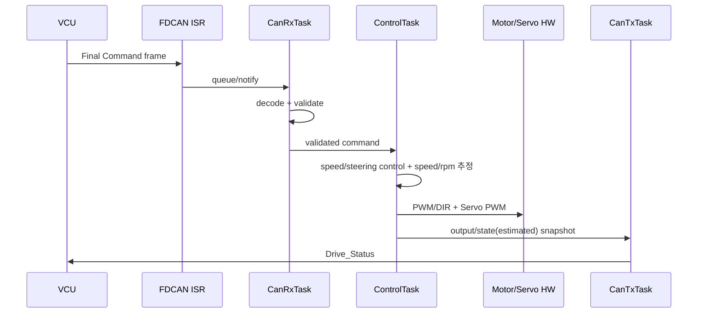
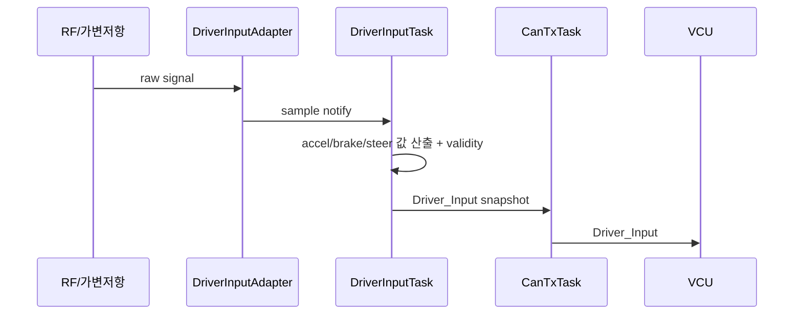
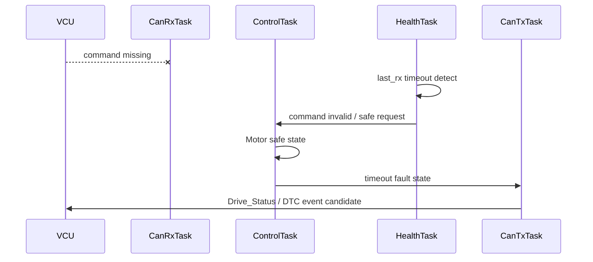
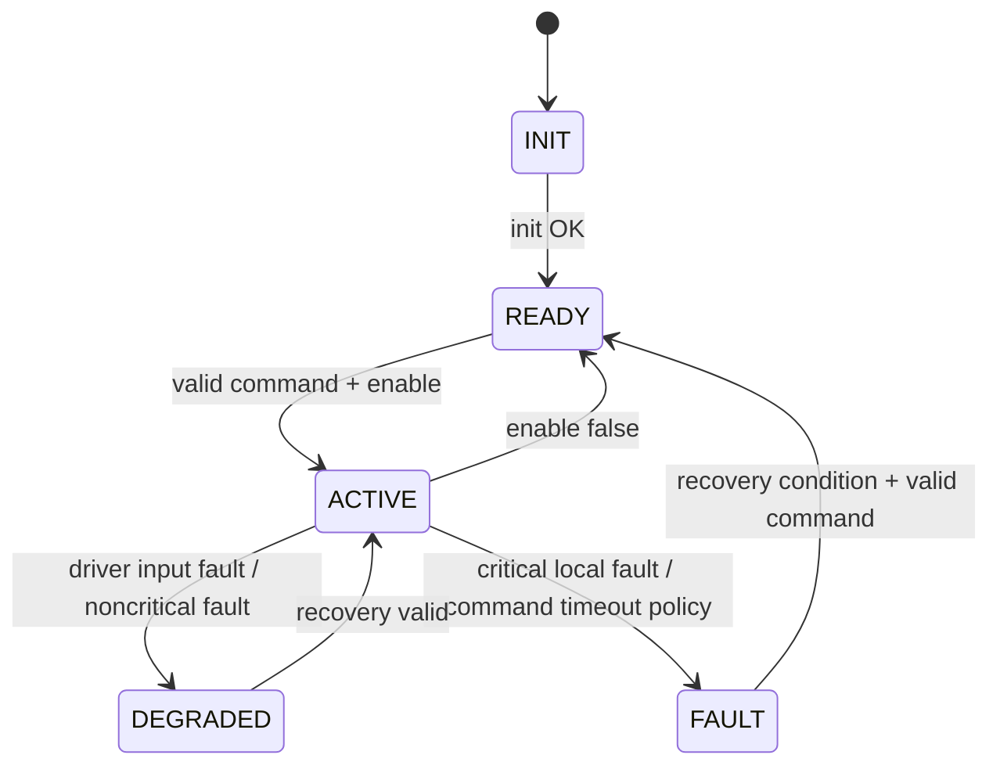

# Motor + Steering Control Software Architecture

> 2026-09-11: STM32G431KB 구매 모델 부분 동결. [최상위 명세](../../system/FINAL_IMPLEMENTATION_SPEC.md) DEC-HW-001~005를 따른다. 제조사/revision/핀 배정과 실기 시험은 별도이며, 아래 시험 결과/측정값을 PASS로 변경한 것은 아니다.

> **2026-09-15 범위 변경 (1차):** Encoder/Hall 기반 Feedback 구조를 삭제했다 (`DEC-HW-012`, `DEC-CTRL-017` REMOVED). `FeedbackTask`/`FeedbackEstimator`/`CaptureAdapter`는 제거하고, RF/가변저항 Driver 입력을 읽는 `DriverInputTask`를 신설했다 (`Driver_Input` publisher가 F에서 C로 이전). `Motor_RPM`/`Vehicle_Speed`는 모터 명령값(PWM) 기반 추정 함수로 대체한다 (`DEC-CTRL-021`, 실측 아님).
>
> **2026-09-15 범위 변경 (2차):** E-Stop/Gear GPIO를 F에서 C로 이전했다 (`DEC-HW-020`/`DEC-HW-026` FROZEN owner node). E-Stop은 EXTI ISR에서 Motor Driver Enable/STBY를 즉시 로컬 차단한다 (CAN 비의존, 이 ECU에서 유일하게 ISR이 안전 액션을 직접 수행하는 예외). `DriverInputTask`가 gear/estop_status를 `Driver_Input`에 포함해 CAN 발행한다. 근거: [`FINAL_IMPLEMENTATION_SPEC.md` §1, §1.2, §3.1, §4.8.1, §6, §8 C Drive](../../system/FINAL_IMPLEMENTATION_SPEC.md).

[프로젝트 홈](../../../README.md) · [문서 안내](../../README.md) · [폴더 목록](README.md)

> 문서 목적: Drive + Steering ECU를 **어떤 Software Component와 FreeRTOS Task로 구현하는지**, 왜 그렇게 나눴는지, 실제 실행 시 어떤 순서로 협력하는지 설명한다.
> 기능 요구사항은 `SPECIFICATION.md`, 검증 결과는 `TEST_REPORT.md`를 기준으로 한다.

## Document Information

| Item | Value |
|---|---|
| Node / System | Motor + Steering Control ECU |
| Owner | C |
| Board / Platform | STM32G431KB (STM32 #2) + Motor Driver + Brushed DC Motor + RC Servo + RF 수신기/가변저항 |
| Execution Model | FreeRTOS + CMSIS-RTOS2 기본 |
| Revision | v0.2 |
| Status | Draft |
| Related Specification | `SPECIFICATION.md` |
| Related Test | `TEST_REPORT.md` |

### Revision History

| Revision | Date | Author | Change |
|---|---|---|---|
| v0.1 | 2026-09-09 | Team | Initial filled RTOS architecture example |
| v0.2 | 2026-09-15 | Team | Encoder/Hall Feedback 구조 삭제, `DriverInputTask` 신설(RF/가변저항 읽기 + `Driver_Input` publish), Motor_RPM/Vehicle_Speed를 명령값 기반 추정 함수로 대체 |
| v0.3 | 2026-09-15 | Team | E-Stop/Gear GPIO를 F에서 C로 이전. E-Stop EXTI ISR 로컬 즉시 차단 경로 추가 |

---

# 1. Introduction & Goals

## 1.1 Purpose

> Drive + Steering ECU는 RF/가변저항 Driver 입력을 읽어 `Driver_Input`으로 발행하고, VCU의 최종 명령을 안전하게 수신해 Motor/Servo 출력으로 변환하며, 모터 명령값 기반 추정 함수로 Speed/RPM 표시값을 계산해 CAN FD로 상태를 반환한다.

## 1.2 Scope

포함:
- RF 수신기/가변저항 read → `Driver_Input` 발행
- FDCAN RX/TX
- Command validation / freshness
- Motor PWM / Direction / Enable
- 모터 명령값 기반 Speed/RPM 추정 (실측 아님)
- Steering command mapping
- Servo PWM
- Fault / timeout / health
- FreeRTOS task scheduling

제외:
- Encoder/Hall 실측 Feedback (삭제됨)
- Closed-loop PID (실측 feedback 부재로 범위 밖)
- VCU arbitration
- Camera/Ultrasonic perception
- HMI rendering
- LIN body control
- DTC history DB

## 1.3 Stakeholders

| Stakeholder | 관심사 / 필요한 정보 |
|---|---|
| C / Drive 담당 | Control logic, timer, driver input, servo, RTOS timing |
| F / VCU·CAN | `Driver_Input`/Command/status contract, timeout, fail-safe |
| B / H735 | Speed/RPM(estimated)/Steering status 표시 데이터 |
| E / HPC | 직접 소비 없음(주차/ADAS와 무관) |
| 테스트 담당 | PWM, 추정 speed/rpm, timeout, jitter, stack/queue health |

---

# 2. Quality Goals

| Priority | Quality Goal | Concrete Scenario / Measure |
|---:|---|---|
| 1 | Safety / Reliability | Command timeout 시 오래된 Motor command를 계속 유지하지 않는다. |
| 2 | Timing | ControlTask/DriverInputTask가 목표 주기와 jitter 범위를 충족한다. |
| 3 | Determinism | CAN burst나 logging 때문에 ControlTask 실행이 불안정해지지 않는다. |
| 4 | Maintainability | Driver Input / Control / Communication을 분리한다. |
| 5 | Testability | CAN 없이 Dummy Command로 Motor/Servo control path를 시험할 수 있다. |

---

# 3. Constraints

| Constraint | Reason / Impact |
|---|---|
| STM32 + FreeRTOS 기본 | 프로젝트 공통 정책 |
| CAN FD Backbone 목표 | VCU 및 다른 Node와 통신 |
| Motor Driver는 TB6612FNG 후보 | 최종 Motor current spec 확인 전 확정 금지 |
| Steering은 RC Servo 기본안 | 실제 pulse/angle calibration 필요 |
| Encoder/Hall 사용하지 않음 (`FROZEN` 방향) | 실측 feedback 없이 명령값 기반 추정만 제공 |
| RF 리모컨 또는 가변저항 중 미확정 | `DEC-HW-024`에서 확정 |
| VCU가 최종 Command Owner | Drive ECU가 ADAS/Driver input arbitration을 직접 하지 않음 |
| 정확한 CAN ID/Task period 일부 TBD | 통합/실측 후 확정 |

---

# 4. Context & Scope View

```mermaid
flowchart LR
    RFIN[RF 수신기 / 가변저항] --> DRIVE[Drive + Steering ECU]
    VCU[VCU] -->|Final Speed / Steering / Enable / Gear| DRIVE
    DRIVE -->|Driver_Input| VCU
    DRIVE -->|PWM / DIR| MD[Motor Driver]
    MD --> MOTOR[Brushed DC Motor]
    DRIVE -->|Servo PWM| SERVO[RC Servo]
    DRIVE -->|RPM(est) / Speed(est) / Steering / Fault| CAN[CAN FD]
    CAN --> VCU
    CAN --> HMI[H735 Cockpit]
    CAN --> HPC[Raspberry Pi HPC]
```

## External Interfaces

| External Entity | Direction | Data / Service | Interface | Owner |
|---|---|---|---|---|
| RF 수신기/가변저항 | RX | driver 입력 신호 | PWM capture / ADC | C |
| VCU | RX | Final command / enable / gear | CAN FD | F |
| VCU | TX | `Driver_Input` | CAN FD | C |
| VCU/H735/HPC | TX | RPM(est) / speed(est) / steering / health | CAN FD | C |
| Motor Driver | TX | PWM / DIR / Enable | Timer/GPIO | C |
| RC Servo | TX | calibrated PWM | Timer PWM | C |

---

# 5. Solution Strategy & Rationale

| Decision / Strategy | Why | Related Quality / Constraint |
|---|---|---|
| ControlTask를 주기 Task로 분리 | 일정한 제어 주기 확보 | Timing |
| CAN RX와 Control 분리 | CAN burst가 control loop를 직접 지연시키지 않게 함 | Determinism |
| DriverInputTask를 별도 Task로 분리 | 입력 read/validate를 control loop와 독립 관리 | Maintainability |
| Speed/RPM 추정은 ControlTask 내 함수로 처리 | 모터 명령값(PWM)에서 바로 계산 가능, 별도 feedback task 불필요 | Maintainability |
| Command는 validation 후 ControlTask에 전달 | 오래되거나 잘못된 command 직접 출력 방지 | Safety |
| CAN TX를 CanTxTask가 담당 | ControlTask blocking 방지 | Determinism |
| Encoder/Hall 미사용 | 실측 feedback 하드웨어 의존성 제거, 명령값 기반 추정으로 단순화 | Constraint |

---

# 6. Building Block / Component View

## 6.1 Top-level Components

```text
                 FDCAN
                   ↓
              CanRxAdapter
                   ↓
             CommandDecoder
                   ↓
            CommandValidator
                   ↓
            CommandRepository
                   ↓
              ControlCore
             ┌─────┴─────┐
             ↓           ↓
       MotorController  SteeringController
             ↓           ↓
        MotorDriverIF   ServoDriverIF
             ↓
       SpeedEstimator (PWM → estimated RPM/speed)

RF/가변저항
    ↓
DriverInputAdapter
    ↓
DriverInputEstimator
    ↓
DriverInputRepository

Control / Estimated Speed / Fault
          ↓
      StatusBuilder
          ↓
       CanTxService
```

## 6.2 Component Responsibility

| Component | Responsibility | Input | Output | Depends On |
|---|---|---|---|---|
| `CanRxAdapter` | FDCAN frame 수신 | RX FIFO | raw frame | HAL/FDCAN |
| `CommandDecoder` | CAN payload → logical command | raw frame | command struct | CAN Matrix |
| `CommandValidator` | range/enum/freshness 검증 | command | valid/invalid | timing/config |
| `CommandRepository` | 최신 valid command 보관 | validated command | snapshot | CanRxTask |
| `MotorController` | speed target → PWM/DIR | command | motor output | calibration/control policy |
| `SteeringController` | steering target → servo command | command | servo output | calibration |
| `SpeedEstimator` | PWM 등 명령값 → estimated RPM/speed | motor output | rpm/speed(estimated) | 추정 함수(`DEC-CTRL-021`) |
| `DriverInputAdapter` | RF/가변저항/Gear raw sample 획득 | ISR/ADC event | raw sample | timer/ADC |
| `DriverInputEstimator` | raw sample → accel/brake/steer/gear 값 | raw sample | driver input struct | 선형 매핑(`DEC-CTRL-019`) |
| `DriverInputRepository` | 최신 Driver 입력(gear/estop_status 포함) 보관 | estimator output | snapshot | DriverInputTask |
| `EstopLocalCutoff` | E-Stop EXTI에서 Motor Driver Enable/STBY 즉시 차단 | GPIO EXTI | GPIO write (즉시) | ISR, CAN 비의존 |
| `FaultManager` | timeout/invalid/RTOS health | health inputs | fault state | timers/RTOS |
| `StatusBuilder` | network status 구성 | command/output/estimate/fault | Drive_Status | repositories |
| `CanTxService` | periodic/event CAN TX (`Driver_Input` 포함) | status/driver input | frame TX | FDCAN |

## 6.3 Suggested Module / Folder Mapping

```text
drive_steering/
├─ app/
│  ├─ command/
│  ├─ control/
│  ├─ driver_input/
│  ├─ fault/
│  └─ status/
├─ drivers/
│  ├─ motor_driver/
│  ├─ servo/
│  └─ driver_input_hw/     # RF receiver 또는 가변저항 ADC
├─ communication/
│  ├─ can_rx/
│  ├─ can_tx/
│  └─ signal_codec/
├─ rtos/
│  ├─ tasks/
│  ├─ queues/
│  └─ health/
└─ config/
   ├─ calibration.h
   └─ drive_config.h
```

---

# 7. Concurrency / RTOS View

## 7.1 Task Model

| Task | Responsibility | Trigger / Period | Relative Priority | Deadline / Target | Stack | Blocking Policy |
|---|---|---|---|---|---|---|
| `CanRxTask` | command decode/validation | CAN event | High | command update latency TBD | TBD | 긴 blocking 금지 |
| `ControlTask` | Motor + Steering control / output update / speed·rpm 추정 | 5~10 ms 후보 | Highest application | 1 cycle 내 완료 | TBD | printf/slow I/O 금지 |
| `DriverInputTask` | RF/가변저항 read → `Driver_Input` 산출 | event / 5~10 ms 후보 | High | next control cycle 전 | TBD | 긴 blocking 금지 |
| `CanTxTask` | `Driver_Input` / `Drive_Status` / Heartbeat TX | 20~50 ms 후보 + event | Normal | status period | TBD | CAN TX service 사용 |
| `HealthTask` | command timeout / task / queue / stack health | 50~100 ms 후보 | Low/Normal | health period | TBD | 짧은 처리 |

`ControlTask`는 application task 중 가장 높은 우선순위 방향으로 두되 정확한 numeric priority는 실측 후 정한다. Encoder 삭제로 기존 `FeedbackTask`는 제거되었다.

## 7.2 Priority Rationale

```text
ControlTask
> CanRxTask / DriverInputTask
> CanTxTask
> HealthTask / Debug Logging
```

단, 실제 interrupt priority와 FreeRTOS API 사용 규칙은 STM32/FreeRTOS 설정에 맞춰 별도로 확인한다.

## 7.3 ISR Map

| Interrupt | Peripheral / Source | ISR Responsibility | Wake-up Target | Mechanism |
|---|---|---|---|---|
| FDCAN RX | CAN frame arrival | 최소 frame metadata/copy | `CanRxTask` | Queue/Notification |
| **E-Stop EXTI** | **GPIO EXTI** | **Motor Driver Enable/STBY GPIO를 ISR 내부에서 즉시 비활성 레벨로 설정 (예외적으로 안전 액션을 ISR이 직접 수행), 이후 notify** | `DriverInputTask` (상태를 `Driver_Input`에 반영) | GPIO write (즉시) + Notification |
| Driver Input capture (PWM capture/ADC), 필요 시 | Timer/ADC | raw sample/timestamp only | `DriverInputTask` | Notification / capture buffer |
| Gear GPIO change, 필요 시 | GPIO/EXTI 또는 polling | raw state only | `DriverInputTask` | Notification |
| Timer Update, 필요 시 | periodic timing | timestamp/event only | relevant task | Notification |

ISR에서 하지 않는 것 (E-Stop의 로컬 GPIO 차단은 예외):
- 제어 연산 전체
- 입력값 선형 매핑/추정 계산 전체
- `printf`
- blocking CAN 송신
- Servo mapping 전체

## 7.4 RTOS Objects / IPC

| Object | Type | Producer | Consumer | Data / Event | Size / Depth | Overflow / Timeout Policy |
|---|---|---|---|---|---|---|
| `CanRxQueue` | Queue | FDCAN ISR | CanRxTask | raw CAN frame | TBD | overflow counter + health fault |
| `CommandQueue` | Queue/latest object | CanRxTask | ControlTask | validated final command | TBD | newest command 우선 정책 검토 |
| `DriverInputNotify` | Task Notification | Driver Input ISR/ADC | DriverInputTask | raw sample ready | counter/index | missed sample 허용 |
| `DriverInputQueue` | Queue/latest object | DriverInputTask | CanTxTask | driver input struct | TBD | latest-value 우선 |
| `StatusQueue` | Queue/latest object | ControlTask | CanTxTask | drive status (est. speed/rpm 포함) | TBD | latest-state policy |
| `HealthFlags` | Event Flags/counters | tasks | HealthTask | alive/overrun/overflow | N/A | missing health → unhealthy |

Command는 오래된 값을 여러 개 순서대로 처리하기보다 **최신 command가 중요한 데이터**이므로 queue depth/overwrite 정책을 실제 CAN 주기와 함께 결정한다.

## 7.5 Shared Resource Ownership

| Resource | Owner Task | Other User | Protection | Reason |
|---|---|---|---|---|
| Motor PWM Timer | `ControlTask` | init only | single owner | output race 방지 |
| Servo PWM Timer | `ControlTask` | init only | single owner | steering output 일관성 |
| Driver Input capture(ADC/PWM) | `DriverInputTask` + ISR adapter | ControlTask는 snapshot만 읽음 | notification/buffer | ISR/task 분리 |
| CAN TX | `CanTxTask`/CanTxService | Fault event producer | TX queue | ControlTask blocking 방지 |
| Command state | CanRxTask writes, ControlTask consumes | HealthTask metadata read | queue/snapshot | direct global write 최소화 |

## 7.6 Scheduling / Delay Policy

- `ControlTask`: `osDelayUntil()` 또는 `vTaskDelayUntil()` 계열 periodic scheduling 권장
- `DriverInputTask`: event-driven 또는 짧은 periodic 방식 중 입력 하드웨어에 맞춰 선택
- `CanRxTask`: event-driven
- `CanTxTask`: periodic + event
- `HealthTask`: periodic
- 일반 Task에서 긴 `HAL_Delay()`/busy wait 사용 금지 방향
- ControlTask 실행시간이 period를 초과하면 overrun counter를 증가시키고 원인을 기록한다.

---

# 8. Runtime View

## 8.1 Normal Drive Command



## 8.2 Driver Input Read



## 8.3 Command Timeout



---

# 9. Deployment / Hardware View

```text
                CAN FD Backbone
                       │
               CAN FD Transceiver
                       │
                     FDCAN
                       │
                STM32 + FreeRTOS
        ┌──────────────┼──────────────┐
        │              │              │
     PWM/DIR       Timer/ADC       Servo PWM
        │          Capture            │
 Motor Driver   RF 수신기/가변저항   RC Servo
        │
 Brushed DC Motor
```

| HW / Runtime Node | Software / RTOS | Interface | Electrical Note |
|---|---|---|---|
| STM32 #2 | FreeRTOS control SW | FDCAN/Timer/GPIO/ADC | STM32G431KB; 실제 보드 revision/핀맵 확인 필요 |
| Motor Driver | MotorDriverIF | PWM/DIR/Enable | TB6612FNG 후보, current fit 확인 |
| Brushed DC Motor | actuator | driver output | voltage/current TBD |
| RF 수신기 또는 가변저항 | DriverInputAdapter | PWM capture / ADC | `DEC-HW-024` 확정 후 기준 |
| RC Servo | steering actuator | PWM | spec/calibration TBD |
| CAN FD Transceiver | physical bus | FDCAN↔CANH/L | part TBD |

## Pin / Peripheral Map

| Function | Device | MCU/Board Pin | Peripheral | Direction | Voltage / Note |
|---|---|---|---|---|---|
| Motor PWM | Motor Driver | TBD | TIMx PWM | OUT | verify driver logic |
| Motor DIR A/B | Motor Driver | TBD | GPIO | OUT | TBD |
| Driver Enable/STBY | Motor Driver | TBD | GPIO | OUT | safe init state |
| Driver Input (accel/brake) | RF 수신기/가변저항 | TBD | TIM Input Capture / ADC | IN | 채택 장치에 따라 확정 |
| Driver Input (steering) | RF 수신기/가변저항 | TBD | TIM Input Capture / ADC | IN | 채택 장치에 따라 확정 |
| Servo PWM | RC Servo | TBD | TIM PWM | OUT | servo spec 기준 |
| E-Stop | E-Stop 스위치 | TBD | GPIO/EXTI | IN | Motor Enable/STBY 로컬 차단 경로와 연계, pull-up/down 확정 필요 |
| Gear | Gear 스위치 | TBD | GPIO/ADC | IN | 버튼/로터리/ADC selector 중 확정 |
| CAN TX/RX | Transceiver | TBD | FDCAN | I/O | schematic 확인 |

---

# 10. Interfaces & Contracts

## 10.1 CAN / CAN FD

### RX

| Message / Signal | Meaning | Sender | Timeout | Timeout Action |
|---|---|---|---|---|
| `Final_Speed_Request` | 최종 속도/구동 요청 | VCU | TBD | motor safe state |
| `Final_Steering_Request` | 최종 조향 요청 | VCU | TBD | safe/hold/center policy TBD |
| `Drive_Enable` | actuator enable | VCU | TBD | disable output |
| `Vehicle_Gear` | direction/mode context | VCU | TBD | drive inhibit/safe policy |

### TX

| Message / Signal | Meaning | Unit | Cycle/Event | Receiver | Valid Condition |
|---|---|---|---|---|---|
| `Driver_Input` | 가속/브레이크/조향 driver 입력 | TBD | periodic TBD | VCU(F) | 입력 신호 valid |
| `Motor_RPM` (estimated) | 명령값 기반 추정 RPM | rpm | periodic TBD | VCU/H735/HPC | 항상 estimated 표시 |
| `Vehicle_Speed` (estimated) | 명령값 기반 추정 속도 | TBD | periodic TBD | VCU/H735/HPC | 항상 estimated 표시 |
| `Steering_Status` | target/valid | TBD | periodic TBD | VCU/H735/HPC | state valid |
| `Drive_Status` | output state / health | flags/enum | periodic TBD | VCU/H735/HPC | ECU running |
| `DTC_Event` | local fault event | code/status | event | Pi/H735/VCU | fault confirmed |
| `ECU_Heartbeat` | node health | enum/flags | periodic TBD | VCU/HPC | scheduler healthy |

## 10.2 LIN

N/A.

---

# 11. Data & State Model

## 11.1 Main Data

| Data | Type | Owner | Meaning | Unit | Valid Range | Invalid Condition |
|---|---|---|---|---|---|---|
| `final_speed_request` | int/float TBD | VCU | final drive target | TBD | CAN contract | timeout/range invalid |
| `final_steering_request` | int/float TBD | VCU | final steering target | TBD | calibrated range | timeout/range invalid |
| `drive_enable` | bool | VCU | actuator enable | bool | true/false | message invalid |
| `driver_accel_input` | int/float | Drive ECU | 가속 입력값 | TBD | 선형 매핑 range | 신호 invalid |
| `driver_brake_input` | int/float | Drive ECU | 브레이크 입력값 | TBD | 선형 매핑 range | 신호 invalid |
| `driver_steer_input` | int/float | Drive ECU | 조향 입력값 | TBD | 선형 매핑 range | 신호 invalid |
| `motor_rpm_estimated` | int/float | Drive ECU | 명령값 기반 추정 RPM | rpm | 추정 함수 range | control invalid |
| `vehicle_speed_estimated` | int/float | Drive ECU | 명령값 기반 추정 속도 | TBD | 추정 함수 range | control invalid |
| `motor_pwm` | int | Drive ECU | applied duty | %/ticks | config range | control invalid |
| `steering_command` | int/float | Drive ECU | servo target | TBD | calibrated limit | request invalid |
| `drive_fault_flags` | bitfield | Drive ECU | local fault state | flags | defined | N/A |

## 11.2 ECU State Machine



| State | Entry Condition | Main Action | Exit Condition |
|---|---|---|---|
| INIT | power on/reset | outputs safe, driver/RTOS init | init complete |
| READY | scheduler/CAN ready | motor disabled/safe, wait valid command | enable + valid command |
| ACTIVE | valid command | periodic control + speed/rpm 추정 | disable/fault/timeout |
| DEGRADED | driver input 신호 unavailable 등 | 안전 기본값/degraded policy TBD | recovery/critical fault |
| FAULT | critical condition | safe output, fault report | recovery policy |

---

# 12. Cross-cutting Concepts

## 12.1 Error Handling

- Invalid CAN command는 actuator에 직접 반영하지 않는다.
- Timeout은 command freshness로 관리한다.
- Driver Input 신호 invalid는 `Driver_Input.request_valid=false`로 분리한다.
- output safe state는 local control path에서 빠르게 적용 가능해야 한다.
- E-Stop만 예외적으로 ISR에서 즉시 안전 액션(Motor Driver disable)을 수행한다 — CAN이나 RTOS Task 스케줄링을 기다리지 않는다.

## 12.2 Diagnostics / DTC

Local fault 후보:
- E-Stop active (참고: 이 fault는 이미 로컬에서 즉시 처리됐고, DTC는 F/B에 상태를 알리는 용도)
- VCU command timeout
- Driver Input 신호 timeout/implausibility
- CAN communication fault
- ControlTask overrun
- queue overflow
- steering feedback fault, 확장 시

Pi DTC Manager/History DB는 삭제됐다 (`DEC-DTC-000` REMOVED). 이 ECU는 **fault detection + `DTC_Event` 발행**만 담당하며, 지속 저장은 어떤 Node도 하지 않는다 — B(IVI)가 실시간 표시만 한다.

## 12.3 Timing

| Task / Function | Period / Trigger | Deadline | Jitter Target | Overrun Action |
|---|---|---|---|---|
| ControlTask | 5~10 ms 후보 | same cycle | TBD | health counter |
| DriverInputTask | event / 5~10 ms 후보 | before next control cycle | TBD | stale input flag |
| CanRxTask | event | TBD | N/A | queue/latency measure |
| CanTxTask | 20~50 ms 후보 + event | period | TBD | health/log |
| HealthTask | 50~100 ms 후보 | period | TBD | watchdog/fault policy |

## 12.4 Communication

- CAN RX는 ISR → Queue/Notification → CanRxTask.
- CAN TX(`Driver_Input` 포함)는 CanTxTask/CanTxService single-owner 방향.
- Heartbeat 주기와 timeout은 공통 CAN Matrix에서 결정.
- Bus-off/error state는 Health/Fault에 반영.

## 12.5 Calibration / Configuration

후보 config:
- motor PWM min/max
- motor direction mapping
- 명령값→speed/rpm 추정 함수 계수 (`DEC-CTRL-021`)
- 입력값→speed/steering 선형 매핑 계수 (`DEC-CTRL-019`)
- wheel/gear ratio, vehicle speed 계산 시
- servo center/left/right
- steering command scale
- command timeout
- brake 감속 감지 threshold (`DEC-CTRL-020`)

Runtime 변경이 필요한 값과 compile-time config를 구분한다.

## 12.6 Memory / Stack / Heap

| Item | Policy / Target | Measurement |
|---|---|---|
| ControlTask stack | TBD | high-water mark |
| DriverInputTask stack | TBD | high-water mark |
| CAN queues | TBD depth | max occupancy |
| heap after startup | 최소화 | runtime free heap |
| dynamic allocation in ControlTask | 사용하지 않는 방향 | code review |
| stack overflow hook | enable 권장 | fault test |

## 12.7 Watchdog / Health Monitoring

```text
ControlTask alive ────┐
CanRxTask alive ──────┤
DriverInputTask alive ┤
Queue health ─────────┤
Command freshness ────┤
                      ↓
                   HealthTask
                      ↓
                 all healthy?
                 ├ Yes → IWDG refresh 후보
                 └ No  → fault / refresh 중단 정책
```

## 12.8 Priority Inversion / Starvation

- ControlTask가 UART/CAN debug mutex를 기다리지 않게 설계한다.
- shared peripheral은 single-owner 방향을 우선한다.
- logging은 낮은 priority 또는 별도 queue 기반으로 분리한다.
- CanRxTask가 burst load로 CPU를 독점하지 않게 frame processing budget을 확인한다.

---

# 13. Architecture Decisions

| ADR ID | Decision | Alternatives | Reason | Consequence |
|---|---|---|---|---|
| ADR-DRV-001 | FreeRTOS task 구조 사용 | one super-loop | control/comm/health 주기 분리 | stack/queue 관리 필요 |
| ADR-DRV-002 | ControlTask가 Motor+Steering output logical owner | motor/steering 별도 direct writers | 출력 상태 동기화와 race 방지 | control task 책임 증가 |
| ADR-DRV-003 | Encoder/Hall 실측 Feedback 삭제, 명령값 기반 추정으로 대체 | Encoder 유지 | HW 단순화, RF/가변저항 입력 우선순위 | 표시 speed/rpm은 항상 estimated |
| ADR-DRV-004 | Driver Input 읽기를 별도 `DriverInputTask`로 분리 | ControlTask에서 직접 read | 입력 샘플링과 제어 주기를 독립 관리 | 추가 IPC 필요 |
| ADR-DRV-005 | CAN TX를 ControlTask에서 직접 blocking 수행하지 않음 | direct transmit | control timing 보호 | CanTxTask 필요 |
| ADR-DRV-006 | TB6612FNG는 후보로 유지 | 즉시 확정 | Motor Stall Current 미확정 | 부품 확정 전 spec 비교 필요 |

---

# 14. Quality Scenarios & Verification

| Quality Goal | Scenario | Measure / Target | Verification |
|---|---|---|---|
| Reliability | VCU command 끊김 | stale command 유지하지 않음 | timeout fault injection |
| Timing | CAN burst + control | ControlTask period/jitter 목표 유지 | trace/runtime stats |
| Driver Input | RF/가변저항 입력 변화 | `Driver_Input` 값 재현성 있게 반영 | signal generator/manual input test |
| Steering | min/center/max command | calibrated mechanical range 내 | bench test |
| RTOS health | long soak | stack/queue overflow 0 | runtime stats |

---

# 15. Risks & Technical Debt

| ID | Risk / Debt | Impact | Mitigation / Next Action | Owner |
|---|---|---|---|---|
| RISK-DRV-001 | Motor current spec 미확정 | Driver 손상/성능 부족 | motor voltage/rated/stall current 확인 | C |
| RISK-DRV-002 | TB6612FNG 적합성 미확정 | driver 재선정 가능 | datasheet/spec comparison | C |
| RISK-DRV-003 | 추정 speed/rpm 오차가 큼 | 표시값 신뢰도 저하 | 추정 함수 calibration + UI 표기 | C |
| RISK-DRV-004 | Servo mechanical limit 미확정 | 과도한 steering command | center/min/max calibration | C |
| RISK-DRV-005 | Task period/priority 미조정 | jitter/overrun | timing profiling | C |
| RISK-DRV-006 | Queue depth 미검증 | CAN burst loss | occupancy/overflow test | C/F |
| RISK-DRV-007 | RF 수신기/가변저항 미확정 | 인터페이스 재설계 가능 | `DEC-HW-024` 조기 확정 | C |

---

# 16. Requirement Traceability

| Requirement ID | Component | Task / Runtime | Interface | Test ID |
|---|---|---|---|---|
| REQ-DRV-001 | DriverInputAdapter/Estimator | DriverInputTask | Timer/ADC | T-DRV-001 |
| REQ-DRV-002 | CanRxAdapter/CommandDecoder | CanRxTask | CAN RX | T-DRV-002 |
| REQ-DRV-005 | MotorController | ControlTask | PWM/DIR | T-DRV-005 |
| REQ-DRV-006 | SteeringController | ControlTask | Servo PWM | T-DRV-006 |
| REQ-DRV-007 | SpeedEstimator | ControlTask | Drive_Status | T-DRV-007 |
| REQ-DRV-008 | FaultManager | HealthTask + ControlTask | command timestamp | T-DRV-008 |
| REQ-DRV-009 | StatusBuilder/CanTxService | CanTxTask | CAN TX | T-DRV-009 |
| REQ-DRV-013 | RTOS scheduling | ControlTask | runtime | T-DRV-013 |
| REQ-DRV-014 | HealthManager | HealthTask | RTOS health | T-DRV-014 |
| REQ-DRV-016 | HW compatibility review | N/A | motor driver | T-DRV-016 |

---

# 17. Glossary

| Term | Meaning |
|---|---|
| Drive ECU | Motor + Steering Control ECU |
| VCU | Vehicle Control Unit |
| PWM | Pulse Width Modulation |
| RPM | Revolutions Per Minute (여기서는 명령값 기반 추정값) |
| Driver Input | RF 리모컨 또는 가변저항으로 들어오는 가속/브레이크/조향 원시 입력 |
| RTOS | Real-Time Operating System |
| ISR | Interrupt Service Routine |
| IWDG | Independent Watchdog |

---

# 18. Architecture Review Checklist

- [ ] VCU와 Drive ECU 역할 경계가 명확하다.
- [ ] Motor/Servo/Driver Input의 실제 Owner가 명확하다.
- [ ] ControlTask 주기와 상대 우선순위 방향이 있다.
- [ ] Driver Input/FDCAN ISR과 Task 책임이 분리되어 있다.
- [ ] CAN burst가 ControlTask를 block하지 않는 구조다.
- [ ] Command Timeout 처리 경로가 있다.
- [ ] Motor safe startup 상태가 정의되어 있다.
- [ ] Steering calibration/TBD가 명시되어 있다.
- [ ] Speed/RPM이 estimated임이 문서와 CAN 계약에 일관되게 표시되어 있다.
- [ ] Stack/Queue/Watchdog 정책이 있다.
- [ ] TB6612FNG를 최종 확정 부품처럼 쓰지 않는다.
- [ ] Requirement → Component/Task → Test 추적이 가능하다.
