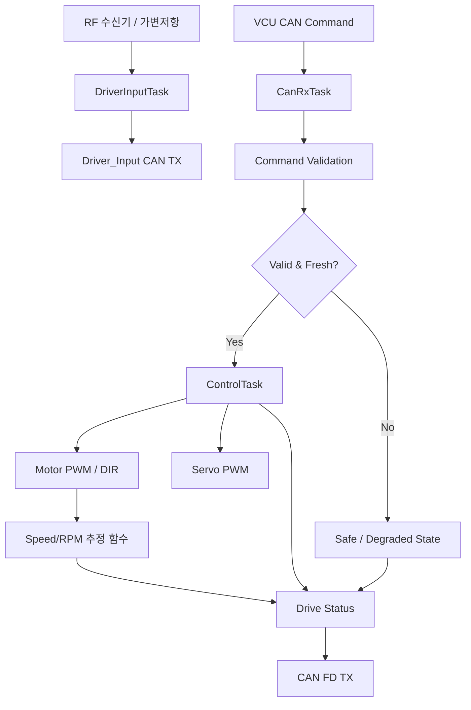

# Motor + Steering Control Functional Specification

> 2026-09-11: STM32G431KB 구매 모델 부분 동결. [최상위 명세](../../system/FINAL_IMPLEMENTATION_SPEC.md) DEC-HW-001~005를 따른다. 제조사/revision/핀 배정과 실기 시험은 별도이며, 아래 시험 결과/측정값을 PASS로 변경한 것은 아니다.

> **2026-09-15 범위 변경:** Encoder/Hall 실측 Feedback을 삭제했다 (`DEC-HW-012`, `DEC-CTRL-017` REMOVED). C는 RF 리모컨 또는 가변저항 기반 Driver 입력을 직접 읽어 `Driver_Input`을 CAN으로 발행하는 owner가 되었고(publisher가 F에서 C로 이전), `Motor_RPM`/`Vehicle_Speed`는 Motor 명령값(PWM 등) 기반 추정 함수 결과로 대체한다 (`DEC-CTRL-021`, 실측 아님). 근거: [`FINAL_IMPLEMENTATION_SPEC.md` §1.1, §3.3, §4.5, §4.6(C 발행 표는 `Driver_Input`이 아니라 §3 공통 계약 참고), §8 C Drive](../../system/FINAL_IMPLEMENTATION_SPEC.md).

[프로젝트 홈](../../../README.md) · [문서 안내](../../README.md) · [폴더 목록](README.md)

> 문서 목적: Drive + Steering ECU가 **무엇을 해야 하는지** 정의한다.
> 구현 구조와 FreeRTOS Task 배치는 `ARCHITECTURE.md`, 실제 검증 결과는 `TEST_REPORT.md`에서 관리한다.

## Document Information

| Item | Value |
|---|---|
| Feature ID | `FEAT-DRIVE-001` |
| Feature / Node Name | Motor + Steering Control ECU |
| Owner | C |
| Role | 제어 + Driver 입력 |
| Status | Draft |
| Priority | MUST |
| Board / Platform | STM32G431KB (STM32 #2) + Motor Driver + Brushed DC Motor + RC Servo + RF 수신기/가변저항 |
| Execution Model | FreeRTOS + CMSIS-RTOS2 기본 |
| Related Architecture | `ARCHITECTURE.md` |
| Related Test | `TEST_REPORT.md` |

### Revision History

| Revision | Date | Author | Change |
|---|---|---|---|
| v0.1 | 2026-09-09 | Team | Initial filled example with FreeRTOS |
| v0.2 | 2026-09-15 | Team | Encoder/Hall 실측 Feedback 삭제, RF/가변저항 Driver 입력 읽기(`DriverInputTask`, `Driver_Input` publisher를 C로 이전) 추가, Motor_RPM/Vehicle_Speed를 명령값 기반 추정 함수로 대체 |

---

# 1. Purpose and Scope

## 1.1 한 문장 설명

> Drive + Steering ECU는 RF 리모컨 또는 가변저항으로 들어오는 Driver 입력을 읽어 `Driver_Input`으로 CAN에 발행하고, VCU가 CAN FD로 전달한 최종 속도/조향 명령을 검증해 Motor와 Steering Actuator가 사용할 실제 출력으로 변환하며, 명령값 기반 추정 Speed/RPM과 ECU 상태를 다시 차량 네트워크에 제공한다.

## 1.2 포함 범위

- RF 수신기 또는 가변저항 기반 Driver 입력(가속/브레이크/조향) 읽기
- `Driver_Input` CAN 발행 (C가 publisher)
- VCU의 최종 Drive / Steering Command 수신
- Command 유효성 및 Timeout 검증
- Brushed DC Motor PWM / Direction 제어
- Motor Driver Enable / Standby 상태 관리
- Motor 명령값(PWM 등) 기반 Speed/RPM 추정 함수 (`DEC-CTRL-021`, 실측 아님)
- RC Servo Steering Command 생성
- Steering Center / Left / Right Calibration
- Drive / Steering 상태 CAN 송신
- Local Fault Detection
- FreeRTOS Task / ISR / Queue 기반 실행 구조
- Health Monitoring / Watchdog-ready 구조

## 1.3 제외 범위

- Encoder/Hall 기반 실측 Feedback (삭제됨, `DEC-HW-012`/`DEC-CTRL-017` REMOVED)
- Closed-loop Speed Control/PID (실측 feedback이 없으므로 범위 밖; `DEC-CTRL-018`은 OPEN으로 남지만 실측 기반 PID는 전제하지 않는다)
- Gear P/R/N/D 최종 상태 결정
- ADAS Camera Processing
- ADAS/Parking 요청의 최종 우선순위 판단
- Ultrasonic 거리 계산
- H735 UI Rendering
- LIN Body Network
- DTC History DB 저장

최종 Arbitration은 VCU가 담당한다. 이 ECU는 **Driver 입력을 읽어 발행하고, VCU가 승인한 최종 명령을 실제 Actuator 제어로 실행하는 Node**다.

---

# 2. Usage / System Scenario

## 2.1 Driver 입력 읽기

| Item | Description |
|---|---|
| Actor / Trigger | RF 수신기 또는 가변저항 하드웨어 |
| Preconditions | ECU 초기화 완료, 입력 장치 연결 |
| Trigger | 주기적 샘플링 |
| Normal Flow | RF/가변저항 신호 read → `DriverInputTask` 처리 → 가속/브레이크/조향 값 산출 → `Driver_Input` CAN 발행 |
| Postconditions | F(VCU)가 최신 Driver 입력을 받아 최종 명령 산출에 사용할 수 있음 |

## 2.2 정상 Drive Command

| Item | Description |
|---|---|
| Actor / Trigger | VCU의 `Final_Speed_Request` / `Drive_Enable` CAN Message |
| Preconditions | ECU 초기화 완료, Motor output safe state, CAN 정상, Command valid |
| Trigger | 새로운 유효 Drive Command 수신 |
| Normal Flow | CAN RX → Command Validate → ControlTask 적용 → Motor PWM/DIR 갱신 → 명령값 기반 Speed/RPM 추정 → Status 갱신 |
| Postconditions | Motor output이 승인된 최종 명령에 맞게 갱신되고 상태가 CAN으로 제공됨 |

## 2.3 정상 Steering Command

| Item | Description |
|---|---|
| Actor / Trigger | VCU의 `Final_Steering_Request` |
| Preconditions | Steering Servo 초기화/Calibration 정보 유효 |
| Trigger | 유효 Steering Command 수신 |
| Normal Flow | CAN RX → Range/Validity Check → Steering Mapping → Servo PWM Update |
| Postconditions | Servo target이 허용된 Steering 범위 내에서 적용됨 |

## 2.4 Command Timeout

| Item | Description |
|---|---|
| Actor / Trigger | VCU Command 미수신 |
| Preconditions | Drive/Steering 기능 실행 중 |
| Trigger | 정의된 Command Timeout 초과 |
| Normal Flow | Timeout Detect → Drive invalid → Motor output safe state → Fault flag/DTC candidate → Status 송신 |
| Postconditions | 오래된 Command가 계속 유지되지 않고 정의된 Safe/Degraded State로 전환됨 |

정확한 Timeout과 Steering timeout 시 `hold / center / neutral` 정책은 VCU/기구 설계와 통합 시험 후 확정한다.

---

# 3. Functional Flow



---

# 4. Inputs

| Input ID | Input | Source | Interface | Unit / Range | Valid Condition | Update / Trigger |
|---|---|---|---|---|---|---|
| IN-DRV-001 | RF 수신기 또는 가변저항 신호 | Driver 입력 장치 | PWM capture / ADC (`DEC-HW-024`) | 채널별 pulse/ADC raw | 신호 정상 범위 | 주기적 샘플링 |
| IN-DRV-002 | `Final_Speed_Request` | VCU | CAN FD | `%` 또는 project speed unit, TBD | valid flag / range / timeout 정상 | Periodic/Event TBD |
| IN-DRV-003 | `Final_Steering_Request` | VCU | CAN FD | deg 또는 normalized %, TBD | 허용 Steering range | Periodic/Event TBD |
| IN-DRV-004 | `Drive_Enable` | VCU | CAN FD | bool | defined enum/bool | Periodic/Event TBD |
| IN-DRV-005 | `Vehicle_Gear` / Direction info | VCU | CAN FD | P/R/N/D enum | defined value | Periodic/Event TBD |
| IN-DRV-006 | Steering feedback, 선택 확장 | Steering sensor | ADC/I2C | angle, TBD | sensor valid | Periodic TBD |
| IN-DRV-007 | Motor temperature, 선택 확장 | Temperature sensor | ADC/I2C | °C | sensor valid | Periodic TBD |

`Final_Speed_Request`, `Vehicle_Gear`, `Drive_Enable`을 하나의 CAN frame으로 묶을지 별도 signal로 둘지는 공통 CAN Matrix에서 확정한다 (최상위 명세 `Final_Drive_Command` 통합 계약과의 정합은 CAN Matrix 확정 시 함께 정리한다). RF/가변저항 중 실제 채택 장치는 `DEC-HW-024`에서 확정한다.

---

# 5. Outputs

| Output ID | Output | Destination | Interface | Unit / Range | Update / Event | Valid Condition |
|---|---|---|---|---|---|---|
| OUT-DRV-000 | `Driver_Input` (가속/브레이크/조향) | VCU(F) | CAN FD | TBD (`DEC-CTRL-019` 선형 매핑) | 주기적 | 입력 신호 valid |
| OUT-DRV-001 | Motor PWM | Motor Driver | Timer PWM | duty %, actual range TBD | ControlTask period | Drive enabled / command valid |
| OUT-DRV-002 | Motor Direction | Motor Driver | GPIO | Forward/Reverse/Stop | command change | valid command |
| OUT-DRV-003 | Motor Driver Enable/Standby | Motor Driver | GPIO | bool | state change | ECU state |
| OUT-DRV-004 | Servo PWM / command | RC Servo | Timer PWM | calibrated target | ControlTask period/event | steering request valid |
| OUT-DRV-005 | `Motor_RPM` (estimated) | VCU/H735/HPC | CAN FD | rpm | Status period TBD | 명령값 기반 추정, 실측 아님 |
| OUT-DRV-006 | `Vehicle_Speed` (estimated) | VCU/H735/HPC | CAN FD | project unit | Status period TBD | 명령값 기반 추정, 실측 아님 |
| OUT-DRV-007 | `Steering_Status` | VCU/H735/HPC | CAN FD | target/status | Status period TBD | valid state |
| OUT-DRV-008 | `Drive_Status` / `Fault_Flags` | VCU/H735/HPC | CAN FD | flags/enum | periodic/event | ECU running |
| OUT-DRV-009 | Local DTC Event | Pi/H735/VCU | CAN FD | code/status | fault event | fault confirmed |

`Motor_RPM`/`Vehicle_Speed`는 Encoder/Hall 실측값이 아니라 PWM 등 모터 명령값 기반 추정 함수의 결과다. IVI/Cluster는 이 필드가 추정값임을 UI에서 구분해야 한다 (`DEC-CTRL-021`).

---

# 6. Functional Requirements

| Requirement ID | Requirement | Priority | Verification | Related Test |
|---|---|---|---|---|
| REQ-DRV-001 | ECU는 RF 수신기 또는 가변저항 입력을 읽어 `Driver_Input`으로 CAN 발행해야 한다. | MUST | Test | T-DRV-001 |
| REQ-DRV-002 | ECU는 VCU가 전송한 최종 Drive/Steering Command를 수신해야 한다. | MUST | Test | T-DRV-002 |
| REQ-DRV-003 | ECU는 유효하지 않거나 정의 범위를 벗어난 Command를 그대로 Actuator에 적용하지 않아야 한다. | MUST | Fault Test | T-DRV-003 |
| REQ-DRV-004 | ECU는 `Drive_Enable=false` 또는 허용되지 않은 Vehicle State에서 Motor 구동 출력을 비활성화해야 한다. | MUST | Test | T-DRV-004 |
| REQ-DRV-005 | ECU는 유효 Drive Command를 Motor PWM/Direction으로 변환해야 한다. | MUST | Test | T-DRV-005 |
| REQ-DRV-006 | ECU는 유효 Steering Command를 보정된 Servo Command로 변환해야 한다. | MUST | Test | T-DRV-006 |
| REQ-DRV-007 | ECU는 Motor 명령값(PWM 등) 기반으로 Speed/RPM 표시값을 추정하는 함수를 제공해야 하며, 이 값이 실측이 아님을 CAN 소비자(IVI)가 식별 가능해야 한다. | MUST | Test/Inspect | T-DRV-007 |
| REQ-DRV-008 | ECU는 VCU Command가 Timeout되면 오래된 Drive Command를 계속 유지하지 않아야 한다. | MUST | Fault Test | T-DRV-008 |
| REQ-DRV-009 | ECU는 Drive/Steering 상태와 주요 Fault를 CAN으로 제공해야 한다. | MUST | Test | T-DRV-009 |
| REQ-DRV-010 | ECU는 초기화 완료 전 Motor를 의도치 않게 구동하지 않아야 한다. | MUST | Inspect/Test | T-DRV-010 |
| REQ-DRV-011 | ECU는 Encoder/Hall 등 실측 Feedback 하드웨어에 의존하지 않아야 한다. | MUST | Inspect | T-DRV-011 |
| REQ-DRV-012 | Control 기능은 CAN 수신, Driver 입력 읽기, 상태 송신, 진단/로그와 분리된 RTOS 실행 구조를 가져야 한다. | MUST | Inspect | T-DRV-012 |
| REQ-DRV-013 | 중요 ControlTask는 UART printf, blocking log, 장시간 CAN TX 대기로 인해 주기가 무너져서는 안 된다. | MUST | Load Test | T-DRV-013 |
| REQ-DRV-014 | ECU는 Task Alive, Queue Overflow, Command Timeout 등 핵심 Health 상태를 감시할 수 있어야 한다. | MUST | RTOS Test | T-DRV-014 |
| REQ-DRV-015 | Watchdog을 사용할 경우 모든 중요 Task가 Healthy일 때만 Refresh하도록 설계해야 한다. | SHOULD | Fault Test | T-DRV-015 |
| REQ-DRV-016 | Motor Driver 확정 전 Motor 전압/정격 및 Stall Current와 Driver 정격 적합성을 확인해야 한다. | MUST | Inspect | T-DRV-016 |

---

# 7. Rules / Conditions

| Rule ID | Condition / Control Rule | Result |
|---|---|---|
| RULE-DRV-001 | `Drive_Enable=false` | Motor command = safe state |
| RULE-DRV-002 | Command timeout | Motor safe state + timeout fault |
| RULE-DRV-003 | Invalid Speed Request | Reject/clamp 정책 중 공통 규격에 따른 처리, Fault flag |
| RULE-DRV-004 | Invalid Steering Request | 허용 범위 밖 값 직접 적용 금지 |
| RULE-DRV-005 | ECU INIT | Motor Driver Standby/Disable 유지 |
| RULE-DRV-006 | Driver 입력 신호 invalid | `Driver_Input.request_valid=false`, 안전 기본값 사용 |
| RULE-DRV-007 | Gear/Direction 상태 불일치 | Motor direction 변경 전 안전 정책 적용, 상세 TBD |
| RULE-DRV-008 | Critical Local Fault | VCU에 Fault 상태 통보, 필요 시 local output safe state |
| RULE-DRV-009 | Speed/RPM 추정값 | 항상 "estimated" 임을 CAN 소비자가 식별 가능한 형태로 제공 |

Motor direction 전환, Steering timeout 시 위치는 실제 Motor/Servo/차체 기구를 확인한 뒤 확정한다.

---

# 8. Exceptions / Edge Cases

| Case ID | Exception / Edge Case | Detection | Expected Behavior | Recovery |
|---|---|---|---|---|
| EDGE-DRV-001 | VCU command timeout | last_rx timestamp | Motor safe state, timeout status | fresh valid command + recovery policy |
| EDGE-DRV-002 | CAN payload malformed | decode/validity check | command reject | valid message receive |
| EDGE-DRV-003 | Speed request out-of-range | range check | reject/clamp + fault policy | valid request |
| EDGE-DRV-004 | Steering request out-of-range | range check | mechanical limit 밖 command 금지 | valid request |
| EDGE-DRV-005 | Driver 입력 신호 missing/disconnect | signal timeout | `Driver_Input` invalid, 안전 기본값 | 신호 복구 |
| EDGE-DRV-006 | Queue full | RTOS queue API/result | drop/overwrite/health flag policy | queue drains |
| EDGE-DRV-007 | ControlTask overrun | runtime timestamp/health | health fault, timing evidence | load/root cause fix |
| EDGE-DRV-008 | CAN burst | queue occupancy / timing | ControlTask deadline 유지 | load normal |
| EDGE-DRV-009 | Servo target beyond mechanical range | calibrated limit check | clamp/reject to safe allowed range | valid target |

---

# 9. UI / UX Reference

N/A. 이 ECU는 직접 UI를 제공하지 않는다.

상태는 H735에서 표시한다.

```text
Drive + Steering ECU
→ Motor_RPM(estimated) / Speed(estimated) / Steering_Status / Fault
→ CAN FD
→ H735 Cluster + IVI
```

---

# 10. Interface Requirements

## 10.1 Hardware

| Device | Interface | Electrical / Voltage | Requirement / Note |
|---|---|---|---|
| Brushed DC Motor | Motor Driver output | Motor spec 기준 | 실제 Motor 모델 TBD |
| TB6612FNG 후보 | PWM / Direction / Standby | Datasheet + Board logic 기준 | Motor Stall Current 적합성 확인 후 확정 |
| RC Servo | Timer PWM | Servo spec 기준 | pulse/angle은 실제 Servo calibration 기준 |
| RF 수신기 또는 가변저항 | PWM capture / ADC | `DEC-HW-024` 확정 후 기준 | 채택 장치에 따라 인터페이스 확정 |
| CAN FD Transceiver | FDCAN ↔ CANH/L | selected part 기준 | 실제 STM32/FDCAN 지원 여부 확인 |

MCU GPIO에서 DC Motor를 직접 구동하지 않는다. Encoder/Hall 하드웨어는 이 ECU에 연결하지 않는다.

## 10.2 CAN / CAN FD

| Message / Signal | TX/RX | Owner / Peer | Unit | Cycle/Event | Timeout | Timeout Action |
|---|---|---|---|---|---|---|
| `Driver_Input` | TX | C → VCU | TBD | TBD | N/A | local log if send fail |
| `Final_Speed_Request` | RX | VCU | TBD | TBD | TBD | Motor safe state |
| `Final_Steering_Request` | RX | VCU | TBD | TBD | TBD | steering safe/degraded policy TBD |
| `Drive_Enable` | RX | VCU | bool | TBD | TBD | output disable |
| `Vehicle_Gear` | RX | VCU | enum | TBD | TBD | drive inhibit/safe policy |
| `Drive_Status` | TX | VCU/H735/HPC | struct | periodic TBD | N/A | health/log |
| `Motor_RPM` (estimated) | TX | VCU/H735/HPC | rpm | periodic TBD | N/A | 항상 estimated 표시 |
| `Steering_Status` | TX | VCU/H735/HPC | TBD | periodic TBD | N/A | valid flag |
| `DTC_Event` | TX | Pi/H735/VCU | code/status | event | N/A | event/log |
| `ECU_Heartbeat` | TX | VCU/HPC | alive/health | periodic TBD | N/A | network health |

CAN ID, DLC, scale, offset, endian은 공통 CAN Matrix에서 확정한다.

## 10.3 LIN

N/A.

## 10.4 API / IPC / File

N/A for MCU external interface. 내부 RTOS Queue/Notification은 Architecture에서 정의한다.

---

# 11. Timing / Performance Requirements

| Requirement | Target | Verification |
|---|---|---|
| DriverInputTask sampling period | 5~10 ms 후보, 실제 입력 장치 시험 후 확정 | timestamp / trace |
| ControlTask period | 5~10 ms 후보, 실제 plant/MCU 시험 후 확정 | timestamp / trace |
| Status CAN period | 20~50 ms 후보 | CAN log |
| Command timeout | TBD | fault injection |
| ControlTask jitter | TBD after baseline | trace/runtime measurement |
| CAN RX → command repository update | TBD | timestamp |
| Command → PWM update latency | TBD | scope / timestamp |

후보 값은 설계 시작점일 뿐 확정 요구사항이 아니다.

---

# 12. Execution / RTOS Requirements

## 12.1 Task Requirement

| Task / Service | Responsibility | Trigger / Period | Priority Direction | Deadline / Response | Blocking Allowed? |
|---|---|---|---|---|---|
| `CanRxTask` | VCU command decode/validate | CAN event | High | command update latency TBD | 긴 blocking 금지 |
| `ControlTask` | speed/steering final control, PWM update, 명령값 기반 speed/RPM 추정 | 5~10 ms 후보 | Highest application | period 내 완료 | blocking log 금지 |
| `DriverInputTask` | RF/가변저항 read, `Driver_Input` 산출 | 5~10 ms 후보 / event | High | next control cycle 전 최신화 목표 | 긴 blocking 금지 |
| `CanTxTask` | `Driver_Input`/`Drive_Status`/Heartbeat 송신 | 20~50 ms 후보 + event | Normal | status period | CAN TX queue 사용 |
| `HealthTask` | timeout/task/queue/stack health | 50~100 ms 후보 | Low/Normal | health period | 짧은 처리 |

정확한 Priority 숫자와 Stack은 실측 후 확정한다. Encoder 삭제로 기존 `FeedbackTask`는 제거되었다.

## 12.2 Event / Communication Requirement

| Producer | Consumer | Mechanism | Data | Overflow / Timeout Policy |
|---|---|---|---|---|
| FDCAN ISR | `CanRxTask` | Queue / Notification | raw frame/ref | queue full health flag |
| `CanRxTask` | `ControlTask` | Command Queue / latest-command object | validated command | 오래된 command 금지 |
| Driver Input ADC/PWM capture | `DriverInputTask` | Timer/ADC event | raw sample | 최신 sample 우선 |
| `DriverInputTask` | `CanTxTask` | Queue / repository | `Driver_Input` | latest-value 유지 |
| `ControlTask` | `CanTxTask` | Status Queue / repository | target/output/estimated speed/rpm/state | latest status 유지 |
| Tasks | `HealthTask` | Event Flags / health counters | alive/overrun | missing flag → unhealthy |

## 12.3 ISR Requirement

| Interrupt | ISR이 해야 하는 일 | Task로 넘길 일 | Constraint |
|---|---|---|---|
| Driver Input capture (PWM/ADC), 필요 시 | raw sample/timestamp 최소 저장 | 값 변환/valid 판단 | printf/blocking 금지 |
| FDCAN RX | frame handle/copy + task wake | decode/validity | 최소 처리 |
| Timer update, 필요 시 | timestamp/event | control computation | Control algorithm ISR 실행 금지 |

## 12.4 Resource / Memory Requirement

- Task Stack은 CubeMX default를 맹신하지 않고 high-water mark로 검증한다.
- Command Queue depth는 CAN burst 및 control period를 고려해 시험한다.
- ControlTask에서는 동적 메모리 할당을 사용하지 않는 방향을 우선한다.
- Motor PWM Timer는 `ControlTask`가 논리적 owner가 된다.
- Driver Input 캡처 리소스는 `DriverInputTask`가 논리적 owner가 된다.
- CAN TX는 `CanTxTask` single-owner 구조를 우선한다.

## 12.5 Watchdog / Health Requirement

| Health Item | Detection | Action |
|---|---|---|
| `ControlTask` alive | cycle counter / Event Flag | unhealthy → watchdog refresh 금지 후보 |
| `DriverInputTask` alive | cycle counter / Event Flag | unhealthy → Driver_Input invalid 처리 |
| `CanRxTask` alive | event/health counter | communication fault |
| Command timeout | timestamp | Motor safe state |
| Driver Input signal stale | timestamp/valid flag | Driver_Input invalid, 안전 기본값 |
| Queue overflow | RTOS return/counter | fault counter + DTC candidate |
| Stack low watermark | runtime measurement | stack sizing 수정 / health warning |
| Task overrun | cycle execution time | health flag / profiling |

---

# 13. Safety / Fail-safe / DTC

| Fault | Detection | Safe / Local Action | DTC Candidate | Recovery |
|---|---|---|---|---|
| VCU command timeout | timestamp | Motor safe state | `DRV_COMM_TIMEOUT` 후보 | fresh valid command + policy |
| Driver Input signal unavailable | signal timeout | `Driver_Input` invalid / 안전 기본값 | `DRV_INPUT_TIMEOUT` 후보 | 신호 recovery |
| Steering feedback invalid, 확장 시 | sensor validity | safe/degraded steering policy | `STR_FEEDBACK_INVALID` 후보 | valid sensor |
| ControlTask overrun | runtime monitor | health fault | `DRV_TASK_OVERRUN` 후보 | load/fix/restart policy |
| CAN fault | controller state | command validity loss + safe policy | `DRV_CAN_FAULT` 후보 | CAN recovery |

TB6612FNG 자체에서 Fault Pin이 제공되는 것으로 가정하지 않는다. 실제 Motor Driver가 Fault/Current/Temperature 진단 신호를 제공하는 경우에만 해당 진단을 추가한다.

---

# 14. Acceptance Criteria

- [ ] Build / Flash / FreeRTOS scheduler 실행이 가능하다.
- [ ] Power ON 직후 Motor가 의도치 않게 구동되지 않는다.
- [ ] 낮은 출력의 bench 조건에서 Motor PWM/DIR 동작을 확인한다.
- [ ] Servo Center / Left / Right 동작과 기구 한계를 기록한다.
- [ ] RF/가변저항 입력을 읽어 `Driver_Input`을 CAN으로 발행한다.
- [ ] Motor 명령값 기반 Speed/RPM 추정값을 산출하고, 이 값이 estimated임을 확인한다.
- [ ] VCU dummy/real CAN Command를 수신해 Motor/Steering output에 반영한다.
- [ ] Command Timeout 시 오래된 Motor Command가 유지되지 않는다.
- [ ] `Drive_Status`를 CAN으로 송신한다.
- [ ] `ControlTask`, `DriverInputTask`, `CanRxTask`, `CanTxTask`, `HealthTask`의 실행을 확인한다.
- [ ] Driver Input/FDCAN ISR에서 긴 계산/printf를 하지 않는다.
- [ ] ControlTask/DriverInputTask period/jitter를 측정한다.
- [ ] Stack high-water와 Queue occupancy를 측정한다.
- [ ] Queue overflow/Task delay fault scenario를 최소 한 번 시험한다.
- [ ] Motor/Driver 전기적 적합성 확인 전 최종 Hardware로 확정하지 않는다.

---

# 15. Open Issues / TBD

| ID | Item | Owner | Target Date / Condition |
|---|---|---|---|
| TBD-DRV-001 | STM32G431KB 모델 동결; 보드 FDCAN 핀/배선 검증 잔여 | C/F | DEC-HW-002; Gate A |
| TBD-DRV-002 | Motor 모델 / Voltage / Rated Current / Stall Current | C | Motor 선정 |
| TBD-DRV-003 | TB6612FNG 사용 확정 여부 | C | Motor spec 비교 후 |
| TBD-DRV-004 | RF 리모컨 vs 가변저항 최종 선택 | C | `DEC-HW-024` |
| TBD-DRV-005 | Servo 모델 / calibration / mechanical range | C | Servo/기구 조립 후 |
| TBD-DRV-006 | Motor PWM frequency | C | Driver/Motor 시험 후 |
| TBD-DRV-007 | Speed control unit / scale | C/F | CAN Matrix 확정 |
| TBD-DRV-008 | DriverInputTask/ControlTask period | C | Timing test 후 |
| TBD-DRV-009 | Command Timeout | C/F | Integration policy |
| TBD-DRV-010 | 입력값→speed/steering 선형 매핑 계수 | C | `DEC-CTRL-019` |
| TBD-DRV-011 | Motor 명령값→speed/rpm 추정 함수 형태 | C | `DEC-CTRL-021` |
| TBD-DRV-012 | Brake 감속 감지→`brake_lamp` threshold | C/F | `DEC-CTRL-020` |
| TBD-DRV-013 | Steering timeout safe position | C/F | 기구/안전 정책 확정 |
