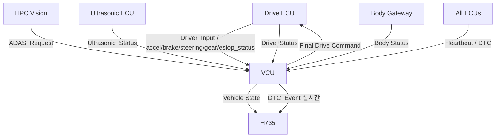
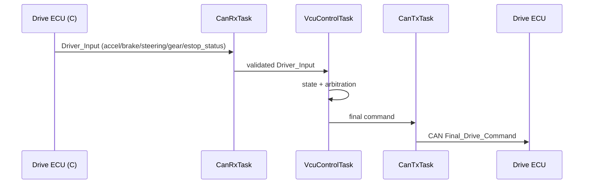
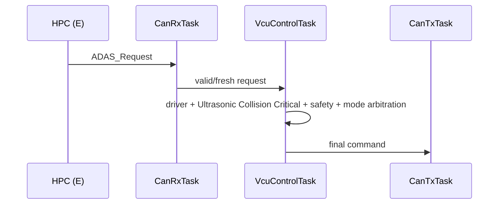
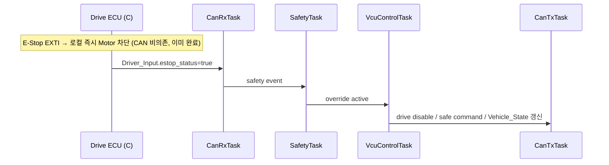
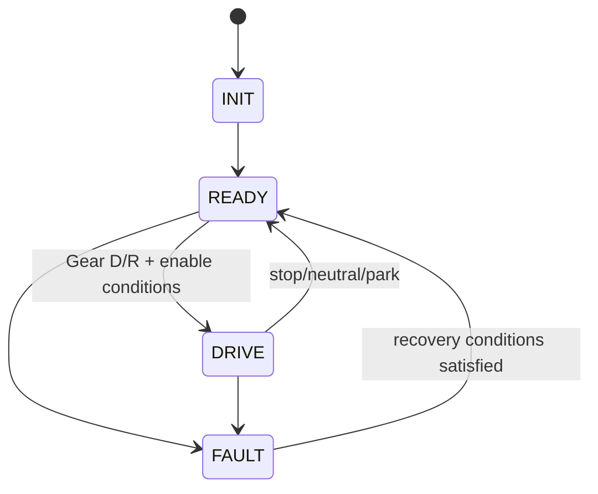

# VCU + DTC + CAN Integration Software Architecture

> 2026-09-11: STM32G431KB 구매 모델 부분 동결. [최상위 명세](../../system/FINAL_IMPLEMENTATION_SPEC.md) DEC-HW-001~005를 따른다. 제조사/revision/핀 배정과 실기 시험은 별도이며, 아래 시험 결과/측정값을 PASS로 변경한 것은 아니다.

> **2026-09-15 범위 변경 (1차):** `Driver_Input`(가속/브레이크/조향) publisher가 F에서 C로 이전됐다. F는 더 이상 GPIO/ADC로 Driver Input을 직접 읽지 않으며, `DriverInputTask`/`DriverInputAdapter`는 제거하고 C가 발행한 `Driver_Input`을 CAN RX로 수신해 arbitration에 사용한다. `Vision_Request`는 `ADAS_Request`로 명칭을 통일했다.
>
> **2026-09-15 범위 변경 (2차):** Gear/E-Stop 물리 입력도 F에서 C로 이전했다. F는 Driver/Gear/E-Stop 입력 GPIO를 갖지 않으며(`LocalInputTask`/`LocalInputAdapter` 제거), C가 로컬에서 E-Stop을 즉시 차단(CAN 비의존)한 뒤 `Driver_Input.gear`/`estop_status`로 보고한 값을 CAN으로만 받는다. Pi DTC Manager(History DB)는 삭제됐다 — `DTC_Event`는 B(IVI)가 실시간(Active만) 구독·표시하며, F/Pi 어디에도 지속 저장하지 않는다.

[프로젝트 홈](../../../README.md) · [문서 안내](../../README.md) · [폴더 목록](README.md)

> 문서 목적: VCU가 Driver_Input(CAN, gear/estop 포함), CAN Request, Fault를 어떤 FreeRTOS 구조로 받아 최종 차량 명령으로 만드는지 설명한다.

## Document Information

| Item | Value |
|---|---|
| Node / System | VCU + DTC + CAN Integration |
| Owner | F |
| Board / Platform | STM32G431KB (STM32 #5) |
| Execution Model | FreeRTOS + CMSIS-RTOS2 |
| Revision | v0.3 |
| Status | Draft |
| Related Specification | `SPECIFICATION.md` |
| Related Test | `TEST_REPORT.md` |

# 1. Introduction & Goals

## Purpose

VCU는 프로젝트에서 **최종 차량 판단과 안전 우선순위 적용**을 담당한다.

```text
Driver_Input (CAN, C 발행 — accel/brake/steering/gear/estop_status)
ADAS_Request
Ultrasonic_Status (Collision Critical 포함)
Peer ECU Status/Fault
        ↓
       VCU
        ↓
Final Speed / Steering / Enable
```

## Scope

포함:
- Driver_Input(CAN) 수신/validation (물리 GPIO 없음 — accel/brake/steering/gear/E-Stop 전부 C가 읽어 CAN으로 발행)
- vehicle mode/state
- arbitration
- safety override
- CAN RX/TX
- heartbeat
- DTC 발행/실시간 통합 (지속 저장 없음)
- RTOS health/watchdog

제외:
- Motor/Servo PWM
- Vision processing
- Ultrasonic distance calculation
- Lamp GPIO
- HMI rendering
- Gear/E-Stop 물리 입력 획득 (C 소유)
- E-Stop 실제 차단 (C가 로컬로 수행)
- DTC 지속 저장/History (삭제됨)

# 2. Quality Goals

| Priority | Goal | Scenario |
|---:|---|---|
| 1 | Safety | E-Stop/critical fault 발생 시 normal request보다 먼저 safe command 적용 |
| 2 | Timing | Control/Safety task가 deadline을 지키고 logging에 막히지 않음 |
| 3 | Reliability | CAN timeout/stale request가 최종 명령에 계속 쓰이지 않음 |
| 4 | Testability | Dummy Driver/CAN input으로 arbitration 단독 시험 가능 |
| 5 | Maintainability | Input, Safety, Arbitration, CAN, Diagnostics 분리 |

# 3. Constraints

- STM32 + FreeRTOS 사용
- CAN FD backbone 목표
- 최종 actuator PWM은 Drive ECU 소유
- Camera raw frame 미수신
- F는 물리 GPIO를 갖지 않는다 (Gear/E-Stop 포함 모든 driver 입력은 C 경유)
- DTC 지속 저장/History DB 없음 (Pi DTC Manager 삭제, `DEC-DTC-000` REMOVED)
- CAN ID/timeout 일부 TBD

# 4. Context View



# 5. Solution Strategy

| Strategy | Reason |
|---|---|
| SafetyTask를 일반 ControlTask와 분리 | critical condition latency 분리 |
| `Driver_Input`(gear/estop 포함)은 CAN RX로만 수신, freshness/validation을 CanRxTask에서 처리 | F는 물리 GPIO 없이 C가 발행한 CAN 신호를 신뢰 경계로 검증 |
| E-Stop 실제 차단은 C가 로컬로 수행, F는 상태만 반영 | 안전 액션의 1차 경로를 CAN 지연에서 분리 (`FINAL_IMPLEMENTATION_SPEC.md` §1.2) |
| CAN RX는 event-driven task | ISR 최소화 |
| VcuControlTask가 final command single owner | 여러 task가 최종 명령을 동시에 수정하지 않게 함 |
| CanTxTask가 CAN TX single owner | bus access 충돌과 blocking 감소 |
| Diagnostics를 낮은 우선순위로 분리, 지속 저장 없이 발행만 | control timing 보호, Pi DTC Manager 삭제로 구조 단순화 |
| HealthTask가 watchdog refresh 조건 관리 | task hang/queue 문제 감지 |

# 6. Component View

```text
FDCAN (Driver_Input/ADAS_Request/Ultrasonic_Status 등)
        ↓
   CanRxAdapter
        ↓
InputValidator / SignalFreshness
        ↓
VehicleStateManager
        ↓
SafetyManager
        ↓
ArbitrationManager
        ↓
FinalCommandRepository
        ↓
CanTxService
```

Diagnostics path:

```text
Peer DTC_Event(CAN RX)
→ DtcManager
→ severity/status (실시간, 저장 없음)
→ SafetyManager + CanTxService
```

| Component | Responsibility |
|---|---|
| `CanRxAdapter` | CAN frame 수신/queue (`Driver_Input` 포함) |
| `InputValidator` | `Driver_Input`(CAN) range/freshness 판단 (accel/brake/steering/gear/estop_status) |
| `SignalFreshnessManager` | timeout/timestamp 관리 |
| `VehicleStateManager` | P/R/N/D, ready/mode/state 관리 |
| `SafetyManager` | E-Stop(CAN 필드)/critical fault, override |
| `ArbitrationManager` | Driver/ADAS/Ultrasonic Collision Warning 우선순위 적용 (Collision Critical이 ADAS_Request보다 항상 우선) |
| `FinalCommandRepository` | final speed/steering/enable single writer data |
| `DtcManager` | local/peer fault code/status/severity 실시간 통합 (지속 저장 없음) |
| `CanTxService` | final command/state/heartbeat/dtc TX |
| `HealthManager` | RTOS health/watchdog 조건 |

# 7. RTOS / Concurrency View

## 7.1 Task Model

| Task | Responsibility | Trigger / Period 후보 | Relative Priority | Blocking Policy |
|---|---|---|---|---|
| `SafetyTask` | critical fault/safety override (E-Stop은 CAN 수신 `estop_status` 기반) | event + fast periodic | Highest | blocking 금지 |
| `VcuControlTask` | vehicle state + arbitration + final command | 5~10 ms 후보 | High | logging/CAN blocking 금지 |
| `CanRxTask` | RX decode(`Driver_Input`의 gear/estop_status 포함), freshness repository update | event | High | short processing |
| `CanTxTask` | command/state/heartbeat/DTC 송신 | event/periodic | Normal/High | bounded queue |
| `DiagnosticTask` | DTC 실시간 status handling (history 없음) | event/periodic | Normal/Low | control path block 금지 |
| `HealthTask` | task alive/queue/stack/watchdog | 50~100 ms 후보 | Low/Normal | bounded |

F는 물리 GPIO Task를 갖지 않는다 (2026-09-15부터 `LocalInputTask` 제거, Gear/E-Stop도 C 소유).

## 7.2 Priority Rationale

```text
SafetyTask
> VcuControlTask / critical CanRx
> CanTxTask
> DiagnosticTask / HealthTask
```

정확한 numeric priority는 측정 후 확정한다.

## 7.3 ISR Map

| Interrupt | ISR Responsibility | Wake-up Target |
|---|---|---|
| FDCAN RX | frame metadata 저장 / queue notify | `CanRxTask` |

F는 물리 GPIO ISR(E-Stop EXTI, Gear change 등)을 갖지 않는다 — 해당 ISR은 C에 있다.

ISR에서는 arbitration, printf, DTC table lookup, CAN application decode 전체를 수행하지 않는다.

## 7.4 RTOS Objects

| Object | Type | Producer | Consumer | Policy |
|---|---|---|---|---|
| `CanRxQueue` | Queue | FDCAN ISR | CanRxTask | bounded, overflow health 기록 |
| `SafetyEvent` | Notification/Event Flag | CanRxTask(estop_status 변화)/Health | SafetyTask | critical event 우선 |
| `FinalCommandQueue` | Queue/latest mailbox | VcuControlTask | CanTxTask | 최신 command 우선 |
| `DtcEventQueue` | Queue | Local/CanRx | DiagnosticTask | overflow 기록 |
| `HealthFlags` | Event/bitset | critical tasks | HealthTask | alive window 확인 |

# 8. Runtime Views

## 8.1 Normal Drive



## 8.2 ADAS Request



## 8.3 E-Stop



F의 이 경로는 모터 정지의 1차 안전 경로가 아니라, 전체 차량 상태(Vehicle_State) 갱신과 다른 요청(ADAS 등) 무효화를 위한 것이다.

## 8.4 Peer Timeout

```text
Heartbeat missing
→ CanRx/Freshness timeout
→ DTC/Health
→ Safety evaluation
→ request invalid / safe action 후보
```

# 9. Deployment View

```text
     STM32 #5 VCU
     + FreeRTOS
        ↕ FDCAN (Driver_Input/ADAS_Request/Ultrasonic_Status 등 전량 CAN 수신)
 CAN FD Transceiver
        ↕
 CAN FD Backbone
```

F는 Gear/E-Stop을 포함해 어떤 driver 입력용 물리 GPIO도 갖지 않는다 (2026-09-15부터 전부 C 소유). 실제 CAN transceiver는 TBD.

# 10. Interfaces & Contracts

## RX

| Signal | Sender | Use |
|---|---|---|
| `Driver_Input` | C | 가속/브레이크/조향/gear/estop_status (publisher가 C로 이전) |
| `ADAS_Request` | E(HPC) | 전방 객체 회피 요청 (주차 사유 없음) |
| `Ultrasonic_Status` | A | distance/warning/Collision Critical |
| `Drive_Status` | C | RPM(estimated)/speed(estimated)/health |
| `Body_Status` | D | body/LIN status |
| `ECU_Heartbeat` | All | peer health |
| `DTC_Event` | All | diagnostic integration (실시간) |

## TX

| Signal | Receiver | Use |
|---|---|---|
| `Final_Drive_Command` 후보 | Drive ECU | final speed/steering/enable |
| `Vehicle_State` | H735/HPC/All | gear/mode/safety |
| `ECU_Heartbeat` | All | VCU alive |
| `DTC_Event` | H735 | VCU/local fault (지속 저장 없음, B 실시간 표시) |

# 11. Data & State Model

## Main Data

| Data | Owner | Meaning |
|---|---|---|
| `driver_input` | CanRxTask repository | C가 발행한 `Driver_Input`(gear/estop_status 포함)의 최신 유효값 |
| `vehicle_state` | VcuControlTask | mode/gear/readiness |
| `adas_request` | CanRxTask repository | latest valid `ADAS_Request` |
| `collision_status` | CanRxTask repository | latest `Ultrasonic_Status` (Critical 포함) |
| `safety_override` | SafetyTask | critical override (E-Stop CAN 필드 포함) |
| `final_command` | VcuControlTask | final speed/steer/enable |
| `dtc_state` | DiagnosticTask | active/inactive (history 없음) |

## State 후보



세부 state는 통합 전 확정한다.

# 12. Cross-cutting Concepts

## Timeout/Freshness

모든 periodic CAN request/status는 timestamp를 가진다. stale data는 정상값으로 계속 사용하지 않는다.

## DTC

각 ECU가 자기 fault를 검출하고 VCU가 공통 규칙으로 실시간 통합한다. Pi DTC Manager/History DB는 삭제됐다.

```text
Local Fault Detection
→ DTC Event
→ severity/status
→ H735 display (실시간, Active만)
→ VCU safe action if critical
```

## Watchdog

```text
SafetyTask heartbeat
VcuControlTask heartbeat
CanRxTask heartbeat
        ↓
HealthTask
        ↓
all required healthy?
├ yes → IWDG refresh
└ no  → fault / refresh policy
```

# 13. Architecture Decisions

| ADR | Decision | Reason |
|---|---|---|
| ADR-VCU-001 | final command는 VcuControlTask 단일 owner | race/책임 중복 방지 |
| ADR-VCU-002 | SafetyTask 별도 분리 | critical event latency 보호 |
| ADR-VCU-003 | actuator PWM은 Drive ECU 소유 | 판단과 actuator control 분리 |
| ADR-VCU-004 | `Driver_Input` publisher를 F에서 C로 이전, F의 `DriverInputTask` 제거 | accel/brake/steering 입력 하드웨어가 실제로 C에 붙기 때문 (2026-09-15) |
| ADR-VCU-005 | CAN TX single owner task | 통신 자원 충돌 감소 |
| ADR-VCU-006 | Gear/E-Stop GPIO를 F에서 C로 이전, F의 `LocalInputTask` 제거 | E-Stop을 실제 actuator(C) 옆에서 로컬 차단해 CAN 지연 없이 즉시 반응하도록 함 (2026-09-15) |
| ADR-VCU-007 | Pi DTC Manager/History DB 삭제, `DTC_Event`는 B가 실시간 표시만 | OBD2/외부 진단 커넥터가 없어 이력 저장의 실효성이 낮음 (2026-09-15) |

# 14. Risks

- Arbitration rule 미확정
- sensor calibration 미확정
- command timeout 너무 짧거나 길 가능성
- CAN matrix 변경에 따른 재작업
- SafetyTask priority/latency 미검증
- E-Stop의 CAN 경유 상태 보고가 지연되면 F의 Vehicle_State가 일시적으로 실제 상태와 어긋날 수 있음 (모터 정지 자체는 C가 이미 로컬로 수행했으므로 안전에는 영향 없음)
- queue depth/stack size 미검증

# 15. Requirement Traceability

| Requirement | Component | Task | Test |
|---|---|---|---|
| REQ-VCU-001 | InputValidator (Driver_Input CAN) | CanRxTask | T-VCU-001 |
| REQ-VCU-004 | SafetyManager | SafetyTask | T-VCU-004 |
| REQ-VCU-005 | ArbitrationManager | VcuControlTask | T-VCU-005 |
| REQ-VCU-006 | FinalCommandRepository/CanTx | VcuControlTask/CanTxTask | T-VCU-006 |
| REQ-VCU-009 | DtcManager | DiagnosticTask | T-VCU-009 |
| REQ-VCU-013 | HealthManager | HealthTask | T-VCU-013 |

# 16. Review Checklist

- [ ] Driver/ADAS/Collision Warning/Fault priority가 설명 가능하다.
- [ ] Final command owner가 하나다.
- [ ] F가 물리 GPIO를 갖지 않고 CAN으로만 입력을 받음이 명확하다.
- [ ] E-Stop의 실제 차단(C)과 F의 상태 반영이 구분되어 있다.
- [ ] stale CAN data 정책이 있다.
- [ ] ISR과 Task 책임이 분리됐다.
- [ ] DTC가 실시간 발행만 하고 지속 저장하지 않음이 명확하다.
- [ ] Stack/Queue/Watchdog 시험 계획이 있다.
