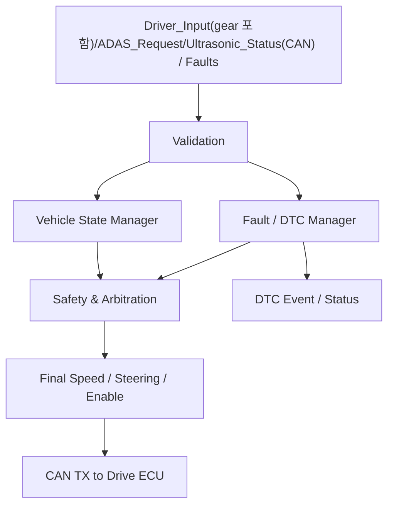

# VCU + DTC + CAN Integration Functional Specification

> 2026-09-11: STM32G431KB 구매 모델 부분 동결. [최상위 명세](../../system/FINAL_IMPLEMENTATION_SPEC.md) DEC-HW-001~005를 따른다. 제조사/revision/핀 배정과 실기 시험은 별도이며, 아래 시험 결과/측정값을 PASS로 변경한 것은 아니다.

[프로젝트 홈](../../../README.md) · [문서 안내](../../README.md) · [폴더 목록](README.md)

> **2026-09-15 범위 변경 (1차):** `Driver_Input`(가속/브레이크/조향) publisher가 F에서 C로 이전됐다. F는 accel/brake/steering을 더 이상 GPIO/ADC로 직접 읽지 않고 `Driver_Input`을 CAN RX로 수신한다. `Vision_Request`는 `ADAS_Request`로 명칭을 통일했고, Ultrasonic Collision Critical이 `ADAS_Request`보다 항상 우선함을 §7에서 재확인한다.
>
> **2026-09-15 범위 변경 (2차):** Gear 물리 입력도 F에서 C로 이전했다. F는 더 이상 Gear GPIO를 직접 읽지 않으며, C가 `Driver_Input.gear`로 CAN 보고한다. Pi DTC Manager(History DB)는 삭제했다 — `DTC_Event`는 B(IVI)가 실시간(Active만) 구독·표시하고 F/Pi 어디에도 지속 저장하지 않는다. 근거: [`FINAL_IMPLEMENTATION_SPEC.md` §1, §1.1, §1.2, §3.1, §3.6, §4.8.1, §6](../../system/FINAL_IMPLEMENTATION_SPEC.md).
>
> **2026-09-17: E-Stop 기능 전체 제거.** 데모 보드 특성상 E-Stop(소프트웨어/하드웨어 전부, 물리 킬스위치 포함)을 프로젝트 전역에서 제거했다. F의 `SafetyTask`/Arbitration은 이제 E-Stop이 아닌 일반 critical fault(peer timeout 등)만 다룬다. 근거: [`FINAL_IMPLEMENTATION_SPEC.md`](../../system/FINAL_IMPLEMENTATION_SPEC.md) DEC-HW-020/DEC-HW-027/DEC-CTRL-006(REMOVED).

> 문서 목적: F 담당 VCU가 **무엇을 해야 하는지** 정의한다. 구현 구조는 `ARCHITECTURE.md`, 검증은 `TEST_REPORT.md`를 기준으로 한다.

## Document Information

| Item | Value |
|---|---|
| Feature ID | `FEAT-VCU-001` |
| Feature / Node Name | VCU + DTC + CAN Integration |
| Owner | F |
| Role | 최종 판단 / 안전 / 통신 / 진단 통합 |
| Status | Draft |
| Priority | MUST |
| Board / Platform | STM32G431KB (STM32 #5) |
| Execution Model | FreeRTOS + CMSIS-RTOS2 |
| Related Architecture | `ARCHITECTURE.md` |
| Related Test | `TEST_REPORT.md` |

### Revision History

| Revision | Date | Author | Change |
|---|---|---|---|
| v0.1 | 2026-09-09 | Team | Initial filled example |
| v0.2 | 2026-09-15 | Team | Driver_Input publisher를 C로 이전 반영(F는 CAN RX만), Vision_Request를 ADAS_Request로 명칭 통일, Ultrasonic Parking Critical 우선순위 재확인 |
| v0.3 | 2026-09-15 | Team | Gear GPIO를 F에서 C로 이전(F는 CAN으로만 수신), Pi DTC Manager/History 삭제 반영 |
| v0.4 | 2026-09-17 | Team | E-Stop 기능 전체 제거(소프트웨어/하드웨어), 관련 요구사항/규칙/필드 삭제 |

# 1. Purpose and Scope

## 1.1 한 문장 설명

> VCU는 C가 발행한 `Driver_Input`(accel/brake/steering/gear, CAN)과 ADAS/Ultrasonic 요청, ECU 상태와 Fault를 받아 안전 우선순위에 따라 최종 Speed/Steering/Enable 상태를 결정하고 CAN FD로 전달한다.

## 1.2 포함 범위

- `Driver_Input`(가속/브레이크/조향/gear) CAN 수신/validation (C가 발행, F는 Driver/Gear 입력용 GPIO를 갖지 않음)
- Vehicle State / Mode 관리
- `ADAS_Request` / `Ultrasonic_Status`(Collision Critical 포함) / Fault 요청 수신
- Arbitration / Safety Override (Ultrasonic Collision Critical이 ADAS_Request보다 항상 우선)
- Final Speed / Steering / Drive Enable 생성
- CAN RX/TX와 Heartbeat
- Local fault detection
- `DTC_Event` 발행 (실시간, 지속 저장 없음 — B가 표시)
- Critical fault에 대한 safe action

## 1.3 제외 범위

- Accelerator/Brake/Steering/Gear 입력의 직접 GPIO/ADC 획득 (C가 전부 읽어 `Driver_Input`으로 발행, F는 물리 입력 핀이 없음)
- Motor PWM/DIR 직접 생성
- Servo PWM 직접 생성
- Camera image processing
- Ultrasonic 거리 계산
- Lamp GPIO 직접 제어
- H735 화면 rendering
- DTC History DB 저장 (Pi DTC Manager 삭제, `DEC-DTC-000` REMOVED — 어떤 Node도 저장하지 않음)

# 2. System Scenarios

## 2.1 정상 주행

| Item | Description |
|---|---|
| Actor / Trigger | `Driver_Input`(CAN, C 발행 — accel/brake/steering/gear 전부 포함) + CAN status |
| Preconditions | VCU READY, 필수 ECU 상태 유효 |
| Trigger | Gear D, `Driver_Input`(accel/steering) 수신 |
| Normal Flow | Input → Validate → Vehicle State → Arbitration → Final Command → CAN TX |
| Postconditions | Drive ECU가 유효한 Final Command를 수신 |

## 2.2 ADAS 요청

```text
Front Vision
→ ADAS Request
→ VCU
→ Driver/Mode/Fault와 함께 검토
→ Final Request
```

## 2.3 Collision Critical

```text
Ultrasonic CRITICAL
→ VCU
→ Collision Warning safety rule (ADAS_Request와 무관하게 항상 적용)
→ Speed limit / Stop request 후보
```

Ultrasonic Collision Critical은 `ADAS_Request`보다 항상 우선하며, `ADAS_Request`가 이 상태를 해제/override할 수 없다 (§7 재확인).

# 3. Functional Flow



# 4. Inputs

| Input ID | Input | Source | Interface | Valid Condition | Trigger |
|---|---|---|---|---|---|
| IN-VCU-001 | `Driver_Input` (accel/brake/steering/gear) | Drive ECU (C) | CAN FD | valid flag/freshness | periodic |
| IN-VCU-002 | `ADAS_Request` | HPC(E) | CAN FD | valid/fresh | periodic/event |
| IN-VCU-003 | `Ultrasonic_Status` (Warning/Collision Critical) | Ultrasonic ECU(A) | CAN FD | valid/fresh | periodic |
| IN-VCU-004 | `Drive_Status` (estimated speed/rpm 포함) | Drive ECU(C) | CAN FD | valid/fresh | periodic |
| IN-VCU-005 | Body Status | Body Gateway | CAN FD | valid/fresh | periodic |
| IN-VCU-006 | ECU Heartbeat | All | CAN FD | timeout 없음 | periodic |
| IN-VCU-007 | DTC Event | All | CAN FD | valid format | event |

F는 Gear 물리 GPIO를 갖지 않는다 (2026-09-15부터 C 소유, `Driver_Input`으로만 수신).

# 5. Outputs

| Output ID | Output | Destination | Interface | Condition |
|---|---|---|---|---|
| OUT-VCU-001 | Final Speed Request | Drive ECU | CAN FD | command valid |
| OUT-VCU-002 | Final Steering Request | Drive ECU | CAN FD | command valid |
| OUT-VCU-003 | Drive Enable / Stop | Drive ECU | CAN FD | state valid |
| OUT-VCU-004 | Vehicle State | All/H735/HPC | CAN FD | periodic |
| OUT-VCU-005 | ECU Heartbeat | VCU peers | CAN FD | periodic |
| OUT-VCU-006 | VCU DTC Event | H735 | CAN FD | event (지속 저장 없음, B 실시간 표시) |

`Driver_Input`은 더 이상 VCU가 발행하지 않는다 (publisher가 C로 이전, 2026-09-15). H735/HPC가 driver 입력을 참고해야 하면 C가 발행한 `Driver_Input`을 직접 구독한다.

# 6. Functional Requirements

| Requirement ID | Requirement | Priority | Verification | Test |
|---|---|---|---|---|
| REQ-VCU-001 | VCU는 `Driver_Input`(CAN, C 발행 — gear 포함)을 읽고 유효성을 판단해야 한다. | MUST | Test | T-VCU-001 |
| REQ-VCU-002 | VCU는 `ADAS_Request`와 `Ultrasonic_Status`(Warning 포함)를 CAN으로 수신해야 한다. | MUST | Test | T-VCU-002 |
| REQ-VCU-003 | VCU는 요청의 freshness/timeout을 관리해야 한다. | MUST | Fault Test | T-VCU-003 |
| REQ-VCU-004 | critical fault는 일반 Driver/ADAS 요청보다 우선해야 한다. | MUST | Test | T-VCU-004 |
| REQ-VCU-005 | Collision Warning critical은 normal driver request보다 높은 안전 우선순위를 가져야 한다. | MUST | Test | T-VCU-005 |
| REQ-VCU-006 | VCU는 최종 Speed/Steering/Enable 명령만 Drive ECU에 전달해야 한다. | MUST | Inspect/Test | T-VCU-006 |
| REQ-VCU-007 | VCU는 Drive command timeout이나 peer offline을 감지해야 한다. | MUST | Fault Test | T-VCU-007 |
| REQ-VCU-008 | VCU는 Vehicle State와 Heartbeat를 제공해야 한다. | MUST | Test | T-VCU-008 |
| REQ-VCU-009 | 각 ECU가 검출한 DTC를 공통 format으로 취급할 수 있어야 한다. | MUST | Test/Inspect | T-VCU-009 |
| REQ-VCU-010 | Critical DTC는 필요한 경우 VCU safe action과 연결되어야 한다. | MUST | Fault Test | T-VCU-010 |
| REQ-VCU-011 | Safety/Control 기능은 blocking logging에 의존하지 않아야 한다. | MUST | Inspect/Load | T-VCU-011 |
| REQ-VCU-012 | ISR은 최소 처리 후 Task로 전달해야 한다. | MUST | Inspect | T-VCU-012 |
| REQ-VCU-013 | RTOS Task/Queue/Stack 상태를 Health에서 확인 가능해야 한다. | SHOULD | Test | T-VCU-013 |
| REQ-VCU-014 | 중요 Task health를 이용한 Watchdog-ready 구조를 가져야 한다. | SHOULD | Test | T-VCU-014 |

# 7. Arbitration Rules

우선순위 (`FINAL_IMPLEMENTATION_SPEC.md` §1.2와 동일, 재확인):

```text
Critical Fault
> Ultrasonic Collision Critical
> ADAS_Request (전방 회피)
> Normal Driver Request
```

**`Ultrasonic_Status`의 Collision Critical은 `ADAS_Request`보다 항상 우선한다.** `ADAS_Request`는 Collision Critical을 해제/override할 수 없으며, VCU 중재 로직은 이 순서를 코드에서도 강제해야 한다. 세부 규칙은 최종 시험과 팀 합의 후 확정한다.

| Rule ID | Condition | Result |
|---|---|---|
| RULE-VCU-002 | Critical peer fault | 해당 기능 제한 또는 safe state |
| RULE-VCU-003 | Ultrasonic Collision Warning CRITICAL | speed limit/stop policy 적용, `ADAS_Request`와 무관하게 항상 적용 |
| RULE-VCU-004 | `ADAS_Request` valid + Ultrasonic CRITICAL 아님 | driver/mode/safety 조건과 함께 arbitration |
| RULE-VCU-005 | request timeout | 해당 request invalid 처리 |
| RULE-VCU-006 | undefined Gear/input | safe/degraded state |

# 8. Exceptions / Edge Cases

| Case | Detection | Expected Behavior | Recovery |
|---|---|---|---|
| `Driver_Input` out-of-range | range validation | invalid / safe default | valid input 복귀 |
| `Driver_Input` timeout | CAN freshness | steering/speed request 제한 | valid frame 재수신 |
| HPC(`ADAS_Request`) timeout | CAN freshness | ADAS request 제거 | valid frame 재수신 |
| Drive ECU heartbeat timeout | heartbeat | drive disable 후보 + DTC | ECU recovery |
| Queue overflow | RTOS health | fault flag / bounded policy | load 원인 수정 |
| CAN bus-off | controller state | communication degraded / DTC | CAN recovery |

# 9. Interface Requirements

## CAN FD logical messages

| Message | Direction | Peer | Content | Timeout |
|---|---|---|---|---|
| `Driver_Input` | RX | Drive ECU(C) | 가속/브레이크/조향/gear | TBD |
| `ADAS_Request` | RX | HPC(E) | 전방 객체 회피/감속 요청 (주차 사유 없음) | TBD |
| `Ultrasonic_Status` | RX | Ultrasonic | distance/warning/Collision Critical | TBD |
| `Drive_Status` | RX | Drive | rpm(estimated)/speed(estimated)/status | TBD |
| `Body_Status` | RX | Gateway | body/lin status | TBD |
| `DTC_Event` | RX/TX | All/H735 | code/status/severity (지속 저장 없음) | event |
| `ECU_Heartbeat` | RX/TX | All | alive | TBD |
| `Vehicle_State` | TX | All | gear/mode/safety | TBD |
| `Final_Drive_Command` 후보 | TX | Drive | speed/steering/enable | TBD |

CAN ID/DLC/bit layout은 공통 CAN Matrix에서 확정한다.

# 10. Timing / Performance

| Requirement | Target |
|---|---|
| SafetyTask response | TBD |
| VcuControlTask period | 5~10 ms 후보 |
| CAN RX → arbitration latency | TBD |
| command timeout detection | TBD |
| Heartbeat period | TBD |

# 11. Execution / RTOS Requirements

| Task | Responsibility | Trigger / Period | Priority Direction |
|---|---|---|---|
| `SafetyTask` | critical fault / safety override | event + fast periodic | Highest |
| `VcuControlTask` | state + arbitration + final command | 5~10 ms 후보 | High |
| `CanRxTask` | peer message decode(`Driver_Input`의 gear 포함)/freshness update | event | High |
| `CanTxTask` | final command/state/heartbeat TX | event/periodic | Normal/High |
| `DiagnosticTask` | DTC 발행/status 관리 (History/DB 없음) | event/periodic | Normal/Low |
| `HealthTask` | task/queue/stack/watchdog health | periodic | Low/Normal |

F는 물리 GPIO Task(`LocalInputTask`)를 갖지 않는다 (2026-09-15부터 Gear도 C 소유).

ISR에서는 긴 arbitration, printf, DTC table 처리 등을 하지 않는다.

# 12. Safety / Fail-safe / DTC

| Fault | Detection | Local Action | DTC Candidate |
|---|---|---|---|
| Driver input invalid | range/timeout | safe input/state | `VCU_INPUT_xxx` 후보 |
| Drive heartbeat lost | timeout | safe command / disable 후보 | `VCU_COMM_DRIVE` 후보 |
| HPC heartbeat/request lost | timeout | ADAS request invalid | `VCU_COMM_HPC` 후보 |
| CAN bus-off | controller | communication degraded | `VCU_CAN_xxx` 후보 |
| task/queue health fault | RTOS health | safe action 정책 | `VCU_SW_xxx` 후보 |

# 13. Acceptance Criteria

- [ ] Driver Input이 유효값으로 변환된다.
- [ ] ADAS/Collision Warning/Driver 요청의 우선순위를 재현할 수 있다.
- [ ] stale CAN request가 최종 명령에 계속 사용되지 않는다.
- [ ] Final Command가 Drive ECU로 송신된다.
- [ ] peer heartbeat timeout을 감지한다.
- [ ] DTC code/status/severity 흐름을 확인한다.
- [ ] RTOS Task/Queue/Stack health를 측정한다.
- [ ] Watchdog policy를 검증한다.

# 14. Open Issues / TBD

- 실제 MCU / FDCAN
- Arbitration 세부 규칙
- safe output policy
- command/heartbeat timing
- DTC code table
- Task priority number / stack / queue depth

## 충돌주의 전환 적용 (2026-09-15)

기능은 4방향 거리 기반 충돌주의이며 Gear R 전용 주차 모드가 아니다. A는 각 zone의 distance/valid/warning을 계속 제공하고, B는 모든 기어에서 패널 접근과 CRITICAL 상시 경고를 제공한다. F의 기존 안전 개입은 유지하며 A/B/E가 최종 Drive 명령을 발행하지 않는다. 방향별 제어 zone과 감속·정지·복구 수치는 [최상위 명세 §1.3](../../system/FINAL_IMPLEMENTATION_SPEC.md#13-충돌주의-기능-범위-2026-09-15-사용자-결정)의 OPEN 항목이다.
