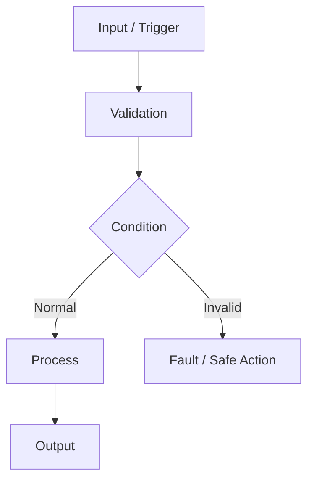

# [FEATURE / NODE NAME] Functional Specification

> 문서 목적: 이 기능이 **무엇을 해야 하는지** 오해 없이 정의한다.  
> 구현 구조는 별도 `ARCHITECTURE.md`에 작성한다.

## Document Information

| Item | Value |
|---|---|
| Feature ID | `FEAT-XXX` |
| Feature / Node Name | |
| Owner | A / B / C / D / E / F |
| Role | 인지 / 판단 / 제어 / UI / 통신 / 진단 |
| Status | Draft / Review / Approved |
| Priority | MUST / SHOULD / COULD |
| Board / Platform | |
| Related Architecture | `ARCHITECTURE.md` |
| Related Test | `TEST_REPORT.md` |

### Revision History

| Revision | Date | Author | Change |
|---|---|---|---|
| v0.1 | | | Initial draft |

---

# 1. Purpose and Scope

## 1.1 한 문장 설명

> 이 기능은 __________________________________________ 한다.

## 1.2 포함 범위

- 
- 

## 1.3 제외 범위

- 
- 

역할 경계를 명확히 적는다.

---

# 2. Usage / System Scenario

사람이 직접 사용하는 기능이면 **사용자 시나리오**, ECU 내부 기능이면 **System Scenario**를 적는다.

| Item | Description |
|---|---|
| Actor / Trigger | Driver / VCU / Sensor / CAN message / Timer 등 |
| Preconditions | 기능 실행 전에 만족해야 하는 조건 |
| Trigger | 기능이 시작되는 사건 |
| Normal Flow | 정상 동작 시나리오 |
| Postconditions | 정상 완료 후 상태 |

예:

```text
Actor      : VCU
Precondition: Drive ECU READY
Trigger    : Final_Speed_Request 수신
Flow       : Validate → Control → PWM Output → Status Update
Postcondition: Motor command applied and status available
```

---

# 3. Functional Flow

복잡한 기능은 글만 쓰지 말고 Flowchart 또는 Mermaid로 표시한다.



---

# 4. Inputs

| Input ID | Input | Source | Interface | Unit / Range | Valid Condition | Update / Trigger |
|---|---|---|---|---|---|---|
| IN-001 | | | | | | |

---

# 5. Outputs

| Output ID | Output | Destination | Interface | Unit / Range | Update / Event | Valid Condition |
|---|---|---|---|---|---|---|
| OUT-001 | | | | | | |

---

# 6. Functional Requirements

Requirement는 시험 가능하게 `~해야 한다` 형태로 작성한다.

| Requirement ID | Requirement | Priority | Verification | Related Test |
|---|---|---|---|---|
| REQ-XXX-001 | | MUST | Test / Inspect / Analyze | T-001 |

예:

```text
REQ-US-001
Ultrasonic ECU는 유효한 Echo 측정에서 거리값을 mm 단위로 계산해야 한다.
```

---

# 7. Rules / Conditions

| Rule ID | Condition / Business or Control Rule | Result |
|---|---|---|
| RULE-001 | | |

포함 예:
- State 조건
- Gear 조건
- Mode 조건
- Clamp / Deadband
- Priority
- Enable / Disable 조건

---

# 8. Exceptions / Edge Cases

정상 동작만 쓰지 않는다.

| Case ID | Exception / Edge Case | Detection | Expected Behavior | Recovery |
|---|---|---|---|---|
| EDGE-001 | Input timeout | | | |
| EDGE-002 | Out-of-range input | | | |
| EDGE-003 | Sensor / Network unavailable | | | |

---

# 9. UI / UX Reference

UI가 있는 기능만 작성하고, UI가 없는 MCU Node는 `N/A`로 명시한다.

| Item | Link / Screenshot / Description |
|---|---|
| Screen | |
| User Action | |
| Warning / Popup | |
| Screen Flow | |

---

# 10. Interface Requirements

## 10.1 Hardware

| Device | Interface | Electrical / Voltage | Requirement / Note |
|---|---|---|---|

## 10.2 CAN / CAN FD

| Message / Signal | TX/RX | Owner / Peer | Unit | Cycle/Event | Timeout | Timeout Action |
|---|---|---|---|---|---|---|

## 10.3 LIN, 해당 시

| Frame / Signal | Publisher | Subscriber | Period | Fault Condition |
|---|---|---|---|---|

## 10.4 API / IPC / File, HPC 해당 시

| Interface | Producer | Consumer | Format | Error Handling |
|---|---|---|---|---|

---

# 11. Timing / Performance Requirements

| Requirement | Target | Verification |
|---|---|---|
| Update period | | |
| Response time | | |
| Timeout | | |
| FPS / Latency, Vision 해당 시 | | |

---

# 12. Safety / Fail-safe / DTC

| Fault | Detection | Safe / Local Action | DTC Candidate | Recovery |
|---|---|---|---|---|

모든 기능이 Safety-Critical이라는 뜻은 아니다. 해당되는 항목만 작성한다.

---

# 13. Acceptance Criteria

- [ ] 정상 시나리오를 재현할 수 있다.
- [ ] Input / Output 값과 단위가 명확하다.
- [ ] 조건과 예외 처리 결과가 정의되어 있다.
- [ ] Timing / Timeout이 필요한 기능은 목표가 있다.
- [ ] Fault 발생 시 예상 동작이 정의되어 있다.
- [ ] 각 Requirement에 검증 방법이 연결되어 있다.

---

# 14. Open Issues / TBD

| ID | Item | Owner | Target Date / Condition |
|---|---|---|---|
| TBD-001 | | | |
