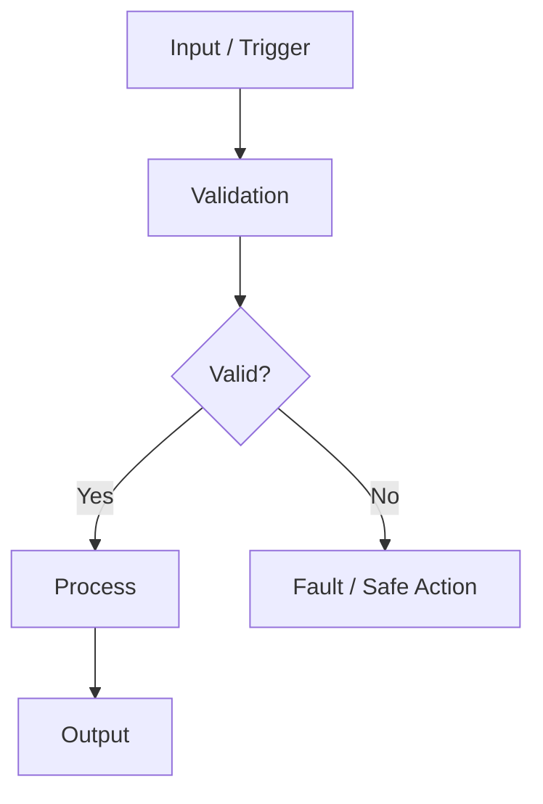

# [FEATURE / NODE NAME] Functional Specification

[프로젝트 홈](../../README.md) · [문서 안내](../README.md) · [폴더 목록](README.md)

> 문서 목적: 이 기능이 **무엇을 해야 하는지** 정의한다.  
> 구현 구조와 Task 배치는 별도 `ARCHITECTURE.md`, 검증 결과는 `TEST_REPORT.md`에서 관리한다.

## Document Information

| Item | Value |
|---|---|
| Feature ID | `FEAT-XXX` |
| Feature / Node Name | |
| Owner | A / B / C / D / E / F |
| Role | 인지 / 판단 / 제어 / UI / 통신 / 진단 |
| Status | Draft / Review / Approved |
| Priority | MUST / SHOULD / COULD |
| Board / Platform | |
| Execution Model | FreeRTOS / Linux / Bare-metal exception |
| Related Architecture | `ARCHITECTURE.md` |
| Related Test | `TEST_REPORT.md` |

### Revision History

| Revision | Date | Author | Change |
|---|---|---|---|
| v0.1 | | | Initial draft |

---

# 1. Purpose and Scope

## 1.1 한 문장 설명

> 이 기능은 __________________________________________ 한다.

## 1.2 포함 범위

- 
- 

## 1.3 제외 범위

- 
- 

역할 경계를 명확히 적는다.

---

# 2. Usage / System Scenario

사람이 직접 사용하는 기능이면 **사용자 시나리오**, ECU 내부 기능이면 **System Scenario**를 적는다.

| Item | Description |
|---|---|
| Actor / Trigger | Driver / VCU / Sensor / CAN message / Timer 등 |
| Preconditions | 기능 시작 전 조건 |
| Trigger | 기능이 시작되는 사건 |
| Normal Flow | 정상 동작 순서 |
| Postconditions | 정상 완료 후 상태 |

---

# 3. Functional Flow

---

# 4. Inputs

| Input ID | Input | Source | Interface | Unit / Range | Valid Condition | Update / Trigger |
|---|---|---|---|---|---|---|
| IN-001 | | | | | | |

---

# 5. Outputs

| Output ID | Output | Destination | Interface | Unit / Range | Update / Event | Valid Condition |
|---|---|---|---|---|---|---|
| OUT-001 | | | | | | |

---

# 6. Functional Requirements

Requirement는 시험 가능하게 `~해야 한다` 형태로 작성한다.

| Requirement ID | Requirement | Priority | Verification | Related Test |
|---|---|---|---|---|
| REQ-XXX-001 | | MUST | Test / Inspect / Analyze | T-001 |

---

# 7. Rules / Conditions

| Rule ID | Condition / Control Rule | Result |
|---|---|---|
| RULE-001 | | |

후보:
- State / Gear / Mode 조건
- Clamp / Deadband
- Priority
- Enable / Disable
- Recovery 조건

---

# 8. Exceptions / Edge Cases

| Case ID | Exception / Edge Case | Detection | Expected Behavior | Recovery |
|---|---|---|---|---|
| EDGE-001 | Input timeout | | | |
| EDGE-002 | Out-of-range | | | |
| EDGE-003 | Sensor / Network unavailable | | | |
| EDGE-004 | Queue full / task delayed, RTOS 해당 시 | | | |

---

# 9. UI / UX Reference

UI가 없는 Node는 `N/A`.

| Item | Link / Screenshot / Description |
|---|---|
| Screen | |
| User Action | |
| Warning / Popup | |
| Screen Flow | |

---

# 10. Interface Requirements

## 10.1 Hardware

| Device | Interface | Electrical / Voltage | Requirement / Note |
|---|---|---|---|

## 10.2 CAN / CAN FD

| Message / Signal | TX/RX | Owner / Peer | Unit | Cycle/Event | Timeout | Timeout Action |
|---|---|---|---|---|---|---|

## 10.3 LIN, 해당 시

| Frame / Signal | Publisher | Subscriber | Period | Fault Condition |
|---|---|---|---|---|

## 10.4 API / IPC / File, HPC 해당 시

| Interface | Producer | Consumer | Format | Error Handling |
|---|---|---|---|---|

---

# 11. Timing / Performance Requirements

| Requirement | Target | Verification |
|---|---|---|
| Update period | | |
| Response time | | |
| Timeout | | |
| Jitter, RTOS periodic task 해당 시 | | |
| FPS / Vision latency | | |

목표를 모르면 숫자를 지어내지 않고 `TBD`로 둔다.

---

# 12. Execution / RTOS Requirements

STM32 Node는 기본적으로 FreeRTOS + CMSIS-RTOS2를 사용한다. Pi는 Linux 항목으로 바꿔 작성한다.

## 12.1 Task Requirement

| Task / Service | Responsibility | Trigger / Period | Priority Direction | Deadline / Response | Blocking Allowed? |
|---|---|---|---|---|---|
| | | | | | |

기능 명세 단계에서는 정확한 FreeRTOS priority number보다 **상대적 중요도와 Timing 요구사항**을 먼저 정의한다.

## 12.2 Event / Communication Requirement

| Producer | Consumer | Mechanism | Data | Overflow / Timeout Policy |
|---|---|---|---|---|
| ISR | Task | Task Notification / Queue | | |
| Task | Task | Queue / Event Flags | | |

## 12.3 ISR Requirement

| Interrupt | ISR이 해야 하는 일 | Task로 넘길 일 | Max/Constraint |
|---|---|---|---|
| | timestamp/flag 등 최소 처리 | | blocking 금지 |

## 12.4 Resource / Memory Requirement

- Dynamic allocation 허용 범위:
- Static allocation 필요 여부:
- Stack overflow detection:
- Queue overflow policy:
- Shared peripheral ownership:

## 12.5 Watchdog / Health Requirement

| Health Item | Detection | Action |
|---|---|---|
| Critical task alive | | |
| Queue overflow | | |
| Task overrun | | |
| Watchdog refresh condition | | |

RTOS가 필요 없는 Linux Node는 Process/Thread/Queue/Service requirement로 바꾼다.

---

# 13. Safety / Fail-safe / DTC

| Fault | Detection | Safe / Local Action | DTC Candidate | Recovery |
|---|---|---|---|---|

---

# 14. Acceptance Criteria

- [ ] 정상 Scenario를 재현할 수 있다.
- [ ] Input / Output과 단위가 명확하다.
- [ ] Edge Case가 정의되어 있다.
- [ ] Timing / Timeout 목표가 있다, 해당 시.
- [ ] Fault 동작이 정의되어 있다.
- [ ] 각 Requirement에 검증 방법이 연결되어 있다.
- [ ] MCU Node는 Task/Trigger/Priority 방향이 정의되어 있다.
- [ ] ISR과 Task 책임이 분리되어 있다.
- [ ] Queue/Notification overflow 또는 timeout 정책이 있다.
- [ ] Watchdog/Health 정책이 필요한 Node는 조건이 정의되어 있다.

---

# 15. Open Issues / TBD

| ID | Item | Owner | Target Date / Condition |
|---|---|---|---|
| TBD-001 | | | |
