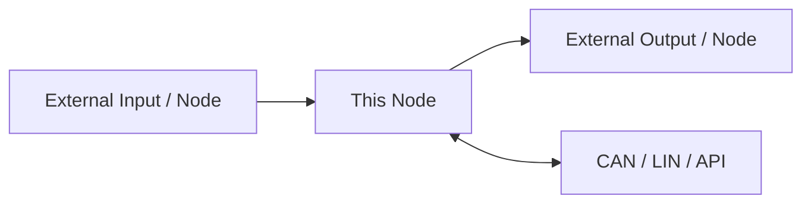
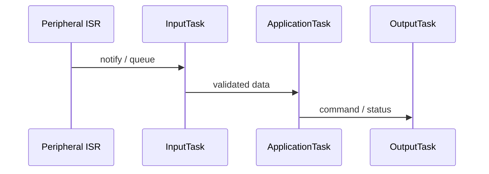
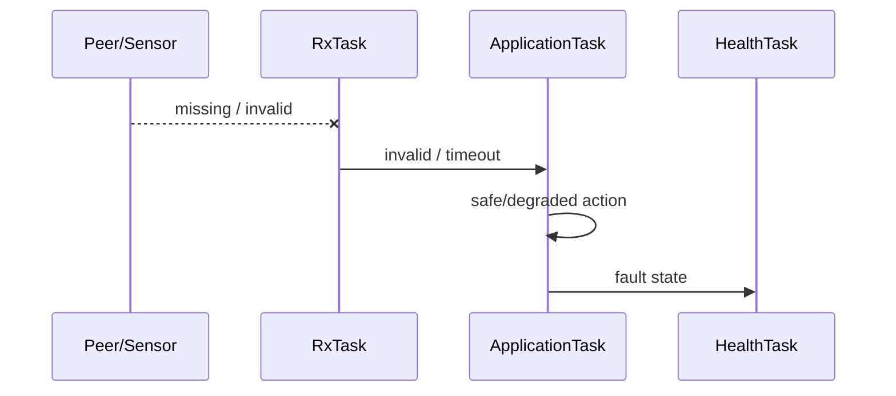
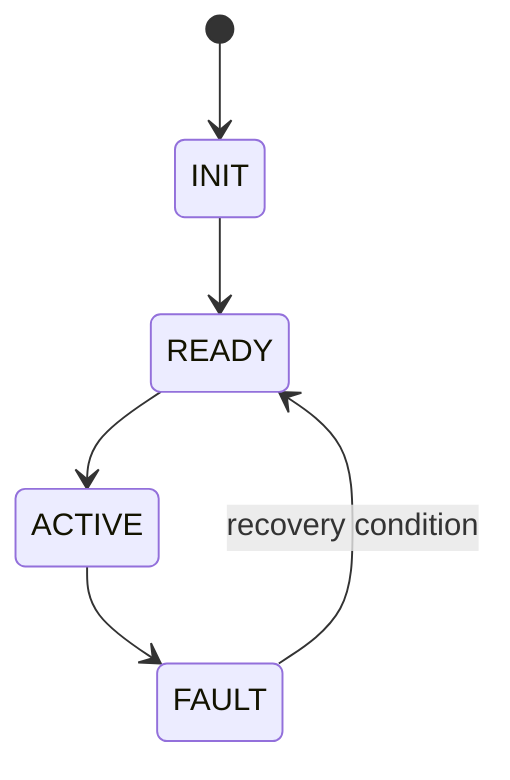

# [NODE / SOFTWARE SYSTEM NAME] Software Architecture

[프로젝트 홈](../../README.md) · [문서 안내](../README.md) · [폴더 목록](README.md)

> 문서 목적: 이 기능을 **어떤 구조로 구현하는지**, 왜 그렇게 나눴는지, 실행 중 어떤 Task/Service가 어떻게 협력하는지 설명한다.  
> 기능 요구사항은 `SPECIFICATION.md`, 검증 결과는 `TEST_REPORT.md`를 기준으로 한다.

## Document Information

| Item | Value |
|---|---|
| Node / System | |
| Owner | A / B / C / D / E / F |
| Board / Platform | |
| Execution Model | FreeRTOS / Linux / Bare-metal exception |
| Revision | v0.1 |
| Status | Draft / Review / Approved |
| Related Specification | `SPECIFICATION.md` |
| Related Test | `TEST_REPORT.md` |

### Revision History

| Revision | Date | Author | Change |
|---|---|---|---|
| v0.1 | | | Initial draft |

---

# 1. Introduction & Goals

## 1.1 Purpose

> 이 Node/System은 __________________________________________ 한다.

## 1.2 Scope

포함:
- 

제외:
- 

## 1.3 Stakeholders

| Stakeholder | 관심사 / 필요한 정보 |
|---|---|
| 담당 개발자 | Component, Task, Interface, Timing |
| 통합 담당 | CAN/LIN 계약, Timeout, Dependency |
| 테스트 담당 | Fault, RTOS timing, Runtime Flow |
| UI 담당, 해당 시 | 표시 데이터와 상태 |

---

# 2. Quality Goals

| Priority | Quality Goal | Concrete Scenario / Measure |
|---:|---|---|
| 1 | Reliability | Input timeout 시 hang 없이 정의된 상태로 전환 |
| 2 | Timing | 중요한 Task가 목표 period/deadline 충족 |
| 3 | Maintainability | Driver/Application/Communication 분리 |
| 4 | Testability | Dummy/Mock 입력으로 독립 시험 가능 |

후보: Reliability, Performance, Safety, Maintainability, Testability, Usability, Compatibility.

---

# 3. Constraints

| Constraint | Reason / Impact |
|---|---|
| STM32 Node는 FreeRTOS 기본 | 프로젝트 개발 정책 |
| CMSIS-RTOS2 API 권장 | STM32CubeMX/TouchGFX 통합 |
| Raspberry Pi는 Linux | Vision/HPC 플랫폼 |
| CAN FD Backbone 목표 | 차량 통신 구조 |
| Raw Camera Frame은 CAN으로 전송하지 않음 | Bandwidth / 역할 분리 |
| | |

FreeRTOS를 사용하지 않는 STM32 Node가 있다면 이유를 ADR과 Risk에 기록한다.

---

# 4. Context & Scope View



## External Interfaces

| External Entity | Direction | Data / Service | Interface | Owner |
|---|---|---|---|---|

---

# 5. Solution Strategy & Rationale

| Decision / Strategy | Why | Related Quality / Constraint |
|---|---|---|
| Driver / Application / Communication 분리 | 테스트와 변경 용이 | Maintainability |
| ISR은 최소 처리 후 Task로 전달 | interrupt latency 감소 | Timing/Reliability |
| 중요 주기 기능은 dedicated Task | 주기/우선순위 관리 | Timing |
| | | |

---

# 6. Building Block / Component View

## 6.1 Top-level Components

```text
Hardware / BSP / Driver
       ↓
Input Adapter / Communication
       ↓
Validation / Conversion
       ↓
Application / State / Control
       ↓
Output / Network Service
```

## 6.2 Component Responsibility

| Component | Responsibility | Input | Output | Depends On |
|---|---|---|---|---|

## 6.3 Module / Folder Mapping

| Component | Planned Source Path / Module |
|---|---|
| | |

---

# 7. Concurrency / RTOS View

STM32 Node에서는 이 장을 핵심 설계로 취급한다. Linux Node는 Task 대신 Process/Thread/Service 관점으로 바꾼다.

## 7.1 Task Model

| Task | Responsibility | Trigger / Period | Relative Priority | Deadline / Target | Stack | Blocking Policy |
|---|---|---|---|---|---|---|
| | | | | | TBD | |

정확한 FreeRTOS 숫자 Priority는 실제 Timing Test 전에는 확정하지 않아도 된다. 대신 `Highest / High / Normal / Low`의 이유를 설명한다.

## 7.2 Priority Rationale

```text
Safety / Hard Real-Time Control
> Critical CAN/LIN RX
> Sensor / State / Gateway
> UI / Periodic Status
> Diagnostics / Logging
```

내 Node가 이 순서를 다르게 사용한다면 이유를 적는다.

## 7.3 ISR Map

| Interrupt | Peripheral / Source | ISR Responsibility | Wake-up Target | Mechanism |
|---|---|---|---|---|
| | | timestamp/flag 등 최소 처리 | | Task Notification / Queue / Semaphore |

ISR에서 하지 않는 것:
- 긴 계산
- printf/logging
- blocking API
- UI rendering
- control algorithm 전체 수행

## 7.4 RTOS Objects / IPC

| Object | Type | Producer | Consumer | Data / Event | Size / Depth | Overflow / Timeout Policy |
|---|---|---|---|---|---|---|
| | Queue / Event / Notification / Mutex | | | | | |

## 7.5 Shared Resource Ownership

| Resource | Owner Task | Other User | Protection | Reason |
|---|---|---|---|---|
| CAN TX | | | Queue / Mutex / single owner | |
| Shared SPI/I2C | | | Mutex / single owner | |

가능하면 공유자원에 여러 Task가 직접 접근하기보다 **single owner task + request queue** 구조를 우선 검토한다.

## 7.6 Scheduling / Delay Policy

- periodic Task: `osDelayUntil()` / `vTaskDelayUntil()` 계열 사용 여부:
- event-driven Task:
- `HAL_Delay()` 사용 정책:
- task overrun 검출:

Scheduler 시작 후 일반 Task에서 긴 busy wait나 `HAL_Delay()`에 의존하지 않는다.

---

# 8. Runtime View

중요 동작은 Component 이름뿐 아니라 **어떤 Task가 실행되는지** 보여준다.

## 8.1 Normal Scenario



## 8.2 Fault / Timeout Scenario



---

# 9. Deployment / Hardware View

```text
Sensor / Camera / Peer ECU
          ↓
Peripheral / Transceiver
          ↓
STM32 + FreeRTOS
or
Raspberry Pi + Linux
          ↓
CAN / LIN / PWM / USB / CSI
```

| HW / Runtime Node | Software / RTOS | Interface | Electrical Note |
|---|---|---|---|

## Pin / Peripheral Map

| Function | Device | MCU/Board Pin | Peripheral | Direction | Voltage / Note |
|---|---|---|---|---|---|

---

# 10. Interfaces & Contracts

## 10.1 CAN / CAN FD

### TX
| Message / Signal | Meaning | Unit | Cycle/Event | Receiver | Valid Condition |
|---|---|---|---|---|---|

### RX
| Message / Signal | Meaning | Sender | Timeout | Timeout Action |
|---|---|---|---|---|

## 10.2 LIN, 해당 시

| Frame / Signal | Publisher | Subscriber | Period | Fault Condition |
|---|---|---|---|---|

### CAN ↔ LIN Mapping, Gateway 해당 시

| CAN Signal | Direction | LIN Signal | Conversion / Rule |
|---|---|---|---|

## 10.3 API / IPC / File, HPC 해당 시

| Interface | Producer | Consumer | Data Format | Failure Handling |
|---|---|---|---|---|

---

# 11. Data & State Model

## 11.1 Main Data

| Data | Type | Owner | Meaning | Unit | Valid Range | Invalid Condition |
|---|---|---|---|---|---|---|

## 11.2 State Machine



| State | Entry Condition | Main Action | Exit Condition |
|---|---|---|---|

---

# 12. Cross-cutting Concepts

## 12.1 Error Handling
- Invalid input 처리:
- Timeout 처리:
- Recovery:

## 12.2 Diagnostics / DTC
- Local fault detection:
- DTC event format:
- Logging:

## 12.3 Timing

| Task / Function | Period / Trigger | Deadline | Jitter Target | Overrun Action |
|---|---|---|---|---|

## 12.4 Communication
- Heartbeat:
- Retry 여부:
- CAN Bus-off / LIN timeout 대응:

## 12.5 Calibration / Configuration
- threshold/config 저장:
- runtime 변경 가능 여부:

## 12.6 Memory / Stack / Heap

| Item | Policy / Target | Measurement |
|---|---|---|
| Static task allocation | Use / Consider / N/A | code review |
| Heap use after startup | | |
| Stack overflow hook | enabled? | |
| Stack high-water mark | target TBD | runtime measurement |
| Queue memory | | |

## 12.7 Watchdog / Health Monitoring

```text
Critical Tasks
→ heartbeat/health flag
→ HealthTask
→ all healthy?
   ├ Yes → IWDG refresh
   └ No  → fault / no refresh
```

| Health Item | Detection | Response |
|---|---|---|
| Task alive | | |
| Queue overflow | | |
| Task overrun | | |
| Stack low watermark | | |

## 12.8 Priority Inversion / Starvation

- Mutex 사용 위치:
- Priority inheritance 기대 여부:
- High priority task가 기다릴 수 있는 resource:
- Low priority task starvation 방지:

---

# 13. Architecture Decisions

| ADR ID | Decision | Alternatives | Reason | Consequence |
|---|---|---|---|---|
| ADR-001 | FreeRTOS Task로 기능 분리 | one super-loop | Timing/maintainability | RTOS object/stack 관리 필요 |

---

# 14. Quality Scenarios & Verification

| Quality Goal | Scenario | Measure / Target | Verification |
|---|---|---|---|
| Reliability | Sensor disconnect | hang 없이 invalid 처리 | Fault injection |
| Timing | periodic control | period/jitter 목표 만족 | timestamp/trace |
| RTOS health | long soak test | stack/queue overflow 0 | runtime stats |

---

# 15. Risks & Technical Debt

| ID | Risk / Debt | Impact | Mitigation / Next Action | Owner |
|---|---|---|---|---|
| RISK-001 | | | | |

RTOS 관련 후보:
- Task priority 미조정
- stack size 과대/과소
- queue depth 미검증
- blocking log로 deadline 지연
- small MCU memory 부족

---

# 16. Requirement Traceability

| Requirement ID | Component | Task / Runtime | Interface | Test ID |
|---|---|---|---|---|

---

# 17. Glossary

| Term | Meaning |
|---|---|
| RTOS | Real-Time Operating System |
| FreeRTOS | STM32 Node 기본 RTOS 후보 |
| CMSIS-RTOS2 | ARM RTOS abstraction API |
| ISR | Interrupt Service Routine |
| VCU | Vehicle Control Unit |
| DTC | Diagnostic Trouble Code |
| HPC | Raspberry Pi 기반 project compute |

---

# 18. Architecture Review Checklist

- [ ] Scope와 역할 경계가 명확하다.
- [ ] Component 책임이 겹치지 않는다.
- [ ] MCU Node는 Task Table이 있다.
- [ ] Task마다 Trigger/Period/Priority 방향이 있다.
- [ ] ISR과 Task 책임이 분리되어 있다.
- [ ] Queue/Event/Notification/Mutex 사용 이유가 있다.
- [ ] 중요 Task가 blocking logging에 의존하지 않는다.
- [ ] 정상 Runtime Flow가 있다.
- [ ] Fault/Timeout Runtime Flow가 있다.
- [ ] Software가 어느 HW/RTOS에서 실행되는지 명확하다.
- [ ] CAN/LIN/API 계약에 Owner와 Timeout이 있다.
- [ ] Stack/Heap/Queue 정책이 있다.
- [ ] Watchdog/Health 구조가 필요한 Node는 정의되어 있다.
- [ ] Priority inversion/starvation 위험을 검토했다.
- [ ] Risk/TBD가 숨겨져 있지 않다.
- [ ] Requirement → Component/Task → Test를 추적할 수 있다.
