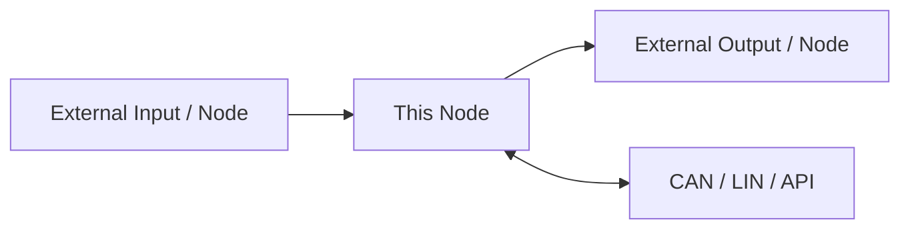
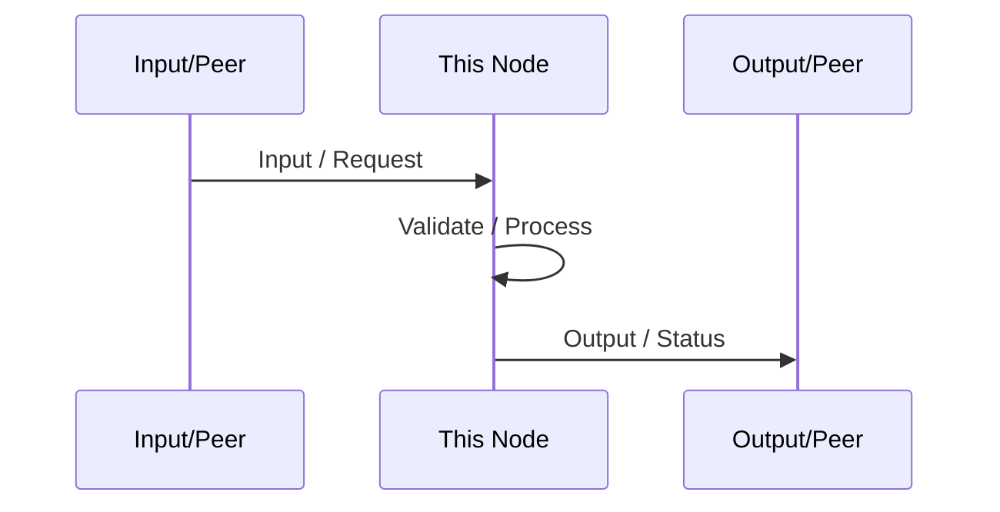
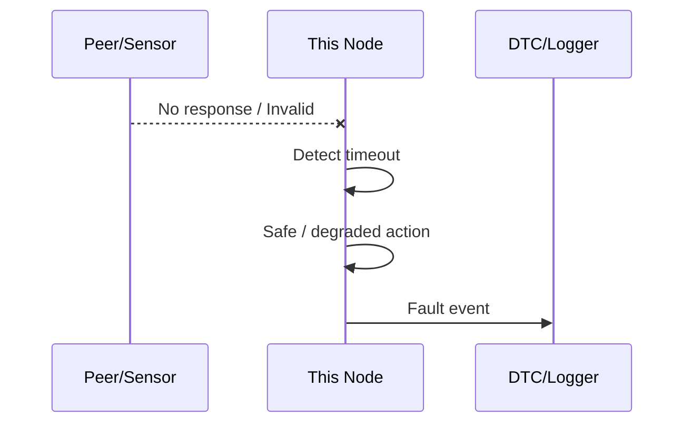
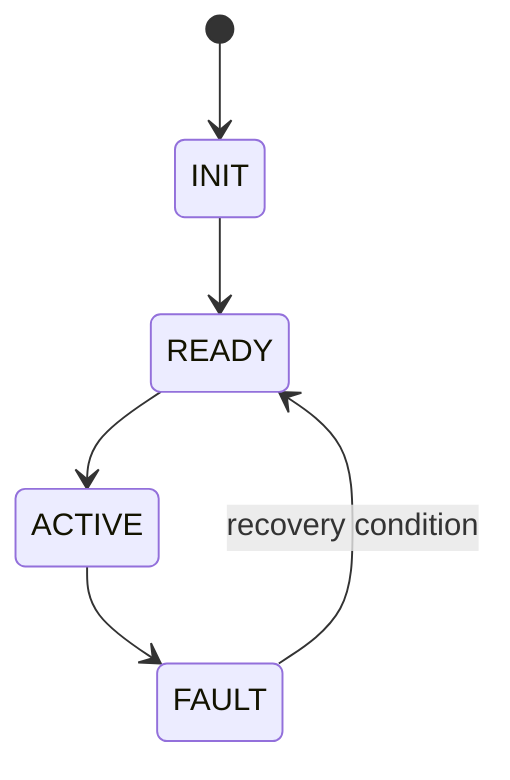

# [NODE / SOFTWARE SYSTEM NAME] Software Architecture

> 문서 목적: 이 기능을 **어떤 구조로 구현하는지**, 왜 그렇게 나눴는지, 실행 중 어떻게 협력하는지 설명한다.  
> 기능 요구사항은 별도 `SPECIFICATION.md`를 기준으로 한다.

## Document Information

| Item | Value |
|---|---|
| Node / System | |
| Owner | A / B / C / D / E / F |
| Board / Platform | |
| Revision | v0.1 |
| Status | Draft / Review / Approved |
| Related Specification | `SPECIFICATION.md` |
| Related Test | `TEST_REPORT.md` |

### Revision History

| Revision | Date | Author | Change |
|---|---|---|---|
| v0.1 | | | Initial draft |

---

# 1. Introduction & Goals

## 1.1 Purpose

> 이 Node/System은 __________________________________________ 한다.

## 1.2 Scope

포함:
- 

제외:
- 

## 1.3 Stakeholders

| Stakeholder | 관심사 / 필요한 정보 |
|---|---|
| 담당 개발자 | 구현 구조, Interface, Timing |
| 통합 담당 | CAN/LIN 계약, Timeout, Dependency |
| 테스트 담당 | Fault, Acceptance, Runtime Flow |
| UI 담당, 해당 시 | 표시 데이터와 상태 |

---

# 2. Quality Goals

가장 중요한 3~5개만 적는다.

| Priority | Quality Goal | Concrete Scenario / Measure |
|---:|---|---|
| 1 | Reliability | 예: Input timeout 시 hang 없이 safe state로 전환 |
| 2 | Timing | 예: 명령 수신 후 TBD ms 내 output update |
| 3 | Maintainability | 예: Driver와 Application logic 분리 |

후보: Reliability, Performance, Safety, Maintainability, Testability, Usability, Compatibility.

---

# 3. Constraints

바꿀 수 없거나 설계를 강하게 제한하는 조건을 적는다.

| Constraint | Reason / Impact |
|---|---|
| STM32 / Raspberry Pi 사용 | 프로젝트 HW |
| CAN FD Backbone 목표 | 차량 통신 구조 |
| Raw Camera Frame은 CAN으로 전송하지 않음 | Bandwidth / Architecture |
| | |

---

# 4. Context & Scope View

이 Node 밖에 무엇이 있고 무엇을 주고받는지 먼저 그린다.



## External Interfaces

| External Entity | Direction | Data / Service | Interface | Owner |
|---|---|---|---|---|

---

# 5. Solution Strategy & Rationale

핵심 설계 선택과 이유를 짧게 쓴다.

| Decision / Strategy | Why | Related Quality / Constraint |
|---|---|---|
| Driver / Application / Network Layer 분리 | 테스트와 변경 용이 | Maintainability |
| Vision은 Pi에서 처리 | 영상 연산과 메모리 요구 | Performance |
| | | |

여기서는 세부 구현보다 **왜 이 방향을 선택했는지**를 남긴다.

---

# 6. Building Block / Component View

## 6.1 Top-level Components

```text
Hardware / OS Driver
       ↓
Input Adapter / Service
       ↓
Validation / Conversion
       ↓
Application / State / Control
       ↓
Output / Network Service
```

내 Node에 맞게 수정한다.

## 6.2 Component Responsibility

| Component | Responsibility | Input | Output | Depends On |
|---|---|---|---|---|

## 6.3 Module / Folder Mapping

| Component | Planned Source Path / Module |
|---|---|
| | |

실제 코드 구조가 정해진 뒤 갱신한다.

---

# 7. Runtime View

중요한 동작 시나리오를 **순서**로 보여준다. 최소 정상 1개, Fault 1개를 권장한다.

## 7.1 Normal Scenario



## 7.2 Fault / Timeout Scenario



필요 시 Mode Change, Gear R, Camera switching, CAN↔LIN Gateway flow 등을 추가한다.

---

# 8. Deployment / Hardware View

Software가 실제 어디에서 실행되고 어떤 물리 인터페이스를 사용하는지 적는다.

```text
[Sensor / Camera / Peer ECU]
          ↓
[Transceiver / Driver / Peripheral]
          ↓
[STM32 / Raspberry Pi]
          ↓
[CAN FD / LIN / PWM / USB / CSI]
```

| HW / Runtime Node | Software | Interface | Power / Electrical Note |
|---|---|---|---|

## Pin / Peripheral Map

| Function | Device | MCU/Board Pin | Peripheral | Direction | Voltage / Note |
|---|---|---|---|---|---|

실제 schematic / datasheet / CubeMX로 확인한 값만 적는다.

---

# 9. Interfaces & Contracts

## 9.1 CAN / CAN FD

### TX
| Message / Signal | Meaning | Unit | Cycle/Event | Receiver | Valid Condition |
|---|---|---|---|---|---|

### RX
| Message / Signal | Meaning | Sender | Timeout | Timeout Action |
|---|---|---|---|---|

## 9.2 LIN, 해당 시

| Frame / Signal | Publisher | Subscriber | Period | Fault Condition |
|---|---|---|---|---|

### CAN ↔ LIN Mapping, Gateway 해당 시

| CAN Signal | Direction | LIN Signal | Conversion / Rule |
|---|---|---|---|

## 9.3 API / IPC / File, HPC 해당 시

| Interface | Producer | Consumer | Data Format | Failure Handling |
|---|---|---|---|---|

---

# 10. Data & State Model

## 10.1 Main Data

| Data | Type | Owner | Meaning | Unit | Valid Range | Invalid Condition |
|---|---|---|---|---|---|---|

Raw와 Physical / Logical 값을 분리한다.

## 10.2 State Machine



| State | Entry Condition | Main Action | Exit Condition |
|---|---|---|---|

---

# 11. Cross-cutting Concepts

Node 전체에 반복 적용되는 정책을 적는다. 해당 없는 항목은 `N/A`.

## 11.1 Error Handling
- Invalid input 처리:
- Timeout 처리:
- Recovery:

## 11.2 Diagnostics / DTC
- Local fault detection:
- DTC event format:
- Logging:

## 11.3 Timing / Concurrency
| Task / Service | Period / Trigger | Priority | Deadline / Measured Time |
|---|---|---|---|

## 11.4 Communication
- Heartbeat:
- Retry 여부:
- CAN Bus-off / LIN timeout 대응:

## 11.5 Calibration / Configuration
- Calibration value 저장 위치:
- Threshold / Config 관리 방식:

## 11.6 Coding / Testability
- Driver와 Application 분리:
- Mock / Dummy input 방식:
- Log / Debug 정책:

---

# 12. Architecture Decisions

중요한 선택만 기록한다. 사소한 구현사항을 전부 적지 않는다.

| ADR ID | Decision | Alternatives | Reason | Consequence |
|---|---|---|---|---|
| ADR-001 | | | | |

예:
```text
ADR-VIS-001
Decision: Front/Rear Vision은 Pi에서 처리하고 CAN에는 결과만 송신
Reason: 영상 bandwidth와 compute requirement
Consequence: Pi service 안정성과 latency를 별도로 관리해야 함
```

---

# 13. Quality Scenarios & Verification

| Quality Goal | Scenario | Measure / Target | Verification |
|---|---|---|---|
| Reliability | Sensor disconnect | hang 없이 invalid 처리 | Fault injection |
| Timing | CAN command 수신 | TBD ms 내 output update | timestamp/log |

---

# 14. Risks & Technical Debt

| ID | Risk / Debt | Impact | Mitigation / Next Action | Owner |
|---|---|---|---|---|
| RISK-001 | | | | |

예:
- 실제 STM32 FDCAN 지원 여부 미확정
- TB6612FNG와 최종 Motor 정격 적합성 확인 필요
- Pi 1대 통합 후 Vision latency 재측정 필요

---

# 15. Requirement Traceability

| Requirement ID | Component / Design Element | Runtime / Interface | Test ID |
|---|---|---|---|

---

# 16. Glossary

| Term | Meaning |
|---|---|
| VCU | Vehicle Control Unit |
| DTC | Diagnostic Trouble Code |
| HPC | High Performance Computer / Project Central Compute |

---

# 17. Architecture Review Checklist

- [ ] Scope와 역할 경계가 명확하다.
- [ ] Stakeholder와 중요한 Quality Goal이 있다.
- [ ] 외부 Context와 Interface가 보인다.
- [ ] Component별 책임이 겹치지 않는다.
- [ ] 정상 Runtime Flow를 설명할 수 있다.
- [ ] Fault/Timeout Runtime Flow가 있다.
- [ ] Software가 어느 HW에서 실행되는지 명확하다.
- [ ] CAN/LIN/API 계약에 Owner와 Timeout이 있다.
- [ ] 중요한 설계 결정의 이유가 기록되어 있다.
- [ ] Risk / TBD가 숨겨져 있지 않다.
- [ ] Requirement → Design → Test를 추적할 수 있다.
